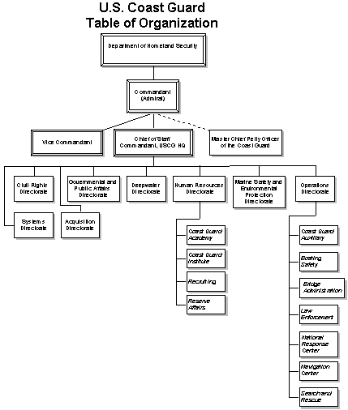

# ব্যবস্থাপনা

*মার্কিন যুক্তরাষ্ট্রের কোস্ট গার্ডের জন্য একটি প্রতিষ্ঠানের তৈরী চার্ট সেই সংস্থায় পরিচালিত ব্যবস্থাপনা ভূমিকাগুলির শ্রেণিবিন্যাস দেখায়।*

ব্যবস্থাপনা ( ইংরেজি : management ) হলো কোন নির্দিষ্ট লক্ষ্য বাস্তবায়নের উদ্দেশ্যে এক বা একাধিক ব্যক্তির সমন্বয়ে গঠিত কোন গোষ্ঠীর উপর কর্তৃত্ব স্থাপন ও নিয়ন্ত্রণ -এর মাধ্যমে, প্রতিষ্ঠানের নিয়োজিত উপকরণ (মানবীয় ও বস্তুগত) কার্যকর ব্যবহারের একটি ধারাবাহিক, সার্বজনীন (সক্রেটিসের মতে, ব্যবস্থাপনা সার্বজনীন) সামাজিক প্রক্রিয়া, যা একটি মূল্যবান অর্থনৈতিক সম্পদ। ইংরেজি Management ( to handle- চালনা করা বা পরিচালনা করা ) শব্দটি ল্যাটিন বা ইতালীয় Maneggiare ( to train up the horse- অশ্বকে প্রশিক্ষিত করে তোলা বা পরিচালনার উপযোগী করে তোলা) শব্দ থেকে সৃষ্ট, যা কালের বিবর্তনে মানুষকে প্রশিক্ষিত করে তোলে, তার নিকট হতে কাজ আদায় করে নেয়ার সাথে সম্পর্কযুক্ত হয়ে পড়েছে। সমাজ বা সমাজ সংশ্লিষ্ট পক্ষের সম্পৃক্ততার কারণে 'ব্যবস্থাপনা' জ্ঞানের অন্যতম একটি শাখায় পরিণত হয়েছে।

## ব্যবস্থাপনা

ব্যবস্থাপনা হলো সেই প্রক্রিয়া যা ৫টি ফাংশন (planning, organizing,Staffing, leading, controlling) এর মাধ্যমে কোন প্রতিষ্ঠানের যে লক্ষ্যগুলো থাকে, তা অর্জন করে।

## ব্যবস্থাপনা

### প্রতিষ্ঠান

যখন একদল মানুষ একত্রে নিয়মতান্ত্রিক ভাবে (systematic manner) কিছু কাঙ্ক্ষিত লক্ষ্য (objectives) অর্জনের লক্ষ্যে একসাথে কাজ করে তখন তাকে প্রতিষ্ঠান বলে। 
প্রতিষ্ঠানের ৪টি মূল বিষয় (issue) থাকে: ১) Objective, ২) People, ৩) Structure, ৪) Technology

## ব্যবস্থাপনা

### পরিকল্পনা

কোন প্রতিষ্ঠানের লক্ষ্যগুলো ঠিক করা আর সেগুল অর্জন করার সবচেয়ে ভাল উপায় আগেই ঠিক করে রাখাই পরিকল্পনা (planning)। 
লক্ষ্য অর্জনের উদ্দেশ্যে ভবিষ্যতের অগ্ৰিম সিদ্ধান্ত গ্রহণ হচ্ছে পরিকল্পনা।

## ব্যবস্থাপনা

### সংগঠিত করা

কোন প্রতিষ্ঠানের পরিকল্পিত লক্ষ্যগুলো অর্জনের জন্য তার সম্পদ (resources) কীভাবে বন্টিত হবে তা ঠিক করা ও সে অনুযায়ী বণ্টন করাই organizing । সম্পদ বলতে মানব সম্পদ (human resource) ও অন্যান্য (non-human resource) বুঝানো হয়েছে। Organizing ঠিকমতো না হলে সম্পদের অপচয় হয়।

## হেনরি ফেয়লের অবদান

আধুনিক ব্যবস্থাপনা কিংবা প্রশাসনিক ব্যবস্থাপনার জনক হেনরি ফেয়ল হিসেবে পরিচিত হয়ে আছেন। তিনি তুরস্কের ইস্তানবুল শহরে জন্মগ্রহণ করেন।পরে তার পরিবারের সাথে ফ্রান্সে পাড়ি জমান। তিনি মূলত একজন খনি প্রকৌশলী ছিলেন। ১৯ বছর বয়সে ১৮৬০ সালে "কম্প্যাগনি ডি কমেন্ট্রি-ফোরচ্যাম্ব্যু-ডিকেজেভিল" কোম্পানিতে কাজ শুরু করেন এবং ১৮৮৮ সালে ব্যবস্থাপনা পরিচালক পদে পদোন্নতি পান। তখন কোম্পানির আর্থিক মন্দাবস্থায় চলছিল। ১৯১৮ সালে যখন তিনি ঐ পদ থেকে অবসর নেন তখন কোম্পানি একটি দৃঢ় অর্থনৈতিক অবস্থানে ছিল। 
তিনি ব্যবস্থাপনার ৫টি কার্যাবলি এবং ১৪টি মূল নীতি প্রবর্তন করেন। [ ১ ] হেনরি ফেয়ল ১৯১৬ সালে প্রশাসনিক ব্যবস্থাপনার উপর Industrial and General Management নামক একটি বই লিখেন যা মার্কিন যুক্তরাষ্ট্রে ১৯৪৯ সালে প্রকাশিত হয় এবং যা পরবর্তিতে অন্যান্য লেখকদেরকে ব্যাপকভাবে অনুপ্রাণিত করে।j

## ফ্রেডারিক টেলর এর অবদান

ফ্রেডারিক উইন্সলো টেলর (Frederic Winslow Taylor: 1856 ~ 1915) Scientific Management এর পিতা বলে স্বীকৃত। তিনি U.S.A তে জন্মগ্রহণ করেন। তিনি Midvale steel company তে একজন শ্রমিক হিসাবে যোগদান করেন এবং ৬ বছরের মধ্যে তার প্রধান প্রকৌশলী হন। ফ্রেডারিক উইন্সলও টেলর কে বৈজ্ঞানিক ব্যবস্তাপনার‌ জনক বলা হয়।

## ব্যবস্থাপনার উদ্দেশ্য

### মুখ্য উদ্দেশ্য

- কোনো প্রতিষ্টানকে নিয়মতান্ত্রিকভাবে পরিচালনা করা
- জবাবাদিহিতা নিশ্চিত করা
- স্বচ্ছতার সাথে সেবা প্রদান করা
- মুনাফা অর্জন
- মালিকের কল্যাণ
- কর্মীদের কল্যাণ
- অস্তিত্ব রক্ষা

## ব্যবস্থাপনার উদ্দেশ্য

### গৌণ উদ্দেশ্য

- প্রতিষ্টান পরিচালনায় সম্ভাব্য ঝুঁকিসমূহ চিহ্নিত করা
- ঝুঁকি মোকাবেলায় প্রয়োজনীয় পদক্ষেপ গ্রহণ করা
- সু্যোগ সুবিধাগুলোকে কাজে লাগানো
- যন্ত্রাদির হালনাগাত করা
- উপকরনাদির উন্নয়ন
- সম্পর্কোন্নয়ন
- উত্‍পাদনশীলতা বৃদ্ধি
- নীতিমালা প্রনয়ন
- উত্‍পাদন
- মানোন্নয়ন
- উদ্ভাবন
- কর্মী পরিচালনা
- সামাজিক দায়িত্ব পালন
- বাজার সম্প্রসারণ
- সুস্থ কার্যপরিবেশ সৃষ্টি

---
Source: https://bn.wikipedia.org/wiki/%E0%A6%AC%E0%A7%8D%E0%A6%AF%E0%A6%AC%E0%A6%B8%E0%A7%8D%E0%A6%A5%E0%A6%BE%E0%A6%AA%E0%A6%A8%E0%A6%BE
