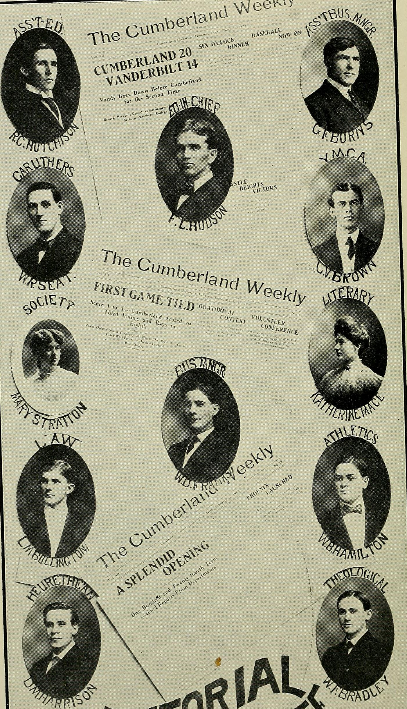
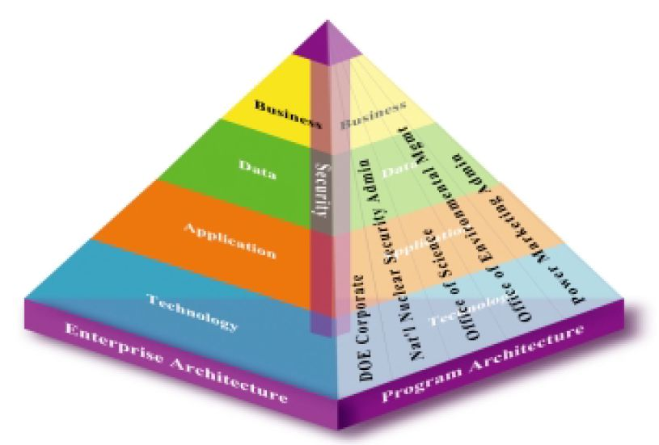
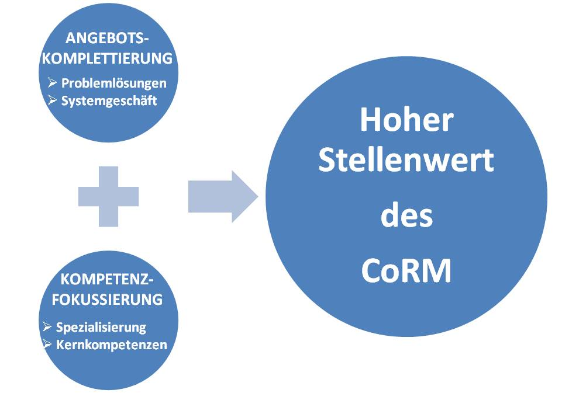

# ವ್ಯವಹಾರ ನಿವ೯ಹಣೆ

ನಿರ್ವಹಣೆ ಪ್ರಸ್ತಾಪನೆ
ನಿರ್ವಹಣೆಯ ವ್ಯಾಖ್ಯಾನವೇನೆಂದರೆ ವಿನ್ಯಾಸ]ಮತ್ತು ಬೆಂಬಲ ಕೊಡುವ ಪರಿಸರ ದಲ್ಲಿ ವ್ಯಕ್ತಿಗಳು, ಗುಂಪುಗಳು ಒಟ್ಟಿಗೆ ಕೆಲಸ, ಪರಿಣಾಮಕಾರಿಯಾಗಿ ಆಯ್ಕೆ ಗುರಿ ಗಳನ್ನು ಸಾಧಿಸುವ ಪ್ರಕ್ರಿಯೆ ಆಗಿದೆ. ಈ ಮೂಲ ವ್ಯಾಖ್ಯಾನವನ್ನು ವಿಸ್ತರಿಸಲು ಅಗತ್ಯವಿದೆ:
೧. ವ್ಯವಸ್ಥಾಪಕರಾಗಿ, ಜನರು ವ್ಯವಸ್ಥಾಪನ ಕಾರ್ಯಗಳನ್ನು ನಿರ್ವಹಿಸಲು ಯೋಜನೆ ಸಂಘಟನಾ, ಸಿಬ್ಬಂದಿ ಮತ್ತು ನಿಯಂತ್ರಿಸುವ ಕಾರ್ಯಗಳನ್ನು ಕೈಗೊಂಡರು.
೨. ನಿರ್ವಹಣೆ ಎಲ್ಲಾ ತರಹದ ಸಂಸ್ಥೆಗಳಿಗೂ ಅನ್ವಯಿಸುತ್ತದೆ.
೩. ಸಂಸ್ಥೆಯ ಎಲ್ಲಾ ಮಟ್ಟದ ವ್ಯವಸ್ಥಾಪಕರಿಗೂ ಈ ನಿರ್ವಹಣೆ ಅನ್ವಯಿಸುತ್ತದೆ.
೪. ಎಲ್ಲಾ ವ್ಯವಸ್ಥಾಪಕರ ಗುರಿಯೂ ಒಂದೇ ಆಗಿರುತ್ತದೆ: ಹೆಚ್ಚುವರಿ ರಚಿಸಲು.
೫. ವ್ಯವಸ್ಥಾಪಕ ಉತ್ಪಾದಕತೆ ಸಂಬಂಧಪಟ್ಟಿದೆ.

ನಿರ್ವಹಣೆಯ ಪ್ರಕಾರ್ಯಳು
೧.ನಿರ್ವಹಣೆ ಯಾವುದೇ ಒಂದು ಸಂಸ್ಥೆಗೂ ಅತ್ಯಗತ್ಯವಾಗಿದೆ.
೨.ಬೇರೆ ಬೇರೆ ಸಂಸ್ಥೆಯ ಮಟ್ಟದಲ್ಲಿ ನಿರ್ವಹಣೆ. ಮೂರು ಸಂಸ್ಥೆಯ ಮಟ್ಟಗಳಿವೆ:

ಯೋಜನೆಯ ಪ್ರಾಮುಖ್ಯತೆಗಳು:
೧. ಯೋಜನೆ ಭವಿಷ್ಯದ ಅನಿಶ್ಚಿತ ಮತ್ತು ಬದಲಾವಣೆ ಪರಿಹಾರ ಮಾಡುತ್ತದೆ.
೨. ಯೋಜನೆ ಉದ್ದೇಶ ಮೂಲಕ ನಿರ್ವಹಣೆ ಮಾಡುತ್ತದೆ.
೩. ಯೋಜನೆ ಸಮನ್ವಯಕ್ಕೆ ಸಹಾಯ ಮಾಡುತ್ತದೆ.
೪. ಯೋಜನೆ ಕಾರ್ಯಾಚರಣೆಯಲ್ಲಿ ಆರ್ಥಿಕವಾಗಿದೆ.
೫. ಯೋಜನೆ ನಿಯಂತ್ರಣದಲ್ಲಿ ಸಹಾಯಮಾಡುತ್ತದೆ.

ನಿರ್ವಹಣೆ - ಸಮರ್ಥವಾಗಿ ಮತ್ತು ಪರಿಣಾಮಕಾರಿಯಾಗಿ ಬಯಸಿದ ಗುರಿ ಮತ್ತು ಉದ್ದೇಶಗಳು ಸಾಧಿಸಲು ಸಂಪನ್ಮೂಲಗಳನ್ನು ಹಂಚುವಲ್ಲಿ ಕ್ರಿಯೆ. ಮ್ಯಾನೇಜ್ಮೆಂಟ್ ಪ್ರಮುಖ ಅಥವಾ ನಿರ್ದೇಶನ, ಮತ್ತು ಗುರಿ ಸಾಧಿಸಲು ಉದ್ದೇಶದಿಂದ ಒಂದು ಸಂಸ್ಥೆಯ ( ಒಂದು ಅಥವಾ ಹೆಚ್ಚು ಜನರು ಅಥವಾ ವಸ್ತುಗಳ ಒಂದು ಗುಂಪು ) ಅಥವಾ ಪ್ರಯತ್ನ ನಿಯಂತ್ರಿಸುವ, ಯೋಜನೆ, ಸಂಘಟನೆ, ಸಿಬ್ಬಂದಿ ಒಳಗೊಂಡಿದೆ.

ಉತ್ತಮ ಯೋಜನೆಯ ಅವಶ್ಯಕತೆಗಳು:
೧.ಇದು ಸ್ಪಷ್ಟವಾಗಿ ನಿರ್ದಿಷ್ಟ ಧ್ಯೇಯಗಳನ್ನು ಆಧರಿಸಿರಬೇಕು.
೨.ಇದು ಸುಲಭವಾಗಿ ಇರಬೇಕು.
೩.ಇದು, ತರ್ಕಬದ್ಧ ಸೂಕ್ತ ಮತ್ತು ಸಮಗ್ರವಾಗಿ ಇರಬೇಕು
೪.ಇದು ಸೌಮ್ಯವಾದವಾಗಿರಬೇಕು.
೫.ಇದು ಸರಿದೂಗಿಸುವಂತಿರಬೇಕು.

ಯೋಜನೆಯ ಮಿತಿಗಳು:
೧. ಮುಂದಾಲೋಚನೆ ಮಿತಿ.
೨. ಬಿಗಿತ ಮತ್ತು ಹಟಮಾರಿ ಧೋರಣೆ.
೩. ಸಮಯ ತೆಗೆದುಕೊಳ್ಳುವ ಮತ್ತು ದುಬಾರಿಯಾದ ಕ್ರಿಯೆಯಾಗಿದೆ
೪. ಬೇರೆ ಮಿತಿಗಳು.

ವ್ಯವಹಾರದ ಮ್ಯಾನೇಜರ್:

*The Phoenix (1908) (14595329010)*

ವ್ಯಾಪಾರ ಮ್ಯಾನೇಜರ್ ದೊಡ್ಡ ಲಾಭ [ಉಲ್ಲೇಖದ ಅಗತ್ಯವಿದೆ] ಪರಿಣಾಮಕಾರಿಯಾಗಿ ಪ್ರಮುಖ ವ್ಯವಹಾರ ನಡೆಸಲು ಮತ್ತು ಮಾಡಲು ಇತರರು ಕೆಲಸ ಡ್ರೈವುಗಳನ್ನು ಒಬ್ಬ ವ್ಯಕ್ತಿ. ಅವನು ಅಥವಾ ಅವಳು ಕೆಳಗಿನ ಪ್ರದೇಶಗಳನ್ನು ಜ್ಞಾನ ಕೆಲಸ ಇರಬೇಕು, ಮತ್ತು ಒಂದು ಅಥವಾ ಹೆಚ್ಚು ತಜ್ಞರು ಇರಬಹುದು : ಮಾರಾಟ, ಮಾರುಕಟ್ಟೆ ಮತ್ತು ಸಾರ್ವಜನಿಕ ಸಂಬಂಧಗಳ ; ಸಂಶೋಧನೆ, ಕಾರ್ಯಾಚರಣೆ ವಿಶ್ಲೇಷಣೆ, ದತ್ತಾಂಶ ಸಂಸ್ಕರಣೆ ಗಣಿತ , ಸಂಖ್ಯಾಶಾಸ್ತ್ರ ಮತ್ತು ಅರ್ಥಶಾಸ್ತ್ ರದ ; ಉತ್ಪಾದನೆ ; ಹಣಕಾಸು; ಲೆಕ್ಕಪತ್ರ, ಲೆಕ್ಕ ಪರಿಶೋಧನೆ, ತೆರಿಗೆ ಮತ್ತು ಬಜೆಟ್ ; ಖರೀದಿ ; ಮತ್ತು ಸಿಬ್ಬಂದಿ. ವ್ಯಾಪಾರದ ಮ್ಯಾನೇಜರ್ ಪರಿಣತಿಯನ್ನು ಹೊಂದಿರಬಹುದು ಇದರಲ್ಲಿ [ಉಲ್ಲೇಖದ ಅಗತ್ಯವಿದೆ] ಇತರ ತಾಂತ್ರಿಕ ಪ್ರದೇಶಗಳಲ್ಲಿ ಕಾನೂನು, ವಿಜ್ಞಾನ, ಮತ್ತು ಕಂಪ್ಯೂಟರ್ ಪ್ರೋಗ್ರಾಮಿಂಗ್ ಇವೆ.

ಅನೇಕ ಉದ್ಯಮಗಳು, ವ್ಯಾಪಾರ ಮ್ಯಾನೇಜರ್ ಪಾತ್ರದಲ್ಲಿ ಕಂಪನಿ ವಿಸ್ತರಣೆ ಅಥವಾ ಮಾರುಕಟ್ಟೆ ಗೆ ನುಗ್ಗುವ ನಿರ್ದಿಷ್ಟ ನೋಟದ ಗಮನ ಸಲುವಾಗಿ ಮೇಲೆ ತಿಳಿಸಿದ ಅನೇಕ ಪಾತ್ರಗಳನ್ನು ಕೆಲವು ಚೆಲ್ಲುವ ಸಣ್ಣ ವ್ಯಾಪಾರ ಮಾಲೀಕರು ಆಸೆ ಯನ್ನು ಹೊರಗೆ ಬೆಳೆಯಬಹುದು. ಒಂದು ಬಾರಿಗೆ ವ್ಯಾಪಾರ ಮ್ಯಾನೇಜರ್ ವ್ಯಾಪಾರ ಮ್ಯಾನೇಜರ್ ಮಾಲೀಕರು ಲಾಭದ ಟ್ರಸ್ಟ್, ಮಾಲೀಕರು ಕರ್ತವ್ಯಗಳನ್ನು ಹಂಚಿಕೊಳ್ಳಬಹುದು. ತಾತ್ತ್ವಿಕವಾಗಿ, ವ್ಯವಹಾರದ ಮ್ಯಾನೇಜರ್ ಮತ್ತು ಸಹಕ್ರಿಯೆಯ ಸ್ವರೂಪದಲ್ಲಿ ಮಾಲೀಕರು ಕೆಲಸ ಯಶಸ್ವಿ ವ್ಯಾಪಾರ ನಡೆಸುವ ವ್ಯಾಪಾರ ನಿರತರಾಗಿದ್ದರು ಖಚಿತಪಡಿಸಲು. ಈ ಬಾರಿ ತನ್ನ ಮುಂದುವರಿದ ಒಳಗೊಳ್ಳುವಿಕೆಯ ಒಂದು ತುಲನಾತ್ಮಕ ಅನಾನುಕೂಲತೆ ಇರುತ್ತದೆ ಇದು ಕಾರ್ಯಗಳನ್ನು ಬಿಟ್ಟುಬಿಡುವಂತೆ ಮಾಲೀಕರು ಒಂದು ಪ್ರಕ್ರಿಯೆಯಾಗಿರಬಹುದು.

ವ್ಯಾಪಾರ ಸಂಬಂಧ ನಿರ್ವಹಣೆ.

*DOE EA Framework 2002*

ವ್ಯಾಪಾರ ಸಂಬಂಧ ನಿರ್ವಹಣೆ (MDE) ವ್ಯಾಖ್ಯಾನಿಸಲು, ಮತ್ತು ವ್ಯಾಪಾರ ನೆಟ್ವರ್ಕಿಂಗ್ ಸಂಬಂಧಿಸಿದ ಅಂತರ ವ್ಯಾಪಾರ ಚಟುವಟಿಕೆಗಳನ್ನು ಬೆಂಬಲಿಸುವ, ಗ್ರಹಿಕೆಗೆ ಔಪಚಾರಿಕ ವಿಧಾನವಾಗಿದೆ. ವ್ಯಾಪಾರ ಸಂಬಂಧ ನಿರ್ವಹಣೆ ಉತ್ಪಾದಕ ಒಂದು ಸೇವಾ ಸಂಸ್ಥೆ ನಡುವಿನ ಸಂಬಂಧವನ್ನು (ಉದಾ ಮಾನವ ಸಂಪನ್ಮೂಲ , ಮಾಹಿತಿ ತಂತ್ರಜ್ಞಾನ , ಒಂದು ಹಣ ಕಾಸು ಇಲಾಖೆ, ಅಥವಾ ಬಾಹ್ಯ ಒದಗಿಸುವವರು ) ಮತ್ತು ಅವರ ವ್ಯಾಪಾರ ಪಾಲುದಾರರು ಬೆಳೆಸುವ ಎಂದು ಜ್ಞಾನ , ಕೌಶಲಗಳು ಮತ್ತು ನಡವಳಿಕೆಗಳ ( ಅಥವಾ ಸಾಮರ್ಥ್ಯಗಳ ) ಒಳಗೊಂಡಿದೆ.

ವ್ಯಾಪಾರ ಸಂಬಂಧ ನಿರ್ವಹಣೆ ಅಭಿವೃದ್ಧಿ ಚಾಲನೆ ಪ್ರವೃತ್ತಿಗಳು:
೧. ವ್ಯಾಪರ ಸಂಬಂಧ ನಿರ್ವಹಣೆ ಜವಾಬ್ದಾರಿ ಉದ್ಯಮಿಗಳ ಮೂಲಕ ವ್ಯಾಪಾರ ಮೌಲ್ಯ ಸಾಕ್ಷಾತ್ಕಾರ ಕೇಂದ್ರೀಸುತ್ತದೆ.
೨. ಜ್ಞಾನವಿಕೇಂದ್ರಕರಣ ಮತ್ತು ಸಾಂಪ್ರದಾಯಿಕ ಬೌದ್ಧಿಕ ಆಸ್ತಿ ಅಪಮೌಲ್ಯೀಕರಣಕ್ಕೆ.

ಗುರಿಗಳು:

೧.ಶಿಸ್ತುವಿಗಾಗಿ

೨. ಮಾದರಿ

ಒಂದು ಗುರಿ ತಮ್ಮ ವಿವಿಧ ಅಂಶಗಳನ್ನು ಸ್ಪಷ್ಟ ಮತ್ತು ಅಳೆಯಬಹುದಾದ ಎರಡೂ ಮಾಡಲು, ಒಂದು ಸಂಪೂರ್ಣ ವ್ಯಾಪಾರ ಸಂಬಂಧಗಳ ಮಾದರಿ ಮತ್ತು ಕಾಲಾನಂತರದಲ್ಲಿ ತಮ್ಮ ಮೌಲ್ಯವನ್ನು ಒದಗಿಸುವುದು. ಬಲಿತಿರುವ ಮಾದರಿ ಅಂತಿಮ ವಾಗಿ ವ್ಯಾಪಾರ ಸಂಬಂಧ ನಿರ್ವಹಣೆ ತತ್ವಗಳನ್ನು ಪರಿಪಾಲಿಸುವ ನಿಗದಿತ ವ್ಯಾಪಾರಿ ಸಂಶೋಧನೆ ಮತ್ತು ಅಭಿವೃದ್ಧಿ ಪ್ರಯತ್ನಗಳಿಗೆ ಹಾಗೂ ತಂತ್ರಗಳನ್ನು ಬೆಂಬಲಿಸುತ್ತದೆ.

*Stellenwert des CoRM*

ವ್ಯಾಪಾರ ಸಂಬಂಧ ನಿರ್ವಹಣೆ ಮಾಡೆಲಿಂಗ್ ಪ್ರಕ್ರಿಯೆಗೆ ವಿಧಾನದ ವಿಷಯದಲ್ಲಿ ವ್ಯಾಪಾರ ಸಂಬಂಧಗಳನ್ನು ವಿವಿಧ ಅಂಶಗಳನ್ನು ಗುರುತಿಸಿ ವಿವರಿಸಲು :

## ಉಲ್ಲೇಖಗಳು

<reference/> [ ೧ ] [ ೨ ]

- ↑ http://www.bmcc.cuny.edu/business/bec_program.jsp
- ↑ https://en.wikipedia.org/wiki/Outline_of_business_management

---
Source: https://kn.wikipedia.org/wiki/%E0%B2%B5%E0%B3%8D%E0%B2%AF%E0%B2%B5%E0%B2%B9%E0%B2%BE%E0%B2%B0_%E0%B2%A8%E0%B2%BF%E0%B2%B5%E0%B3%AF%E0%B2%B9%E0%B2%A3%E0%B3%86
