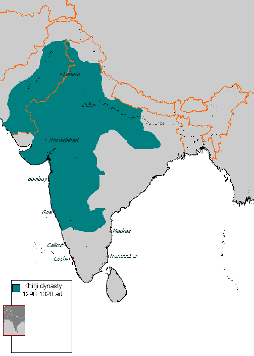

# ಅಲಾವುದ್ದೀನ್ ಖಿಲ್ಜಿ

| ಸುಲ್ತಾನ್ ಅಲಾವುದ್ದೀನ್ ಖಿಲ್ಜಿ |
| --- |
| Sultan of India |
| ಸುಲ್ತಾನ್ ಅಲಾವುದ್ದೀನ್ ಖಿಲ್ಜಿ |
| ರಾಜ್ಯಭಾರ |
| ಪಟ್ಟಾಭಿಷೇಕ |
| ಜನ್ಮ ಸ್ಥಳ |
| ಮರಣ ಸ್ಥಳ |
| ಸಮಾಧಿ ಸ್ಥಳ |
| ಪೂರ್ವಾಧಿಕಾರಿ |
| ಉತ್ತರಾಧಿಕಾರಿ |
| ಅರಮನೆ |

*ಖಿಲ್ಜಿ ಸಾಮ್ರಾಜ್ಯ*

ಅಲಾವುದ್ದೀನ್ ಖಿಲ್ಜಿ (1296-1316). ಜಲಾಲುದ್ದೀನ್ ಖಿಲ್ಜಿಯ ಅಳಿಯ, ಮತ್ತು ಆತನ ಉತ್ತರಾಧಿಕಾರಿ. ಈತ ದೆಹಲಿ ಸುಲ್ತಾನರಲ್ಲೆಲ್ಲ ಅತಿ ಕ್ರೂರಿ ಮತ್ತು ಬಲಿಷ್ಠ. ಭಾರತದಲ್ಲಿ ವಿಶಾಲ ಮಹಮ್ಮದೀಯ ಸಾಮ್ರಾಜ್ಯವನ್ನು ಸ್ಥಾಪಿಸಲೆತ್ನಿಸಿದವರಲ್ಲಿ ಮೊದಲಿಗ. ದಕ್ಷಿಣದ ಹಿಂದು ರಾಜ್ಯಗಳ ಮೇಲೆ ಮೊಟ್ಟಮೊದಲು ಮಹಮ್ಮದೀಯರ ರಾಜಕೀಯ ಪ್ರಭಾವವನ್ನು ಸ್ಥಾಪಿಸಿದ. ಜಲಾಲುದ್ದೀನನ ಆಳ್ವಿಕೆಯ ಕೊನೆಗಾಲದಲ್ಲಿ ಖಾರ ಮತ್ತು ಮಾಳವ ರಾಜ್ಯಗಳ ಪ್ರಾಂತ್ಯಾಧಿಕಾರಿಯಾಗಿದ್ದ, ಸುಖವಿಹೀನ ಗೃಹಜೀವನದಿಂದುದ್ದೀಪಿತನಾದ ಅಲಾವುದ್ದೀನ್ 1294 ರಲ್ಲಿ 8000 ಅಶ್ವಬಲ ಸಮೇತನಾಗಿ ವಿಂಧ್ಯಪರ್ವತವನ್ನು ದಾಟಿ, ದೇವಗಿರಿ ಯನ್ನು ಮುತ್ತಿ ಅಲ್ಲಿನ ರಾಜನಾದ ಯಾದವ ರಾಮಚಂದ್ರನನ್ನೂ ಆತನ ಮಗ ಶಂಕರದೇವ ನನ್ನೂ ಸೋಲಿಸಿ ಚಿನ್ನ , ಬೆಳ್ಳಿ , ರತ್ನ ಮೊದಲಾದ ಅಪಾರ ಸಂಪತ್ತಿನ ಕೊಳ್ಳೆಯೊಡನೆ ಹಿಂದಿರುಗಿದ. ವಿಜಯಿ ಅಲಾವುದ್ದೀನನನ್ನು ಸುಲ್ತಾನ್ ಜಲಾಲುದ್ದೀನನು ಗಂಗಾತೀರದಲ್ಲಿ ಸ್ವಾಗತಿಸುವಂತೆ ನಿಷ್ಕರ್ಷೆಯಾಯಿತು. ಗುಪ್ತವಾಗಿ ಮೊದಲೇ ನಿರ್ಧರಿಸಿದ್ದಂತೆ ಸಂದರ್ಶನದ ವೇಳೆಯಲ್ಲಿ ಅಲಾವುದ್ದೀನ್ ಕುತಂತ್ರದಿಂದ ಮಾವನನ್ನು ಕೊಲೆಮಾಡಿಸಿ ದಕ್ಷಿಣದಿಂದ ದೋಚಿ ತಂದಿದ್ದ ಐಶ್ವರ್ಯವನ್ನು ತನಗೆ ಬೇಕಾದವರಿಗೆ ಹಂಚಿ, 1296ರಲ್ಲಿ ದೆಹಲಿ ಸಿಂಹಾಸನವನ್ನಾಕ್ರಮಿಸಿ, ತನ್ನ ವಿರೋಧಿಗಳನ್ನು ಕ್ರೌರ್ಯದಿಂದ ನಿರ್ನಾಮ ಮಾಡಿದ. ಇವನ 20 ವರ್ಷಗಳ ಆಳ್ವಿಕೆ ಭಯೋತ್ಪಾದನೆಯ ರಕ್ತಪಾತದ ಕಾಲವಾಗಿತ್ತು.

## ದಂಡಯಾತ್ರೆ

ಆ ವೇಳೆಯಲ್ಲಿ ಪಂಜಾಬ್ ಮತ್ತು ವಾಯವ್ಯ ಪ್ರದೇಶದಲ್ಲಿ ಮಂಗೋಲರ ಭೀತಿ ವಿಪರೀತವಾಗಿತ್ತು. ಅವರು ಒಂದಾದ ಮೇಲೊಂದರಂತೆ ಆಕ್ರಮಣ ಮಾಡಿ ಸಂಪತನ್ನು ಸೂರೆಗೊಂಡು ಹಿಂದಿರುಗುತ್ತಿದ್ದರು. 1307ರಲ್ಲಿ ಅವರ ದಂಡು ದೆಹಲಿ ವರೆಗೂ ಬಂದಿತ್ತು. ಅಲಾವುದ್ದೀನ್ ಸತತವಾಗಿ ಕಾಲುಶತಮಾನಕಾಲ ಹೋರಾಡಿ ಮಂಗೋಲರ ಹಾವಳಿಯನ್ನು ತಡೆಗಟ್ಟಿದ. ಗಡಿನಾಡಿನ ರಕ್ಷಣಾಕಾರ್ಯಗಳನ್ನು ಪುನರ್ವ್ಯವಸ್ಥೆಗೊಳಿಸಿ ತುಘಲಕ್ ಎಂಬ ಸೇನಾನಾಯಕನ ವಶಕ್ಕೆ ಅಲ್ಲಿನ ಕಾವಲುಸೈನ್ಯವನ್ನು ಒಪ್ಪಿಸಿದ. ಮಹಾತ್ತ್ವಾಕಾಂಕ್ಷಿಯಾದ ಅಲಾವುದ್ದೀನನಿಗೆ ಒಂದು ಹೊಸ ಮತವನ್ನು ಸ್ಥಾಪಿಸಬೇಕೆಂಬ ಹಾಗೂ ಅಲೆಕ್ಸಾಂಡರನಂತೆ ಪ್ರಪಂಚವನ್ನೇ ಗೆಲ್ಲಬೇಕೆಂಬ ಆಕಾಂಕ್ಷೆಗಳು ಹುಟ್ಟಿದವು. ಅಲ್ಲಾ ಉಲ್ ಮುಲ್ಕ್‌ ಎಂಬ ತನ್ನ ಆಪ್ತ ಖಾಜಿಯ ಹಿತೋಕ್ತಿಯಿಂದ ಈ ಎರಡು ಅಭಿಲಾಷೆಗಳನ್ನೂ ಕೈಬಿಟ್ಟು ಹಿಂದೂಸ್ಥಾನವನ್ನೆಲ್ಲ ಜಯಿಸಲುದ್ಯುಕ್ತನಾದ. ಮೊದಲು ರಜಪೂತ ಸಂಸ್ಥಾನಗಳ ಕಡೆಗೆ ತಿರುಗಿ ಕ್ರೌರ್ಯದಿಂದ ಗುಜರಾತ್ , ರಣತಂಬೂರ್ ಮತ್ತು ಮೇವಾರ್ ರಾಜ್ಯಗಳನ್ನು ವಶಪಡಿಸಿಕೊಂಡ. ರಾಣಾ ರತನ್ ಸಿಂಗ್ ನ ರಾಣಿ ಪದ್ಮಿನಿಯನ್ನು ಪಡೆಯಲು ಅಲಾವುದ್ದೀನ್ ಚಿತ್ತೂರನ್ನು ಮುತ್ತಿದನೆಂಬ ವಿಷಯದಲ್ಲಿ ಭಿನ್ನಾಭಿಪ್ರಾಯಗಳಿವೆ.

1305ರ ವೇಳೆಗೆ ಇಡೀ ಉತ್ತರ ಹಿಂದುಸ್ಥಾನದಲ್ಲಿ ಖಿಲ್ಜಿ ಸಾಮ್ರಾಜ್ಯ ಏರ್ಪಟ್ಟಿತು. ಅನಂತರ ಅಲಾವುದ್ದೀನ್ ರಾಜಕೀಯ ಮತ್ತು ಆರ್ಥಿಕ ಲೋಭದಿಂದ ದಕ್ಷಿಣದ ಕಡೆಗೆ ತನ್ನ ಗಮನ ಹರಿಸಿದ. ದಕ್ಷಿಣ ರಾಜ್ಯಗಳ ಆಕ್ರಮಣಕ್ಕೆ ತನ್ನ ಆಪ್ತ ಗುಲಾಮನೂ ಪರಾಕ್ರಮಿಯೂ ಆದ ಮಲಿಕ್ ಕಾಫೂರನನ್ನು (ಮಲಿಕ್ ನಾಯಿಬ್) ನೇಮಿಸಿದ. ಈತ ತನ್ನ ಮೊದಲ ದಾಳಿಯಲ್ಲಿ ರಾಜ ರಾಮಚಂದ್ರ ಕ್ರಮವಾಗಿ ಕಪ್ಪಕಾಣಿಕೆಯನ್ನು ಸಲ್ಲಿಸುತ್ತಿರಲಿಲ್ಲವೆಂಬ ನೆಪದ ಮೇಲೆ ದೇವಗಿರಿಯನ್ನು ಮುತ್ತಿ ಕೊಳ್ಳೆ ಹೊಡೆದ. ಎರಡನೆಯ ದಂಡಯಾತ್ರೆಯಲ್ಲಿ ವಾರಂಗಲ್ಲಿನ ಪ್ರತಾಪರುದ್ರನನ್ನು ಸೋಲಿಸಿದ. 1313ರಲ್ಲಿ ಹೊಯ್ಸಳ 3ನೆಯ ವೀರಬಲ್ಲಾಳ ನನ್ನು ಸೋಲಿಸಿ ದೋರಸಮುದ್ರ ವನ್ನು ಕೊಳ್ಳೆ ಹೊಡೆದ. ಮಧುರೆ ಹಾಗೂ ರಾಮೇಶ್ವರ ದವರೆಗೂ ದಂಡೆತ್ತಿ ಹೋಗಿ ಪಾಂಡ್ಯರನ್ನು ಸೋಲಿಸಿ ವಿಶೇಷವಾದ ಐಶ್ವರ್ಯವನ್ನು ದೋಚಿದ. ಈ ದಂಡಯಾತ್ರೆಗಳಿಂದ ಸಾವಿರಾರು ಮಂದಿ ಮಡಿದರು, ಅನೇಕ ಪಟ್ಟಣಗಳು ಹಾಗೂ ದೇವಾಲಯ ಗಳು ನಾಶವಾದವು. ಅಪಾರ ಸಂಪತ್ತು ಸುಲ್ತಾನನ ವಶವಾಯಿತು.

## ಆಡಳಿತ

ಅಲಾವುದ್ದೀನ್ ಆಡಳಿತ ವ್ಯವಸ್ಥೆಯನ್ನು ಇಸ್ಲಾಂ ಧರ್ಮ ದ ಆಧಾರದ ಮೇಲೆ ರೂಪಿಸದೆ ತನ್ನ ಪರಮಾಧಿಕಾರಕ್ಕೆ ಸೂಕ್ತವಾಗುವಂತೆ ಮಾರ್ಪಡಿಸಿಕೊಂಡ. ಆಡಳಿತ, ಸೈನ್ಯ ಮತ್ತು ಆರ್ಥಿಕ ಕ್ಷೇತ್ರಗಳಲ್ಲಿ ಅನೇಕ ಸುಧಾರಣೆಗಳನ್ನು ಜಾರಿಗೆ ತಂದ. ಅಗತ್ಯ ವಸ್ತುಗಳ ಕಾಳ ಧಂಧೆ ಮಾರಾಟದ ಮೇಲೆ ಉಗ್ರವಾದ ಹತೋಟಿ ವಿಧಿಸಿದ. ಮಾದಕ ಪದಾರ್ಥಗಳ ಸೇವನೆ, ಜೂಜಾಟ, ಶ್ರೀಮಂತರು ಒಟ್ಟಿಗೆ ಕಲೆಯುವುದು ನ್ಯಾಯಬಾಹಿರವೆಂದು ಘೋಷಿಸಿದ. ತಪ್ಪಿತಸ್ಥರೆಂದು ಕಂಡವರನ್ನು ಕ್ರೂರವಾಗಿ ದಂಡಿಸಿದ. ಹಿಂದುಗಳು ದಂಗೆಯೇಳಬಹುದೆಂಬ ಭೀತಿಯಿಂದ ಅವರ ಮೇಲೆ ಭಾರವಾದ ತೆರಿಗೆಗಳನ್ನು ವಿಧಿಸಿದ. ಮಹಮ್ಮದೀಯರಲ್ಲಿ ಆಡಳಿತ ವಿರುದ್ಧ ಅಸಮಾಧಾನವೂ ಹಿಂದುಗಳಲ್ಲಿ ಕಡುಬಡತನ ಮತ್ತು ಅಸಹಾಯಕತೆಯ ನೋವು ಅಂದಿನ ಸಾಮಾಜಿಕ ಸ್ಥಿತಿಯ ನೈಜ ಪ್ರತಿಬಿಂಬಗಳಾಗಿದ್ದುವು. ಕ್ರೂರಿಯಾದ ಅಲಾವುದ್ದೀನನ ಅಂತ್ಯ ದುಃಖಮಯವಾಗಿತ್ತು. ಅತಿಭೋಗದಿಂದ ಅವನ ಆರೋಗ್ಯ ಕೆಟ್ಟಿತ್ತು. ಅರಮನೆಯಲ್ಲಿ ಗೃಹಕಲಹಗಳುದ್ಭವಿಸಿ ದಂಗೆಗಳಾದವು. ಕೊನೆಗೆ ಮಲಿಕ್ ಕಾಫೂರ್ ಅಲಾವುದ್ದೀನನನ್ನು ಕೊಲೆಮಾಡಿ ಸಿಂಹಾಸನವೇರಿದ. ಆದರೆ ಒಂದು ತಿಂಗಳಲ್ಲೇ ಕಾಫೂರನ ಕೊಲೆಯಾಗಿ ಅಲಾವುದ್ದೀನನ ಮಗ ಕುತುಬ್ ಉದ್ದೀನ್ 1316ರಲ್ಲಿ ಮುಬಾರಕ್ ಎಂಬ ಬಿರುದಿನಿಂದ ಸುಲ್ತಾನನಾದ.

## ನೋಡಿ

- ಖಿಜ಼ರ್ ಖಾನ್
- ಗೋಪಾಲನಾಯಕ

## ಬಾಹ್ಯ ಸಂಪರ್ಕಗಳು

- Táríkh-i 'Aláí; or, Khazáínu-l Futúh, of Amír Khusrú Archived 2016-12-20 ವೇಬ್ಯಾಕ್ ಮೆಷಿನ್ ನಲ್ಲಿ. The History of India, as Told by Its Own Historians: The Muhammadan Period , by Sir H. M. Elliot. Vol III. 1866-177. Page:67-92.
- Khalji Dynasty - Encyclopædia Britannica
- Khilji followed The Slave Dynasty

---
Source: https://kn.wikipedia.org/wiki/%E0%B2%85%E0%B2%B2%E0%B2%BE%E0%B2%B5%E0%B3%81%E0%B2%A6%E0%B3%8D%E0%B2%A6%E0%B3%80%E0%B2%A8%E0%B3%8D_%E0%B2%96%E0%B2%BF%E0%B2%B2%E0%B3%8D%E0%B2%9C%E0%B2%BF
