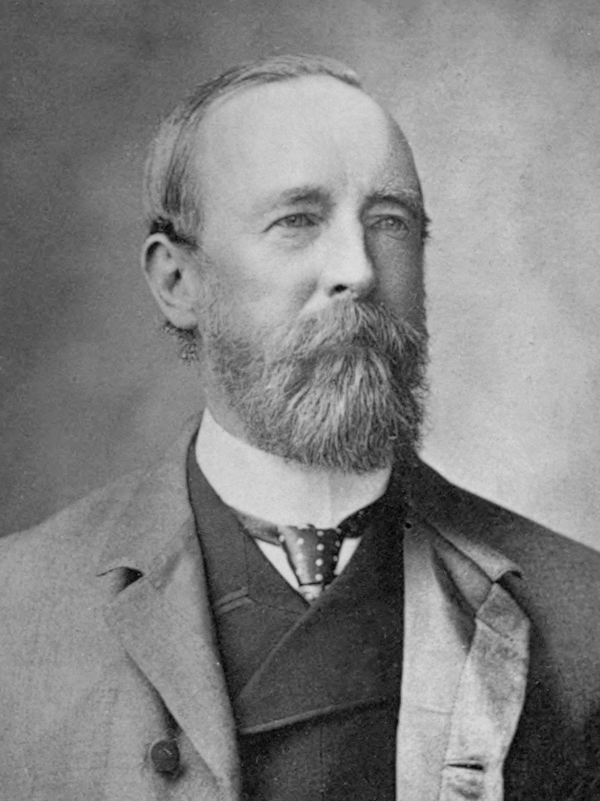

# ॲलन ऑक्टेवियन ह्यूम

| Col1 | Col2 |
| --- | --- |
|  | ह्या लेखाचा/विभागाचा इंग्रजी किंवा अमराठी भाषेतून मराठी भाषेत भाषांतर करावयाचे बाकी आहे. अनुवाद करण्यास आपलाही सहयोग हवा आहे. ऑनलाईन शब्दकोश आणि इतर सहाय्या करिता भाषांतर प्रकल्पास भेट द्या. कृपया, पुढील भाषांतर संकेतांचे पालन आवर्जून करा. [दाखवा] विकिपीडिया:शीर्षकलेखन संकेत अनुसार काही अपवाद वगळता लेख शीर्षके मराठीतच असणे अभिप्रेत आहे . एकूण लेख संख्येच्या अंदाजे २% पेक्षा अधिक लेख भाषांतर प्रतिक्षेत (इंग्रजी मसुद्याच्या स्वरूपात) असू नयेत असा संकेत आहे. स्वतःच्या संपादन संख्येच्या २% पेक्षा अधिक लेखात मसुदे परभाषेत चिटकवू नयेत. |

*ॲलन ऑक्टेवियन ह्यूम*

ए ओ ह्यूम
नागरिक नौकर, राजनीतिक सुधारक और प्रकृतिवादी
किसी अन्य भाषा में पढ़ें
डाउनलोड करें
ध्यान रखें
संपादित करें
एलेन ओक्टेवियन ह्यूम (६ जून १८२९ - ३१ जुलाई १९१२) ब्रिटिशकालीन भारत में सिविल सेवा के अधिकारी एवं राजनैतिक सुधारक थे। वे भारतीय राष्ट्रीय कांग्रेस के संस्थापक थे।

एलेन ओक्टेवियन ह्यूम
ह्यूम प्रशासनिक अधिकारी और राजनैतिक सुधारक के अलावा माहिर पक्षी-विज्ञानी भी थे, इस क्षेत्र में उनके कार्यों की वजह से उन्हें 'भारतीय पक्षीविज्ञान का पितामह' कहा जाता है।

जीवनी 
इन्हें भी देखें 
बाहरी कड़ियाँ

ख़ान अब्दुल ग़फ़्फ़ार ख़ान
भारतीय स्वातन्त्र कार्यकर्ता

गंगई
भारत सभा
1876 में सुरेंद्रनाथ बनर्जी और आनंद मोहन बोस द्वारा ब्रिटिश भारत में स्थापित पहला सम्मानित राष्

सामग्री CC BY-SA 3.0 के अधीन है जब तक अलग से उल्लेखना किया गया हो।
गोपनीयता नीति उपयोग की शर्तेंडेस्कटॉप

---
Source: https://mr.wikipedia.org/wiki/%E0%A5%B2%E0%A4%B2%E0%A4%A8_%E0%A4%91%E0%A4%95%E0%A5%8D%E0%A4%9F%E0%A5%87%E0%A4%B5%E0%A4%BF%E0%A4%AF%E0%A4%A8_%E0%A4%B9%E0%A5%8D%E0%A4%AF%E0%A5%82%E0%A4%AE
