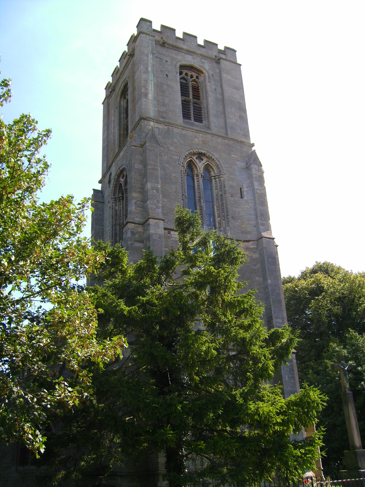
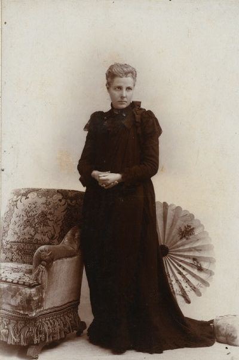
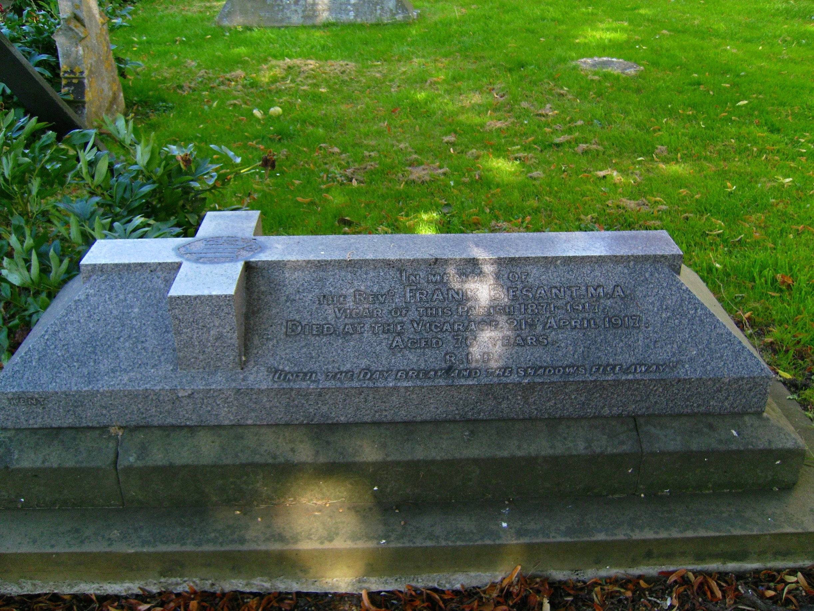
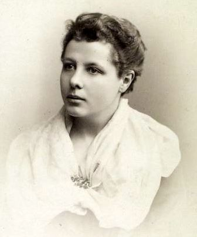
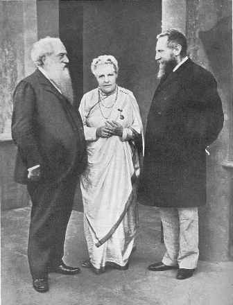
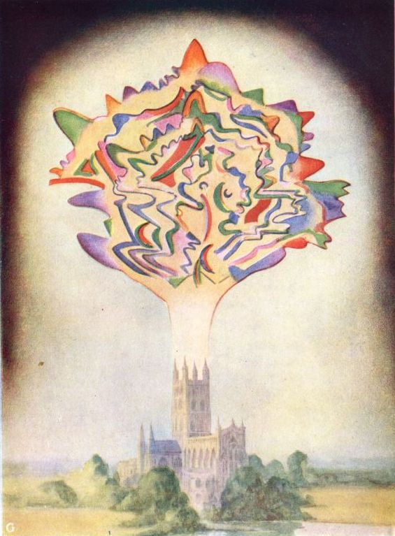
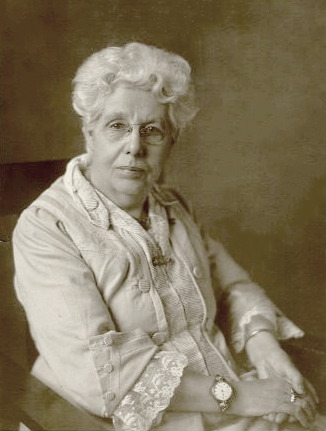

# ଆନି ବେସାନ୍ତ

| ଆନି ବେସାନ୍ତ |
| --- |
| ଆନି ବେସାନ୍ତ |
| ଜନ୍ମ |
| ମୃତ୍ୟୁ |
| ପ୍ରସିଦ୍ଧି |
| ବୈବାହିକ-ସାଥୀ(s) |
| ସନ୍ତାନ |

ଆନି ବେସାନ୍ତ (୧ ଅକ୍ଟୋବର ୧୮୪୭ – ୨୦ ସେପ୍ଟେମ୍ବର ୧୯୩୩) ବ୍ରିଟେନର ଜଣେ ପ୍ରମୁଖ ଜାତୀୟତାବାଦୀ , ବ୍ରହ୍ମ‌ବିଦ୍ୟା ବିଶେଷଜ୍ଞ , ଲେଖିକା ଏବଂ ବକ୍ତା ଥିଲେ। ସେ ସମାଜରେ ମହିଳା ମାନ‌ଙ୍କ ଅଧିକାର ରକ୍ଷା ନିମନ୍ତେ ଅତ୍ୟନ୍ତ କ୍ରିୟାଶୀଳ ଥିଲେ। ସେ ମଧ୍ୟ ଆୟର୍‌ଲ୍ୟାଣ୍ଡ୍ ଏବଂ ଭାରତୀୟ ସ୍ୱାଧୀନତା ସଂଗ୍ରାମର ଦୃଢ଼ ସମର୍ଥକ ଥିଲେ।

୧୮୬୭ ମସିହାରେ ଆନି ୨୦ବର୍ଷ ବୟସରେ ଫ୍ରାଙ୍କ୍ ବେସାନ୍ତ ନାମକ ଜଣେ ପାଦ୍ରୀଙ୍କୁ ବିବାହ କରିଥିଲେ । ତାଙ୍କର ଦୁଇଟି ସନ୍ତାନ ଥିଲେ। କିନ୍ତୁ ଆନିଙ୍କ ମନରେ ବୃଦ୍ଧି ପାଉଥିବା ଧର୍ମ ବିରୋଧି ଚିନ୍ତାଧାରା ୧୮୭୩ ମସିହାରେ ଆନି ଏବଂ ଫ୍ରାଙ୍କ୍‌ଙ୍କ ବିବାହ ବିଚ୍ଛେଦର କାରଣ ହୋଇଥିଲା। [ ୧ ] ଏହା ପରେ ସେ ଜାତୀୟ ଧର୍ମନିରପେକ୍ଷ ସମାଜ ନାମକ ସଂଘ ବା National Secular Society (NSS)ର ଜଣେ ପ୍ରମୁଖ ବକ୍ତା, ଲେଖିକା ଏବଂ ଚାର୍ଲସ୍ ବ୍ରାଡ୍‌ଲାଫ୍‌ (Charles Bradlaugh)ଙ୍କର ଜଣେ ଅନ୍ତରଙ୍ଗ ବନ୍ଧୁ ଭା‌ବେ ପରିଚିତି ଲାଭ କରିଥିଲେ। ୧୮୭୭ ମସିହାରେ ଏକ ବ‌ହି ପ୍ରକାଶନ କରିଥିବା ଯୋଗୁଁ ପରିବାର ନିୟନ୍ତ୍ରଣ ଉପରେ ଅଭିଯାନ ଚଳାଇଥିବା ଚାର୍ଲସ୍ ନଲ୍‌ଟନ୍ ( Charles_Knowlton ) ସେମାନ‌ଙ୍କ ବିରୋଧରେ ଅଭିଯୋଗ ଆଣିଥିଲେ। କିନ୍ତୁ ଏହି ଅପବାଦ ସେମାନ‌ଙ୍କୁ ପ୍ରସିଦ୍ଧ କରିଥିଲା ଏବଂ ବ୍ରାଡ୍‌ଲାଫ୍ ୧୮୮୦ ମସିହାରେ ନର୍ଥମ୍ପଟନର ସାଂସଦ ଭାବେ ନିର୍ବାଚିତ ହୋଇଥିଲେ।

ସେ ରକ୍ତାକ୍ତ ରବିବାର ବା Bloody Sunday (୧୮୮୭) ପ୍ରଦର୍ଶନ ଏବଂ ୧୮୮୮ ମସିହାରେ ହୋଇଥିବା ଲଣ୍ଡନର ଦିଆସିଲି କାଠି କାରଖାନାରେ କାମ କରୁଥିବା ମହିଳାମାନ‌ଙ୍କର ବିଦ୍ରୋହରେ ସକ୍ରିୟ ଭା‌ବେ ଯୋଗ ଦେଇଥିଲେ। ସେ ଫାବିଆନ୍ ସମାଜ (Fabian Society) ଏବଂ ମାର୍କ୍ସିଷ୍ଟ୍ ସାମାଜିକ ଗାଣତାନ୍ତ୍ରିକ ସଂସ୍ଥା ବା Marxist Social Democratic Federation (SDF)ରଜଣେ ମୁଖ୍ୟବକ୍ତା ଥିଲେ । ଯେତେବେଳେ ମାତ୍ର ଅଳ୍ପ କେତେକ ମ‌ହିଳା ନିର୍ବାଚନରେ ଅଂଶଗ୍ରହଣ କରିବା ପାଇଁ ଯୋଗ୍ୟ ବିବେଚିତ ହୋଇ ପାରୁଥିଲେ, ସେ ସମୟରେ ଆନିବେସାନ୍ତ ସର୍ବାଧିକ ଭୋଟ୍ ପାଇ ଟାୱାର୍ ହାମ୍‌ଲେଟ୍‌ସ୍ ( Tower Hamlets ) ପାଇଁ ଲଣ୍ଡନ୍ ସ୍କୁଲ୍ ବୋର୍ଡ଼୍ ( London School Board )କୁ ନିର୍ବାଚିତ ହୋଇଥିଲେ।

୧୮୯୦ ମସିହାରେ ବେସାନ୍ତଙ୍କର ହେଲେନା ବ୍ଲାଭାଟ୍‌ସ୍କି ( Helena Blavatsky )ଙ୍କ ସ‌ହ ଦେଖା ହୋଇଥିଲା। ଆଗାମୀ ବର୍ଷ ଗୁଡ଼ିକରେ ବ୍ରହ୍ମ‌ବିଦ୍ୟା (Theosophy) ତାଙ୍କ ରୁଚି ବଢ଼ିଥିଲା; କିନ୍ତୁ ଧର୍ମନିରପେକ୍ଷତା ଜନିତ ଘଟଣା ଗୁଡ଼ିକ ଉପରେ ତାଙ୍କ ରୁଚି କମିଥିଲା । ସେ ବ୍ରହ୍ମ‌ବିଦ୍ୟା ସମାଜ ( Theosophical Society )ର ସଦସ୍ୟା ହୋଇଥିଲେ ଏବଂ ବ୍ରହ୍ମ‌ବିଦ୍ୟା ବିଷୟର ଜଣେ ପ୍ରମୁଖ ଅଧ୍ୟାପିକା ରୂପେ ମଧ୍ୟ ପରିଚିତି ଲାଭ କରିଥିଲେ । ତାଙ୍କର ବ୍ରହ୍ମ‌ବିଦ୍ୟା ସମ୍ପର୍କୀୟ କିଛି କାମ ପାଇଁ ସେ ଭାରତକୁ ଆସିଥିଲେ। ୧୯୮୮ ମସିହାରେ ସେ କେନ୍ଦ୍ରୀୟ ହିନ୍ଦୁ ମହାବିଦ୍ୟାଳୟ ( Central Hindu School ) ଏବଂ ୧୯୨୨ ମସିହାରେ ଭାରତର ମୁମ୍ବାଇଠାରେ ହାଇଦ୍ରାବାଦ୍ (ସିନ୍ଦ୍) ଜାତୀୟ କଲିଜିଏଟ୍ ବୋର୍ଡ଼୍ (Hyderabad (Sind) National Collegiate Board) ପ୍ରତିଷ୍ଠାରେ ସ‌ହାୟକ ହୋଇଥିଲେ। [ ୨ ] [ ୩ ] ୧୯୦୨ ମସିହାରେ International Order of Co-Freemasonry, ଲେ ଡ୍ରୋଇଟ୍ ହୁମେନ୍ ( Le Droit HumainLe Droit Humain )ର ପ୍ରଥମ ସମୁଦ୍ରପାର ଲଜ୍‌ ପ୍ରତିଷ୍ଠା କରିଥିଲେ। ପରବର୍ତ୍ତୀ ବର୍ଷ ଗୁଡ଼ିକରେ ସେ ବ୍ରିଟିଶ ସାମ୍ରାଜ୍ୟ (British Empire)ର ବି‌ଭିନ୍ନ ପ୍ରାନ୍ତରେ ଲଜ୍‌ମାନ ପ୍ରତିଷ୍ଠା କରିଥିଲେ । ୧୯୦୭ ମସିହାରେ ସେ ବ୍ରହ୍ମ‌ବିଦ୍ୟା ସମାଜ (Theosophical Society)ର ସଭାପତି ହୋଇଥିଲେ। ଏହି ସମାଜର ଆନ୍ତର୍ଜାତୀୟ ମୁଖ୍ୟାଳୟ ଚେନ୍ନାଇର ଆଦ୍ୟାରଠାରେ ଥିଲା।

ସେ ଭାରତୀୟ ଜାତୀୟ କଂଗ୍ରେସରେ ଯୋଗ ଦେଇ ଭାରତୀୟ ରାଜନୀତିରେ ପ୍ରବେଶ କରିଥିଲେ । ୧୯୧୪ ମସିହାରେ ପ୍ରଥମ ବିଶ୍ୱଯୁଦ୍ଧ ଆରମ୍ଭ ହେବା ସମୟରେ ଭାରତରେ ଗଣତନ୍ତ୍ର ଶାସନ ଏବଂ ସାର୍ବ‌ଭୌମତ୍ୱ ପାଇଁ ହୋମ୍ ରୁଲ୍ ଲିଗ୍ର ଅଭିଯାନ ଚଳାଇବାରେ ସେ ସାହାଯ୍ୟ କରିଥିଲେ। ଏଥିପାଇଁ ତାଙ୍କୁ ୧୯୧୭ ମସିହା ଶେଷବେଳକୁ ଭାରତୀୟ ଜାତୀୟ କଂଗ୍ରେସର ସଭାପତି ଭାବେ ନିର୍ବାଚିତ କରାଯାଇ ଥିଲା । ୧୯୨୦ ମସିହାରେ ବେସାନ୍ତ ତାଙ୍କର ପାଳିତ ପୁତ୍ର ଜିଦ୍ଦୁ କୃଷ୍ଣମୂର୍ତ୍ତୀଙ୍କ ସ‌ହ ଯୁକ୍ତ ରାଷ୍ଟ୍ର ଆମେରିକାକୁ ଯାତ୍ରା କରିଥିଲେ। ଜିଦ୍ଦୁଙ୍କୁ ସେ ବୁଦ୍ଧଙ୍କର ପୁନର୍ଜନ୍ମ ବୋଲି ଦାବି କରୁଥିଲେ। ୧୯୨୯ ମସିହାରେ କୃଷ୍ଣମୂର୍ତ୍ତୀ ଏହି ଦାବିକୁ ଖଣ୍ଡନ କରିଥିଲେ। [ ୧ ] ଯୁଦ୍ଧ ପ‌ରଠାରୁ ନିଜ ମୃତ୍ୟୁ ପର୍ଯ୍ୟନ୍ତ ବେସାନ୍ତ ଭାରତର ସ୍ୱାଧୀନତା ଏବଂ ବ୍ରହ୍ମ‌ବିଦ୍ୟାର ପ୍ରସାର ପାଇଁ ଅଭିଯାନ ଚଳାଇ ଥିଲେ । ଶେଷରେ ୧୯୩୩ ମସିହାରେ ସେ ମୃତ୍ୟୁବରଣ କରିଥିଲେ ।

## ପ୍ରାରମ୍ଭିକ ଜୀବନ

*ସିବ୍‌ସେଠାରେ ଥିବା ସେଣ୍ଟ୍ ମାର୍ଗାରେଟ୍ ଚର୍ଚ (St. Margaret's church, Sibsey), ଯେଉଁଠାରେ୧୮୭୧ରୁ ୧୯୧୭ ମସିହା ପର୍ଯ୍ୟନ୍ତ ଫ୍ରାଙ୍କ୍ ବେସାନ୍ତ ପାଦ୍ରୀ ରୂପେ କାର୍ଯ୍ୟରତ ଥିଲେ।*

ଆନିବେସାନ୍ତଙ୍କ ପ୍ରାରମ୍ଭିକ ନାମ ଆନି ଉଡ୍ ଥିଲା । ସେ ୧୮୪୭ ମସିହାରେ ଲଣ୍ଡନଠାରେ ବସବାସ କରୁଥିବା ଆୟର୍‌ଲ୍ୟାଣ୍ଡର ଏକ ମଧ୍ୟବିତ୍ତ ପରିବାରରେ ଜନ୍ମଗ୍ରହଣ କରିଥିଲେ । ସେ ନିଜର ଐତିହ୍ୟକୁ ନେଇ ଗର୍ବ ଅନୁଭ‌ବ କରୁଥିଲେ ଏବଂ ଆୟର‌୍‌ଲ୍ୟାଣ୍ଡର ସ୍ୱାୟତ ଶାସନକୁ ଜୀବନ ସାରା ସମର୍ଥନ କରିଥିଲେ । ସେ ପାଞ୍ଚ ବର୍ଷ ବୟସର ହୋଇଥିବା ସମୟରେ ତାଙ୍କ ପିତା ମୃତ୍ୟୁବରଣ କରିଥିଲେ ଏବଂ ତାଙ୍କ ପରିବାର ନିଃସ୍ୱ ହୋଇଯାଇ ଥିଲା । ଘର ଚଳାଇବା ପାଇଁ ତାଙ୍କ ମା' ହ୍ୟାରୋ ସ୍କୁଲ୍ (Harrow School)ଠାରେ ବାଳକମାନ‌ଙ୍କ ପାଇଁ ଏକ ହଷ୍ଟେଲ୍ ଚଳାଉ ଥିଲେ। କିନ୍ତୁ ସେ ଆନିଙ୍କ ପାଳନ ପୋଷଣ କରିବାରେ ଅକ୍ଷମ ହେବାରୁ ନିଜ ବନ୍ଧୁ ଏଲେନ୍ ମ୍ୟାରିୟଟ୍ (Ellen Marryat)ଙ୍କୁ ଆନିଙ୍କ ପାଳନପୋଷଣ କରିବାପାଇଁ ଅନୁରୋଧ କରିଥିଲେ। ମ୍ୟାରିୟଟ୍ ବେସାନ୍ତଙ୍କୁ ଉତ୍ତମ ଶିକ୍ଷା ପ୍ରଦାନ କରିଥିଲେ । ତାଙ୍କୁ ସମାଜପ୍ରତି ତାଙ୍କର କର୍ତ୍ତବ୍ୟସମ୍ପର୍କରେ ଏବଂ ଜଣେ ସ୍ୱାଧୀନ ମହିଳାର ସାମର୍ଥ୍ୟ ବିଷୟରେ ଉଦ୍‌ବୁଦ୍ଧ କରାଯାଇଥିଲା । [ ୪ ] ଯୁବତୀ ହୋଇଥିବା ସମୟରେ ସେ ସମ୍ପୂର୍ଣ୍ଣ ଇଉରୋପ ଭ୍ରମଣ କରିଥିଲେ। ସେଠାରେ ସେ ରୋମାନ କ୍ୟାଥୋଲିକ୍ ( Roman Catholic ) ପରମ୍ପରା ଏବଂ ପର୍ବପର୍ବାଣିଦ୍ୱାରା ପ୍ରଭାବିତ ହୋଇଥିଲେ ଏବଂ ଏହି ପ୍ରଭାବ ତାଙ୍କ ଜୀବନରେ ଶେଷ ପର୍ଯ୍ୟନ୍ତ ରହିଥିଲା।

୧୮୬୭ ମସିହାରେ କୋଡ଼ିଏ ବର୍ଷ ବୟସରେ ସେ ୨୬ ବର୍ଷୀୟ ପାଦ୍ରୀ ଫ୍ରାଙ୍କ୍ ବେସାନ୍ତ (୧୮୪୦-୧୯୧୭)ଙ୍କୁ ବିବାହ କରିଥିଲେ। ଫ୍ରାଙ୍କ୍ ୱାଲ୍‌ଟର୍ ବେସାନ୍ତ (Walter Besant)ଙ୍କ ସାନଭାଇଥିଲେ । ସେ ଜଣେ ଖ୍ରୀଷ୍ଟ ଧର୍ମାବଲମ୍ବୀ Anglicanism Anglican ଥିଲେ ଏବଂ ତାଙ୍କର ଅନେକ ମତ ଆନିଙ୍କ ମତ ସ‌ହ ମେଳ ଖାଉଥିଲା । [ ୪ ] ନିଜ ବିବାହ ଦିନ ଆନି ମାଞ୍ଚେଷ୍ଟର୍‌ଠାରେ ରହୁଥିବା ନିଜର ଜଣେ ବନ୍ଧୁଙ୍କଦ୍ୱାରା ବ୍ରିଟିଶ୍ ସାମ୍ରାଜ୍ୟର ହିଂସା, ଆୟର‌୍‌ଲ୍ୟାଣ୍ଡର ସ୍ୱାଧୀନତା ପାଇଁ ଲଢ଼ିଥିବା ମାଞ୍ଚେଷ୍ଟର୍ର ସ‌ହୀଦ୍ (Manchester Martyrs) ତ‌ଥା ଗ୍ରାମଞ୍ଚଳର ଗରିବ ଲୋକମାନ‌ଙ୍କ ସଂଶ୍ପର୍ଶରେ ଆସିଥିଲେ। ଏହା ତାଙ୍କୁ ରାଜନୈତିକ ଚିନ୍ତାଧାରାରେ ଉପନୀତ କରିଥିଲା। [ ୫ ]

*ଆନିବେସାନ୍ତ*

*ସିବ୍‌ସେଠାରେ ଥିବାଫ୍ରାଙ୍କ୍ୱେସାନ୍ତଙ୍କସମାଧି।*

ଖୁବ୍ ଶୀଘ୍ର ଫ୍ରାଙ୍କ୍ ଲିଙ୍କନ୍‌ଶିରେ (Lincolnshire)ଠାରେ ଥିବା ସିବ୍‌ସେରେ ପାଦ୍ରୀରୂପେ କାମକରିବା ଆରମ୍ଭ କରିଦେଇଥିଲେ । ଆନି ନିଜ ସ୍ୱାମୀଙ୍କ ସ‌ହ ସିବ୍‌ସେକୁ ଚାଲିଗଲେ ଏବଂ କିଛି ବର୍ଷ ମଧ୍ୟରେ ସେ ଦୁଇଟି ସନ୍ତାନ, ଆର୍ଥର୍ ଏବଂ ମାବେଲ୍,ଙ୍କ ଜନନୀ ହୋଇଥିଲେ । କିନ୍ତୁ ତାଙ୍କର ବିବାହ ଅଧିକ ଦିନ ପର୍ଯ୍ୟନ୍ତ ତିଷ୍ଠିପାରି ନ ଥିଲା। ଆନି ନିଜ ଆତ୍ମଜୀବନୀ ରେ ଲେଖିଛନ୍ତି, "ଆମ ଯୋଡ଼ି ଏକ ବେମେଳ ଯୋଡ଼ି ଥିଲା (we were an ill-matched pair)"। [ ୬ ] ଫ୍ରାଙ୍କ୍ ଏବଂ ଆନିଙ୍କର ପ୍ରଥମ ମତାନ୍ତର ଟଙ୍କା ଏବଂ ଆନିଙ୍କ ସ୍ୱାଧୀନତାକୁ ନେଇ ହୋଇଥିଲା । ଆନି କ୍ଷୁଦ୍ର ଗଳ୍ପ ତ‌ଥା ଛୋଟ ପିଲା ମାନ‌ଙ୍କ ପାଇଁ ବ‌ହି ଲେଖୁଥିଲେ । ଯେହେତୁ ସେ ସମୟରେ ବିବାହିତ ମହିଳା ମାନ‌ଙ୍କର ନିଜ ସମ୍ପତ୍ତି ଉପରେ କୌଣସି ଆଇନ୍ ସମ୍ମତ ଅଧିକାର ନ ଥିଲା, ତେଣୁ ଆନିଙ୍କଦ୍ୱାରା ଅର୍ଜିତ ସମସ୍ତ ଅର୍ଥ ଫ୍ରାଙ୍କ୍ ନେଇ ଯିବାକୁ ସମର୍ଥ ହେଉଥିଲେ । ଏହା ପରେ ରାଜନୀତି ମଧ୍ୟ ଏହି ଦମ୍ପତିଙ୍କୁ ଭିନ୍ନେ କରି ଦେଇଥିଲା । ସଂଘ ବଦ୍ଧ ଭାବେ ନିଜ ଅବସ୍ଥାରେ ସୁଧାର ଆଣିବାକୁ ଚେଷ୍ଟା ଚଳାଇଥିବା ଭାଗ-ଚାଷୀ ମାନ‌ଙ୍କୁ ଆନି ସମର୍ଥନ କରିବା ଆରମ୍ଭ କରିଦେଇଥଲେ । ଫ୍ରାଙ୍କ୍ ଜଣେ ବ୍ରିଟିଶ୍ ସପକ୍ଷବାଦୀ (Tory) ଥିଲେ ଏବଂ ଜମି ମାଲିକ ତ‌ଥା କୃଷକ ମାନ‌ଙ୍କ ସ‌ହ ହାତ ମିଳାଇ ଥିଲେ । ଆନି ନିଜ ଧର୍ମାବଲମ୍ବୀ ସମାଜର ସଭାକୁ ଯିବାକୁ ମଧ୍ୟ ମନା କରି ଦେଇଥିଲେ । ଶେଷରେ ୧୮୭୩ ମସିହାରେ ସେ ଫ୍ରାଙ୍କ୍‌ଙ୍କୁ ଛାଡ଼ି ଲଣ୍ଡନ ପଳାଇ ଆସିଥିଲେ। ତାଙ୍କର ଆଇନ୍ ଅନୁଯାୟୀ ବିବାହ ବିଚ୍ଛେଦ ହୋଇଥିଲା ଏବଂ ଆନି ନିଜ ଝିଅକୁ ନିଜ ସ‌ହ ନେଇ ଆସିଥିଲେ।

ବେସାନ୍ତ ନିଜ ଭାଗ୍ୟ ଉପରେ ବିଶ୍ୱାସ ହରାଇ ବସିଲେ । ସେ ପରାମର୍ଶ ପାଇଁ ବିଭିନ୍ନ ପାଦ୍ରୀ ମାନ‌ଙ୍କ ପାଖକୁ ଗଲେ । ସେହି ପାଦ୍ରୀ ମାନ‌ଙ୍କ ମଧ୍ୟରେ Church of Englandର ଏଡ଼୍‌ୱାର୍ଡ୍ ଓ#x20;Bouverie ପୁସେ ଅନ୍ୟତମ । ପୁସେ, ଅକ୍ସ୍‌ଫୋଡ଼୍ ଆନ୍ଦୋଳନ (Oxford Movement)ର ଜଣେ ନେତା ଥିଲେ । ଆନି ଯେତେବେଳେ ନିଜକୁ ସାହାଯ୍ୟ କରିବା ପାଇଁ କୌଣସି ବ‌ହି ବିଷୟରେ ତାଙ୍କୁ ପଚାରିଲେ, ଆନି ଆଗରୁ ହିଁ ବ‌ହୁତ ଗୁଡ଼ିଏ ବ‌ହି ପଢ଼ି ସାରିଲେଣି ବୋଲି ସେ ଉତ୍ତର ଦେଇଥିଲେ। [ ୭ ] ନିଜ ଦାମ୍ପତ୍ୟ ଜୀବନକୁ ପୁନର୍ବାର ଠିକ୍ କରିବା ପାଇଁ ଏକ ଶେଷ ଚେଷ୍ଟା କରିବାକୁ ବେସାନ୍ତ ଫ୍ରାଙ୍କ୍ଙ୍କ ନିକଟକୁ ଯାଇ ଥିଲେ । କିନ୍ତୁ ଶେଷରେ ଆନି ଏକାକୀ ଲଣ୍ଡନକୁ ପ୍ରତ୍ୟାବର୍ତ୍ତନ କଲେ ।

## ବାର୍କ୍‌ବେକ୍ (Birkbeck)

ଅଳ୍ପ ସମୟ ପାଇଁ ସେ ବ୍ରିକ୍‌ବେକ୍ ଲିଟେରାରି ଏଣ୍ଡ୍ ସାଇଣ୍ଟିଫିକ୍ ଇନ୍‌ଷ୍ଟିଚ୍ୟୁଟ୍ରେ ଅଧା ସମୟ ପାଠ ପଢୁଥିଲେ । ସେଠାରେ ତାଙ୍କର ଧାର୍ମିକ ଏବଂ ରାଜନୈତିକ କାର୍ଯ୍ୟ ଚରମ ସୀମାରେ ପ‌ହଞ୍ଚିଥିଲା । ଏହାଦ୍ୱାରା ତାଙ୍କ ପରୀକ୍ଷା ଫଳକୁ କିଛି ଦିନ ପାଇଁ ରଦ୍ଦ କରି ଦିଆଯାଇଥିଲା । [ ୮ ]

## ସୁଧାରକ ଏବଂ ଧର୍ମନିରପେକ୍ଷବାଦୀ

*୧୮୮୦ମସିହାରେ ଆନି ବେସାନ୍ତ*

ତାଙ୍କୁ ଯାହା ଠିକ୍ ବୋଲି ଲାଗୁଥିଲା ସେ ସେଥିପାଇଁ ଲଢ଼ିଲେ । ସେ ସ୍ୱାଧୀନ ଚିନ୍ତା, ମହିଳା ମାନ‌ଙ୍କର ଅଧିକାର, ଧର୍ମନିରପେକ୍ଷତା , ଜନ୍ମ-ନିୟନ୍ତ୍ରଣ , ଫାବିଆନ୍ ସାମାଜିକତା (Fabian socialism) ଏବଂ ଶ୍ରମିକ ମାନ‌ଙ୍କ ଅଧିକାର ପାଇଁ ଲଢ଼ିବା ଆରମ୍ଭ କଲେ । ସେ ଚାର୍ଲସ୍ ବ୍ରାଡ୍‌ଲାଫ୍ଙ୍କ ଭଳି ଜାତୀୟ ଧର୍ମନିରପେକ୍ଷ ସମାଜ (National Secular Society)ର ଜଣେ ପ୍ରମୁଖ ସଦସ୍ୟା ଥିଲେ। ସେ ମଧ୍ୟ ସାଉଥ୍ ପ୍ଲେସ୍ ଏଥିକାଲ୍ ସୋସାଇଟି ( Society South Place Ethical Society )ର ଜଣେ ପ୍ରମୁଖ ସଦସ୍ୟା ଥିଲେ। [ ୯ ]

ଜଣେ ମଧ୍ୟବିତ୍ତ ବ୍ୟକ୍ତି ହିସାବରେ ଫ୍ରାଙ୍କ୍‌ଙ୍କ ପାଇଁ ବିବାହ ବେଚ୍ଛେଦ ତାଙ୍କ ଚିନ୍ତା ଶକ୍ତିର ବାହାରେ ଥିଲା । ଆନି ନିଜର ବାକି ଜୀବନ ତକ "ଶ୍ରୀମତୀ ବେସାନ୍ତ"ର ପରିଚୟ ସ‌ହ ବିତାଇ ଥିଲେ । ପ୍ରଥମେ ପ୍ରଥମେ ସେ ନିଜର ଉଭୟ ସନ୍ତାନଙ୍କ ସ‌ହ ସମ୍ପର୍କ ରଖିବାରେ ସମର୍ଥ ହେଉଥିଲେ । ମାବେଲ୍ ତାଙ୍କ ପାଖରେ ରହୁଥିବା ହେତୁ ସେ ତାଙ୍କ ସ୍ୱାମୀଙ୍କଠାରୁ ଅଳ୍ପ ପରିମାଣର ଭତ୍ତା ମଧ୍ୟ ପାଉଥିଲେ ।

ଫ୍ରାଙ୍କ୍ ବେସାନ୍ତଙ୍କ ସ୍ମୃତିରୁ ମୁକ୍ତ ହେଲା ପରେ ଏବଂ ନୂତନ ଚିନ୍ତାଧାରାର ସଂଶ୍ପର୍ଶରେ ଆସିଲା ପରେ ଆନି ପୁରୁଷାଦିକ୍ରମେ ଆପଣାଇ ନିଆଯାଉଥିବା ଧାର୍ମିକ ବିଶ୍ୱାସ ଉପରେ ପ୍ରଶ୍ନ କରିବା ଆରମ୍ଭ କଲେ । ନିଜ ରଚନା ଗୁଡ଼ିକରେ ସେ ଚର୍ଚ ଗୁଡ଼ିକର କାର୍ଯ୍ୟ କରିବା ଶୈଳୀ ଏବଂ ଲୋକ ମାନ‌ଙ୍କ ଉପରେ ଏହାର ପ୍ରଭାବ ସମ୍ବନ୍ଧରେ ବିଶ୍ଳଷଣ କଲେ। ମୁଖ୍ୟତଃ ସେ ଚର୍ଚ ଅଫ୍ ଇଂଲଣ୍ଡ (Church of England) ସମ୍ବନ୍ଧରେ ବିଶ୍ଳେଷଣ କଲେ ।

ଖୁବ୍ ଶୀଘ୍ର ସେ ଏନ୍.ଏସ୍.ଏସ୍. (NSS)ର ଖବର କାଗଜ ନ୍ୟାସ୍‌ନାଲ୍ ରିଫର୍‌ମର୍ରେ ଏକ ସ୍ତମ୍ଭ ଲେଖିବା ଆରମ୍ଭ କରି ଦେଲେ ଏବଂ ସେଥିରୁ ସେ ସାପ୍ତାହିକ ଭାବେ ଦରମା ପାଇଲେ । ଏନ୍.ଏସ୍.ଏସ୍. (NSS) ଏକ ଧର୍ମନିରପେକ୍ଷ ରାଷ୍ଟ୍ର ଗଠନ ଏବଂ ସବୁ ଧର୍ମକୁ ସମାନ ମହତ୍ତ୍ୱ ପ୍ରଦାନ ନିମନ୍ତେ ଦାବି କରି ଥିଲା । ଏଥିପାଇଁ ଆନିଙ୍କୁ ସାମୂହିକ ସମ୍ମିଳନୀ ଗୁଡ଼ିକରେ ବକ୍ତୃତା ଦେବାକୁ ଅନୁରୋଧ କରାଯାଇ ଥିଲା । ଭିକ୍ଟୋରିଆନ୍ ଯୁଗ (Victorian times)ରେ ସାମୂହିକ ବକ୍ତୃତା ଗୁଡ଼ିକ ମନୋରଞ୍ଜନର ମୁଖ୍ୟ ମାଧ୍ୟମ ଥିଲା। ବେସାନ୍ତ ଜଣେ ଉତ୍ତମ ବକ୍ତା ଥିଲେ । ତେଣୁ ଲୋକମାନେ ମଧ୍ୟ ତାଙ୍କୁ ପସନ୍ଦ କରିବାକୁ ଲାଗିଲେ। ସେ ତାଙ୍କ ବକ୍ତବ୍ୟରେ ଦିନର ସମସ୍ତ ମୁଖ୍ୟ ଖବର ଗୁଡ଼ିକ ଉପରେ ଆଲୋକପାତ କରିବା ସଙ୍ଗେ ସଙ୍ଗେ ପ୍ରଗତି, ସୁଧାର ଏବଂ ସ୍ୱାଧୀନତା ଦାବି କରୁଥିଲେ ।

ଅନେକ ବର୍ଷ ଧରି ଆନି ଜାତୀୟ ଧର୍ମନିରପେକ୍ଷ ସମାଜ (National Secular Society)ର ମୁଖ୍ୟ ଚାର୍ଲସ୍ ବ୍ରାଡ୍‌ଲାଫ୍ (Charles Bradlaugh)ଙ୍କ ବନ୍ଧୁ ଥିଲେ। ବ୍ରାଡ୍‌ଲାଫ୍ ଜଣେ ଅବସର ପ୍ରାପ୍ତ ସୈନିକ ଥିଲେ ଏବଂ ନିଜ ପତ୍ନୀଙ୍କଠାରୁ ଅନେକ ବର୍ଷ ଧରି ଅଲଗା ହୋଇ ଯାଇଥିଲେ। ବେସାନ୍ତ ବ୍ରାଡ୍‌ଲାଫ୍ ଓ ତାଙ୍କ ଝିଅ ମାନ‌ଙ୍କ ସ‌ହ ରହୁଥିଲେ ଏବଂ ତାଙ୍କ ସ‌ହ ଅନେକ ଗୁଡ଼ିଏ ପ୍ରକଳ୍ପରେ କାମ କରିଥିଲେ। ବ୍ରାଡ୍‌ଲାଫ୍ ଜଣେ ନାସ୍ତିକ ଏବଂ ଗଣତନ୍ତ୍ରବାଦୀ ମଣିଷ ଥିଲେ । ସେ ମଧ୍ୟ ଉତ୍ତର-ଆମ୍ପଟନ୍ (Northampton)ର ସାଂସଦ (M.P.) ଭାବେ ନିର୍ବାଚିତ ହେବା ପାଇଁ ଚେଷ୍ଟା କରୁଥିଲେ।

୧୮୭୭ ମସିହାରେ ବେସାନ୍ତ ଓ ବ୍ରାଡ୍‌ଲାଫ୍ ଜନ୍ମ ନିୟନ୍ତ୍ରଣ ସମ୍ବନ୍ଧରେ ଅଭିଯାନ ଚଳାଇ ଥିବା ଆମେରିକାର ଚାର୍ଲସ୍ ନଲ୍‌ଟନ୍ (Charles Knowlton)ଙ୍କ ରଏକ ବ‌ହି ପ୍ରକାଶ କରାଇ ଥିଲେ । ଏହି ବ‌ହିଟିର ପ୍ରକାଶନ ପରେ "ବେସାନ୍ତ ଓ ବ୍ରାଡ୍‌ଲାଫ୍" ଗୋଟିଏ ଜଣାଶୁଣା ନାମ ହୋଇ ଯାଇଥିଲା। ଗୋଟିଏ ଶ୍ରମିକ ଶ୍ରେଣୀୟ ପରିବାରରେ ଯେ ପର୍ଯ୍ୟନ୍ତ ସ୍ୱାମୀ-ସ୍ତ୍ରୀ କେତେ ଜଣ ସନ୍ତାନ ଚାହାନ୍ତି ଠିକ୍ କରି ପାରି ନାହାନ୍ତି, ସେ ପର୍ଯ୍ୟନ୍ତ ସେମାନେ ଆନ‌ନ୍ଦରେ ଚଳି ପାରିବେ ନାହିଁ ବୋଲି ଏହି ପୁସ୍ତକରେ ଯୁକ୍ତି ବଢ଼ାଯାଇ ଥିଲା । ଏଥିରେ ପରିବାରର ଜନସଂଖ୍ୟା ନିୟନ୍ତ୍ରଣ କରିବା ପାଇଁ ବିଭିନ୍ନ ପ୍ରକାରର ଉପାୟ ସମ୍ବନ୍ଧରେ ମଧ୍ୟ ଆଲୋଚନା କରାଯାଇ ଥିଲା । ନଲ୍‌ଟନ୍‌ଙ୍କର ଏହି ବ‌ହିଟି ଖୁବ୍ ବିବାଦୀୟ ହୋଇ ପଡ଼ିଥିଲା ଏବଂ ଚର୍ଚ୍‌ଗୁଡ଼ିକଦ୍ୱାରା ବ୍ୟାପକ ଭାବରେ ଏହାର ବିରୋଧ କରାଯାଇ ଥିଲା । ଏହି ବିରୋଧର ଉତ୍ତର ଦେବାପାଇଁ ବେସାନ୍ତ ଓ ବ୍ରାଡ୍‌ଲାଫ୍ National Reformer ରେ ଘୋଷଣାକଲେ ଯେ:

ନଲ୍‌ଟନ୍‌ଙ୍କର ପୁସ୍ତକ ପ୍ରକାଶ କରିବା ପାଇଁ ବେସାନ୍ତ ଓ ବ୍ରାଡ୍‌ଲାଫ୍‌ଙ୍କୁ ଗିରଫ କରାଯାଇ ଥିଲା । ସେମାନେ ଦୋଷୀ ସାବ୍ୟସ୍ତ ହୋଇ ଥିଲେ ହେଁ ବିଚାରାଧୀନ ଥିବା ସମୟରେ ସେମାନ‌ଙ୍କର ଯାଚନା ରକ୍ଷା କରି ସେମାନ‌ଙ୍କୁ ମୁକ୍ତ କରାଯାଇ ଥିଲା । ସେମାନ‌ଙ୍କୁ ବ୍ୟାପକ ଭାବେ ବିରୋଧ କରାଯାଇ ଥିଲେ ମଧ୍ୟ ସାମ୍ବାଦିକ ତ‌ଥା ପତ୍ରକାର ସଂଘ ପକ୍ଷରୁ ସେମାନ‌ଙ୍କୁ ପୂର୍ଣ୍ଣ ସମର୍ଥନ ମିଳିଥିଲା । ଏହି ଘଟଣାକୁ ନେଇ ଚିଠି ପତ୍ର ତ‌ଥା ଅଦାଲତରେ ଅନେକ ଯୁକ୍ତି ତର୍କ ହୋଇଥିଲା । ଶେଷରେ ସେମାନେ ମୁକ୍ତ ହୋଇ ଥିଲେ ।

କିନ୍ତୁ ଏହି ଘଟଣା ଯୋଗୁଁ ବେସାନ୍ତଙ୍କୁ ନିଜ ପିଲା ମାନ‌ଙ୍କୁ ହରାଇବାକୁ ପଡ଼ିଥିଲା । ସେ ତାଙ୍କ ପିଲା ମାନ‌ଙ୍କ ଯତ୍ନ ନେବାକୁ ଅସମର୍ଥ ବୋଲି ତାଙ୍କ ସ୍ୱାମୀ ଅଦାଲତକୁ ରାଜି କରାଇବାରେ ସଫଳ ହୋଇ ଥିଲେ । ତେଣୁ ଅଦାଲତ ପିଲାମାନ‌ଙ୍କର ରକ୍ଷଣା ବେକ୍ଷଣର ଦାୟିତ୍ୱ ସବୁ ଦିନ ପାଇଁ ତାଙ୍କ ସ୍ୱାମୀଙ୍କୁ ଦେଇ ଦେଇ ଥିଲେ ।

୧୮୮୧ ମସିହା ମାର୍ଚ ମାସ ୬ ତାରିଖରେ ଲେଇସେଷ୍ଟର୍ (Leicester)ର ହମ୍ବର୍‌ଷ୍ଟୋନ୍ ଗେଟ୍ (Humberstone Gate)ଠାରେ Leicester Secular Societyର ନୂତନ ଭବନ ( Secular Hall )ର ଉଦ୍‌ଘାଟନୀ ସମାରୋହରେ ସେ ବକ୍ତୃତା ଦେଇଥିଲେ। ସେଠାରେ ଜର୍ଜ ଜ୍ୟାକବ୍ ହୋଲ୍ୟୋକେ ( George Jacob Holyoake ), ହ୍ୟାରିଏଟ୍ ଲ ( Harriet Law ) ତ‌ଥା ଚାର୍ଲସ୍ ବ୍ରାଡ୍‌ଲାଫ୍ ( Charles Bradlaugh ) ମଧ୍ୟ ବକ୍ତୃତା ପ୍ରଦାନ କରିଥିଲେ । [ ୧୧ ]

ନଲ୍‌ଟନ୍‌ଙ୍କ ପୁସ୍ତକ ସମ୍ବନ୍ଧୀୟ ବିବାଦ ସତ୍ତ୍ୱେ ବ୍ରାଡ୍‌ଲାଫ୍‍ଙ୍କର ରାଜନୈତିକ ଭାବମୂର୍ତ୍ତୀ ଖରାପ ହୋଇ ନ ଥିଲା ଏବଂ ୧୮୮୧ ମସିହାରେ ସେ ସାଂସଦ ଭାବେ ନିର୍ବାଚିତ ହୋଇଥିଲେ । ସେ ନାସ୍ତିକ ଥିବା ଯୋଗୁଁ ବିଶ୍ୱସନୀୟତା ନିମନ୍ତେ ଶପଥ ଗ୍ରହଣ କରିବା ପରିବର୍ତ୍ତେ ସେ ନିଜ ବିଶ୍ୱସନୀୟତାକୁ ପ୍ରମାଣ କରିବା ଉଚିତ୍ ହେବ ବୋଲି ପ୍ରସ୍ତାବ ଦିଆଯାଇ ଥିଲା । ତେବେ ଏହି ପ୍ରସ୍ତାବଟିକୁ ପ୍ରତ୍ୟାଖ୍ୟାନ କରାଯିବା ପରେ ବ୍ରାଡ୍‌ଲାଫ୍ ଶପଥ ଗ୍ରହଣ କରିବା ପାଇଁ ନିଜ ଇଚ୍ଛା ବ୍ୟକ୍ତ କରିଥିଲେ । ଅନେକ ଖ୍ରୀଷ୍ଟୀୟାନ୍ ଏଥିପାଇଁ ତାଙ୍କୁ ବିରୋଧ କରିଥିଲେ । କିନ୍ତୁ ଅନ୍ୟମାନେ, ଯଥା ଉଦାରତାବାଦୀ ନେତା ଗ୍ଲାଡ୍‌ଷ୍ଟୋନ୍ ସ୍ୱାଧୀନ ବିଶ୍ୱାସକୁ ସମର୍ଥନ କରିଥିଲେ । ଅନେକ ତର୍କ-ବିତର୍କ ପରେ ଏହି ଘଟଣାର ସମାଧାନ (ବ୍ରାଡ୍‌ଲାଫ୍‌ଙ୍କ ସପକ୍ଷରେ) ହେବାକୁ ଛ'ବର୍ଷରୁ ଅଧିକସମୟ ଲାଗିଯାଇଥିଲା ।

ଏହି ସମୟରେ ବେସାନ୍ତ ଆୟର୍‌ଲ୍ୟାଣ୍ଡ୍ର ସ୍ୱରାଜ୍ୟବାଦୀ ନେତା ( Irish Home Rulers ) ମାନ‌ଙ୍କ ସ‌ହ ଘନିଷ୍ଠ ସମ୍ପର୍କ ସ୍ଥାପନ କରିଥିଲେ। ଆୟର୍‌ଲ୍ୟାଣ୍ଡର ସ୍ୱାଧୀନତା ସଂଗ୍ରାମୀମାନେ ଯେତେବେଳେ ଉଦାରତା ଏବଂ ମୌଳିକତାକୁ ନିଜ ଆନ୍ଦୋଳନର ପୃଷ୍ଠଭୂମି କରି ଏକ ସଂଗଠନ ତିଆରି କରୁଥିଲେ, ସେତେବେଳେ ଆନି ଖବର କାଗଜରେ ଲେଖୁଥିବା ସ୍ତମ୍ଭରେ ସେମାନ‌ଙ୍କୁ ସମର୍ଥନ କରିଥିଲେ। ବେସାନ୍ତ ଆୟରଲ୍ୟାଣ୍ଡର ସ୍ୱରାଜ୍ୟବାଦୀ ନେତାମାନ‌ଙ୍କ ସ‌ହ ଦେଖାକରିଥିଲେ । ଏହିସମୟରେ ମାଇକେଲ ଡାଭିଟ'ଙ୍କ ସ‌ହତାଙ୍କର ଦେଖାହୋଇଥିଲା । ମାଇକେଲ ଜମିମାଲିକମାନ‌ଙ୍କ ସ‌ହ ଏକ ପ୍ରତ୍ୟକ୍ଷ ଯୁଦ୍ଧ କରି କୃଷକମାନ‌ଙ୍କୁ ସେମାନ‌ଙ୍କ ଅଧିକାର ଦେବାକୁ ଚାହୁଁଥିଲେ । ଆଗାମୀ ଦଶନ୍ଧିଗୁଡ଼ିକରେ ସେ ନିଜ ବକ୍ତବ୍ୟ ଏବଂ ରଚନାଗୁଡ଼ିକରେ ବେସାନ୍ତ ମାଇକେଲ ଏବଂତାଙ୍କକାର୍ଯ୍ୟକୁ ସମର୍ଥନ କରିଥିଲେ ।

ଏହା ମଧ୍ୟରେ ବ୍ରାଡ୍‌ଲାଫ୍ଙ୍କ ସଂସଦୀୟ କାର୍ଯ୍ୟ ଧିରେ ଧିରେ ଆନିଙ୍କୁ ସେଥିରୁ ଅଲଗା କରିଦେଇ ଥିଲା । ସେ ସମୟରେ ସଂସଦୀୟ ରାଜନୀତିରେ ମହିଳାମାନେ ଅଂଶ ଗ୍ରହଣ କରିପାରୁ ନଥିଲେ। ବେସାନ୍ତ ଏକ ଏପରି ରାଜନୈତିକ ମଞ୍ଚ ଖୋଜୁଥିଲେ ଯେଉଁଠାରେ ସେ ନିଜର ବକ୍ତୃତା, ରଚନା ତ‌ଥା ଦାୟିତ୍ୱ ତୁଲାଇ ପାରିବାର ପ୍ରତିଭା ବଳରେ ସମାଜର କିଛି ମଙ୍ଗଳ କରି ପାରିବେ ।

## ରାଜନୈତିକ କାର୍ଯ୍ୟକଳାପ

ଆନିବେସାନ୍ତଙ୍କ ପାଇଁ ରାଜନୀତି, ବନ୍ଧୁତା ଏବଂ ପ୍ରେମ ପରସ୍ପର ସ‌ହ ନିବିଡ଼ ଭାବେ ଜଡ଼ିତ ଥିଲା । ଲଣ୍ଡନଠାରେ ରହୁଥିବା ଆୟର୍‌ଲ୍ୟାଣ୍ଡର ଜଣେ ଯୁବ ଲେଖକ ତ‌ଥା ଫାବିଆନ୍ ସମାଜ ( Fabian Society )ର ଜଣେ ପ୍ରମୁଖ ସଦସ୍ୟ ଜର୍ଜ ବର୍ନାର୍ଡ଼୍ ଶ ( George Bernard Shaw )ଙ୍କ ସ‌ହ ତାଙ୍କର ଅତ୍ୟନ୍ତ ଘନିଷ୍ଠ ସମ୍ପର୍କ ସ୍ଥାପିତ ହୋଇଥିଲା। ୧୮୮୦ ମସିହାର ପ୍ରଥମ ଭାଗରେ ଆନି ତାଙ୍କ କାର୍ଯ୍ୟଦ୍ୱାରା ବିଶେଷ ଭାବରେ ପ୍ରଭାବିତ ହୋଇଥିଲେ ଏବଂ ତାଙ୍କର ନିକଟତର ହୋଇଥିଲେ । ବେସାନ୍ତ ହିଁ ପ୍ରଥମେ ଏକାଠି ରହିବା ପାଇଁ ତାଙ୍କୁ ନିଜ ଆଡ଼ୁ ପ୍ରସ୍ତାବ ଦେଇଥିଲେ। କିନ୍ତୁ ଜର୍ଜ ଏହି ପ୍ରସ୍ତାବକୁ ପ୍ରତ୍ୟାଖ୍ୟାନ କରିଥିଲେ। ତ‌ଥାପି ସେ ଆନିଙ୍କୁ ଫାବିଆନ୍ ସମାଜ ( Fabian Society )ର ସଦସ୍ୟା ହେବାରେ ସାହାଯ୍ୟ କରିଥିଲେ । ପ୍ରାରମ୍ଭିକ ଦିନ ମାନ‌ଙ୍କରେ ଏହି ସମାଜର ସଦସ୍ୟମାନେ ଏକତ୍ରିତ ହୋଇ ସମାଜ ସୁଧାର ନିମନ୍ତେ ଧର୍ମ କ୍ଷେତ୍ରରେ ଆବଶ୍ୟକ ଥିବା ବିଭିନ୍ନ ପରିବର୍ତ୍ତନ ସମ୍ପର୍କରେ ଆଲୋଚନା କରୁଥିଲେ। [ ୧୨ ] ପରବର୍ତ୍ତୀ ସମୟରେ ଏଠାରେ ବିଭିନ୍ନ ରାଜନୈତିକ ବିଷୟରେ ମଧ୍ୟ ଆଲୋଚନା କରାଗଲା । ବେସାନ୍ତ ଏହି ସମାଜପାଇଁ ଲେଖିବା ଆରମ୍ଭ କରିଦେଲେ। ତାଙ୍କ କାର୍ଯ୍ୟକ୍ଷେତ୍ରରେ ଏହି ପରିବର୍ତ୍ତନ ତ‌ଥା ଜର୍ଜଙ୍କ ସ‌ହ ତାଙ୍କର ସମ୍ପର୍କ ସମାଜବାଦୀ ବିରୋଧୀ ଏବଂ ବ୍ୟକ୍ତିବାଦୀ ଚିନ୍ତାଧାରାସମ୍ପନ୍ନ ବ୍ରାଡ୍‌ଲାଫ୍‌ଙ୍କ ସ‌ହ ତାଙ୍କର ବିଚ୍ଛେଦକୁ ଆହୁରି ଗଭୀର କରିଦେଇଥିଲା । [ ୧୩ ]

ବେକାରୀ ସେ ସମୟରେ ଏକ ଗୁରୁତ୍ୱପୂର୍ଣ୍ଣ ସମସ୍ୟା ଥିଲା । ୧୮୮୭ ମସିହାରେ ଲଣ୍ଡନର କେତେକ ବେକାରୀ ଟ୍ରାଭାଲ୍‌ଗର୍ ଛକ ( Trafalgar Square )ଠାରେ ଆନ୍ଦୋଳନ କରିବା ଆରମ୍ଭ କରି ଦେଇଥିଲେ । ଏହି ପରିପ୍ରେକ୍ଷୀରେ ନଭେମ୍ବର ମାସ ୧୩ ତାରିଖରେ ବେସାନ୍ତ ଏକ ସଭାରେ ବକ୍ତୃତା ଦେବା ପାଇଁ ରାଜି ହୋଇଥିଲେ । ପୁଲିସ ଏହି ସଭାକୁ ବନ୍ଦ କରିବାକୁ ଚେଷ୍ଟା କରିଥିଲା । ଏଥିପାଇଁ ତାଲିମ ପ୍ରାପ୍ତ ବିଶେଷ ଦଳକୁ ମଧ୍ୟ ଡକାଯାଇଥିଲା ଏବଂ ବ‌ହୁତ ସଂଘର୍ଷ ହୋଇଥିଲା। ଏହି ସଂଘର୍ଷରେ ଅନେକ ଲୋକ ଆହତ ହୋଇଥିଲେ, ଜଣେ ବ୍ୟକ୍ତି ମୃତ୍ୟୁବରଣ କରିଥିଲା ଏବଂ ଶହ ଶହ ଲୋକ ଗିରଫ ହୋଇଥିଲେ। ବେସାନ୍ତ ପୁଲିସ ହାତରେ ଗିରଫ ହେବା ପାଇଁ ସା‌ହସର ସ‌ହ ନିଜେ ନିଜେ ଆଗକୁ ଆସିଥିଲେ । କିନ୍ତୁ ପୁଲିସ ତାଙ୍କୁ ଛାଡ଼ି ଦେଇଥିଲା। [ ୧୪ ]

ଏହି ଘଟଣା ଲୋକ ମାନ‌ଙ୍କ ମନରେ ଉତ୍ତେଜନା ସୃଷ୍ଟି କଲା ଏବଂ ଏହା ରକ୍ତାକ୍ତ ରବିବାର ( Bloody Sunday ) ନାମରେ ପରିଚିତ ହେଲା । ଏହି ଘଟଣା ପାଇଁ ବେସାନ୍ତ ଯେତିକି ପ୍ରଶଂସିତ ହୋଇଥିଲେ ସେତିକି ନିନ୍ଦିତ ମଧ୍ୟ ହୋଇଥିଲେ । ସେ ଜେଲରେ ଥିବା ଆନ୍ଦୋଳନ‌କାରୀମାନ‌ଙ୍କୁ ନ୍ୟାୟିକ ସାହାଯ୍ୟ ପ୍ରଦାନ କରିବାକୁ ତ‌ଥା ସେମାନ‌ଙ୍କ ପରିବାରକୁ ସାହାରା ଦେବାକୁ ଯଥା ସମ୍ଭବ ଚେଷ୍ଟା କରିଥିଲେ । [ ୧୫ ] ବ୍ରାଡ୍‌ଲାଫ୍ ଅନୁଭବ କଲେ ଯେ, ଏପରି ସଭାକୁ ଯିବା ପୂର୍ବରୁ ଆନିଙ୍କର ତାଙ୍କୁ ପଚାରିବା ଉଚିତ ଥିଲା ।ତେଣୁ ସେ କ୍ଷୁବ୍ଧ ହୋଇ ଆନିଙ୍କ ସ‌ହ ସମ୍ପର୍କ ଚ୍ଛିନ୍ନ କରିଥିଲେ ।

ତ‌ଥାପି ଆନି ୧୮୮୮ ମସିହାରେ ହୋଇଥିବା ଲଣ୍ଡନ୍ର ଦିଆସିଲି କାଠି କାରଖାନାରେ କାମ କରୁଥିବା ମହିଳା ମାନ‌ଙ୍କର ବିଦ୍ରୋହ ( London matchgirls strike of 1888 )ରେ ମଧ୍ୟ ଯୋଗ ଦେଇଥିଲେ । ଜଣେ ଯୁବ ସମାଜବାଦୀ ବ୍ୟକ୍ତି ହର୍ବର୍ଟ୍ ବୁରୋଜ୍ ( Herbert Burrows )ଙ୍କଦ୍ୱାରା ସେ ଏହି ଆନ୍ଦୋଳନରେ ପ୍ରବେଶ କରିଥିଲେ । ସେ ଲଣ୍ଡନର ବୋ (Bow)ଠାରେ ଥିବା ବ୍ରିୟାଣ୍ଟ୍ ଏବଂ ମେ ଦିଆସିଲି କାଠି କାରଖାନା ( Bryant and May 's match factory)ର ଶ୍ରମିକ ମାନ‌ଙ୍କ ସ‌ହ ଦେଖା କରିଥିଲେ । ଏହି ଶ୍ରମିକମାନେ ମୁଖ୍ୟତଃ ଯୁବତୀ ଥିଲେ ଏବଂ ଏମାନ‌ଙ୍କୁ ଖୁବ୍ କମ ଦରମା ଦିଆଯାଉଥିଲା । ଏମାନେ କାରଖାନାରେ ବ୍ୟବ‌ହୃତ ହେଉଥିବା ରାସାୟନିକ ପଦାର୍ଥ ଗୁଡ଼ିକର ପ୍ରଭାବରେ ହେଉଥିବା Phossy jaw ରୋଗର ମଧ୍ୟ ଶିକାର ହେଉଥିଲେ । [ ୧୬ ] କେତେକ ଶ୍ରମିକ ଏକଦଳ ଗଠନକରି ବୁରୋଜ୍ଏବଂବେସାନ୍ତଙ୍କୁ ସାହାଯ୍ୟପାଇଁ ମଧ୍ୟ ଅନୁରୋଧ କରିଥିଲେ ।

ବେସାନ୍ତ ସେହି ମହିଳା ମାନ‌ଙ୍କୁ ଦେଖା କରି ଏକ ଦଳ ଗଠନ କଲେ । ଦଳବଦ୍ଧ ଭାବେ ସେମାନେ ଅଧିକ ଦରମା ପାଇଁ ଆନ୍ଦୋଳନ କଲେ । ବେସାନ୍ତଙ୍କ ଅଧ୍ୟକ୍ଷତାରେ ଏହି ଆନ୍ଦୋଳନ ସାମାଜିକ ସମର୍ଥନ ପ୍ରାପ୍ତ କଲା । ତ‌ତ୍‌କାଳୀନ ପ୍ରମୁଖ ପାଦ୍ରୀମାନେ ମଧ୍ୟ ଏହି ମହିଳା ଶ୍ରମିକ ମାନ‌ଙ୍କୁ ସମର୍ଥନ କଲେ । ମାତ୍ର ଏକ ସପ୍ତାହ ମଧ୍ୟରେ ଏହି ଆନ୍ଦୋଳନ କାରଖାନାର ମାଲିକ ମାନ‌ଙ୍କୁ ବେତନ ବଢ଼ାଇବାକୁ ତ‌ଥା ବାତାବରଣକୁ କାମ କରି ପାରିବା ଭଳି ଉତ୍କୃଷ୍ଟ କରିବାକୁ ବାଧ୍ୟ କରିଥିଲା । ଏହା ପରେ ବେସାନ୍ତଙ୍କ ସ‌ହଯୋଗରେ ଏହି ମହିଳା ଶ୍ରମିକମାନେ ଏକ ସ୍ଥାୟୀ ଶ୍ରମିକ ସଂଘ ଗଠନ କରିଥିଲେ ।

ସେ ସମୟରେ ସବୁ ଆଡ଼େ ବିଜୁଳି ଆଲୋକ ନ ଥିଲା ଏବଂ ଦିଆସିଲି କାଠି ବ‌ହୁଳ ଭାବରେ ବ୍ୟବ‌ହୃତ ହେଉଥିଲା । ତେଣୁ ସେତେବେଳେ ଦିଆସିଲି କାଠି କାରଖାନା ଏକ ବଡ଼ ଉଦ୍ୟୋଗ ଥିଲା । ୧୮୭୨ ମସିହାରେ ଦିଆସିଲି କାଠି କାରଖାନା ଗୁଡ଼ିକର ଉଦ୍ୟୋଗପତିମାନେ ବ୍ରିଟିଶ ସରକାରଙ୍କୁ ତାଙ୍କର କର ନୀତି ପରିବର୍ତ୍ତନ କରିବାକୁ ରାଜି କରିଦେଇ ଥିଲେ । ତେବେ ବେସାନ୍ତ ଏହା ବିରୁଦ୍ଧରେ ବିଦ୍ରୋହ କରି ସଫଳ ହୋଇଥିଲେ । ଏହା ତାଙ୍କର ଏକ ବଡ଼ ବିଜୟ ଥିଲା ।

୧୮୮୪ ମସିହାରେ ଜଣେ ଯୁବ ସମାଜବାଦୀ ନେତା ଏଡ୍‌ୱାର୍ଡ଼ ଆଭେଲିଙ୍ଗ୍ ( Edward Aveling )ଙ୍କ ସ‌ହ ବେସାନ୍ତଙ୍କର ଗଭୀର ବନ୍ଧୁତା ଗଢ଼ି ଉଠିଥିଲା । କିଛି ଦିନ ପାଇଁ ଆଭେଲିଙ୍ଗ୍ ବେସାନ୍ତଙ୍କ ଘରେ ମଧ୍ୟ ରହିଥିଲେ । ଆଭେଲିଙ୍ଗ୍ ଜଣେ ଜ୍ଞାନୀ ବ୍ୟକ୍ତି ଥିଲେ। ମାର୍କ୍ସ୍ (Marx)ଙ୍କ ରଚନା ଗୁଡ଼ିକୁ ପ୍ରଥମେ ସେ ହିଁ ଇଂରାଜୀରେ ଅନୁବାଦ କରିଥିଲେ । କିଛି ଦିନ ପରେ ସେ କାର୍ଲ ମାର୍କସଙ୍କ ଝିଅ ଏଲେନର୍ ମାର୍କ୍ସ୍ ( Eleanor Marx )ଙ୍କ ସ‌ହ ରହିବାକୁ ଚାଲିଯାଇ ଥିଲେ। ଆଭେଲିଙ୍ଗ୍ ବେସାନ୍ତଙ୍କ ଚିନ୍ତା କରିବାର ଶୈଳୀ ଉପରେ ଏକ ଗଭୀର ଛାପ ଛାଡ଼ି ଯାଇଥିଲେ । ବେସାନ୍ତ ମଧ୍ୟ ତାଙ୍କ କାର୍ଯ୍ୟକୁ ସମର୍ଥନ କରୁଥିଲେ । ତ‌ଥାପି ସେ ସମୟରେ ବେସାନ୍ତ ପ୍ରତିଦ୍ୱନ୍ଦୀ ଫାବିଆନ୍ ମାନ‌ଙ୍କ ଆଡ଼କୁ ମୁହାଁଇ ଥିଲେ। ଆଭେଲିଙ୍ଗ୍ ଏବଂ ଏଲେନର୍ ମାର୍କ୍ସ୍ ମାର୍କ୍ସିଷ୍ଟ୍ ସାମାଜିକ ଗଣତାନ୍ତ୍ରିକ ସଂଘ ( Marxist Social Democratic Federation )ରେ ଯୋଗ ଦେଇଥିଲେ । ଏହା ପରେପରେ ସେମାନେ ୱିଲିୟମ୍ ମୋରିସ୍ ( William Morris )ଙ୍କଦ୍ୱାରା ଗଠିତ ସମାଜବାଦୀ ସଂଘ ( Socialist League )ରେ ମଧ୍ୟ ଯୋଗ ଦେଇଥିଲେ ।

ବେସାନ୍ତଙ୍କୁ ମାର୍କ୍ସିଷ୍ଟ୍ ଚିନ୍ତାଧାରା ପ୍ରତି ଆକୃଷ୍ଟ କରିବାରେ ମୋରିସ୍‌ଙ୍କର ବ‌ହୁତ ବଡ଼ ହାତ ଥିଲା । କିନ୍ତୁ ସମାଜବାଦୀ ସଂଘ (Socialist League) ବଦଳରେସେ ୧୮୮୮ ମସିହାରେ ସେ ଏସ୍.ଡି.ଏଫ୍.ରେ ଯୋଗ ଦେଇଥିଲେ। ସେ ବେଶ୍ କିଛି ବର୍ଷ ଧରି ଏହି ସଂଘର ସଦସ୍ୟା ଥିଲେ ଏବଂ ଏଠାକାର ପ୍ରମୁଖ ବକ୍ତା ମାନ‌ଙ୍କ ମଧ୍ୟରେ ଅନ୍ୟତମ ଥିଲେ । ସେତେବେଳେ ସେ ଫାବିଆନ୍ ସମାଜ (Fabian Society)ର ମଧ୍ୟ ସଦସ୍ୟା ଥିଲେ ।

ମାର୍କ୍ସିଷ୍ଟ୍ ସଂଘରେ ଯୋଗ ଦେବା ପରେ ପରେ ସେ ୧୮୮୮ ମସିହାରେ ଲଣ୍ଡନ ସ୍କୁଲ୍ ବୋର୍ଡ଼୍ (London School Board)କୁ ନିର୍ବାଚିତ ହୋଇଥିଲେ । [ ୧୭ ] ସେ ସମୟରେ ମହିଳାମାନେ ସାଂସଦୀୟ ରାଜନୀତିରେ ଭାଗ ନେଇପାରୁ ନଥିଲେ । କିନ୍ତୁ ୧୮୮୧ମସିହାରେ ସେମାନ‌ଙ୍କୁ ସ୍ଥାନୀୟ ନିର୍ବାଚନରେ ଅଂଶଗ୍ରହଣ କରିବାର ଅଧିକାର ମିଳିଥିଲା ।

ବେସାନ୍ତ ନିଜ ବାଳରେ ଏକ ଲାଲ୍ ରିବନ୍ ବାନ୍ଧି ସଭାରେ ବକ୍ତୃତା ଦେଇଥିଲେ । କୌଣସି ଶିଶୁ ଭୋକିଲା ରହିବେ ନାହିଁ ବୋଲି ସେ ଘୋଷଣା କରିଥିଲେ । ସେ ନିଜର ସମାଜବାଦୀ ସିଦ୍ଧାନ୍ତ ଏବଂ ନାରୀବାଦକୁ ଏକତ୍ର କରି ଖିଥିଲେ: "ମୁଁ ନିର୍ବାଚକ ମାନ‌ଙ୍କୁ ମୋ ସପକ୍ଷରେ ମତ ଦାନ କରିବାକୁ କୁହେ ଏବଂ ଅଣ-ନିର୍ବାଚକ ମାନ‌ଙ୍କୁ ମୋ ପାଇଁ କାମ କରିବାକୁ କୁହେ । କାରଣ ବୋର୍ଡ଼୍‌ରେ ମହିଳା ମାନ‌ଙ୍କର ଆବଶ୍ୟକତା ଅଛି ଏବଂ ଏଠାରେ ମହିଳା ପ୍ରାର୍ଥୀ ମାନ‌ଙ୍କ ସଂଖ୍ୟା ଖୁବ୍ କମ୍ ।" Tower Hamletsଠାରେ ବେସାନ୍ତ ୧୫,୦୦୦ଠାରୁ ମଧ୍ୟ ଅଧିକ ଭୋଟ୍ ପାଇ ସଂଖ୍ୟା ଗରିଷ୍ଠତା ଲାଭ କରିଥିଲେ । ସେ ତାଙ୍କର National Reformer ଖବର କାଗଜରେ ଲେଖିଥିଲେ: "ଦଶ ବର୍ଷ ତଳେ, ଏକ ନିଷ୍ଠୁର ଆଇନ ବଳରେ, ଜଣେ ଖ୍ରୀଷ୍ଟିୟାନ୍ ହଠୀ ମୋଠାରୁ ମୋର ଛୋଟ ଛୋଟ ପିଲା ମାନ‌ଙ୍କୁ ଛଡ଼ାଇ ନେଇଥିଲା । ଆଜି ଲଣ୍ଡନର ୭୬୩,୬୮୦ ପିଲାଙ୍କର ରକ୍ଷଣା-ବେକ୍ଷଣର ଦାୟିତ୍ୱ ମୋ ହାତରେ ।" [ ୧୮ ]

ବେସାନ୍ତ ଲଣ୍ଡନ ଘାଟ ଆନ୍ଦୋଳନ ( London Dock Strike )ରେ ମଧ୍ୟ ଯୋଗ ଦେଇଥିଲେ । ଏହି ଆନ୍ଦୋଳନରେ ଘାଟୁଆ ବା ଜାହାଜ ଚାଳକମାନେ ବେନ୍ ଟିଲ୍ଲେଟ୍ ( Ben Tillett )ଙ୍କ ଅଧ୍ୟକ୍ଷତାରେ "Dockers' Tanner" ପାଇଁ ବିଦ୍ରୋହ କରିଥିଲେ । ବେସାନ୍ତ ଟିଲ୍ଲେଟ୍‌ଙ୍କୁ ଅଧ୍ୟକ୍ଷତା କରିବାରେ ସାହାଯ୍ୟ କରିଥିଲେ । ବିଭିନ୍ନ ସାମୂହିକ ସଭା ତ‌ଥା ରାସ୍ତା ଉପରେ ସେ ଘାଟୁଆ ମାନ‌ଙ୍କୁ ସମର୍ଥନ କରି ବକ୍ତୃତା ଦେଇଥିଲେ। ତାଙ୍କ ସ‌ହାୟତାରେ ଦିଆସିଲି କାଠି କାରଖାନାରେ କାମ କରୁଥିବା ମହିଳା ମାନ‌ଙ୍କ ଭଳି ଘାଟୁଆମାନେ ମଧ୍ୟ ବିପୁଳ ଜନସମର୍ଥନ ଲାଭ କରିଥିଲେ ଏବଂ ଶେଷରେ ସେମାନ‌ଙ୍କ ଅନ୍ଦୋଳନ ସଫଳ ହୋଇଥିଲା । [ ୧୯ ]

## ବ୍ରହ୍ମ‌ବିଦ୍ୟା

ବେସାନ୍ତ ଜଣେ ଉତ୍କୃଷ୍ଟ ମାନର ଲେଖିକା ଏବଂ ଜଣେ ଉତ୍ତମ ବକ୍ତା ଥିଲେ। [ ୨୦ ] ୧୮୮୯ମସିହାରେ ଏଚ୍.ପି. ବ୍ଲାଭାଟ୍‌ସ୍କି ( H. P. Blavatsky )ଙ୍କ ଦ୍ୱାରାଲିଖିତ ପୁସ୍ତକ The Secret Doctrine ରେ Pall Mall Gazette [ ୨୧ ] ସମ୍ପର୍କରେଏକ ସମୀକ୍ଷା ଲେଖା ଲେଖିବାକୁ ତାଙ୍କ ପାଖକୁ ପ୍ରସ୍ତାବ ଆସିଥିଲା। ପୁସ୍ତକଟିକୁ ପଢ଼ିଲା ପରେ ସେ ପ୍ୟାରିସଠାରେ ବ୍ଲାଭାଟ୍‌ସ୍କିଙ୍କୁ ଦେଖା କରି ତାଙ୍କର ଏକ ସାକ୍ଷାତକାର ନେବାକୁ ଚାହିଁଥିଲେ। ଏହି ଭଳି ଭାବରେ ସେ ବ୍ରହ୍ମ‌ବିଦ୍ୟା ଆଡ଼କୁ ମୁହାଁଇଥିଲେ। ବେସାନ୍ତଙ୍କର ବୌଦ୍ଧିକ ଯାତ୍ରା ସର୍ବଦା ଏକ ଆଧ୍ୟାତ୍ମିକ ପରିସର ଉପରେ ପର୍ଯ୍ୟବସିତ ଥିଲା। ସେ ସର୍ବଦା ନିଜର ସମଗ୍ର ବ୍ୟକ୍ତିତ୍ୱର ସମ୍ପୂର୍ଣ୍ଣ ରୂପାନ୍ତରଣ ପ୍ରତି ଅନୁସନ୍ଧିତ୍ସୁ ଥିଲେ। ବ୍ରହ୍ମ‌ବିଦ୍ୟାରେ ତାଙ୍କର ଆଗ୍ରହ ଯେତେବେଳେ ବଢ଼ିବାକୁ ଲାଗିଲା, ସେତେବେଳେ ସେ ଫାବିଆନ୍ସମାଜ (Fabian Society)ରେ ନିଜର ସଦସ୍ୟତା ସମାପ୍ତ କରିଥିଲେ (୧୮୯୦) ଏବଂ ମାର୍କ୍ସିଷ୍ଟ୍ମାନଙ୍କ ( Marxists ) ସ‌ହ ନିଜର ସମ୍ପର୍କ ଭାଙ୍ଗି ଦେଇଥିଲେ। ନିଜର ଆତ୍ମଜୀବନୀ ରେ ବେସାନ୍ତ ସମାଜବାଦ ("Socialism") ସ‌ହ ବ୍ରହ୍ମ‌ବିଦ୍ୟାରୁ ମିଳିଥିବା ଶାନ୍ତି ("Through Storm to Peace") ସମ୍ପର୍କରେ ମଧ୍ୟ ଉଲ୍ଲେଖ କରିଥିଲେ। ୧୮୮୮ ମସିହାରେ ସେ ଘୋଷଣା କରିଥିଲେ ଯେ ସେ ଦ୍ରୁତଗତିରେ ବ୍ରହ୍ମ‌ବିଦ୍ୟା ଆଡ଼କୁ ଅଗ୍ରସର ହେଉଛନ୍ତି ("marching towards the Theosophy")ଏବଂ ଏହା ତାଙ୍କ ଜୀବନକୁ "ଗୌରବାନ୍ୱିତ" କରିବ। ବେସାନ୍ତ ସେ ପର୍ଯ୍ୟନ୍ତ ନିଜ ଜୀବନରେ ଥିବା ଅଭାବକୁ ଅର୍ଥନୈତିକ ଦୃଷ୍ଟିକୋଣରୁ ଦେଖି ଆସୁଥିଲେ। ବ୍ରହ୍ମ‌ବିଦ୍ୟା ସଂଶ୍ପର୍ଶରେ ଆସିଲା ପରେ ସେ "ପ୍ରେମ" ଉପରେ ପର୍ଯ୍ୟବସିତ ଏକ ବିଶ୍ୱାସର ସନ୍ଧାନରେ ଲାଗି ପଡ଼ିଲେ। ଏହି ବିଶ୍ୱାସ ତାଙ୍କୁ ବ୍ରହ୍ମ‌ବିଦ୍ୟାରେ ହିଁ ମିଳିଲା। ତେଣୁ ସେ ବ୍ରହ୍ମ‌ବିଦ୍ୟା ସମାଜ (Theosophical Society)ରେ ଯୋଗ ଦେଲେ। ତାଙ୍କର ଏହି ପଦକ୍ଷେପ ତାଙ୍କୁ ବ୍ରାଡ୍‌ଲାଫ୍ ତ‌ଥା ତାଙ୍କର ଅନ୍ୟ ଆନ୍ଦୋଳନ‌କାରୀ ସାଥି ମାନଙ୍କଠାରୁ ଦୂରେଇ ଦେଲା। [ ୨୨ ] ୧୮୯୧ ମସିହାରେ ଯେତେବେଳେ ବ୍ଲାଭାଟ୍‌ସ୍କି ମୃତ୍ୟୁବରଣ କଲେ, ବ୍ରହ୍ମ‌ବିଦ୍ୟାର ଏକମାତ୍ର ମୁଖ୍ୟ ବିଶେଷଜ୍ଞ ଭାବେ ବେସାନ୍ତ ହିଁ ସେତେବେଳେ ବାକି ରହିଯାଇ ଥିଲେ। ୧୮୯୩ମସିହାରେ Chicago World Fair [ ୨୩ ] ଠାରେ ସେ ବ୍ରହ୍ମ‌ବିଦ୍ୟାର ପ୍ରତିନିଧି ଭାବେଯୋଗ ଦେଇଥିଲେ।

ବ୍ରହ୍ମ‌ବିଦ୍ୟା ସମାଜ (Theosophical Society)ର ସଦସ୍ୟା ହେବା ପରେ ୧୮୯୩ ମସିହାରେ ସେ ପ୍ରଥମ ଥର ପାଇଁ ଭାରତ ଯାଇଥିଲେ। [ ୨୪ ] ଏକ ବିବାଦ ପରେ ବ୍ରହ୍ମ‌ବିଦ୍ୟା ସମାଜ (Theosophical Society)ର ଆମେରିକୀୟ ଉପବିଭାଗଟି ଏକ ସ୍ୱାଧୀନ ସଂସ୍ଥା ଭାବେ ଅଲଗା ହୋଇଯାଇଥିଲା। ସମାଜର ମୂଳ ବିଭାଗଟିକୁ ହେନେରୀ ଷ୍ଟିଲ୍ ଓଲ୍‌କଟ୍ ( Henry Steel Olcott )ଏବଂ ବେସାନ୍ତ ପରିଚାଳିତ କରିଥିଲେ। ଏହି ମୂଳ ବିଭାଗଟି ବର୍ତ୍ତମାନ ଭାରତର ଚେନ୍ନାଇଠାରେ ଅବସ୍ଥିତ ଏବଂ ଆଦ୍ୟାର୍ ବ୍ରହ୍ମ‌ବିଦ୍ୟା ସମାଜ ( Theosophical Society Adyar ) ଭାବେ ପରିଚିତ। ଏହା ପରେ ବେସାନ୍ତ ନିଜକୁ ସମ୍ପୁର୍ଣ୍ଣ ରୂପେ ସମାଜର ମଙ୍ଗଳ ତ‌ଥା ଭାରତର ସ୍ୱାଧୀନତା ଏବଂ ଉନ୍ନତି ପାଇଁ ଉତ୍ସର୍ଗ କରିଥିଲେ। ଚେନ୍ନାଇରେ ଥିବା ବ୍ରହ୍ମ‌ବିଦ୍ୟା ସମାଜ (Theosophical Society) ନିକଟବର୍ତ୍ତୀ ଏକ ସ‌ହରକୁ ବେସାନ୍ତଙ୍କ ସମ୍ମାନରେ ବେସାନ୍ତ ନ‌ଗର ଭାବେ ନାମିତ କରାଯାଇଛି।

## ବ୍ରହ୍ମ‌ବିଦ୍ୟା

### କୋ-ଫ୍ରିମାସୋନାରୀ (Co-freemasonry)

ଏହି ସମୟରେ ଫ୍ରିମାସୋନାରୀ ( Freemasonry ) ସଂସ୍ଥା ଗୁଡ଼ିକ ଭାଇଚାରା ତ‌ଥା ପରସ୍ପର ମଧ୍ୟରେ ସଦ୍‌ଭାବକୁ ପ୍ରୋତ୍ସାହିତ କରିବା ଉଦ୍ଦେଶ୍ୟରେ ଉଲ୍ଲେଖନୀୟ କାର୍ଯ୍ୟ କରୁଥିଲେ। ତେବେ ଏହି ଫ୍ରିମାସୋନାରୀ ( Freemasonry ) ଗୁଡ଼ିକରେ କେବଳ ପୁରୁଷମାନେ ହିଁ ଯୋଗ ଦେଇ ପାରୁଥିଲେ। ବେସାନ୍ତ ଏହି ସଂସ୍ଥା, ବିଶେଷ କରି କୋ-ଫ୍ରିମାସୋନାରୀ ( Co-freemasonry ), ତରଫରୁ କାର୍ଯ୍ୟ କରିବା ପାଇଁ ଆଗ୍ରହ ପ୍ରକାଶ କରିଥିଲେ। କୋ-ଫ୍ରିମାସୋନାରୀ ( Co-freemasonry ) ଗୁଡ଼ିକରେ ଉଭୟ ପୁରୁଷ ଏବଂ ମହିଳା ଯୋଗ ଦେଇ ପାରୁଥିଲେ। ଏଥିରେ ଉଭୟ ପୁରୁଷ ଏବଂ ମହିଳାମାନେ ପରସ୍ପର ସ‌ହ କାନ୍ଧ ମିଳାଇ ସମାଜରେ ଭ୍ରାତୃତ୍ୱ ଭାବ ଏବଂ ସଦ୍‌ଭାବ ସ୍ଥାପନ ଦିଗରେ କାର୍ଯ୍ୟ କରୁଥିଲେ। ଏହା ବେସାନ୍ତଙ୍କୁ ବିଶେଷ ଭାବେ ଆକୃଷ୍ଟ କରିଥିଲା। ଏହି ସଂସ୍ଥାଦ୍ୱାରା ସମାଜରେ ମହିଳା ମାନ‌ଙ୍କ ଅଧିକାର ପ୍ରତି ସଚେତନତା ସୃଷ୍ଟି କରାଯାଇ ପାରିବ ବୋଲି ସେ ଚିନ୍ତା କଲେ। ତେଣୁ ଖୁବ୍ ଶୀଘ୍ର ସେ ଆନ୍ତର୍ଜାତୀୟ କୋ-ଫ୍ରିମାସୋନାରୀସଂସ୍ଥା (The International Order of Co-freemasonry) ଲେ ଡ୍ରଇଟ୍ ହୁମେନ୍ ( Le Droit Humain )ରେ ଯୋଗ ଦେଇଥିଲେ।

୧୯୦୨ ମସିହାରେ ବ୍ରହ୍ମ‌ବିଦ୍ୟା ବିଶେଷଜ୍ଞ ଫ୍ରାନ୍‌ସେସ୍କା ଅରୁନ୍‌ଡାଲେ (Francesca Arundale) ତ‌ଥା ଅନ୍ୟ ଛଅ ଜଣ ବନ୍ଧୁଙ୍କ ସ‌ହ ବେସାନ୍ତ ପ୍ୟାରିସ ଯାଇଥିଲେ। ସେଠାରେ ସେମାନେ ସମସ୍ତେ ନିଜର ଡିଗ୍ରୀ ଶେଷ କରି ସାରିବା ପରେ ଆନି ଇଂଲଣ୍ଡ ଫେରିଆସିଥିଲେ ଏବଂ ସେଠାରେ ଆନ୍ତର୍ଜାତୀୟ ମିଶ୍ର ମାସୋନାରୀ (International Mixed Masonry)ର ପ୍ରଥମ ଲଜ୍, ଲେ ଡ୍ରଇଟ୍ ହୁମେନ୍ (Le Droit Humain) ପ୍ରତିଷ୍ଠା କରିଥିଲେ । ପରେ ବେସାନ୍ତ ଏହି ସଂସ୍ଥାର ଜଣେ କ୍ଷମତାଶାଳୀ ବ୍ୟକ୍ତି ଭାବରେପରିଚିତ ହୋଇଥିଲେ ଏବଂ ଆନ୍ତର୍ଜାତୀୟ ସ୍ତରରେ ଏହାର ପ୍ରସିଦ୍ଧି କ୍ଷେତ୍ରରେ ଉଲ୍ଲେଖନୀୟ ଭୂମିକା ଗ୍ରହଣ କରିଥିଲେ।

## ବ୍ରହ୍ମ‌ବିଦ୍ୟା

### ବ୍ରହ୍ମ‌ବିଦ୍ୟା ସମାଜ (Theosophical Society)ର ଅଧ୍ୟକ୍ଷା

*୧୯୦୫ ମସିହା ଡିସେମ୍ବରରେ ମାଡ୍ରାସର ଆଦ୍ୟାର୍ଠାରେ ହେନେରୀ ଓଲ୍‌କଟ୍ ( Henry Olcott : ବାମ) ଏବଂ ଚାର୍ଲସ୍ ଲିଡ୍‌ବେଟର୍ ( Charles Leadbeater : ଡାହାଣ)ଙ୍କ ସ‌ହ ଆନି ବେସାନ୍ତ*

୧୮୯୪ ମସିହା ଅପ୍ରେଲ ମାସରେ ଲଣ୍ଡନଠାରେ ଚାର୍ଲସ୍ ୱେବ୍‌ଷ୍ଟର୍ ଲିଡ୍‌ବେଟର୍ ( Charles Webster Leadbeater ) ନାମକ ଜଣେ ବ୍ରହ୍ମ‌ବିଦ୍ୟା ବିଶେଷଜ୍ଞ ବନ୍ଧୁଙ୍କ ସ‌ହ ବେସାନ୍ତଙ୍କର ଦେଖା ହୋଇଥିଲା। ସେମାନେ ପରସ୍ପରର ମୁଖ୍ୟ ସ‌ହଯୋଗୀ ଭାବେ ଶେଷ ପର୍ଯ୍ୟନ୍ତ ବ୍ରହ୍ମ‌ବିଦ୍ୟା ବିପ୍ଳବରେ କାମ କରିଥିଲେ। ଲିଡ୍‌ବେଟର୍ (Leadbeater) ଜଣେ ଅନ୍ତର୍ଦୃଷ୍ଟି ସମ୍ପନ୍ନ ବ୍ୟକ୍ତି ଥିଲେ ଏବଂ କୌଣସି ଘଟଣା, ବସ୍ତୁ ବା ବ୍ୟକ୍ତି ସମ୍ପର୍କରେ ନିଜର ପ୍ରତ୍ୟକ୍ଷ ଜ୍ଞାନଦ୍ୱାରା ସବିଶେଷ ତ‌ଥ୍ୟ ଦେଇ ପାରୁଥିବାର ସେ ଦାବି କରୁଥିଲେ। ଏହି ଅନ୍ତର୍ଦୃଷ୍ଟିକୁ ଜାଗ୍ରତ କରିବା ନିମନ୍ତେ ସେ ବେସାନ୍ତଙ୍କୁ ଆଗାମୀ ବର୍ଷ ଗୁଡ଼ିକରେ ସ‌ହଯୋଗ କରିଥିଲେ। ଫ୍ରାନ୍‌ସେସ୍କା ଅରୁନ୍‌ଡାଲେ (Francesca Arundale)ଙ୍କ ପାଖକୁ ୧୮୯୫ ମସି‌ହା ଅଗଷ୍ଟ ମାସ ୨୫ ତାରିଖରେ ଲେଖିଥବା ନିଜର ଏକ ଚିଠିରେ ଲିଡ୍‌ବେଟର୍ (Leadbeater) ବେସାନ୍ତଙ୍କ ଅନ୍ତର୍ଦୃଷ୍ଟି ପ୍ରାପ୍ତି ସମ୍ପର୍କରେ ବର୍ଣ୍ଣନା କରିଛନ୍ତି। ମିଳିତ ଭାବରେ ସେମାନେ ନିଜ ନିଜର ପ୍ରତ୍ୟକ୍ଷ ଜ୍ଞାନ ବଳରେ ବ୍ରହ୍ମାଣ୍ଡ, ପଦାର୍ଥ, ବିଚାରଶୈଳୀ ତ‌ଥା ମାନବତାର ଇତିହାସକୁ ଅନୁଧ୍ୟାନ କରିଥିଲେ ଏବଂ Occult Chemistry ନାମକ ଏକ ପୁସ୍ତକ ମଧ୍ୟ ରଚନା କରିଥିଲେ।

୧୯୦୬ ମସିହାରେ ଲିଡ୍‌ବେଟର୍ (Leadbeater) କେତେକ ବାଳକଙ୍କୁ ହସ୍ତମୈଥୁନ କରିବାକୁ ଉପଦେଶ ଦେଇଥିବାର ଜଣା ପଡ଼ିବା ପରେ ସେ ବିବାଦର କେନ୍ଦ୍ରବିନ୍ଦୁ ହୋଇଯାଇଥିଲେ। ସେହି ବାଳକ ମାନ‌ଙ୍କୁ ସନ୍ନ୍ୟାସ ପଥରେ ଆଗେଇ ନେବା ପାଇଁ ସେ ସେମାନଙ୍କୁ ଏପରି ଉପଦେଶ ଦେଇଥିବାର ଲିଡ୍‌ବେଟର୍ (Leadbeater) ଦର୍ଶାଇ ଥିଲେ। [ ୨୫ ] ଏହି ବିବାଦ ଯୋଗୁଁ ସେ ୧୯୦୬ ମସିହାରେ ବ୍ରହ୍ମ‌ବିଦ୍ୟା ସମାଜରେ ନିଜର ସଦସ୍ୟତା ତ୍ୟାଗ କରିଥିଲେ। ଏହାର ପରବର୍ତ୍ତୀ ବର୍ଷ ବେସାନ୍ତ ଏହି ସମାଜର ଅଧ୍ୟକ୍ଷା ରୂପେ ନିଯୁକ୍ତ ହୋଇଥିଲେ ଏବଂ ୧୯୦୮ ମସିହାରେ ତାଙ୍କ ସମର୍ଥନ ବଳରେ ଲିଡ୍‌ବେଟର୍ (Leadbeater) ପୁନର୍ବାର ଏଥିରେ ଯୋଗ ଦେଇଥିଲେ। ଲିଡ୍‌ବେଟର୍ (Leadbeater)ଙ୍କ ବିରୋଧରେ ବାଳକ ମାନଙ୍କ ସ‌ହ ଅବୈଧ ସମ୍ପର୍କ ରଖିବାର କେତେକ ଅଭିଯୋଗ ମଧ୍ୟ ଆସିଥିଲା। କିନ୍ତୁ ସେଥିମଧ୍ୟରୁ କୌଣସି ଅଭିଯୋଗ ପ୍ରମାଣିତ ହୋଇପାରି ନ ଥିଲା। ତେଣୁ ବେସାନ୍ତ ତାଙ୍କୁ ବ‌ହିଷ୍କାର କରି ନ ଥିଲେ। [ ୨୬ ]

ବେସାନ୍ତଙ୍କ ଅଧ୍ୟକ୍ଷତା ସମୟରେ ଥେରବାଦ ବୌଦ୍ଧଧର୍ମ ଏବଂ ଶ୍ରୀଲଙ୍କା ବ୍ରହ୍ମ‌ବିଦ୍ୟା ସମାଜର ମୁଖ୍ୟ କେନ୍ଦ୍ର ଥିଲା। ଶ୍ରୀଲଙ୍କାଠାରେ ହେନେରୀ ଓଲ୍‌କଟ୍ (Henry Olcott) ନିଜର ଅନେକ ଗୁରୁତ୍ୱପୂର୍ଣ୍ଣ କାର୍ଯ୍ୟ ମଧ୍ୟ କରିଥିଲେ। [ ୨୭ ] ବେସାନ୍ତଙ୍କ ଅଧ୍ୟକ୍ଷତାରେ ଆର୍ଯ୍ୟାବର୍ତ୍ତ ବା ଭାରତର ଶାସ୍ତ୍ର ଏବଂ ଶିକ୍ଷା ତ‌ଥା ଖ୍ରୀଷ୍ଟିୟାନ ଧର୍ମର ଗୂଢ଼ ମର୍ମ ଉପରେ ବିଶେଷ ଗୁରୁତ୍ୱ ଦିଆ ଯାଉଥିଲା। [ ୨୮ ]

ବେସାନ୍ତ ବାରଣାସୀଠାରେ Central Hindu College (CHC) ନାମକ ଏକ ବାଳକ ବିଦ୍ୟାଳୟ ପ୍ରତିଷ୍ଠା କରିଥିଲେ। ବ୍ରହ୍ମ‌ବିଦ୍ୟା ଏହି ବିଦ୍ୟାଳୟର ମୂଳଦୁଆ ଥିଲା ଏବଂ ଅନେକ ପ୍ରମୁଖ ବ୍ରହ୍ମ‌ବିଦ୍ୟା ବିଶେଷଜ୍ଞ ଏହି ବିଦ୍ୟାଳୟରେ ନିଯୁକ୍ତି ପାଇଥିଲେ। ଭାରତ ପାଇଁ ନୂତନ ନେତୃତ୍ୱ ସୃଷ୍ଟି କରିବା ଏହି ବିଦ୍ୟାଳୟର ମୁଖ୍ୟ ଲକ୍ଷ୍ୟ ଥିଲା। ଏଠାରେ ଶିକ୍ଷାର୍ଥୀମାନେ ପ୍ରତିଦିନ ୯୦ ମିନିଟ୍ ପ୍ରାର୍ଥନା କରୁଥିଲେ। ସେମାନେ ସେଠାରେ ଧାର୍ମିକ ବ‌ହି ସବୁ ପଢ଼ିବା ସଙ୍ଗେ ସଙ୍ଗେ ଆଧୁନିକ ବିଜ୍ଞାନ ସମ୍ବନ୍ଧିତ ଭି ମଧ୍ୟ ପଢ଼ୁଥିଲେ। ଭାରତୀୟ ରାଜା ମାନ‌ଙ୍କଠାରୁ CHC ପାଇଁ ପାଣ୍ଠି ସଂଗ୍ରହ କରିବାକୁ ପ୍ରାୟ ୩ ବର୍ଷ ଲାଗିଯାଇ ଥିଲା। [ ୨୯ ] ୧୯୧୧ ମସିହା ଏପ୍ରିଲ ମାସରେ ପଣ୍ଡିତ ମଦନ ମୋହନ ମାଲବ୍ୟଙ୍କ ସ‌ହ ବେସାନ୍ତଙ୍କ ଦେଖା ହୋଇଥିଲା ଏବଂ ସେମାନେ ମିଳିତ ଭାବରେ ବାରଣାସୀଠାରେ ଏକ ବିଶ୍ୱବିଦ୍ୟାଳୟ ପ୍ରତିଷ୍ଠା କରିବା ପାଇଁ ଚିନ୍ତା କରିଥିଲେ। Central Hindu College ଏହି ବିଶ୍ୱବିଦ୍ୟାଳୟର ଏକ ଅଂଶ ରୂପେ କାର୍ଯ୍ୟ କରିବ ବୋଲି ମତ ରଖାଯାଇଥିଲା ଏବଂ ଏଥିରେ ସମସ୍ତେ ଏକମତ ହୋଇଥିଲେ। Central Hindu Collegeକୁ ନିଜର ପ୍ରଥମ ମହାବିଦ୍ୟାଳୟ ଭାବେ ନେଇ Banaras Hindu University ନାମକ ଏହି ବିଶ୍ୱବିଦ୍ୟାଳୟଟି ପ୍ରଥମେ ୧୯୧୭ ମସିହା ଅକ୍ଟୋବର ୧ ତାରିଖରେ କାର୍ଯ୍ୟକାରୀ ହୋଇଥିଲା।

୧୮୮୯ ମସିହାରେ ବ୍ଲାଭାଟ୍‌ସ୍କି କ‌ହିଥିଲେ ଯେ ଭବିଷ୍ୟତର ପିଢ଼ିକୁ ସତ୍ୟର ପଥ ପ୍ରଦର୍ଶକ ରୂପେ ଗଢ଼ି ତୋଳିବା ତ‌ଥା ସେମାନ‌ଙ୍କୁ ପ୍ରକୃତ ଆଧ୍ୟାତ୍ମିକତା ପ୍ରତି ଆକୃଷ୍ଟ କରିବା ବ୍ରହ୍ମ‌ବିଦ୍ୟା ସମାଜର ମୁଖ୍ୟ ଉଦ୍ଦେଶ୍ୟ। [ ୩୦ ] ୧୮୯୬ ମସିହାରେ ବେସାନ୍ତ ଏହି ସମାନ କଥା କ‌ହିଥିଲେ। ଏହା ପରେ ପରେ ବେସାନ୍ତ ବିଶ୍ୱ ଶିକ୍ଷକ ପ୍ରକଳ୍ପରେ ମଧ୍ୟ କାର୍ଯ୍ୟ କରିଥିଲେ। [ ୩୧ ] [ ୩୨ ]

*ବେସାନ୍ତ ଏବଂ ସି.ଡବ୍ଲ୍ୟୁ. ଲିଡ୍‌ବେଟର୍ଙ୍କ ମତରେ ଚାର୍ଲସ୍ ଗୁନୋଡ଼୍ (Charles Gounod)ଙ୍କ ସଙ୍ଗୀତର ବିଚାରଶୈଳୀ ତ‌ଥା ଭାବ (୧୯୦୧)*

## ବ୍ରହ୍ମ‌ବିଦ୍ୟା

### "ବିଶ୍ୱ ଶିକ୍ଷକ" ବା "World Teacher" ପ୍ରକଳ୍ପ

ଜଣେ ବ୍ୟକ୍ତିଙ୍କୁ ବ୍ରହ୍ମ‌ବିଦ୍ୟା ସମାଜର ପ୍ରତିନିଧି ଘୋଷଣା କରି ତାଙ୍କ ମାଧ୍ୟମରେ ଆଧ୍ୟାତ୍ମ‌ବାଦର ପ୍ରଚାର ପ୍ରସାର କରିବା ପାଇଁ ବେସାନ୍ତ ମତ ରଖିଥିଲେ। ୧୯୦୯ ମସିହାରେ ଲିଡ୍‌ବେଟର୍ ଆଦ୍ୟାର୍ଠାରେ ନିଜ ପିତା ଏବଂ ଭାଇଙ୍କ ସ‌ହ ରହୁଥିବା ୧୪ ବର୍ଷୀୟ ଦକ୍ଷିଣଭାରତୀୟ ବାଳକ ଜିଦ୍ଦୁ କୃଷ୍ଣମୂର୍ତ୍ତୀ ( Jiddu Krishnamurti : ୧୮୯୫-୧୯୮୬)ଙ୍କୁ ପ୍ରତିନିଧି ଘୋଷଣା କରିଥିଲେ । ଏହି ପ୍ରତିନିଧିଙ୍କୁ ବିଶ୍ୱ ଶିକ୍ଷକ କୁହାଗଲା। [ ୩୩ ] ଏହି ବିଶ୍ୱ ଶିକ୍ଷକ ପ୍ରକଳ୍ପଦ୍ୱାରା ଅନେକ ଲୋକ ବ୍ରହ୍ମ‌ବିଦ୍ୟା ପ୍ରତି ଆକୃଷ୍ଟ ହେଲେ । ତେବେ ଏହା ମଧ୍ୟ ବ୍ରହ୍ମ‌ବିଦ୍ୟା ସମାଜର ବିଭାଜନର କାରଣ ହୋଇଥିଲା । ବିଶ୍ୱ ଶିକ୍ଷକ ଘୋଷିତ ହେବା ପରେ ଜିଦ୍ଦୁ କୃଷ୍ଣମୂର୍ତ୍ତୀ ଏବଂ ତାଙ୍କ ସାନ ଭାଇ ନିତ୍ୟାନ‌ନ୍ଦ ("ନିତ୍ୟା") ବ୍ରହ୍ମ‌ବିଦ୍ୟା ବିଶେଷଜ୍ଞ ମାନ‌ଙ୍କ ରକ୍ଷଣା ବେକ୍ଷଣରେ ରହିଲେ । ଜିଦ୍ଦୁଙ୍କ ପିତା ନିଜର ଦୁଇ ପୁଅଙ୍କ ପାଳନ ପୋଷଣ କରିବାକୁ ଅର୍ଥନୈତିକ ସ୍ତରରେ ଅସମର୍ଥ ଥିଲେ। ତେଣୁ ତାଙ୍କ ସ‌ହମତି ଲାଭ କରି ବେସାନ୍ତ ବାଳକ ଦୁହିଁଙ୍କର ଆଇନ ସମ୍ମତ ପ୍ରତିପାଳକ ହୋଇଥିଲେ। ତେବେ ପରବର୍ତ୍ତୀ ସମୟରେ ଜିଦ୍ଦୁଙ୍କ ପିତା ନିଜ ମନ ବଦଳାଇ ଦେଇଥିଲେ ଏବଂ ନିଜ ପୁଅ ମାନ‌ଙ୍କ ଉପରେ ନିଜର ଅଧିକାର ଫେରି ପାଇବା ପାଇଁ ବେସାନ୍ତଙ୍କ ସ‌ହ ଅଦାଲତରେ ଲଢ଼ିଥିଲେ। [ ୩୪ ] କୃଷ୍ଣମୂର୍ତ୍ତ ବେସାନ୍ତଙ୍କୁ ନିଜର ମାଆ ଭଳି ସମ୍ମାନ ଦେଉଥିଲେ। (ତାଙ୍କୁ ଦଶ ବର୍ଷ ବୟସ ହୋଇଥିବା ସମୟରେ ତାଙ୍କ ମାଆଙ୍କ ମୃତ୍ୟୁ ହୋଇଯାଇଥିଲା।) [ ୩୫ ]

ପାଖାପାଖି କୋଡ଼ିଏ ବର୍ଷ ପରେ ୧୯୨୯ ମସିହା ବେଳକୁ କୃଷ୍ଣମୂର୍ତ୍ତୀ ବିଶ୍ୱ ଶିକ୍ଷକ ପ୍ରକଳ୍ପ ପ୍ରତି ବୀତସ୍ପୃହ ହୋଇ ପଡ଼ିଥିଲେ। ସେ ବିଶ୍ୱ ଶିକ୍ଷକ ପ୍ରକଳ୍ପରେ ସ‌ହଯୋଗ କରିବା ପାଇଁ ଗଠିତ ହୋଇଥିବା ଏକ ସଂସ୍ଥା Order of the Star in the Eastକୁ ବନ୍ଦ କରି ଦେଇଥିଲେ ଏବଂ ଘଟଣା କ୍ରମରେ ସେ ବ୍ରହ୍ମ‌ବିଦ୍ୟା ସମାଜ ତ‌ଥା ବ୍ରହ୍ମ‌ବିଦ୍ୟାକୁ ମଧ୍ୟ ତ୍ୟାଗ କରି ଦେଇଥିଲେ। [ ୩୬ ] ପରବର୍ତ୍ତୀ ସମୟରେ ସେ ଜଣେ ସ୍ୱାଧୀନ ବକ୍ତା ତ‌ଥା ମନସ୍ତ‌ତ୍ତ୍ୱ, ଦର୍ଶନ ଏବଂ ଆଧ୍ୟାତ୍ମ୍ୟ ଉପରେ ସ୍ୱାଧୀନ ବିଚାର ସମ୍ପନ୍ନ ବ୍ୟକ୍ତି ଭାବରେ ପରିଚିତ ହୋଇଥିଲେ। ନିଜର ବାକି ଜୀବନକୁ ସେ ବିଶ୍ୱ ଭ୍ରମଣରେ ଅତିବାହିତ କରିଥିଲେ। ତେବେ କୃଷ୍ଣମୂର୍ତ୍ତୀ ଏବଂ ବେସାନ୍ତଙ୍କର ପରସ୍ପର ପ୍ରତି ସମ୍ମାନ ଏବଂ ଭଲପାଇବା କେବେ ବି ଊଣା ହୋଇ ନ ଥିଲା। [ ୩୭ ] କୃଷ୍ଣମୂର୍ତ୍ତୀ ବ୍ରହ୍ମ‌ବିଦ୍ୟା ତ୍ୟାଗ କରିବା ପରେ ତାଙ୍କ ଭବିଷ୍ୟତକୁ ସୁରକ୍ଷିତ କରିବା ପାଇଁ ବେସାନ୍ତ ବ୍ରହ୍ମ‌ବିଦ୍ୟା ସମାଜର ଜମି ନିକଟରେ ୬ ଏକର (୨.୪ ହେକ୍ଟର) ଜାଗା କିଣିଥିଲେ। ପରବର୍ତ୍ତୀ ସମୟରେ ଏହି ଜମି ଉପରେ କୃଷ୍ଣମୂର୍ତ୍ତୀ ଫାଉଣ୍ଡେସନ୍ ( Krishnamurti Foundation India )ର ମୁଖ୍ୟାଳୟ ଗଢ଼ି ଉଠିଥିଲା।

## ହୋମ୍ ରୁଲ୍ ଆନ୍ଦୋଳନ

ବ୍ରହ୍ମ‌ବିଦ୍ୟା ସମାଜର ବିଭିନ୍ନ କାର୍ଯ୍ୟକଳାପ ସ‌ହ ବେସାନ୍ତ ବିଭିନ୍ନ ରାଜନୈତିକ କାର୍ଯ୍ୟକଳାପରେ ମଧ୍ୟ ସକ୍ରିୟ ଭାବେ ଅଂଶଗ୍ରହଣ କରିଥିଲେ। ସେ ଭାରତୀୟ ଜାତୀୟ କଂଗ୍ରେସରେ ଯୋଗ ଦେଇଥିଲେ। ପ୍ରାରମ୍ଭିକ ପର୍ଯ୍ୟାୟରେ ଏହା ଆଲୋଚକ ମାନ‌ଙ୍କର ଏକ କ୍ଷୁଦ୍ର ସଂଘ ଥିଲା। ଏହାର ସଦସ୍ୟମାନେ ପ୍ରତି ବର୍ଷ ଏକାଠି ବିଭିନ୍ନ ରାଜନୈତିକ ଘଟଣା ଉପରେ ଆଲୋଚନା କରୁଥିଲେ। ଏହି ଆଲୋଚନାରେ ମୁଖ୍ୟତଃ ବ୍ରିଟିଶ୍ ସରକାରଙ୍କ ଅମଳରେ ମଧବିତ୍ତ ଶ୍ରେଣୀର ଭାରତୀୟ ମାନ‌ଙ୍କ ସମସ୍ୟା ଗୁଡ଼ିକ ସମ୍ପର୍କରେ ଆଲୋଚନା କରାଯାଉଥିଲା। ସେ ସମୟରେ ଏହା ଗଣ-ବିଦ୍ରୋହର ରୂପ ନେଇ ନ ଥିଲା। ଏହି ସମୟରେ ବେସାନ୍ତଙ୍କ ସ‌ହକର୍ମୀ ଲିଡ୍‌ବେଟର୍ ସିଡ୍‌ନି ଫେରିଯାଇଥିଲେ।

୧୯୧୪ ମସିହାରେ ପ୍ରଥମ ବିଶ୍ୱଯୁଦ୍ଧ ଆରମ୍ଭ ହୋଇଥିଲା। ଏହି ସମୟରେ ବ୍ରିଟେନ୍ ନିଜ ଅଧିକୃତ ସବୁ ଦେଶ ଗୁଡ଼ିକୁ ଜର୍ମାନୀ ବିରୁଦ୍ଧରେ ଯୁଦ୍ଧରେ ଯୋଗ ଦେବା ପାଇଁ କ‌ହିଥିଲା। ଆୟର୍‌ଲ୍ୟାଣ୍ଡ୍ର ସ୍ୱାଧୀନତା ସଂଗ୍ରାମରେ ବ୍ୟବ‌ହୃତ ହୋଇଥିବା ଏକ ସ୍ଲୋଗାନ୍ଦ୍ୱାରା ଅନୁପ୍ରାଣିତ ହୋଇ ବେସାନ୍ତ ଘୋଷଣା କରିଥିଲେ ଯେ "ଇଂଲଣ୍ଡର ଆବଶ୍ୟକତା ଭାରତ ପାଇଁ ଏକ ସୁଯୋଗ" ("England's need is India's opportunity")। New India ଖବର କାଗଜର ସମ୍ପାଦିକା ଭାବେ ସେ ନିଜର ସ୍ତମ୍ଭ ଗୁଡ଼ିକଦ୍ୱାରା ଭାରତରେ ଇଂଲଣ୍ଡର ଉପନିବେଶବାଦୀ ସରକାରକୁ ଆକ୍ରମଣ କରିଥିଲେ ଏବଂ ଭାରତକୁ ସ୍ୱାଧୀନତା ନିମନ୍ତେଦୃଢ଼ ପଦକ୍ଷେପ ନେବାକୁ ପ୍ରୋତ୍ସାହିତ କରିଥିଲେ। ମାତ୍ର ଯୁଦ୍ଧ ଚାଲିଥିବା ପର୍ଯ୍ୟନ୍ତ ଶାସନ କ୍ଷେତ୍ରରେ କୌଣସି ପ୍ରକାର ପରିବର୍ତ୍ତନ କରିବାକୁ ବ୍ରିଟିଶ୍ ସରକାର ମନା କରି ଦେଇଥିଲେ।

*ସିଡ୍‌ନିରେଆନି ବେସାନ୍ତ ୧୯୨୨*

୧୯୧୬ ମସିହାରେ ବେସାନ୍ତ ଲୋକମାନ୍ୟ ତିଳକଙ୍କ ସ‌ହ ମିଶି ସର୍ବଭାରତୀୟ ହୋମ୍ ରୁଲ୍ ଲିଗ୍ ( All India Home Rule League ) ପ୍ରତିଷ୍ଠା କରିଥିଲେ ଏବଂ ପୁଣି ଥରେ ଏହା ମାଧ୍ୟମରେ ଭାରତର ସ୍ୱାଧୀନତା ଦାବି କରିଥିଲେ। ଭାରତର ସାଶନ ପଦ୍ଧତିରେ ପରିବର୍ତ୍ତନ ଆଣିବା ପାଇଁ ଦାବି କରିଥିବା ରାଜନୈତିକ ଦଳ ମାନ‌ଙ୍କ ମଧ୍ୟରେ ହୋମ୍ ରୁଲ୍ ଲିଗ୍ ପ୍ରଥମ ଥିଲା। ଏହି ଲିଗ୍ ବର୍ଷ ତମାମ କାର୍ଯ୍ୟ କରୁଥିଲା। ବିଭିନ୍ନ ସ୍ଥାନରେ ଏହି ଲିଗ୍ର ସ୍ଥାନୀୟ ଶାଖା ଖୋଲିଥିଲା ଏହି ଶାଖା ଗୁଡ଼ିକ ମାଧ୍ୟମରେ ଲିଗ୍‌ର ବିଭିନ୍ନ ଦାବି, ପଦକ୍ଷେପ ତ‌ଥା ଆନ୍ଦୋଳନ ଦେଶର କୋଣ ଅନୁକୋଣରେ ପ‌ହଞ୍ଚି ପାରୁଥିଲା। ୧୯୧୭ ମସିହା ଜୁନ ମାସରେ ବେସାନ୍ତଙ୍କୁ ଗିରଫ କରାଯାଇ ଏକ ପାହାଡ଼ିଆ ଅଞ୍ଚଳରେ ବନ୍ଦୀ କରି ରଖାଯାଇଥିଲା। ସେଠାରେ ସେ ନିର୍ଭୀକ ଭାବରେ ଗୋଟିଏ ଲାଲ୍ ପତାକା ଏବଂ ଗୋଟିଏ ସବୁଜ ପତାକା ପୋତିଥିଲେ। ବେସାନ୍ତଙ୍କୁ ମୁକ୍ତ କରା ନ ଗଲେ କଂଗ୍ରେସ ଏବଂ ମୁସ୍‌ଲିମ୍ ଲିଗ୍ ମିଳିତ ଭାବରେ ଆନ୍ଦୋଳନ କରିବେ ବୋଲି ବ୍ରିଟିଶ୍ ସରକାରଙ୍କୁ ଧମକ ଦିଆଯାଇ ଥିଲା। ବେସାନ୍ତଙ୍କ ଗିରଫଦାରୀ ଭାରତୀୟ ମାନ‌ଙ୍କୁ ବିଦ୍ରୋହ କରିବା ପାଇଁ ଖୋରାକ୍ ଯୋଗାଇଥିଲା। [ ୩୮ ]

ଶେଷରେ ବ୍ରିଟିଶ୍ ସରକାର ବେସାନ୍ତଙ୍କୁ ମୁକ୍ତ କରିବାକୁ ବାଧ୍ୟ ହୋଇଥିଲେ। ବ୍ରିଟିଶ୍ ସରକାର ଘୋଷଣା କଲେ ଯେ ଭାରତକୁ ସ୍ୱାଧୀନତା ଦେବା ତାଙ୍କର ମୁଖ୍ୟ ଲକ୍ଷ ଏବଂ ଏ ଦିଗରେ ଖୁବ୍ ଶୀଘ୍ର ଆବଶ୍ୟକୀୟ ପଦକ୍ଷେପ ନିଆଯିବ। ବେସାନ୍ତଙ୍କୁ ୧୯୧୭ ମସିହା ସେପ୍ଟେମ୍ବର ମାସରେ ମୁକ୍ତ କରାଯାଇଥିଲା। ତାଙ୍କୁ ସ୍ୱାଗତ କରିବା ପାଇଁ ଏକ ବିଶାଳ ଜନସମାଗମ ହୋଇଥିଲା ଏବଂ ସାରା ଦେଶରୁ ଲୋକମାନେ ଆସି ଏଥିରେ ଯୋଗ ଦେଇଥିଲେ। ସେହି ବର୍ଷ ଡିସେମ୍ବର ମାସରେ ସେ ଭାରତୀୟ ଜାତୀୟ କଂଗ୍ରେସର ସଭାପତି ପଦ ଅଳଙ୍କୃତ କରିଥିଲେ ଏବଂ ଏକ ବର୍ଷ ପର୍ଯ୍ୟନ୍ତ ସେ ଏହି ପଦରେ ରହିଥିଲେ।

ମୋହନଦାସ କରମଚାନ୍ଦ ଗାନ୍ଧୀ ମଧ୍ୟ ବେସାନ୍ତଙ୍କ ମୁକ୍ତି ପାଇଁ ବ୍ରିଟିଶ୍ ସରକାରଙ୍କ ନିକଟରେ ଦାବି କରିଥିଲେ। ବିଶ୍ୱଯୁଦ୍ଧ ଶେଷ ହେବା ପରେ ଭାରତର ସ୍ୱାଧୀନତା ସଂଗ୍ରାମରେ ଗାନ୍ଧୀଜୀ ଜଣେ ଲୋକପ୍ରିୟ ନେତା ଭାବେ ଉଭା ହୋଇଥିଲେ। ସେ ପେଷାରେ ଜଣେ ଓକିଲ ଥିଲେ ଏବଂ ଦକ୍ଷିଣ ଆଫ୍ରିକାରେ କଳା-ଗୋରା ଭେଦଭାବ ବିରୋଧରେ ଶାନ୍ତିପୂର୍ଣ୍ଣ ବିଦ୍ରୋହ କରି କଳା-ଗୋରା ଭେଦଭାବ ନୀତିକୁ ଉଚ୍ଛେଦ କରିବାରେ ସଫଳ ହୋଇଥିଲେ। ପଣ୍ଡିତ ଜବାହରଲାଲ ନହେରୁ ଗାନ୍ଧୀଜୀଙ୍କର ଅତ୍ୟନ୍ତ ନିକଟତର ସ‌ହଯୋଗୀ ଥିଲେ। ସେ ମଧ୍ୟ ଜଣେ ବ୍ରହ୍ମ‌ବିଦ୍ୟା ବିଶେଷଜ୍ଞଙ୍କଦ୍ୱାରା ଶିକ୍ଷା ଲାଭ କରିଥିଲେ।

ଭାରତୀୟ ସ୍ୱାଧୀନତା ସଂଗ୍ରାମରେ ଉଭୟ ଅହିଂସା ନୀତି ଏବଂ କଠୋରପନ୍ଥୀ ନୀତି ବ୍ୟବ‌ହାର କରାଯାଇଥିଲା। ତେବେ ବେସାନ୍ତ ଏ ସବୁରୁ ଅଲଗା ରହି ସ୍ୱତନ୍ତ୍ର ଭାବରେ ଭାରତର ସ୍ୱାଧୀନତା ପାଇଁ ନିଜର ଆନ୍ଦୋଳନ ଚଳାଇଥିଲେ। ଯଦିଓ ସେ ସ୍ୱାଧୀନତା ସଂଗ୍ରାମୀ ମାନ‌ଙ୍କର ସମାଜବାଦୀ ନୀତିରେ ସ‌ହମତ ନ ଥିଲେ, ତ‌ଥାପି ସେ ନିଜ ମୃତ୍ୟୁ ପର୍ଯ୍ୟନ୍ତ ଭାରତର ସ୍ୱାଧୀନତା ପାଇଁ ଅଭିଯାନ ଚଳାଇଥିଲେ। ତାଙ୍କ ଅଭିଯାନ ଭାରତଠାରୁ ଆରମ୍ଭ କରି ବ୍ରିଟେନ୍ ପର୍ଯ୍ୟନ୍ତ ପ୍ରସାରିତ ହୋଇଥିଲା। [ ୩୯ ] ସେ ଭାରତର ପାରମ୍ପରିକ ପୋଷାକ ପରିଧାନ କରୁଥିଲେ; କିନ୍ତୁ ସେଥିରେ ସେ ନିଜ ବ୍ୟକ୍ତିତ୍ୱ ତ‌ଥା ସ୍ୱାଧୀନ ଚିନ୍ତାର ସ୍ୱାଦ ଭରିଥିଲେ। ସେ ଜଣେ ଉତ୍ତମ ବକ୍ତା ଭାବେ ଭାରତର ସ୍ୱାଧୀନତା ପାଇଁ ଲଢ଼ିଥିଲେ। ସ୍ୱାଧୀନତା ଦାବି କରି ସେ ଅନେକ ସ୍ତମ୍ଭ ତ‌ଥା ବ୍ରିଟିଶ୍ ସରକାରଙ୍କ ପାଖକୁ ଅନେକ ଚିଠି ଲେଖିଥିଲେ।

## ଶେଷ ଜୀବନ ଏବଂ ମୃତ୍ୟୁ

କୃଷ୍ଣମୂର୍ତ୍ତୀଙ୍କ ଚିନ୍ତାଧାରାକୁ ବିନା ସଫଳତାରେ ଆପଣାଇବା ପାଇଁ ବେସାନ୍ତ ଜଣେ ବ୍ରହ୍ମ‌ବିଦ୍ୟା ବିଶେଷଜ୍ଞ ଏବଂ ବ୍ରହ୍ମ‌ବିଦ୍ୟା ସମାଜର ଅଧ୍ୟକ୍ଷା ଭାବେ କାର୍ଯ୍ୟ କରିଥିଲେ। ଯଦିଓ ବେସାନ୍ତ ତାଙ୍କର ଉଦ୍ଦେଶ୍ୟ ଏବଂ ସନ୍ଦେଶ ଗୁଡ଼ିକୁ ଠିକ୍ରେ ବୁଝିପାରୁ ନ ଥିଲେ, ତ‌ଥାପି ସେ ତାଙ୍କୁ ଅନୁସରଣ କରିବା ପାଇଁ ପ୍ରତିଜ୍ଞାବଦ୍ଧ ଥିଲେ। [ ୪୦ ] ଜୀବନର ଶେଷ ପର୍ଯ୍ୟନ୍ତ ସେମାନେ ପରସ୍ପର ରବନ୍ଧୁ ହୋଇ ରହିଥିଲେ।

୧୯୩୧ ମସିହାରେ ବେସାନ୍ତ ଭାରତରେ ଅସୁସ୍ଥ ହୋଇ ପଡ଼ିଥିଲେ। [ ୪୧ ]

୧୯୩୩ ମସିହା ସେପ୍ଟେମ୍ବର ୨୦ ତାରିଖରେ ବ୍ରିଟିଶ୍ ଅଧିକୃତ ଭାରତର ମାଡ୍ରାସଠାରେ ଥିବା ଆଦ୍ୟାର୍ (Adyar, Madras Presidency, British India)ରେ ବେସାନ୍ତ ମୃତ୍ୟୁବରଣ କରିଥିଲେ। ତାଙ୍କ ଶବକୁ ପୋଡ଼ାଯାଇ ତାଙ୍କର ଦାହ ସଂସ୍କାର କରାଯାଇଥିଲା। [ ୪୨ ]

ସେ ତାଙ୍କ ଝିଅ ମାବେଲ୍ଙ୍କ ଭିତରେ ବଞ୍ଚି ରହିଥିଲେ। ତାଙ୍କ ମୃତ୍ୟୁ ପରେ ତାଙ୍କ ସହକର୍ମୀ ଜିଦ୍ଦୁ କୃଷ୍ଣମୂର୍ତ୍ତୀ ( Jiddu Krishnamurti ), ଆଲ୍‌ଡୋସ୍ ହକ୍ସ୍‌ଲେ ( Aldous Huxley ), ଗୁଇଡୋ ଫେରାଣ୍ଡୋ (Guido Ferrando) ଏବଂ ରୋଜାଲିଣ୍ଡ୍ ରାଜଗୋପାଳ ( Rosalind Rajagopal ) Happy Valley Schoolନାମକ ଏକ ବିଦ୍ୟାଳୟ ପ୍ରତିଷ୍ଠା କରିଥିଲେ। ଏହି ବିଦ୍ୟାଳୟକୁ ପରବର୍ତ୍ତୀ ସମୟରେ ବେସାନ୍ତଙ୍କ ସମ୍ମାନାର୍ଥେ Besant Hill School ନାମରେ ନାମିତ କରାଗଲା।

## ବଂଶଧର

ବେସାନ୍ତଙ୍କ ବଂଶଧର କ‌ହିଲେ ମୁଖ୍ୟତଃ ତାଙ୍କ ପୁଅ ଆର୍ଥର୍ ଡିଗ୍‌ବେ ( Arthur Digby )ଙ୍କ ବଂଶଧରଙ୍କୁ ବୁଝାଏ। ସିଲ୍‌ଭିଆ ବେସାନ୍ତ (Sylvia Besant) ଆର୍ଥର୍‌ଙ୍କ ଝିଅମାନ‌ଙ୍କ ମଧ୍ୟରେ ଅନ୍ୟତମ ଥିଲେ । ସେ ୧୯୨୦ ମସିହାରେ କମାଣ୍ଡର୍ କ୍ଲେମ୍ ଲୁଇସ୍ ( Clem Lewis )ଙ୍କୁ ବିବାହ କରିଥିଲେ । ୧୯୩୪ମସିହାରେ ତାଙ୍କର କ୍ୟାଥେଲିନ୍‌ ମ୍ୟାରୀ (Kathleen Mary) ନାମକ ଏକ ଝିଅ ହୋଇଥିଲା, ଯାହାକୁ ସେ ଆଉଜଣଙ୍କୁ ପାଳିତକନ୍ୟା ଭାବରେ ଦେଇ ଦେଇଥିଲେ । ଏହାପରେ କ୍ୟାଥେଲିନ୍ ଲାଭିନିଆ ପୋଲୋକ୍ ( Lavinia Pollock ) ନାମରେ ପରିଚିତ ହୋଇଥିଲେ । ୧୯୫୩ମସିହାରେ ସେ ଫ୍ରାଙ୍କ୍‌ କ୍ୟାଷ୍ଟେଲ୍ (Frank Castle)ଙ୍କୁ ବିବାହ କରିଥିଲେ। ତାଙ୍କର ପାଞ୍ଚ ଜେମ୍‌ସ୍ କ୍ୟାଷ୍ଟେଲ୍ (James Castle), ରିଚାର୍ଡ଼୍ କ୍ୟାଷ୍ଟେଲ୍ (Richard Castle), ଡାଭିଡ୍ କ୍ୟାଷ୍ଟେଲ୍ (David Castle), ଫିଓନା କ୍ୟାଷ୍ଟେଲ୍ (Fiona Castle) ଏବଂ ଆଣ୍ଡ୍ର୍ୟୁ କ୍ୟାଷ୍ଟେଲ୍ ( Andrew Castle ) ନାମକ ପାଞ୍ଚ ଜଣ ସନ୍ତାନ ସନ୍ତ‌ତି ଥିଲେ। ଏମାନ‌ଙ୍କ ମଧ୍ୟରେ ସର୍ବକନିଷ୍ଠ ଆଣ୍ଡ୍ର୍ୟୁ କ୍ୟାଷ୍ଟେଲ୍ ( Andrew Castle ) ଜଣେ ପୁର୍ବତନ ଟେନିସ୍ ଖେଳାଳୀ ତ‌ଥା ଏବେକା ଦିନରେ ଟେଲିଭିଜନର ଜଣେ ପ୍ରମୁଖ ବ୍ୟକ୍ତିତ୍ୱ ଅଟନ୍ତି।

## ଖ୍ରୀଷ୍ଟିୟାନ୍ ଧର୍ମକୁ ସମାଲୋଚନା

ପ୍ରମୁଖ ପାଦ୍ରୀ ତ‌ଥା ପ୍ରସିଦ୍ଧ ଖ୍ରୀଷ୍ଟିୟାନ୍ ଧର୍ମ ଗୁରୁମାନେ ଅନେକ ଶତାବ୍ଦୀ ଧରି ନାରୀକୁ ଧର୍ମ ମାର୍ଗରେ ବାଧକ ବୋଲି କ‌ହି ଆସୁଥିଲେ। ବେସାନ୍ତ ଏହାକୁ ଦୃଢ଼ତାର ସ‌ହ ଖଣ୍ଡନ କରିଥିଲେ। ସେ ନିଜ ଆତ୍ମଜୀବନୀରେ ଲେଖିଛନ୍ତି, "ମୃତ୍ୟୁ ପରବର୍ତ୍ତୀ ଦଣ୍ଡ ଓ ପ୍ରାୟଶ୍ଚିତ ତ‌ଥା ମହାନ ବାଇବେଲର ସତ୍ୟତା ବିରୁଦ୍ଧରେ ଯାଇ ମୁଁ ମୋ ମସ୍ତିଷ୍କ ଏବଂ ଜିଭର ସମସ୍ତ ଶକ୍ତି ଏକତ୍ରିତ କରି ଖ୍ରୀଷ୍ଟିୟାନ୍ ଧର୍ମର କ୍ରୁରତା ଏବଂ ଦମନ ନୀତି ବିରୁଦ୍ଧରେ ଠିଆ ହେଉଛି।"

- ୧୮୭୬: "Christianity", The freethinker's ପୁସ୍ତକ , ଭାଗ ୨. (ଜାତୀୟଧର୍ମନିରପେକ୍ଷସମାଜ (National Secular Societyଦ୍ୱାରା ପ୍ରକାଶିତ); (D.) That before about A.D. 180 there is no trace of FOUR gospels among the Christians ....As it is not pretended by any that there is any mention of four Gospels before the time of Irenaeus , excepting this "harmony," pleaded by some as dated about A.D. 170 and by others as between 170 and 180, it would be sheer waste of time and space to prove further a point admitted on all hands. This step of our argument is, then on solid and unassailable ground — That before about A.D. 180 there is no trace of FOUR gospels among the Christians . (E.) That, before that date, Matthew, Mark, Luke, and John, are not selected as the four evangelists . This position necessarily follows from the preceding one [D.], since four evangelists could not be selected until four Gospels were recognised. Here, again, Dr. Giles supports the argument we are building up. He says: " Justin Martyr never once mentions by name the evangelists Matthew, Mark, Luke, and John. This circumstance is of great importance; for those who assert that our four canonical Gospels are contemporary records of our Saviour's ministry, ascribe them to Matthew, Mark, Luke, and John, and to no other writers." [ ୪୩ ] [ ୪୪ ]

## ରଚନା ଏବଂ ବକ୍ତୃତା

ଜଣେ ଉତ୍ତମ ଲେଖିକା ହେବା ସଙ୍ଗେ ସଙ୍ଗେ ବେସାନ୍ତ ଜଣେ ଉତ୍କୃଷ୍ଟ ଧରଣର ବକ୍ତା ମଧ୍ୟ ଥିଲେ। ସେ ବର୍ଷକ ମଧ୍ୟରେ ଛଷଠିଟି ସାର୍ବଜନିକ ବକ୍ତୃତା ଦେଇଥିଲେ। [ ୨୦ ] ତାଙ୍କ କୃତି ଗୁଡ଼ିକ ହେଲା :

- The Political Status of Women (୧୮୭୪) [ ୪୫ ]
- Christianity: Its Evidences, Its Origin, Its Morality, Its History (୧୮୭୬)
- The Law of Population (୧୮୭୭)
- My Path to Atheism (୧୮୭୮, ୩ୟସଂସ୍କରଣ ୧୮୮୫)
- Marriage, As It Was, As It Is, And As It Should Be: A Plea for Reform (୧୮୭୮)
- The Atheistic Platform: 12 Lectures One by Besant (୧୮୮୪)
- Autobiographical Sketches (୧୮୮୫)
- Why I Am a Socialist (୧୮୮୬)
- Why I Became a Theosophist (୧୮୮୯)
- The Seven Principles of Man (୧୮୯୨)
- Bhagavad Gita ( The Lord's Song ଭାବେ ଅନୁବାଦିତ) (୧୮୯୫)
- The Ancient Wisdom (୧୮୯୮)
- Thought Forms (୧୯୦୧)
- The Religious Problem in India (୧୯୦୧)
- Thought Power: Its Control and Culture (୧୯୦୧)
- Esoteric Christianity (୧୯୦୫ ୨ୟ ସଂସ୍କରଣ)
- A Study in Consciousness: A contribution to the science of psychology. (ca ୧୯୦୭, rpt ୧୯୧୮)
- An Introduction to Yoga (୧୯୦୮)
- Australian Lectures (୧୯୦୮)
- Annie Besant: An Autobiography (୧୯୦୮ ୨ୟ ସଂସ୍କରଣ)
- The Religious Problem in India Lectures on Islam, Jainism, Sikhism, Theosophy (୧୯୦୯)
- Man and His Bodies (୧୮୯୬, rpt ୧୯୧୧)
- Initiation: The Perfecting of Man (୧୯୧୨)
- Man's Life in This and Other Worlds (୧୯୧୩)
- Man: Whence, How and Whither with C. W. Leadbeater (୧୯୧୩)
- Occult Chemistry with C. W. Leadbeater (୧୯୧୯)
- The Doctrine of the Heart (୧୯୨୦)
- The Future of Indian Politics (୧୯୨୨)
- The Life and Teaching of Muhammad (୧୯୩୨)
- Memory and Its Nature (୧୯୩୫)
- Various writings regarding Helena Blavatsky (୧୮୮୯–୧୯୧୦)
- Selection of Pamphlets as follows:

## ଅଧିକ ଜାଣିବା ପାଇଁ ଦେଖନ୍ତୁ

- Annie Besant School Allahabad
- ନାରୀବାଦର ଇତିହାସ
- Man: whence, how and whither

## ଅଧିକ ପଠନ

- Briggs, Julia. A Woman of Passion: The Life of E. Nesbit . New Amsterdam Books, 2000, 68, 81-82, 92-96, 135-139
- Chandrasekhar, S. "A Dirty, Filthy Book": The Writing of Charles Knowlton and Annie Besant on Reproductive Physiology and Birth Control and an Account of the Bradlaugh-Besant Trial. University of California Berkeley 1981
- Grover, Verinder and Ranjana Arora (eds.) Annie Besant: Great Women of Modern India – 1 : Published by Deep of Deep Publications, New Delhi, India, 1993
- Kumar, Raj, Annie Besant's Rise to Power in Indian Politics, 1914–1917 . Concept Publishing, 1981
- Kumar, Raj Rameshwari Devi and Romila Pruthi. Annie Besant: Founder of Home Rule Movement , Pointer Publishers, 2003 [[:en:Special:BookSources/8171323219| ISBN 81-7132-321-9 ]]
- Manvell, Roger. The trial of Annie Besant and Charles Bradlaugh. Elek, London 1976
- Nethercot, Arthur H. The first five lives of Annie Besant Hart-Davis: London, 1961
- Nethercot, Arthur H. The last four lives of Annie Besant Hart-Davis: London (also University of Chicago Press 1963) [[:en:Special:BookSources/0226573176| ISBN 0-226-57317-6 ]]
- Taylor, Anne. Annie Besant: A Biography , Oxford University Press, 1991 (also US edition 1992) [[:en:Special:BookSources/0192117963| ISBN 0-19-211796-3 ]]
- Uglow, Jennifer S., Maggy Hendry, The Northeastern Dictionary of Women's Biography . Northeastern University, 1999

## ବାହ୍ୟ ଆଧାର

- Works by Annie Besant at Project Gutenberg

Project Gutenberg

- Works by or about ଆନି ବେସାନ୍ତ at Internet Archive Internet Archive
- ଆନି ବେସାନ୍ତ public domain audiobooks from LibriVox LibriVox (public domain audiobooks)
- Annie Wood Besant: Orator, Activist, Mystic, Rhetorician Archived 2009-11-06 at the Wayback Machine . By Susan Dobra
- Annie Besant's Quest for Truth: Christianity, Secularism, and New Age Thought
- Annie Besant's Multifaceted Personality. A Biographical Sketch
- Thought power, its control and culture Cornell University Library Historical Monographs Collection.
- The British Federation of the International Order of Co-Freemasonry, Le Droit Humain, founded by Annie Besant in 1902
- Annie Besant Archived 2019-04-13 at the Wayback Machine . Biography at varanasi.org.in

---
Source: https://or.wikipedia.org/wiki/%E0%AC%86%E0%AC%A8%E0%AC%BF_%E0%AC%AC%E0%AD%87%E0%AC%B8%E0%AC%BE%E0%AC%A8%E0%AD%8D%E0%AC%A4
