# அக்பர்

| சலாலுத்தீன் முகம்மது அக்பர் |
| --- |
| பாடிஷா [ 1 ] |
| அக்பரின் ஓவியம். ஓவியர் கோவர்த்தனன். ஆண்டு அண். 1630 . |
| முகலாயப் பேரரசின் 3வது பேரரசர் |
| ஆட்சிக்காலம் |
| முடிசூட்டுதல் |
| முன்னையவர் |
| பின்னையவர் |
| பிரதிநிதி |
|  |
| பிறப்பு |
| இறப்பு |
| புதைத்த இடம் |
| வாழ்க்கைத் துணைகள் |
| துணைவியர்கள் |
| குழந்தைகளின் #பிள்ளைகள் |
| பெயர்கள் அபூல் பாத் சலாலுத்தீன் முகம்மது அக்பர் [ 9 ] மறைவுக்குப் பிந்தைய பெயர் அர்சு-அசுயானி ( பொருள். தெய்வீக அரியணையில் வீற்றிருப்பவர் ) |
| பெயர்கள் |
| அபூல் பாத் சலாலுத்தீன் முகம்மது அக்பர் [ 9 ] |
| மறைவுக்குப் பிந்தைய பெயர் |
| அர்சு-அசுயானி ( பொருள். தெய்வீக அரியணையில் வீற்றிருப்பவர் ) |
| மரபு |
| அரசமரபு |
| தந்தை |
| தாய் |
| மதம் |

பேரரசர் அக்பர் (Akbar the Great, [ 12 ] Persian : اکبر اعظم , பாரசீக உச்சரிப்பு: அக்பர்-இ-ஆசம், பொருள்: மகா அக்பர்) என அழைக்கப்படும் அபூல் பாத் சலாலுத்தீன் முகம்மது அக்பர் ( Abu'l-Fath Jalal-ud-din Muhammad Akbar , [ 9 ] 25 அக்டோபர் 1542 [ a ] – 27 அக்டோபர் 1605), [ 13 ] [ 14 ] [ 15 ] என்பவர் மூன்றாவது முகலாயப் பேரரசர் ஆவார். இவர் 1556 முதல் 1605 வரை ஆட்சி புரிந்தார். இவர் தன் தந்தை உமாயூனுக்குப் பிறகு ஆட்சிக்கு வந்தார். இவருக்கு வயது குறைவாக இருந்ததால் பைராம் கான் அரசப் பிரதிநிதியாக ஆட்சியைக் கவனித்துக் கொண்டார்.

ஒரு வலிமையான ஆளுமையாகவும் வெற்றிகரமான தளபதியாகவும் திகழ்ந்த அக்பர் படிப்படியாக முகலாயப் பேரரசை விரிவுபடுத்தி பெரும்பாலான இந்தியத் துணைக் கண்டத்தை முகலாயப் பேரரசுக்குள் கொண்டுவந்தார். எனினும், அக்பரின் சக்தியும் செல்வாக்கும் இந்தியத் துணைக்கண்டம் முழுவதும் பரவியிருந்தது. இதற்கு முக்கியக் காரணம் முகலாய இராணுவ, அரசியல், கலாச்சார மற்றும் பொருளாதார ஆதிக்கம் ஆகும். பரந்த முகலாய அரசை ஒன்றுபடுத்த தனது பேரரசு முழுவதும் ஒரு மையப்படுத்தப்பட்ட நிர்வாக அமைப்பை அக்பர் நிறுவினார். மேலும், திருமணங்கள் மற்றும் இராசதந்திர நடவடிக்கைகள் மூலம் வெல்லப்பட்ட மன்னர்களை சமரசப்படுத்தும் கொள்கையை அக்பர் பின்பற்றினார். மத மற்றும் கலாச்சார ரீதியாக வேறுபட்டிருந்த பேரரசில் அமைதி மற்றும் ஒழுங்கைப் பாதுகாக்க இவர் பின்பற்றிய கொள்கைகளை அனைத்து மக்களும் ஆதரித்தனர். பழங்குடியின இணைப்புகளைத் தாண்டி தனது பேரரசில் இருந்த தொலைதூரப் பகுதிகளை இணைக்க விசுவாசத்திற்கு அக்பர் மதிப்பளித்தார். தன்னை ஒரு பேரரசராக நிலைநிறுத்தி, இந்திய-பாரசீகக் கலாச்சாரத்தின் மூலம் இதைச் செயல்படுத்தினார்.

முகலாய இந்தியாவானது ஒரு வலிமையான மற்றும் நிலையான பொருளாதாரத்தை வளர்த்துக்கொண்டது. இது வணிக விரிவாக்கம் மற்றும் கலாச்சாரத்திற்குப் பெரிய புரவலத் தன்மைக்கு வழிவகுத்தது. கலை மற்றும் கலாச்சாரத்திற்கான ஆதரவாளராக அக்பரும் திகழ்ந்தார். அக்பருக்கு இலக்கியங்களைப் பிடிக்கும். இதன் காரணமாகப் பல்வேறு அறிஞர்கள், மொழிபெயர்ப்பாளர்கள், கலைஞர்கள், அழகிய கையெழுத்தில் எழுதுபவர்கள், வேதபாரகர், புத்தகப்பிணைப்பாளர்கள் மற்றும் வாசிப்பாளர்கள் ஆகியவர்களால் சமசுகிருதம் , உருது , பாரசீகம் , கிரேக்கம் , இலத்தீன் மற்றும் காஷ்மீரி ஆகிய மொழிகளில் எழுதப்பட்ட 24,000 தொகுதிகளை உடைய ஒரு நூலகத்தை உருவாக்கினார். இந்தப் புத்தகங்களை அட்டவணைப்படுத்தும் பொறுப்பைத் தானே முன்னின்று மூன்று முக்கியக் குழுக்கள் மூலம் செய்தார். [ 16 ] பெண்கள் மட்டுமே பயன்படுத்தக்கூடிய நூலகத்தையும் பத்தேப்பூர் சிக்ரியில் அக்பர் நிறுவினார். [ 17 ] கல்விக்காகப் பள்ளிகள் தனது பேரரசு முழுவதும் நிறுவப்பட வேண்டும் என்று ஆணையிட்டார். புத்தகப்பிணைப்பானது ஒரு உயர் மதிப்புடைய கலையாக உருவாக அக்பர் ஆதரவளித்தார். [ 16 ] பல்வேறுபட்ட நம்பிக்கைகள் கொண்ட மதத்தைச் சேர்ந்தவர்கள், கவிஞர்கள், கட்டடக் கலைஞர்கள் மற்றும் கைவினைஞர்கள் படிப்பதற்கும், விவாதம் செய்வதற்கும் உலகம் முழுவதும் இருந்து அக்பரின் அவைக்கு வந்து அலங்கரித்தனர். தில்லி , ஆக்ரா மற்றும் பத்தேப்பூர் சிக்ரி ஆகிய இடங்களிலிருந்த அக்பரின் அவைகள் கலைகள், கடிதங்கள் மற்றும் கற்பித்தலின் மையங்களாக மாறின. பாரசீகக் கலாச்சாரமானது உள்நாட்டு இந்தியப் பழக்கவழக்கங்களுடன் இணைய ஆரம்பித்தது. இவ்வாறாக, முகலாயப் பாணி கலைகள், ஓவியங்கள் மற்றும் கட்டடக்கலை ஒரு தனித்துவமான இந்திய-பாரசீகக் கலாச்சாரத்தைப் பறைசாற்றும் விதமாக உருவாக ஆரம்பித்தது. தனது பேரரசுக்குள் மத ஒற்றுமையை ஏற்படுத்தும் நம்பிக்கையுடன் அக்பர் தீன் இலாகி என்ற சமயத்தை பிரகடனப்படுத்தினார்.

இந்திய வரலாற்றின் போக்கை அக்பரின் ஆட்சியானது பெருமளவு மாற்றியது. அக்பரின் ஆட்சியின் போது முகலாயப் பேரரசின் அளவு மற்றும் செல்வமானது மும்மடங்கானது. ஒரு வலிமையான இராணுவ அமைப்பை உருவாக்கிய அக்பர் பயனுள்ள அரசியல் மற்றும் சமூக சீர்திருத்தங்களையும் தொடங்கிவைத்தார். சமசுகிருத இலக்கியங்களை மொழிபெயர்த்த அக்பர் உள்ளூர் விழாக்களிலும் பங்கெடுத்துக் கொண்டார். ஒரு நிலையான பேரரசு என்பது பொதுமக்களின் ஒத்துழைப்பு மற்றும் நல்லெண்ணம் ஆகியவற்றை அடிப்படையாகக் கொண்டது என்பதை அக்பர் அறிந்திருந்தார். இவ்வாறாக, முகலாய ஆட்சியின் பல்வேறுபட்ட கலாச்சாரங்களைக் கொண்ட பேரரசின் அடித்தளமானது அக்பரின் ஆட்சியில் தான் நிறுவப்பட்டது. அக்பருக்குப் பிறகு இவரது மகன் இளவரசர் சலீம் ஆட்சிக்கு வந்தார். அவரே பின்னாளில் ஜஹாங்கீர் என்று அழைக்கப்பட்டார்.

## இளமைக் காலம்

1539 முதல் 1541 வரை சேர் ஷா சூரியின் படைகளால் சவுசா மற்றும் கன்னோசி யுத்தங்களில் தோற்கடிக்கப்பட்ட முகலாயப் பேரரசர் உமாயூன் மேற்கில் சிந்துப் பகுதிக்குச் சென்றார். [ 18 ] அங்கு இன்டால் மிர்சாவின் பாரசீக ஆசிரியர் சேக் அலி அக்பர் சாமியின் மகளாகிய 14 வயது அமீதா பானு பேகத்தைச் சந்தித்து உமாயூன் திருமணம் செய்து கொண்டார். சலாலுத்தீன் முகம்மது அக்பர் அடுத்த ஆண்டு 15 அக்டோபர் 1542இல் பிறந்தார். [ a ] இராசபுதன அரசின் ஒரு பகுதியாகிய உமர்கோட்டில் இருந்த உமர்கோட் கோட்டையில் பிறந்தார். இந்த இடம் தற்போது சிந்துப் பகுதியில் உள்ளது. அக்பரின் பெற்றோர்களுக்கு உள்ளூர் இந்து ஆட்சியாளரான இராணா பிரசாத் அடைக்கலம் கொடுத்திருந்தார். [ 20 ]

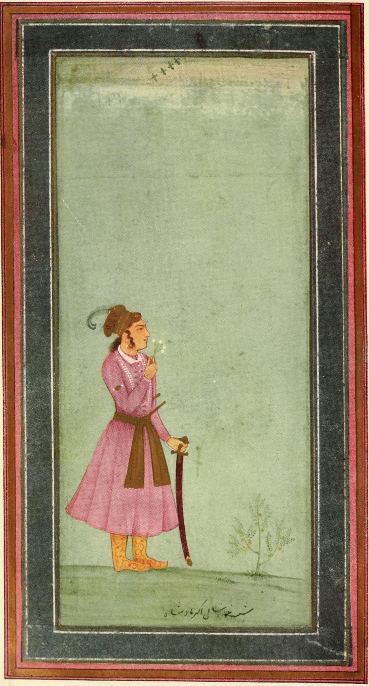
*ஒரு சிறுவனாக அக்பர்*

உமாயூன் வெளிநாட்டில் இருந்த காலங்களில் அக்பர் காபூலில் வளர்க்கப்பட்டார். அங்கு இவரை அக்பரின் தந்தை வழி உறவினர்களான கம்ரான் மிர்சா மற்றும் அசுகாரி மிர்சா ஆகியோர் வளர்த்தனர். இவரை வளர்த்ததில் கம்ரான் மிர்சாவின் மனைவிக்கும் குறிப்பிடத்தக்க பங்குண்டு. தனது இளமைக்காலம் முழுவதும் அக்பர் வேட்டையாட, ஓட மற்றும் சண்டையிடக் கற்றுக்கொண்டார். இதன் மூலம் அக்பர் ஒரு தைரியமான, சக்தி வாய்ந்த மற்றும் துணிச்சலான போர் வீரனாக உருவானார். ஆனால், அக்பர் என்றுமே எழுதவும் படிக்கவும் கற்றுக் கொள்ளவில்லை. எனினும், இது இவரின் அறிவைத் தேடும் முயற்சியைப் பாதிக்கவில்லை. மாலை நேரங்களில் ஓய்வெடுக்கும் அக்பர் எப்பொழுதுமே தனக்காகப் படித்துக் காட்ட ஒருவரைப் பயன்படுத்துவார் என்று கூறப்பட்டதுண்டு. [ 21 ] [ 22 ] 20 நவம்பர் 1551ஆம் ஆண்டு இன்டால் மிர்சா, கம்ரான் மிர்சாவின் படைகளுடன் போரிட்ட போது யுத்தத்தில் இறந்தார். அவர் இறந்த செய்தியைக் கேட்ட உமாயூன் மிகுந்த துக்கத்திற்கு உள்ளானார். [ 23 ]

கசுனியின் ஆளுநராக ஒன்பது வயது அக்பர் முதலில் நியமிக்கப்பட்ட நேரத்தில், இவர் இன்டாலின் மகளான ருக்கையா சுல்தான் பேகத்தை மணந்து கொண்டார். [ 24 ] ஏகாதிபத்திய இணைக்கு இன்டால் மற்றும் கசுனியின் அனைத்து செல்வம், இராணுவம் மற்றும் ஆதரவாளர்களை உமாயூன் வழங்கினார். இன்டாலின் சாகிரில் ஒன்று அக்பருக்கு வழங்கப்பட்டது. அக்பர் அதற்கு உயரதிகாரியாக நியமிக்கப்பட்டார். இவரது உறவினரின் இராணுவத்திற்குத் தலைமைப் பொறுப்பும் இவருக்கு வழங்கப்பட்டது. [ 25 ] ருக்கையாவுடனான அக்பரின் திருமணமானது இருவருக்கும் 14 வயதாக இருந்தபொழுது பஞ்சாபின் ஜலந்தரில் உறுதிசெய்யப்பட்டது. [ 26 ] அக்பரின் முதல் மனைவியும் முதன்மையான பட்டத்து இராணியாகவும் ருக்கையா இருந்தார். [ 27 ] [ 5 ]

சேர் ஷா சூரியின் மகன் இஸ்லாம் ஷா அரியணை ஏறுவதைப் பற்றிய பிரச்சினைக்குப் பிறகு உமாயூன் தில்லியை 1555இல் மீண்டும் கைப்பற்றினார். அதில் உமாயூன் தலைமை தாங்கிய இராணுவத்தின் ஒரு பகுதி இவரது பாரசீகக் கூட்டாளி முதலாம் தமஸ்ப்பால் வழங்கப்பட்டிருந்தது. சில மாதங்களுக்குப் பிறகு உமாயூன் இறந்தார். அக்பரை அரியணை ஏற்றும் முயற்சிக்காக அக்பரின் பாதுகாவலரான பைராம் கான் உமாயூன் இறந்ததை மறைத்தார். 14 பிப்ரவரி 1556இல் உமாயூனுக்குப் பிறகு அக்பர் அரியணை ஏறினார். முகலாய அரியணையை மீண்டும் கைப்பற்ற சிக்கந்தர் ஷா சூரியுடன் அந்நேரத்தில் நடைபெற்றுக்கொண்டிருந்த போருக்கு நடுவில் அக்பர் அரியணை ஏறினார். பஞ்சாபின் கலனவுரில் புதிதாகக் கட்டப்பட்ட மேடையில் இருந்த அரியணையில் 14 வயது அக்பரைப் பைராம் கான் அமர வைத்தார். அந்த மேடை இன்றும் உள்ளது. [ 28 ] [ 29 ] இங்கு அக்பர் ஷாஹின்ஷா என்று பிரகடனப்படுத்தப்பட்டார். இந்தப் பாரசீக வார்த்தைக்கு "மன்னர்களின் மன்னர்" என்று பொருள். அக்பருக்கு வயது வரும் வரை பைராம் கான் ஆட்சியைக் கவனித்துக் கொண்டார். [ 30 ]

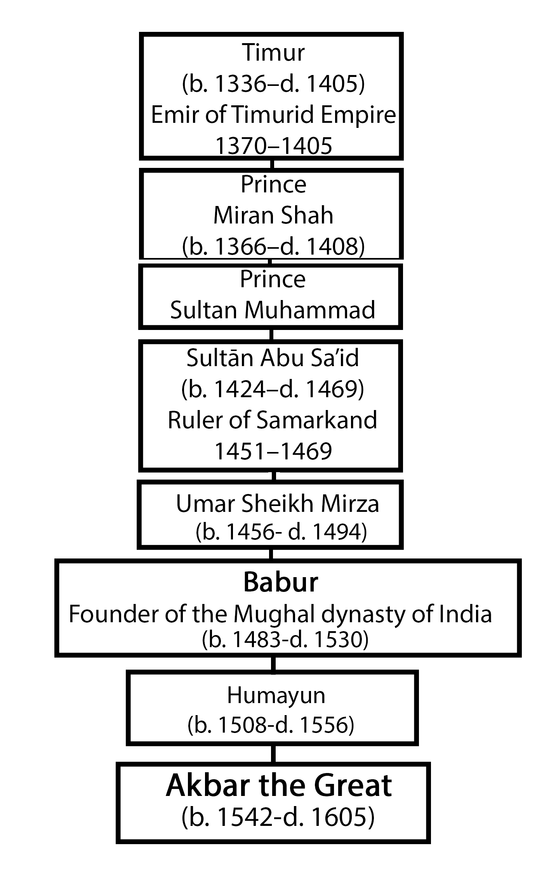
*தைமூர் வரையிலான அக்பரின் மரபு வரிசை*

## இராணுவப் படையெடுப்புகள்

### இராணுவப் புதுமைகள்

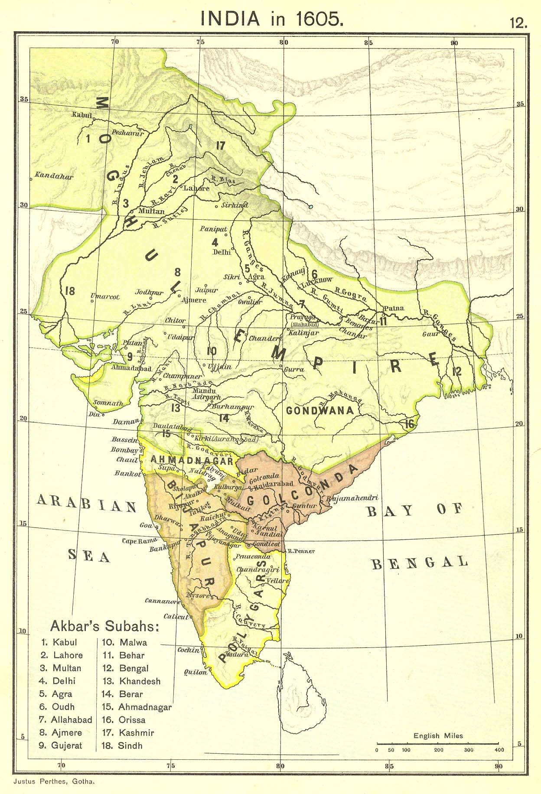
*அக்பரின் காலத்தில் முகலாயப் பேரரசு*

இந்தியத் துணைக்கண்டம் முழுவதும் முகலாய ஆட்சியை உறுதிப்படுத்திய தோல்வியே அடையாத இராணுவப் படையெடுப்புகளை அக்பர் மேற்கொண்டார். [ 31 ] [ 32 ] இந்த இராணுவத் திறன் மற்றும் அதிகாரத்திற்கு அடிப்படையாக அமைந்தது, அக்பர் முகலாய இராணுவத்தைத் திறமையாக அமைத்ததும், நிர்வாக அலகீடும் ஆகும். [ 33 ] அக்பரின் காலத்தின்போது முகலாய சக்தியை நிலை நிறுத்தியதில் மன்சப்தாரி அமைப்பின் பங்கானது குறிப்பாகப் பாராட்டப்படுகிறது. முகலாயப் பேரரசின் இறுதி வரை இந்த அமைப்பானது சிறிதளவே மாற்றங்களுடன் நீடித்திருந்தது. எனினும், இவருக்குப் பின் வந்தவர்களுக்குக் கீழ் படிப்படியாக பலவீனமடைந்தது. [ 33 ]

அமைப்பு ரீதியிலான சீர்திருத்தங்களுடன் பீரங்கி , கோட்டை மற்றும் யானைகளைப் பயன்படுத்துதல் ஆகியவற்றில் புதுமைகளும் புகுத்தப்பட்டன. [ 32 ] அக்பருக்குத் திரி இயக்கச் சுடுகலன்கள் மீதும் ஆர்வம் இருந்தது. பல்வேறு சண்டைகளின் போது அவற்றைத் திறமையாகப் பயன்படுத்தினார். கைத் துப்பாக்கிகள் மற்றும் சேணேவிகளைப் பெற உதுமானியர்களின் உதவியை அக்பர் வேண்டினர். மேலும், ஐரோப்பியர்களிடமும், குறிப்பாகப் போத்துக்கீசியர்கள் மற்றும் இத்தாலியர்களிடம் உதவியை வேண்டினார். [ 34 ] மண்டல ஆட்சியாளர்கள், திறை செலுத்தியவர்கள் அல்லது சமீன்தார்களால் பயன்படுத்தப்பட்ட எவற்றையும் விட அக்பரின் காலத்தின்போது இருந்த முகலாயக் கைத்துப்பாக்கிகள் மிகுந்த முன்னேற்றம் அடைந்தவையாக இருந்தன. [ 35 ] அக்பரின் உயரதிகாரியான அபுல் பாசல் ஒரு முறை, "துருக்கியைத் தவிர்த்து, [இந்தியாவைப்] போல் அரசாங்கத்தைப் பாதுகாக்கத் துப்பாக்கிகளைப் பயன்படுத்தும் ஒரு நாடு இல்லை" என்று கூறும் அளவுக்கு இந்த ஆயுதங்களின் தாக்கம் இருந்தது. [ 36 ] இவ்வாறாக, " வெடிமருந்துப் பேரரசு " என்ற சொற்றொடரானது அறிஞர்கள் மற்றும் வரலாற்றாளர்களால் இந்தியாவில் முகலாயர்களின் வெற்றியை ஆய்வு செய்யப் பயன்படுத்தப்படுகிறது. போர் முறை உத்திகளில் முகலாயர்கள் கைதேர்ந்தவர்கள் என்பது, குறிப்பாக, அக்பரால் ஊக்குவிக்கப்பட்டக் கைத் துப்பாக்கிப் பயன்பாடு என்பது முகலாய சக்திக்கு முக்கிய உதவியாக இருந்தது. [ 37 ]

## இராணுவப் படையெடுப்புகள்

### வட இந்திய முயற்சிகள்

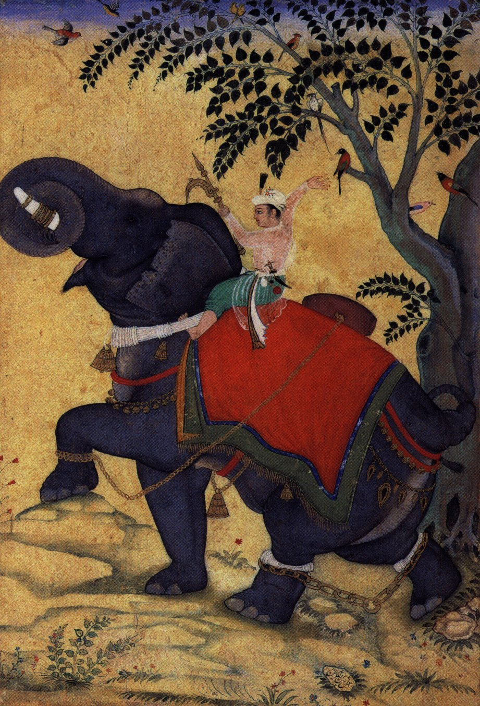
*ஒரு யானைக்குப் பயிற்சியளிக்கும் முகலாயப் பேரரசர் அக்பர்*

சபாவித்துகளின் ஆதரவுடன் பஞ்சாப் , தில்லி , மற்றும் ஆக்ரா பகுதிகளின் கட்டுப்பாட்டை அக்பரின் தந்தை உமாயூன் மீண்டும் பெற்றார், ஆனால், இந்தப் பகுதிகளில் கூட முகலாய ஆட்சியானது நிலையற்றதாக இருந்தது. உமாயூனின் இறப்பிற்குப் பிறகு, ஆக்ரா மற்றும் தில்லியைச் சூர்கள் கைப்பற்றியபோது, சிறுவனாக இருந்த இந்தப் பேரரசனின் விதி என்னவாகும் என்று யாருக்கும் தெரியவில்லை. அக்பருக்கு வயது குறைவாக இருந்ததும், பதாக்சானின் ஆட்சியாளரான இளவரசன் மிர்சா சுலைமானின் படையெடுப்புக்கு உள்ளானதால் முகலாய வலுவூட்டல் பகுதியான காபூலில் இருந்து எந்தவித இராணுவ உதவிக்கான வாய்ப்பும் இல்லாமல் போனதும் இந்தச் சூழ்நிலையை இன்னும் மோசமாக்கியது. [ 38 ] இவரது அரசப் பிரதிநிதியான பைராம் கான் முகலாயப் படைகளை ஒருங்கிணைக்க ஓர் அவைக்கு அழைப்பு விடுத்தார். அக்பரின் கீழ் இருந்த ஒரு தலைவர் கூட இதற்கு ஒப்புக்கொள்ளவில்லை. இந்த உயர் குடியினரின் முடிவைப் பைராம் கான் இறுதியாக மாற்ற வைத்தார். ஆனால், சூர் ஆட்சியாளர்களில் வலிமையானவராக இருந்த சிக்கந்தர் ஷா சூரிக்கு எதிராகப் பஞ்சாப்பில் அணிவகுப்பை முகலாயர்கள் நடத்துவார்கள் என முடிவு செய்யப்பட்டது. அரசப் பிரதிநிதியான தருதி பைக் கானுக்குக் கீழ் தில்லி விடப்பட்டது. [ 38 ] சிக்கந்தர் ஷா சூரி அக்பருக்கு முக்கியக் பிரச்சனையைக் கொடுக்கவில்லை. [ 39 ] கவலைக்குரிய அச்சுறுத்தலானது சூர் ஆட்சியாளர்களில் ஒருவரின் மந்திரியும், தளபதியுமான எமூவிடமிருந்து வந்தது. அவர் தன்னை பேரரசர் என்று அறிவித்தார். சிந்து-கங்கைச் சமவெளியில் இருந்த முகலாயர்களை வெளியேற்றினார். [ 38 ]

எமூ தனது நிலையை நிலைப்படுத்தும் முன்னர், பைராம் கான் முகலாய இராணுவத்தை மீண்டும் ஒருங்கிணைத்தார். அவரது வலியுறுத்தலின் பேரில் தில்லியை மீண்டும் பெற அக்பர் அணிவகுத்தார். [ 40 ] இவரது இராணுவத்திற்கு பைராம் கான் தலைமை தாங்கினார். தில்லிக்கு வடக்கே 50 கிலோ மீட்டர் தொலைவில் 5 நவம்பர் 1556இல் நடைபெற்ற இரண்டாம் பானிபட் போரில் எமூ மற்றும் சூர் இராணுவத்தைப் பைராம் கான் தோற்கடித்தார். [ 41 ] இந்த யுத்தம் நடந்ததற்குப் பிறகு சீக்கிரமே முகலாயப் படைகள் தில்லி மற்றும் பிறகு ஆக்ராவை ஆக்கிரமித்தன. தில்லிக்குள் வெற்றி வாகை சூடியவராக அக்பர் நுழைந்தார். அங்கு ஒரு மாதம் தங்கியிருந்தார். பிறகு, இவரும், பைராம் கானும் பஞ்சாப்புக்கு அப்பகுதியில் மீண்டும் செயலாற்றத் துவங்கிய சிக்கந்தர் ஷாவைக் கையாளுவதற்காகத் திரும்பி வந்தனர். [ 42 ] அடுத்த ஆறு மாதங்களில், சிக்கந்தர் ஷா சூரிக்கு எதிராக மற்றொரு முக்கிய யுத்தத்தில் முகலாயர்கள் வெற்றி பெற்றனர். சிக்கந்தர் ஷா சூரி கிழக்கே வங்காளத்திற்குத் தப்பி ஓடினார். அக்பரும் அவரது படைகளும் பஞ்சாப்பில் இருந்த இலாகூரை ஆக்கிரமித்தன. பிறகு முல்தானைக் கைப்பற்றின. 1558இல் அக்பர் இராசபுதனத்திற்குச் சொல்லும் வழியாக இருந்த அஜ்மீரை அதன் ஆட்சியாளரைத் தோற்கடித்துத் தப்பியோடச் செய்ததன் மூலம் கைப்பற்றினார். [ 42 ] சூர் படைகளுக்கு நருமதை ஆற்றுக்கு வடக்கே இருந்த மிகப்பெரிய வலுவூட்டல் மையமாகக் குவாலியர் கோட்டை திகழ்ந்தது. அதை முற்றுகையிட்டு முகலாயர்கள் வென்றனர். குவாலியரின் கட்டுப்பாட்டைப் பெறுவதற்காக சூர் படைகளைத் தோற்கடித்தனர். [ 42 ]

முகலாய அமீர்களின் குடும்பங்களுடன் அரச குடும்பப் பேகம்கள் இறுதியாகக் காபூலில் இருந்து இந்தியாவுக்கு அந்நேரத்தில் அழைத்துவரப்பட்டனர். அக்பரின் உயரதிகாரி அபுல் பாசலின் கூற்றுப்படி, "வீரர்கள் இவ்வாறாக குடியமரும் நிலையை அடைந்தனர். தங்களுக்குப் பழக்கப்பட்டுவிட்ட ஒரு நாட்டிற்குள் ஓரளவுக்குப் பிரிவு உணர்ச்சிகளைக் கட்டுப்படுத்திக் கொண்டு வந்தனர்". [ 38 ] முகலாயர்கள் இந்தியாவில் தொடர்ந்து தங்குவதற்காக வந்துள்ளனர் என்பதற்கான தனது எண்ணங்களை அக்பர் தெளிவாக அறிவித்தார். இவரது தாத்தா பாபர் மற்றும் தந்தை உமாயூன் ஆகியோரின் அரசியல் குடியிருப்புகளிலிருந்து இது வேறுபட்டதாக இருந்தது. அவர்கள் இருவருமே குறுகிய காலத்திற்குத் தங்கியிருந்து ஆட்சி புரிபவர்கள் என்பதைத் தவிர்த்து வேறு எதையும் வெளிக்காட்டவில்லை. [ 38 ] [ 42 ] எனினும், தன்னுடைய முன்னோர்கள் விட்டுச்சென்ற தைமூரிய மறுமலர்ச்சியின் ஒரு வரலாற்று மரபை அக்பர் முறையாக மறு அறிமுகம் செய்தார். [ 43 ]

## இராணுவப் படையெடுப்புகள்

### நடு இந்தியாவுக்குள் விரிவாக்கம்

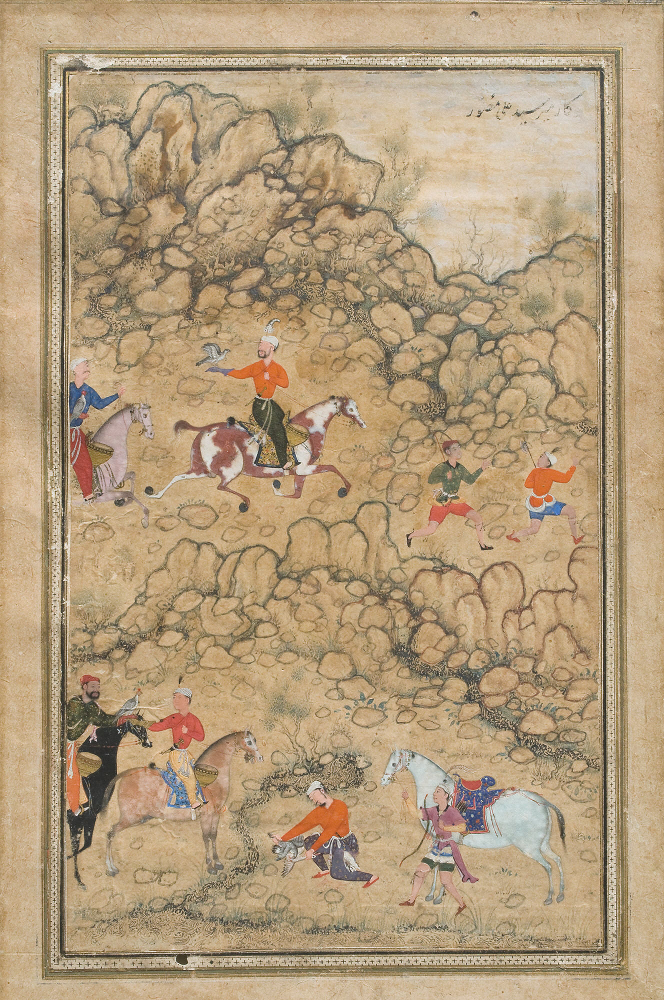
*தனது பாதுகாவலர் பைராம் கான், முகலாயத் தலைவர்கள் மற்றும் உயர் குடியினருடன் அக்பர் பாறுக்களைக் கொண்டு வேட்டையில் ஈடுபடுதல்*

1559இல் தெற்கே இராசபுதனம் மற்றும் மால்வாவுக்குள் முகலாயர்கள் ஒரு தாக்குதலைத் தொடங்கினர். [ 44 ] எனினும், தன்னுடைய அரசப் பிரதிநிதி பைராம் கானுடன் அக்பருக்கு ஏற்பட்ட பிரச்சனைகள் தற்காலிகமாக இந்த விரிவாக்கத்தை நிறுத்தின. [ 44 ] 18 வயது நிரம்பிய இளம் பேரரசர் விவகாரங்களைப் பராமரிப்பதில் ஒரு மிகுந்த செயல் பங்கைப் பெற விரும்பினார். தன்னுடைய வளர்ப்புத் தாய் மகம் அங்கா மற்றும் தன் உறவினர்களின் வலியுறுத்தலின் பேரில் பைராம் கானின் சேவைகளை கழித்துவிட அக்பர் முடிவெடுத்தார். அவையில் மீண்டுமொரு பிரச்சனைக்குப் பிறகு 1560ஆம் ஆண்டின் இளவேனிற்காலத்தில் அக்பர் இறுதியாகப் பைராம் கானை நீக்கினார். புனிதப் பயணம் செல்ல அவருக்கு ஆணையிட்டார். [ 45 ] பைராம் கான் பயணிக்க ஆரம்பித்தார். ஆனால், செல்லும் வழியில் அவரது எதிரிகளால் சினமூட்டப்பட்டுப் புரட்சி செய்யும் நிலைக்கு ஆளாக்கப்பட்டார். [ 41 ] பஞ்சாபில் முகலாய இராணுவத்தால் பைராம் கான் தோற்கடிக்கப்பட்டார். அடிபணியும் நிலைக்குத் தள்ளப்பட்டார். அக்பர் அவரை மன்னித்தார். எனினும், தனது அவையில் தொடர்வது அல்லது புனிதப் பயணத்தை மேற்கொள்வது ஆகிய இரண்டில் ஒன்றைத் தேர்ந்தெடுக்க வேண்டும் என்ற வாய்ப்பை வழங்கினார். இரண்டாவது வழியைப் பைராம் கான் தேர்ந்தெடுத்தார். [ 46 ] பிறகு புனிதப் பயணம் செல்லும் வழியில் பைராம் கான் அரசியல் கொலை செய்யப்பட்டார். இவருடன் தனிப்பட்ட பகைமை கொண்டிருந்த ஒரு ஆப்கானியர் இதைச் செய்ததாகக் கூறப்பட்டது. [ 44 ]

1560இல் அக்பர் மீண்டும் இராணுவ நடவடிக்கைகளைத் தொடங்கினார். [ 44 ] இவரது தத்து அண்ணன் ஆதாம் கான் மற்றும் பீர் முகம்மது கான் என்ற ஒரு முகலாயத் தளபதியின் கீழ் மால்வா மீதான முகலாயப் படையெடுப்பு தொடங்கப்பட்டது. சாரங்கப்பூர் யுத்தத்தில் ஆப்கானிய ஆட்சியாளரான பாசு பகதூர் தோற்கடிக்கப்பட்டார். அடைக்கலம் தேடுவதற்காகக் கந்தேசுக்குத் தன்னுடைய கருவூலம் மற்றும் போர் யானைகளை விட்டு விட்டுத் தப்பியோடினர். [ 44 ] ஆரம்பத்தில் வெற்றியடைந்த போதிலும் அக்பரின் பார்வையில் இந்தப் படயெடுப்பானது பேரிடராக இருந்தது. இந்தப் போரில் கிடைத்த அனைத்து பொருட்களையும் இவரது தற்போது அண்ணன் ஆதம் கான் வைத்துக் கொண்டார். சரணடைந்த கோட்டைக் காவல்படையினர், அவர்களது மனைவிகளைப் படுகொலை செய்யும் நடு ஆசியப் பழக்க வழக்கத்தைத் தொடர்ந்தார். [ 44 ] ஆதம் கானை எதிர்க்கவும், தளபதி பதவியிலிருந்து நீக்கவும் மால்வாவுக்கு அக்பர் தானே சென்றார். பாசு பகதூரைத் துரத்த பீர் முகம்மது கான் அனுப்பப்பட்டார். காந்தேசு மற்றும் பெராரின் ஆட்சியாளர்களின் கூட்டணியால் தோற்கடித்துத் திருப்பி அனுப்பப்பட்டார். [ 44 ] பாசு பகதூர் தற்காலிகமாக மால்வாவின் கட்டுப்பாட்டைப் பெற்றார். அடுத்த ஆண்டு இந்த இராச்சியத்தின் மீது படையெடுத்து அதை அரசில் இணைக்க முகலாய இராணுவத்தை அக்பர் அனுப்பினார். [ 44 ] அக்பரின் ஆட்சியின் அப்போது தொடங்கப்பட்டிருந்த ஏகாதிபத்திய நிர்வாகத்தின் ஒரு மாகாணமாக மால்வா உருவானது. பாசு பகதூர் ஒரு அகதியாகப் பல அரசவைகளில் வாழ்ந்து வந்தார். எட்டு ஆண்டுகளுக்குப் பிறகு 1570இல் அக்பரிடம் சேவையாற்றத் தொடங்கினார். [ 44 ]

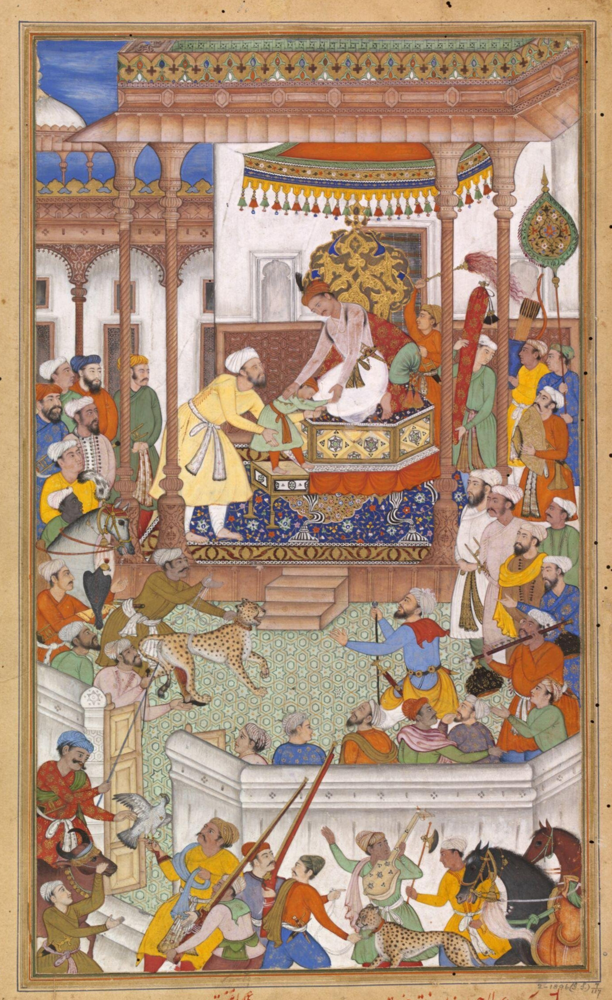
*பைராம் கானின் மகனான இளம் அப்துல் ரஹீம் கான்-இ-கானா அக்பரால் வரவேற்கப்படுதல்*

மால்வாவில் இறுதியான வெற்றியைப் பெற்றபோதிலும், தன் உறவினர்கள் மற்றும் முகலாய உயர் குடியினருடன் அக்பருக்கு இருந்த தனிமனித உறவுகளில் இருந்த விரிசல்களை இந்தச் சண்டையானது வெளிக்காட்டியது. 1562இல் மற்றொரு பிரச்சனைக்குப் பிறகு ஆதாம் கான் அக்பரை எதிர்த்தபோது பேரரசரால் அவர் தாக்கப்பட்டார். அவர் இறந்ததை அக்பர் உறுதி செய்தார். தனது குடிமக்களில் அதிக வலிமை உடையவர்களின் அச்சுறுத்தலை நீக்க அக்பர் தற்போது முடிவு செய்தார். [ 44 ] ஏகாதிபத்திய அரசமைப்புடன் தொடர்புடைய தனிச் சிறப்பு வாய்ந்த அமைச்சர் பதவிகளை இவர் உருவாக்கினார். எந்த முகலாய உயர்குடி உறுப்பினர்களுக்கும் கேள்வி எழுப்பப்படாத அளவுக்குப் பெரும் புகழைப் பெற்றிருக்கும் நிலையானது இல்லாமல் போனது. [ 44 ] 1564இல் உசுப்பெக் தலைவர்களின் ஒரு சக்திவாய்ந்த இனமானது புரட்சி செய்தபோது அக்பர் அவர்களை மால்வாவிலும், பிறகு பீகாரிலும் தீர்க்கமாகத் தோற்றோடச் செய்தார். [ 47 ] புரட்சி நடத்திய தலைவர்களை இவர் மன்னித்தார். அவர்களுடன் சமரசம் செய்து கொள்ளலாம் என்று நம்பினார். ஆனால், அவர்கள் மீண்டும் புரட்சி செய்தனர். எனவே, இரண்டாவது முறையாக அவர்களது எழுச்சியை அக்பர் ஒடுக்க வேண்டி வந்தது. அக்பரின் சகோதரரும் காபூலின் முகலாய ஆட்சியாளருமான மிர்சா முகம்மது அக்கீம் தன்னைப் பேரரசராக அறிவித்துக்கொண்ட மூன்றாவது புரட்சி அறிவிப்பிற்குப் பிறகு அக்பர் இறுதியாகப் பொறுமை இழந்தார். பல தலைவர்கள் இறுதியாக கொலை செய்யப்பட்டனர். புரட்சி செய்த தலைவர்கள் யானைகளால் கொல்லப்பட்டனர். [ 47 ] அதே நேரத்தில் ஆக்ராவுக்கு அருகில் முக்கிய நிலங்களை உடைமையாகக் கொண்டிருந்த அக்பரின் தொலைதூர உறவினர்களின் குழுவான மிர்சாக்கள் புரட்சியில் ஈடுபட்டனர். அவர்களும் கொலை செய்யப்பட்டனர் அல்லது பேரரசில் இருந்து துரத்தப்பட்டனர். [ 47 ] 1566இல் தனது சகோதரர் முகம்மது அக்கீமின் படைகளைச் சந்திக்க அக்பர் பயணித்தார். ஏகாதிபத்திய அரியணையைக் கைப்பற்றும் கனவுடன் பஞ்சாபுக்கு அக்கீம் அனிவகுத்து வந்திருந்தார். எனினும், ஒரு குறுகிய சண்டைக்குப் பிறகு அக்பரின் முதன்மை நிலையை முகம்மது அக்கீம் ஒப்புக்கொண்டார். காபூலுக்குப் பின் வாங்கிச் சென்றார். [ 47 ]

1564இல் முகலாயப் படைகள் கார்கா படையெடுப்பைத் தொடங்கின. கார்கா என்பது நடு இந்தியாவில் இருந்த குறைந்த அளவு மக்களையுடைய ஒரு மலைப்பாங்கான இடமாகும். இந்த இடத்தின் மீது முகலாயர்களுக்கு ஆர்வம் ஏற்பட்டதன் காரணமானது அங்கிருந்த காட்டு யானைகளின் கூட்டமாகும். [ 48 ] இந்த நிலப்பரப்பானது சிறுவனான இராஜா வீர நாராயணன் மற்றும் கோண்டுகளின் ஒரு இராசபுத்திர போர்க் குணம் கொண்ட இராணியான அவரது தாய் துர்காவதியால் ஆளப்பட்டது. [ 47 ] உசுப்பெக் புரட்சியில் மூழ்கியிருந்ததால் அக்பர் தானே இந்தப் படையெடுப்புக்குத் தலைமை தாங்கவில்லை. காராவின் முகலாய ஆளுநரான அசாப் கானின் கைகளில் இந்தத் தாக்குதலை இவர் அளித்தார். [ 47 ] [ 49 ] தமோ யுத்தத்தில் தான் தோல்வியடைந்ததற்குப் பிறகு துர்காவதி தற்கொலை செய்து கொண்டார். கோண்டுகளின் மலைக் கோட்டையான சௌரகர்க்கின் வீழ்ச்சிக்குப் பிறகு இராஜா வீர நாராயணன் கொலை செய்யப்பட்டார். [ 49 ] முகலாயர்கள் ஏராளமான செல்வத்தைக் கைப்பற்றினர். மதிப்பிடப்படாத அளவுக்கு இருந்த தங்கம் மற்றும் வெள்ளி, ஆபரணங்கள் மற்றும் 1000 யானைகளைக் கைப்பற்றினர். [ 49 ] அப்பகுதியின் முகலாய நிர்வாகியாகத் துர்காவதியின் இறந்த கணவரின் சகோதரர் அமர்த்தப்பட்டார். [ 49 ] எனினும், மால்வாவைப் போலவே கோண்டுவானா படையெடுப்பு குறித்து தனக்குத் திறை செலுத்தியவர்களுடன் அக்பருக்குப் பிரச்சனை ஏற்பட்டது. [ 49 ] பெரும்பாலான பொக்கிஷங்களைத் தானே வைத்துக்கொண்டு, வெறும் 200 யானைகளை மட்டுமே அக்பருக்கு அனுப்பியதாக அசாப் கான் மீது குற்றம் சாட்டப்பட்டது. இதற்காக விசாரிக்க வருமாறு அவருக்கு அழைப்பு அனுப்பப்பட்ட போது அசாப் கான் கோண்டுவானாவில் இருந்து தப்பித்தார். அவர் முதலில் உசுப்பெக்குகளிடம் சென்றார். பிறகு, கோண்டுவானாவுக்குத் திரும்பினார். அங்கு முகலாயப் படைகளால் துரத்தப்பட்டார். இறுதியாக அவர் அடிபணிந்தார். அக்பர் அவரை முந்தைய பதவியிலேயே அமர வைத்தார். [ 49 ]

## இராணுவப் படையெடுப்புகள்

### நடு இந்தியாவுக்குள் விரிவாக்கம்

#### அக்பரைக் கொல்ல முயற்சி

1564ஆம் ஆண்டு வாக்கில் அக்பரை அரசியல் கொலைசெய்ய நடந்த ஒரு முயற்சியானது ஓவியத்தில் ஆவணப்படுத்தப்பட்டுள்ளது. தில்லிக்கு அருகில் உள்ள அசரத் நிசாமுத்தீன் இடத்திற்குச் சென்று விட்டுத் திரும்பும் வழியில் அக்பர் மீது ஒருவன் அம்பை எய்தான். அது இவரது வலது தோள் பட்டையில் துளை ஏற்படுத்தியது. அவன் பிடிக்கப்பட்டான். பேரரசரின் ஆணைப்படி அவன் கொல்லப்பட்டான். மிர்சா சர்புதீன் என்ற அக்பரின் அவையில் இருந்த ஒரு உயர்குடி நபர் புரட்சியில் ஈடுபட்டார். அவரது புரட்சி அண்மையில் தான் ஒடுக்கப்பட்டிருந்தது. அவர் தான் தன்னிடம் இருந்த ஒரு அடிமை மூலம் அக்பரைக் கொல்ல முயன்றிருந்தார். [ 50 ]

## இராணுவப் படையெடுப்புகள்

### இராசபுதனத்தை வெல்லுதல்

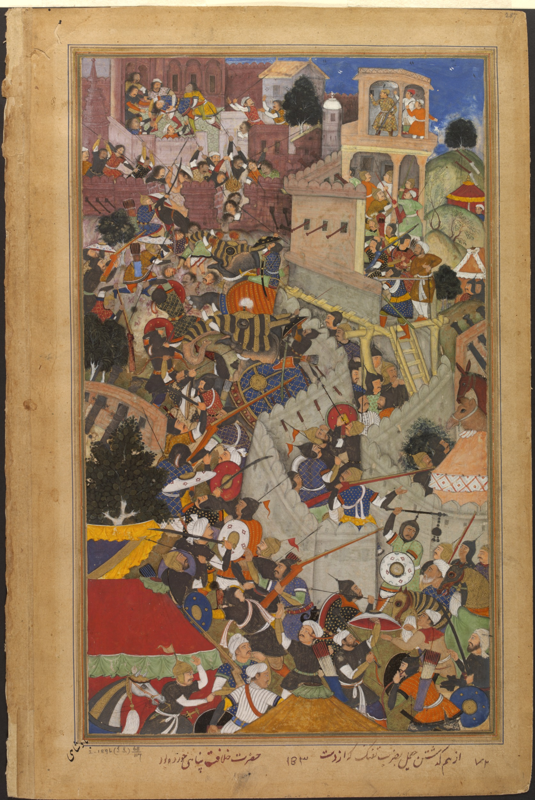
*1568இல் சித்தோர்கார் கோட்டை முற்றுகையின் போது முகலாயப் பேரரசர் அக்பர்*

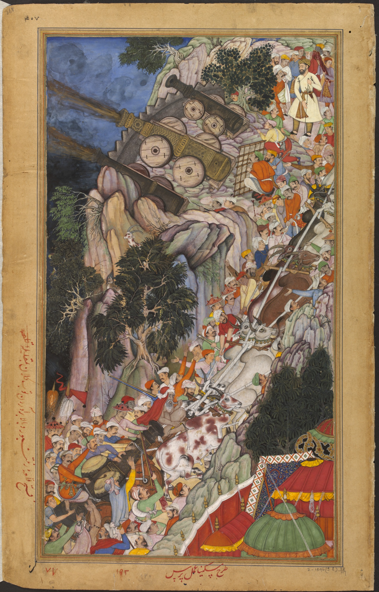
*1568இல் இரந்தம்பூர் கோட்டை மீதான அக்பரின் தாக்குதலின் போது வண்டி மாடுகள் மலைக்கு முற்றுகைப் பீரங்கிகளை இழுத்துச் செல்லுதல்*

வட இந்தியா மீது முகலாய ஆட்சியை நிறுவிய பிறகு அக்பர் தனது கவனத்தை இராசபுதனத்தை வெல்வதை நோக்கித் திருப்பினார். [ 49 ] மேவார் , அஜ்மீர் மற்றும் நகோர் ஆகிய வடக்கு இராசபுதனப் பகுதிகள் மீது முகலாயர்கள் ஏற்கனவே ஆதிக்கத்தை நிறுவியிருந்தனர். [ 42 ] [ 47 ] தில்லி சுல்தானகத்தின் ஆட்சியாளர்களிடம் கூட அரிதாகவே முன்னர் அடிபணிந்திருந்த இராசபுத்திர மன்னர்களின் மைய நிலங்களுக்குள் செல்வது என அக்பர் தற்போது உறுதி பூண்டார். 1561இல் தொடங்கி முகலாயர்கள் இராசபுத்திரர்களுடன் போர் முறை மற்றும் தூதரக உறவுகளில் செயலாற்றத் தொடங்கினார். [ 48 ] அக்பரின் ஆட்சியைப் பெரும்பாலான இராசபுத்திர அரசுகள் ஏற்றுக்கொண்டன. எனினும், மேவார் மற்றும் மர்வாரின் ஆட்சியாளர்களான உதய் சிங் மற்றும் சந்திரசேன இரத்தோர் ஆகியோர் ஏகாதிபத்திய வட்டத்தில் இருந்து விலகியே இருந்தனர். [ 47 ] இராணா உதய் சிங் சிசோடிய ஆட்சியாளரான இராணா சங்காவின் வழித்தோன்றல் ஆவார். இராணா சங்கா 1527இல் கன்வா யுத்தத்தில் பாபரை எதிர்த்துச் சண்டையிட்டவர் ஆவார். [ 47 ] உதய் சிங்கை அடிபணிய வைக்கா விட்டால் முகலாயர்களின் ஏகாதிபத்திய அதிகாரமானது இராசபுத்திரர்களின் பார்வையில் வலுவற்றதாகக் காணப்படும். [ 47 ]

1567இல் மேவாரில் இருந்த சித்தோர் கோட்டையைத் தாக்க அக்பர் பயணித்தார். மேவாரின் கோட்டைத் தலை நகரமான இது மிகுந்த முக்கியத்துவத்தைக் கொண்டதாகக் கருதப்பட்டது. ஏனெனில், ஆக்ராவிலிருந்து குசராத்திற்குச் செல்லும் குறுகிய தொலைவு வழியில் இது அமைந்திருந்தது. மேலும், இராசபுதனத்தின் உட்பகுதிகளுக்குச் செல்லப் பயன்படும் ஒரு முக்கியமான இடமாகக் கருதப்பட்டது. மேவாரின் மலைப்பாங்கான பகுதிகளுக்கு உதய் சிங் சென்றுவிட்டார். தனது தலைநகரத்தைத் தற்காப்பதற்கான பணிக்கு ஜய்மால் மற்றும் பட்டா என்ற இரண்டு இராசபுத்திரப் போர் வீரர்களை விட்டுச் சென்றார். [ 51 ] 1568இல் 4 மாத முற்றுகைக்குப் பிறகு சித்தோர்கார் வீழ்ந்தது. எஞ்சியிருந்த தற்காப்பாளர்கள் மற்றும் 30,000 போரில் ஈடுபடாதவர்களை அக்பர் கொலை செய்தார். [ 52 ] [ 53 ] முகலாயர்களின் கைகளில் கிடைத்த செல்வங்கள் பேரரசு முழுவதும் பகிர்ந்து அளிக்கப்பட்டன. [ 54 ] அக்பர் சித்தோர்கார்க்கில் மூன்று நாட்களுக்குத் தொடர்ந்து இருந்தார். பிறகு ஆக்ராவுக்குத் திரும்பினார். அங்கு இவ்வெற்றிக்கு நினைவுச் சின்னம் ஏற்படுத்துவதற்காகத் தனது கோட்டையின் வாயில்களில் ஜய்மால் மற்றும் பட்டா ஆகியோர் யானைகளின் மீது அமர்ந்திருக்கும் சிலைகளை நிறுவினார். [ 55 ] உதய் சிங்கின் சக்தி மற்றும் செல்வாக்கானது உடைக்கப்பட்டது. மேவாரில் இருந்த தனது புகலிடத்தில் இருந்து அவர் மீண்டும் வரவில்லை. அவரை அங்கேயே விட்டுவிட அக்பரும் முடிவு செய்தார். [ 56 ]

சித்தோர்கார்க்கின் வீழ்ச்சிக்குப் பிறகு, 1568இல் இரந்தம்பூர் கோட்டை மீது ஒரு முகலாயத் தாக்குதல் நடத்தப்பட்டது. இரந்தம்பூரை கதா இராசபுத்திரர்கள் கட்டுப்பாட்டில் வைத்திருந்தனர். இந்தியாவில் இருந்த மிகுந்த சக்தி வாய்ந்த கோட்டையாக அது பெயர் பெற்றிருந்தது. [ 56 ] எனினும், சில மாதங்களிலேயே அதுவும் வீழ்ந்தது. [ 56 ] அக்பர் தற்போது கிட்டத்தட்ட ஒட்டுமொத்த இராசபுதனத்திற்கும் மன்னரானார். [ 56 ] மேவார் இனங்கள் மட்டுமே முகலாயர்களைத் தொடர்ந்து எதிர்த்து வந்தன. [ 56 ] உதய் சிங்கின் மகனும் அவருக்குப் பின் ஆட்சிக்கு வந்தவருமான பிரதாப் சிங் முகலாயர்களால் 1576இல் ஹல்டிகாட் போரில் தோற்கடிக்கப்பட்டார். [ 56 ] இராசபுதனத்தைத் தான் வென்றதைக் கொண்டாட ஒரு புதிய தலைநகரத்திற்கு ஆக்ராவிற்கு மேற்கு தென்மேற்கே 37 கிலோமீட்டர் தொலைவில் அக்பர் 1569இல் அடித்தளம் போட்டார். இது பத்தேப்பூர் சிக்ரி ("வெற்றியின் நகரம்") என்று அழைக்கப்பட்டது. [ 57 ] எனினும், இராணா பிரதாப் சிங் தொடர்ந்து முகலாயர்களைத் தாக்கி வந்தார். அக்பரின் வாழ் நாளின் போது தனது மூதாதையர்களின் பெரும்பாலான இராச்சியத்தைக் கட்டுப்பாட்டில் வைத்திருக்க அவரால் முடிந்தது. [ 58 ]

## இராணுவப் படையெடுப்புகள்

### மேற்கு மற்றும் கிழக்கிந்தியாவை இணைத்துக் கொள்ளுதல்

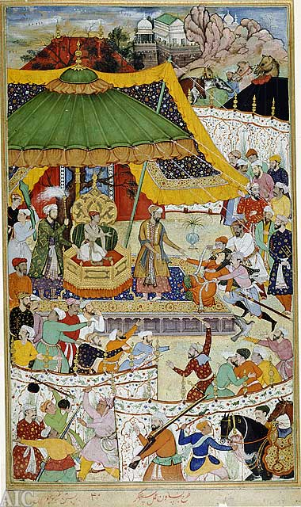
*இளம் அக்பரின் அவை, தனது 13ஆம் வயதில் இவரது முதல் ஏகாதிபத்தியச் செயலைக் காட்டுகிறது: மூர்க்கமான ஒரு அவையோரைக் கைது செய்கிறார். இவர் அக்பரின் தந்தைக்கு விருப்பத்திற்குரியவராக ஒரு காலத்தில் இருந்தவர் ஆவார். இது அக்பர்நாமாவின் ஒரு கையெழுத்துப் பிரதியில் உள்ள ஒரு விளக்கப்படம்.*

அக்பரின் அடுத்த இராணுவ இலக்குகளாக குசராத் மற்றும் வங்காளத்தை வெல்வது இருந்தது. இவை, இந்தியாவை ஆசியா, ஆப்பிரிக்கா மற்றும் ஐரோப்பிய வணிக மையங்களுடன் முறையே அரபிக் கடல் மற்றும் வங்காள விரிகுடா மூலம் இணைந்தன. [ 56 ] மேலும், குசராத்தானது புரட்சி செய்யும் முகலாய உயர் குடியினருக்குப் புகலிடமாகத் திகழ்ந்தது. அதே நேரத்தில், வங்காளத்தில் தங்களது ஆட்சியாளர் சுலைமான் கான் கர்ரானிக்குக் கீழ் ஆப்கானியர்கள் இன்னும் குறிப்பிடத்தக்க அளவுக்குச் செல்வாக்குப் பெற்றிருந்தனர். அக்பர் முதலில் குசராத்திற்கு எதிராகப் பயணித்தார். இராசபுதனம் மற்றும் மால்வா ஆகிய முகலாய மாகாணங்களின் வளைவில் குசராத் அமைந்திருந்தது. [ 56 ] அதன் கடற்கரைப் பகுதிகளுடன், குசராத்தானது, அதன் நடு சமவெளியில் செழிப்பான விவசாய உற்பத்தி கொண்ட பகுதிகளையும், ஜவுளிகள் மற்றும் பிற தொழிற்சாலைப் பொருட்களின் மதிக்கத்தக்க உற்பத்தியையும், மற்றும் இந்தியாவின் மிகுந்த சுறுசுறுப்பான கடல் துறைமுகங்களையும் கொண்டிருந்தது. [ 56 ] [ 59 ] சிந்து-கங்கைச் சமவெளிகளின் பெருமளவு உற்பத்திப் பொருட்களுடன் இந்தக் கடல் பயணம் சார்ந்த மாநிலத்தை இணைக்க அக்பர் விரும்பினார். [ 60 ] எனினும், இந்தப் போருக்கு முக்கிய காரணமாக மிர்சா புரட்சியாளர்கள் இருந்தனர் எனக் கூறப்பட்டது. அவர்கள் முன்னர் இந்தியாவில் இருந்து துரத்தப்பட்டு இருந்தனர். தற்போது தெற்கு குசராத்தில் உள்ள ஒரு மையத்திலிருந்து செயலாற்றிக் கொண்டிருந்தனர். [ 56 ] 1572இல் அக்பர் தலை நகரமான அகமதாபாதுவையும் , மற்றும் பிற வடக்கு நகரங்களையும் ஆக்கிரமிக்கச் சென்றார். குசராத்தின் சட்டப்பூர்வ ஆட்சியாளராக அறிவிக்கப்பட்டார். 1573இல் மிர்சாக்களை அங்கிருந்து துரத்தினார். பெயரளவு எதிர்ப்பைக் காட்டிய பிறகு அவர்கள் தக்காணத்திற்குத் தப்பியோடிப் புகலிடம் பெற்றனர். இப்பகுதியின் வணிக மையமான சூரத்து மற்றும் பிற கடற்கரை நகரங்கள் முகலாயர்களிடம் வந்தன. [ 56 ] மன்னனான மூன்றாம் முசாபர் ஷா ஒரு சோள வயலில் பதுங்கியிருந்த போது பிடிக்கப்பட்டார். ஒரு சிறு தொகையுடன் அவருக்கு ஓய்வூதியம் வழங்க அக்பர் உத்தரவிட்டார். [ 56 ]

குசராத் மீது தனது அதிகாரத்தை நிலைநாட்டிய பிறகு அக்பர் பத்தேப்பூர் சிக்ரிக்குத் திரும்பினார். அங்கு தனது வெற்றிகளின் நினைவுச் சின்னமாகப் புலாண்ட் தர்வாசாவைக் கட்டினர். இதரின் இராசபுத்திர ஆட்சியாளர்களால் ஆதரவளிக்கப்பட்ட ஆப்கானிய உயர் குடியினரின் ஒரு கிளர்ச்சி மற்றும் மிர்சாக்களின் மீண்டும் தொடர்ந்த மோசமான செயல்கள் ஆகியவை இவரைக் குசராத்திற்கு மீண்டும் வரும் நிலைக்குத் தள்ளின. [ 60 ] அக்பர் இராசபுதனத்தைக் கடந்தார். 11 நாளில் அகமதாபாதுவை அடைந்தார். பொதுவாக, இந்தப் பயணத்தை மேற்கொள்ள 6 வாரங்கள் ஆகும். எண்ணிக்கையில் குறைவாக இருந்த முகலாய இராணுவமானது செப்டெம்பர் 2, 1573இல் ஒரு தீர்க்கமான வெற்றியைப் பெற்றது. அக்பர் புரட்சி செய்த தலைவர்களைக் கொலை செய்தார். [ 56 ] குசராத்தை வென்றதும், அடிபணிய வைத்ததும் முகலாயர்களுக்கு மிகுந்த பொருளீட்டக்கூடிய செயலாக இருந்தது. செலவீனங்களுக்குப் பிறகு அக்பரின் கருவூலத்திற்கு ஆண்டுதோறும் ₹50 இலட்சத்துக்கும் மேற்பட்ட பணத்தை இந்தப் பகுதியானது வருவாயாக ஈட்டித் தந்தது. [ 56 ]

இந்தியாவில் எஞ்சியிருந்த பெரும்பாலான ஆப்கானியர்களை அக்பர் தற்போது தோற்கடித்திருந்தார். ஓர் ஆப்கானிய அதிகார மையமானது தற்போது வங்காளத்தில் இருந்தது. சேர் ஷா சூரியிடம் பணியாற்றிய குடும்பத்தைச் சேர்ந்த ஆப்கானியத் தலைவரான சுலைமான் கான் கர்ரானி அங்கு ஆட்சி செய்து வந்தார். அக்பரின் உணர்வுகளைப் புண்படுத்தக்கூடாது என்பதில் அவர் மிகக் கவனமாக இருந்தார். ஆனால், 1572இல் ஆட்சிக்கு வந்த அவரது மகன் தாவூத் கான் வேறுவிதமாக முடிவெடுத்தார். [ 61 ] சுலைமான் கான் அக்பரின் பெயரில் போதனையைப் படிக்க வைத்தார். முகலாய முதன்மை நிலையை ஒப்புக்கொண்டார். அரசின் அடையாளச் சின்னத்தை தாவூத் கான் புனைவாக்கினார். தன்னுடைய சொந்தப் பெயரில் அறிவிக்கப்பட வேண்டும் என ஆணையிட்டார். அக்பருக்கு இவர் கட்டுப்படாத நிலையை இது காட்டியது. பீகாரின் முகலாய ஆளுநரான முனிம் கான் தாவூத் கானுக்கு ஒரு தண்டனை கொடுக்க ஆணையிடப்பட்டது. ஆனால், பிறகு அக்பர் தானே வங்காளத்திற்குப் பயணிக்க ஆரம்பித்தார். [ 61 ] கிழக்கில் இருந்த வணிகத்தை முகலாயக் கட்டுப்பாட்டின் கீழ் கொண்டு வரும் ஒரு வாய்ப்பாக இது அமைந்தது. [ 62 ] 1574இல் முகலாயர்கள் தாவூத் கானிடமிருந்து பட்னாவைக் கைப்பற்றினர். தாவூத் கான் வங்காளத்திற்குத் தப்பி ஓடினார். [ 61 ] அக்பர் பத்தேப்பூர் சிக்ரிக்குத் திரும்பினார். இந்தத் தாக்குதலை முடிக்கும் பொறுப்பைத் தனது தளபதிகளிடம் விட்டுச் சென்றார். 1575இல் துக்கரோயி யுத்தத்தில் முகலாய இராணுவமானது இறுதியாக வெற்றி பெற்றது. இது வங்காளமும், தாவூத் கானின் ஆட்சியின் கீழிருந்த பீகாரின் பகுதிகளும் அக்பரின் ஆட்சியுடன் இணைத்துக் கொள்ளப்படும் நிலைக்கு இது இட்டுச் சென்றது. ஒரிசா மட்டும் கர்ரானி அரசமரபின் கைகளில் முகலாயப் பேரரசின் ஒரு நிலமாகக் கொடுக்கப்பட்டது. எனினும், ஒரு ஆண்டுக்குப் பிறகு வங்காளத்தின் மீதான கட்டுப்பாட்டை மீண்டும் பெறும் முயற்சியாகத் தாவூத் கான் கிளர்ச்சியில் ஈடுபட்டார். முகலாயத் தளபதி கான் ஜகான் குலியால் தோற்கடிக்கப்பட்டார். பிறகு நாட்டிலிருந்து தப்பியோடினர். தாவூத் கான் முகலாயப் படைகளால் பிறகு கைது செய்யப்பட்டு மரண தண்டனைக்கு உட்படுத்தப்பட்டார். [ 61 ]

## இராணுவப் படையெடுப்புகள்

### ஆப்கானித்தான் மற்றும் நடு ஆசியப் படையெடுப்புகள்

குசராத் மற்றும் வங்காளத்தை வென்ற பிறகு அக்பர் உள்நாட்டு விவகாரங்களில் மூழ்கியிருந்தார். பஞ்சாபானது இவரது சகோதரர் மிர்சா முகம்மது அக்கீமால் மீண்டும் 1581ஆம் ஆண்டு படையெடுப்புக்கு உள்ளான போது வரை ஒரு இராணுவப் படையெடுப்புக்காக அக்பர் பத்தேப்பூர் சிக்ரியிலிருந்து வெளியேறவே இல்லை. அக்பர் தனது சகோதரரைக் காபூலுக்கு வெளியேற்றி இருந்தார். ஆனால், இந்த முறை நடவடிக்கை எடுக்க முடிவு செய்தார். முகம்மது அக்கீமின் அச்சுறுத்தலை ஒரேயடியாக முடித்து வைக்க முடிவு செய்தார். அக்பரின் மூதாதையர்கள் ஒரு காலத்தில் முகலாய உயர்குடியினரை இந்தியாவில் தங்க வைக்க மிகவும் சிரமப்பட்டனர். ஆனால், மாறாக அக்பர் அவர்களை எப்படி இந்தியாவிலிருந்து வெளியேற்றுவது என்ற சிரமத்தில் இருந்தார். அவர்கள், அபுல் பசலின் கூற்றுப்படி, "ஆப்கானித்தானின் குளிரைக் கண்டு அஞ்சினர்". இந்து அதிகாரிகளும் பதிலுக்குச் சிந்து ஆற்றைக் கடப்பதற்கு இருந்த பாரம்பரியத் தடைக் கட்டுப்பாட்டால் தடுத்து நிறுத்தப்பட்டனர் ஆனால், அக்பர் அவர்களை ஊக்குவித்தார். 8 மாத சம்பளத்தை முன் பணமாகப் போர் வீரர்களுக்குக் கொடுத்தார். ஆகத்து 1581இல் அக்பர் காபூலைக் கைப்பற்றினார். மலைகளுக்குத் தப்பியோடிய தனது சகோதரன் இல்லாத நிலையில் பாபரின் பழைய நகர்க் காப்பரணில் குடியமர்ந்தார். மூன்று வாரங்களுக்கு அங்கு தங்கினார். அக்பர் காபூலைத் தனது உறவினர் பக்துன்னிசாவின் கைகளில் விட்டுச் சென்றார். இந்தியாவுக்குத் திரும்பினார். தனது சகோதரனை மன்னித்தார். காபூலில் உண்மையான முகலாய நிர்வாகத்தின் கட்டுப்பாட்டை இவரது சகோதரர் எடுத்துக் கொண்டார். பக்துன்னிசா தொடர்ந்து அதிகாரப்பூர்வ ஆளுநராக இருந்தார். சில ஆண்டுகளுக்குப் பிறகு, 1585இல் முகம்மது அக்கீம் இறந்தார். காபூலானது அக்பரின் கைகளுக்கு மீண்டும் ஒருமுறை வந்தது. முகலாயப் பேரரசின் ஒரு மாகாணமாக அதிகாரப்பூர்வமாக இணைத்துக் கொள்ளப்பட்டது. [ 61 ]

காபூல் போர்ப் பயணமானது முகலாயப் பேரரசின் வடக்கு எல்லைகளில் மீது நடத்தப்பட்ட ஒரு நீண்ட கால தொடர்ச்சியான செயல்களின் தொடக்கமாக அமைந்தது. [ 63 ] 13 ஆண்டுகளுக்கு, 1585இல் இருந்து அக்பர் வடக்கிலேயே இருந்தார். தனது தலைநகரை பஞ்சாபின் இலாகூருக்கு மாற்றினார். கைபர் கணவாய் தாண்டி வந்த சவால்களை எதிர்கொண்டார். [ 63 ] மிகவும் கவலைக்குரிய அச்சுறுத்தலானது உசுப்பெக்கியர்களிடமிருந்து வந்தது. அவர்கள் தான் பாபரை நடு ஆசியாவிலிருந்து துரத்தி இருந்தனர். [ 61 ] பழங்குடியினமான அவர்கள் அப்துல்லா கான் சாய்பனிடுவின் கீழ் ஒன்றிணைந்திருந்தனர். அக்பரின் தொலைதூர தைமூரிய உறவினர்களிடமிருந்து பதாக்சான் மற்றும் பல்குவைக் கைப்பற்றிய ஒரு கை தேர்ந்த இராணுவத் தலைவராக அவர் இருந்தார். அவரது உசுப்பெக்கியத் துருப்புகள் தற்போது முகலாயப் பேரரசின் வடமேற்கு எல்லைகளுக்கு ஒரு கடுமையான சவாலை விடுத்தன. [ 61 ] [ 64 ] எல்லையில் இருந்த ஆப்கானியப் பழங்குடி இனங்களும் பிரச்சனைகளை ஏற்படுத்தின. இதற்கு ஒரு பங்குக் காரணம் பசௌர் மற்றும் சுவாத்தில் இருந்த யூசுப்சாயின் எதிர்ப்பும் ஆகும். பயாசித் என்பவரின் செயலின் காரணமாகவும் இந்தப் பிரச்சனைகள் ஏற்பட்டன. [ 63 ] ஆப்கானியருக்கு உசுப்பெக்கியர்கள் மானிய நிதி வழங்குவதும் பரவலாக அறியப்பட்டிருந்தது. [ 65 ]

1586இல் அப்துல்லா கானுடன் அக்பர் ஒரு பேச்சு வார்த்தையை நடத்தினார். சபாவித்துக்களின் கட்டுப்பாட்டிலிருந்த குராசான் மீது உசுப்பெக்கியர்கள் படையெடுக்கும்போது முகலாயர்கள் நடுநிலை வகிப்பது என அதில் குறிப்பிடப்பட்டிருந்தது. [ 65 ] இதற்குப் பதிலாக, முகலாயர்களுக்கு எதிரான ஆப்கானியப் பழங்குடி இனங்களுக்கு ஆதரவளிப்பது, மானிய நிதி அளிப்பது, அல்லது புகலிடம் கொடுப்பதை அப்துல்லா கான் தவிப்பார் என்று ஒப்பந்தம் போடப்பட்டது. இவ்வாறாக, சுதந்திரம் கொடுக்கப்பட்ட அக்பர் யூசுப்சாய்கள் மற்றும் பிற கிளர்ச்சியாளர்களை அமைதிப்படுத்த ஒரு தொடர்ச்சியான படையெடுப்புகளைத் தொடங்கினார். [ 65 ] ஆப்கானியப் பழங்குடி இனங்களுக்கு எதிராகப் போர்ப் பயணத்திற்கு தலைமை தாங்க சைன் கானுக்கு அக்பர் ஆணையிட்டார். அக்பரின் அவையில் இருந்த ஒரு புகழ்பெற்ற அமைச்சரான பீர்பாலுக்கும் இராணுவத் தளபதி பொறுப்பு கொடுக்கப்பட்டது. இந்தப் போர்ப் பயணம் முகலாயர்களுக்குப் பேரிடராக மாறியது. மலைகளில் இருந்து பின்வாங்கித் திரும்பிக் கொண்டிருந்த போது, பெப்ரவரி 1586இல், [ 65 ] மலந்தராய் கணவாயில் பீர்பாலும் அவரது பரிவாரங்களும் ஆப்கானியர்களால் பதுங்கியிருந்து திடீர்த் தாக்குதல் நடத்தப்பட்டுக் கொல்லப்பட்டனர். தோடர் மாலின் தளபதித்துவத்தின் கீழ் யூசுப்சாய் நிலங்கள் மீது மீண்டும் படையெடுப்பு நடத்த புதிய இராணுவங்களை அக்பர் உடனடியாக ஒருங்கிணைத்தார். அடுத்த ஆறு ஆண்டுகளில், முகலாயர்கள் யூசுப்சாய்களை மலைப் பள்ளத்தாக்குகளுக்குள் ஒடுக்கி வைத்தனர். சுவாத் மற்றும் பசௌரில் இருந்த பல தலைவர்களின் அடிபணியக் கட்டாயப்படுத்தப்பட்டனர். [ 65 ] இப்பகுதியைப் பாதுகாப்பாக வைப்பதற்காக பல கோட்டைகள் கட்டப்பட்டு அங்கு வீரர்கள் நிறுத்தப்பட்டனர். ஆப்கானியப் பழங்குடி இனங்கள் மீது உறுதியான இராணுவக் கட்டுப்பாட்டைப் பெற்ற அக்பரின் திறமைக்கு எடுத்துக்காட்டாக இவரது நடவடிக்கைகள் இருந்தன. [ 65 ]

உசுப்பெக்கியர்களுடனான உடன்பாடு இருந்தபோதிலும், தற்போதைய ஆப்கானித்தானில் இருந்து நடு ஆசியாவை மீண்டும் கைப்பற்றும் ஒரு நம்பிக்கையை அக்பர் வளர்த்து வந்தார். [ 66 ] எனினும், பதாக்சான் மற்றும் பல்கு ஆகியவை உறுதியாக உசுப்பெக் நிலப்பகுதிகளின் பகுதிகளாகத் தொடர்ந்தன. இவரது பேரன் ஷாஜகான் தலைமையிலான முகலாயர்கள் 17ஆம் நூற்றாண்டின் நடுப்பகுதியில் இந்த இரண்டு மாகாணங்களையும் ஒரு குறுகிய காலத்திற்கு மட்டுமே ஆக்கிரமித்திருந்தனர். இது தவிர இப்பகுதிகள் உசுப்பெக்கியர்களின் கட்டுப்பாட்டிலேயே இருந்தன. [ 64 ] எவ்வாறாயினும், வடக்கு எல்லைப்புறங்களில் அக்பர் தங்கி இருந்த நிகழ்வானது மிகுந்த நன்மையைக் கொடுத்தது. கிளர்ச்சி செய்த கடைசி ஆப்கானியப் பழங்குடி இனங்கள் 1600ஆம் ஆண்டு வாக்கில் அடிபணிய வைக்கப்பட்டன. [ 64 ] ரோசனிய்யாக்கள் உறுதியாக ஒடுக்கப்பட்டனர். ரோசனிய்யாவின் கீழ் கிளர்ந்தெழுந்த அப்ரிதி மற்றும் ஓராக்சாய் பழங்குடியினங்கள் அடிபணிய வைக்கப்பட்டன. [ 64 ] இயக்கத்தின் தலைவர்கள் கைது செய்யப்பட்டு நாடு கடத்தப்பட்டனர். [ 64 ] ரோசனியா இயக்கத்தின் நிறுவனரான பயசித்தின் மகனான சலாலுதீன் காசுனிக்கு அருகில் முகலாயத் துருப்புகளுடன் நடந்த ஒரு சண்டையில் 1601ஆம் ஆண்டு கொல்லப்பட்டார். [ 64 ] தற்போதைய ஆப்கானித்தான் மீதான முகலாய ஆட்சியானது இறுதியாக, குறிப்பாக, 1598ஆம் ஆண்டு அப்துல்லா கானின் இறப்புடன் உசுப்பெக்கிய அச்சுறுத்தலானது முடிந்து போனதற்குப் பிறகு உறுதிப்படுத்தப்பட்டது. [ 65 ]

## இராணுவப் படையெடுப்புகள்

### சிந்து சமவெளிப் படையெடுப்புகள்

இலாகூரில் உசுப்ப்பெக்கியர்கள் தொடர்பான செயலில் மூழ்கி இருந்த நேரத்தில் தன்னுடைய எல்லை மாகாணங்களைப் பாதுகாப்பதற்காகச் சிந்துப் பகுதியை அடிபணிய வைக்க அக்பர் விரும்பினார். [ 65 ] முகலாய அவைக்கு சியா சக் அரசமரபின் ஆட்சி புரிந்த மன்னனாகிய அலி ஷா 1585இல் தனது மகனைப் பிணையக் கைதியாக அனுப்ப மறுத்தபோது சிந்துவெளியின் மேல் பகுதியில் இருந்த காஷ்மீரை வெல்ல அக்பர் ஒரு இராணுவத்தை அனுப்பினார். அலி ஷா உடனடியாக முகலாயர்களிடம் சரணடைந்தார். ஆனால், அவரது மகன்களில் மற்றொருவரான யகூப் மன்னனாகத் தனக்கு முடிசூட்டிக் கொண்டார். முகலாயர்களுக்கு எதிராக ஒரு பிடிவாதமான எதிர்ப்புக்குத் தலைமை தாங்கினார். இறுதியாக, சூன் 1589இல் இலாகூரிலிருந்து சிறீநகருக்கு அக்பர் தானே யகூப் மற்றும் அவரது கிளர்ச்சிப் படைகளின் சரணடைவை ஏற்பதற்காகப் பயணித்தார். [ 65 ] காஷ்மீருக்கு அருகிலிருந்த திபெத்திய மாகாணங்களான பல்திஸ்தான் மற்றும் இலடாக் ஆகியவைத் தங்களது விசுவாசம் அக்பருக்குத் தான் என வாக்குறுதியளித்தன. [ 67 ] கீழ் சிந்துப் பள்ளத்தாக்கில் இருந்த சிந்து மாகாணத்தை வெல்வதற்கு முகலாயர்கள் பயணித்தனர். 1574இல் இருந்து வடக்குக் கோட்டையான பக்கார் ஏகாதிபத்தியக் கட்டுப்பாட்டுக்குள் தொடர்ந்து இருந்து வந்தது. தற்போது, 1586இல் தெற்கு சிந்துவில் இருந்த தட்டாவின் சுதந்திரமான ஆட்சியாளரான மிர்சா ஜானி பெக்கின் அடிபணிவை உறுதிப்படுத்த முல்தானின் முகலாய ஆளுநர் முயற்சி செய்து தோல்வியடைந்தார். [ 65 ] இதற்குப் பதிலாக செக்வானை முற்றுகையிட ஒரு முகலாய இராணுவத்தை அக்பர் அனுப்பினார். இது அப்பகுதியின் ஆற்றுத் தலைநகரமாக இருந்தது. முகலாயர்களைச் சந்திப்பதற்காக ஒரு பெரிய இராணுவத்தை ஜானி பெக் திரட்டினார். [ 65 ] செக்வான் யுத்தத்தில் எண்ணிக்கையில் குறைவாக இருந்த முகலாயப் படைகள் சிந்திப் படைகளைத் தோற்கடித்தன. மேலும், தோல்விகளை அடைந்த பிறகு, 1591ஆம் ஆண்டு ஜானி பெக் முகலாயர்களிடம் சரணடைந்தார். 1593ஆம் ஆண்டு இலாகூரில் அக்பருக்கு மரியாதை செலுத்தினார். [ 67 ]

## இராணுவப் படையெடுப்புகள்

### பலுச்சிசுத்தானத்தின் பகுதிகளை அடிபணிய வைத்தல்

1586லேயே சுமார் 6 பலுச்சித் தலைவர்கள் பெயரளவு பானி ஆப்கானிய ஆட்சிக்குக் கீழ் அக்பருக்கு பணிந்து நடக்குமாறு இணங்க வைக்கப்பட்டனர். சபாவித்துகளிடமிருந்து காந்தாரத்தை எடுத்துக்கொள்ளும் முன்னேற்பாடுகளுக்காக 1595இல் ஆப்கானியர்களிடம் இருந்த பலுச்சிசுத்தானத்தின் பகுதிகளின் எஞ்சியவற்றை வெல்லுமாறு முகலாயப் படைகளுக்கு அக்பர் ஆணையிட்டார். [ 67 ] [ 68 ] முகலாயத் தளபதி மீர் மசூம் குவெட்டாவுக்கு வட மேற்கே உள்ள சிபி என்ற வலுவூட்டல் பகுதி மீதான தாக்குதலுக்குத் தலைமை தாங்கினார். [ 68 ] யுத்தத்தில் உள்ளூர்த் தலைவர்களின் ஒரு கூட்டணியைத் தோற்கடித்தார். முகலாய முதன்மை நிலையை அவர்கள் ஒப்புக்கொள்ளவும், அக்பரின் அவைக்கு வர வேண்டியுமிருந்தது. இதன் விளைவாக, மக்ரான் கடற்கரை உள்ளிட்ட தற்போதைய பலுச்சிசுத்தானத்தின் பாக்கித்தான் மற்றும் ஆப்கானித்தான் பகுதிகள் முகலாயப் பேரரசின் ஒரு பகுதியாயின. [ 68 ]

## இராணுவப் படையெடுப்புகள்

### சபாவித்துக்களும், காந்தாரமும்

14ஆம் நூற்றாண்டில் தெற்காசியாவின் மேற்கு மற்றும் நடுப் பகுதிகளில் பெரும்பாலானவற்றை வென்ற போர்ப் பிரபுவான தைமூர் முகலாயர்களின் மூதாதையர் ஆவார். அவரின் காலத்தில் இருந்து கந்தாரமானது முகலாயர்களுடன் தொடர்புபடுத்தப்பட்டு இருந்தது. பாரசீக ஆட்சிக்குட்பட்ட குராசான் நிலப்பரப்பின் ஒட்டு நிலமாக இதைச் சபாவித்துக்கள் கருதினர். இதை முகலாயப் பேரரசர்களுடன் தொடர்புபடுத்துவதை ஒரு தவறான முறையிலான கைப்பற்றலாகக் கருதினர். 1558ஆம் ஆண்டு வட இந்தியா மீது தனது ஆட்சியை அக்பர் நிலைநிறுத்திக் கொண்டிருந்தபோது சபாவித்துப் பேரரசரான முதலாம் தமஸ்ப் காந்தாரத்தைக் கைப்பற்றிக்கொண்டார். அதன் முகலாய ஆளுநரை வெளியேற்றினார். அடுத்த 30 ஆண்டுகளுக்கு இது பாரசீக ஆட்சியின் கீழ் தொடர்ந்து இருந்தது. [ 67 ] காந்தாரத்தை மீட்டெடுப்பது என்பது அக்பருக்கு முக்கியத்துவமான செயலாக இல்லை. ஆனால், வடக்கு எல்லைகளில் இவரது தொடர்ச்சியான இராணுவ நடவடிக்கைகளுக்குப் பிறகு காந்தாரம் மீது முகலாய ஆட்சியை மீண்டும் நிறுவுவது என்பது அக்பரின் விருப்பத்திற்கு உரியதாக இருந்தது. [ 67 ] சிந்து, காஷ்மீர் மற்றும் பலுச்சிசுத்தானத்தின் பகுதிகள் ஆகியவற்றை வென்றது மற்றும் தற்போதைய ஆப்கானித்தான் மீது முகலாய சக்தியை நிறுவியதற்குப் பிறகு அக்பரின் தன்னம்பிக்கையானது அதிகமாகியது. [ 67 ] மேலும், காந்தாரமானது இந்நேரத்தில் உசுப்பெக்கியர்களின் அச்சுறுத்தலுக்கு உள்ளாகி இருந்தது. ஆனால், பாரசீகப் பேரரசர் உதுமானியத் துருக்கியர்களுடனான சண்டையில் மூழ்கியிருந்தார். எனவே அவர் எந்த வலுவூட்டல் படைகளையும் அனுப்ப இயலாத நிலையில் இருந்தார். இச்சூழ்நிலைகள் முகலாயர்களுக்குச் சாதகமாக இருந்தன. [ 67 ]

1593இல் தனது குடும்பத்துடனான வாக்குவாதத்திற்குப் பிறகு நாடுகடத்தப்பட்ட சபாவித்து இளவரசனான் ரோசுதம் மிர்சாவை அக்பர் வரவேற்றார் [ 69 ] . முகலாயர்களுக்குத் தான் தனது விசுவாசம் என ரோசுதம் மிர்சா வாக்குறுதி அளித்தார். அவருக்கு 5,000 வீரர்களின் ஒரு தளபதி என்ற ஒரு தரம் (மன்சப்) கொடுக்கப்பட்டது. சாகிராக முல்தானையும் பெற்றார். [ 69 ] தொடர்ச்சியான உசுப்பெக்கியத் திடீர்த் தாக்குதல்களில் மூழ்கியிருந்தது மற்றும் முகலாய அவையில் ரோசுதம் மிர்சாவுக்குக் கொடுக்கப்பட்ட வரவேற்பு ஆகியவற்றைக் கண்ட பிறகு சபாவித்து இளவரசனும், காந்தாரத்தின் ஆளுநருமான முசாபர் உசைன் முகலாயர்கள் பக்கம் கட்சி தாவ ஒப்புக்கொண்டார். எனினும், தன்னுடைய மன்னன் ஷா அப்பாஸுடன் பகைமை உறவு முறையை முசாபர் உசேன் ஏற்கனவே கொண்டிருந்தார். அவருக்கு 5,000 வீரர்களின் மன்சப் என்ற ஒரு தரமும் கொடுக்கப்பட்டது. அவரது மகள் காந்தாரி பேகம் அக்பரின் பேரனும், முகலாய இளவரசனுமான குர்ரமுக்கு மணமுடிக்கப்பட்டார். [ 67 ] [ 69 ] காந்தாரம் இறுதியாக 1595ஆம் ஆண்டு முகலாயத் தளபதி ஷா பய்க் கானால் தலைமை தாங்கப்பட்ட ஒரு கோட்டைக் காவல் படையினரின் வருகைக்குப் பின்னர் பாதுகாப்புப் பெற்றது. [ 69 ] காந்தாரத்தை மீண்டும் வென்ற நிகழ்வானது முகலாய-பாரசீக உறவுகளை வெளிப்படையாக மோசமாக்கிவிடவில்லை. [ 67 ] அக்பரும், பாரசீக ஷாவும் தொடர்ந்து தூதுவர்களையும், பரிசுப் பொருட்களையும் பரிமாறிக் கொண்டனர். எனினும், இருநாடுகளுக்கும் இடையிலான சக்தியானது தற்போது முகலாயர்களுக்குச் சாதகமாக இருந்தது. [ 67 ]

## இராணுவப் படையெடுப்புகள்

### தக்காணச் சுல்தான்கள்

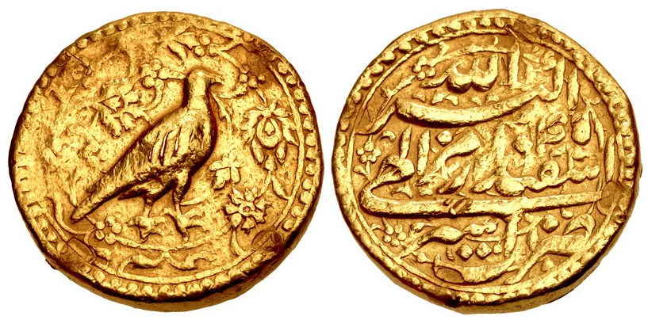
*அக்பரின் மொகுர் பாறு, அசிரில் அச்சிடப்பட்டது. 17 சனவரி 1601இல் காந்தேசு சுல்தானகத்தின் முக்கியமான அசிர்கார் கோட்டையைக் கைப்பற்றியதை நினைவுபடுத்துவதற்காக அக்பரின் பெயரில் இந்த நாணையம் வெளியிடப்பட்டது. [ 70 ] [ 71 ]*

1593இல் தனது அதிகாரத்திற்கு அடிபணியாத தக்காணச் சுல்தானகங்களுக்கு எதிராக இராணுவ நடவடிக்கைகளை அக்பர் தொடங்கினார். 1595இல் அகமதுநகர் கோட்டையை முற்றுகையிட்டார். பெராரை விட்டுக் கொடுக்கும் நிலைக்குச் சாந்த் பிபி தள்ளப்பட்டார். [ 72 ] இறுதியாக ஏற்பட்ட புரட்சியானது ஆகத்து 1600இல் கோட்டையை அக்பர் எடுத்துக் கொள்ளும் நிலைக்குத் தள்ளியது. அக்பர் புர்ஹான்பூரை ஆக்கிரமித்தார். 1599இல் அசிர்கார் கோட்டையை முற்றுகையிட்டார். மீரான் பகதூர் ஷா காந்தேசிடம் அடிபணிய மறுத்த போது 17 சனவரி 1601இல் அக்பர் கோட்டையைக் கைப்பற்றினார். இளவரசன் தனியாலுக்குக் கீழ் அகமதுநகர், பெரார் மற்றும் காந்தேசு சுபாக்களை அக்பர் நிறுவினார். "1605இல் இவரது இறப்பின்போது, வங்காள விரிகுடாவில் இருந்து காந்தாரம் மற்றும் பதக்சான் வரையிலான ஒரு பரந்து விரிந்த நிலப்பரப்பை அக்பர் கட்டுப்படுத்தினார். சிந்து மற்றும் சூரத்தில் மேற்குக் கடலைத் தொட்டிருந்தார். அதே நேரத்தில் நடு இந்தியாவையும் தன் கட்டுப்பாட்டில் வைத்திருந்தார்." [ 73 ]

## நிர்வாகம்

### அரசாங்கம்

தில்லி சுல்தானகத்தின் காலத்தில் இருந்து பரிணாம வளர்ச்சி பெற்ற அமைப்பை அடிப்படையாகக் கொண்டு அக்பரின் மைய அரசமைப்பானது இருந்தது.

- வருவாய் துறையானது வசீரால் தலைமை தாங்கப்பட்டு இருந்தது. இத்துறை அனைத்து நிதி, மற்றும் சாகிர் மற்றும் இனாம் நிலங்களின் பராமரிப்புக்குப் பொறுப்பேற்றுக் கொண்டது.
- இராணுவத்தின் தலைவர் மிர் பாக்சி என்று அழைக்கப்பட்டார். அரசவையின் முன்னணி உயர் குடியினரில் இருந்து அவர் நியமிக்கப்பட்டார். உளவுத் தகவல்களைத் திரட்டுதல், இராணுவ நியமனங்கள் மற்றும் பணி உயர்வுக்கான பரிந்துரைகளைப் பேரரசுக்கு அளித்தல் ஆகிய பொறுப்பை மிர் பாக்சி ஏற்றுக் கொண்டார்.
- மிர் சமன், ஏகாதிபத்தியக் குடியிருப்புகளுக்குப் பொறுப்பேற்றுக் கொண்டார். அவர் அவை மற்றும் அரச குலப் பாதுகாவலர்களின் பணியை மேற்பார்வையிட்டார்.
- நீதித்துறையானது ஒரு தனியான அமைப்பாக இருந்தது. இதற்குத் தலைமைக் காசி தலைமை தாங்கினார். சமய நம்பிக்கைகள் மற்றும் பழக்க வழக்கங்களுக்கும் அவர் பொறுப்பேற்றுக் கொண்டார்.

## நிர்வாகம்

### வரி விதிப்பு

சேர் ஷா சூரியால் பயன்படுத்தப்பட்ட ஒரு அமைப்பைப் பின்பற்றியதன் மூலம் தனது பேரரசின் நில வருவாய் நிர்வாகத்தை அக்பர் மறுசீரமைப்புச் செய்ய ஆரம்பித்தார். பயிர்கள் நன்றாக வளரக்கூடிய ஒரு அறுவடைப் பகுதியானது அளவிடப்பட்டது. அப்பகுதியின் பயிர் மற்றும் உற்பத்தியை அடிப்படையாககொண்டு வரியானது நிலையான வீதங்களின் மூலம் விதிக்கப்பட்டது. எனினும், இம்முறை விவசாயிகள் மீது சுமையை ஏற்படுத்தியது. ஏனெனில், ஏகாதிபத்திய அவையில் இருந்த விலைகளை அடிப்படையாகக்கொண்டு வரி வீதங்கள் விதிக்கப்பட்டன. இது பெரும்பாலும் நாட்டுப்புறத்தில் உள்ள விலைகளை விட அதிகமாகவே இருந்தது. [ 74 ] வருடாந்திர மதிப்பீட்டையுடைய ஒரு மையப்படுத்தப்படாத அமைப்பாக இதை அக்பர் மாற்றினார். ஆனால், இது உள்ளூர் அதிகாரிகள் மத்தியில் ஊழலுக்கு வழி வகுத்தது. இத்திட்டம் 1580இல் கைவிடப்பட்டது. ஏற்கனவே இருந்த அமைப்புக்குப் பதிலாக தகசாலா என்ற ஒரு அமைப்பு கொண்டு வரப்பட்டது. [ 75 ] புது அமைப்பின் கீழ் முந்தைய 10 ஆண்டுகளின் சராசரி உற்பத்தியில் மூன்றில் ஒரு பங்காக வருவாயானது கணக்கிடப்பட்டது. இது அரசாங்கத்திற்குப் பணமாகச் செலுத்தப்பட வேண்டியிருந்தது. இந்த அமைப்பானது பிறகு மேம்படுத்தப்பட்டது. உள்ளூர் விலைகளையும் கணக்கில் எடுத்துக் கொண்டது. ஒரே மாதிரியான உற்பத்தி பொருட்களைக் கொண்ட பகுதிகளைக் குழுவாக்கி மதிப்பீட்டு வட்டங்களுக்குள் எடுத்துக்கொண்டது. வெள்ளம் அல்லது வறட்சி காலங்களின்போது அறுவடை பொய்க்கும்போது தள்ளுபடி கொடுக்கப்பட்டது. [ 75 ] அக்பரின் தகசாலா ( சபித் ) அமைப்புக்கு தோடர் மால் காரணமாகக் கூறப்படுகிறார். இவர் சேர் ஷா சூரியிடம் ஒரு வருவாய் அதிகாரியாகச் சேவையாற்றினார். [ 76 ] 1582-83இல் பேரரசரிடம் கொடுக்கப்பட்ட ஒரு விளக்கமான குறிப்பில் தோடர் மால் வருவாய் நிர்வாகத்தின் அமைப்பை விளக்கியிருந்தார். [ 77 ]

மற்ற உள்ளூர் மதிப்பீட்டு முறைகள் சில பகுதிகளில் தொடர்ந்தன. தரிசு அல்லது அறுவடை செய்யப்படாத நிலமானது சலுகை வீதங்களில் வரி செலுத்த வேண்டி இருந்தது. [ 78 ] விவசாய முன்னேற்றம் மற்றும் விரிவாக்கத்தையும் அக்பர் செயல்பாட்டுடன் ஊக்குவித்தார். வருவாய் மதிப்பீட்டின் ஆதார அலகாக கிராமங்கள் தொடர்ந்து இருந்து வந்தன. [ 79 ] விவசாயிகளை அவர்களால் எந்தளவுக்கு முடியுமோ அந்த அளவுக்கு நிலங்களை உழுகவும், உயர் தரத்திலான விதைகளை விதைக்கவும் ஊக்கப்படுத்த, தேவைப்படும் காலங்களில் கடன்களைக் கொடுத்தல் மற்றும் விவசாயச் செயல்களை அமல்படுத்தல் ஆகிய பணிகளை ஒவ்வொரு பகுதிக்கும் செய்ய வேண்டிய தேவை ஜமீந்தார்களுக்கு இருந்தது. இதற்குப் பதிலாக உற்பத்தியின் ஒரு பகுதியைச் சேகரிக்கும் ஒரு மரபுவழி உரிமையானது ஜமீந்தார்களுக்குக் கொடுக்கப்பட்டது. விவசாயிகள் எவ்வளவு காலத்திற்கு நில வரியைச் செலுத்துகின்றனரோ அவ்வளவு காலத்திற்கு நிலத்தை அறுவடை செய்ய மரபு வழி உரிமை அவர்களுக்குக் கொடுக்கப்பட்டது. [ 78 ] சிறு விவசாயிகளுக்கு வருவாய் மதிப்பீட்டு அமைப்பானது சஞ்சலத்தை ஏற்படுத்திய அதே நேரத்தில், வருவாய் அதிகாரிகளை நோக்கி ஓரளவு நம்பிக்கையில்லாத தன்மையையும் அது கொடுத்தது. வருவாய் அதிகாரிகளுக்கு அவர்களது சம்பளத்தில் முக்கால் பங்கு மட்டுமே கொடுக்க உறுதி செய்யப்பட்டிருந்தது. எஞ்சிய கால் பங்கு கொடுக்கப்படுவது என்பது அவர்களால் மதிப்பிடப்பட்ட வருவாய் முழுவதுமாக அவர்களால் சேகரிக்கப்படுவதைச் சார்ந்திருந்தது. [ 80 ]

## நிர்வாகம்

### இராணுவ அமைப்பு

மன்சப்தாரி என்ற ஒரு அமைப்பின் மூலம் தனது இராணுவத்தையும், மேலும் உயர்குடியினரையும் அக்பர் அமைத்தார். இந்த அமைப்பின் கீழ் இராணுவத்தில் உள்ள ஒவ்வொரு அதிகாரிக்கும் ஒரு தரம் (ஒரு மன்சப்தார் ) கொடுக்கப்படும். அவர்களுக்கென்று குறிப்பிட்ட எண்ணிக்கையிலான குதிரைப் படையினர் ஒதுக்கப்படுவர். மன்சப்தார்கள் ஏகாதிபத்திய இராணுவத்திற்குப் படைகளை வழங்க வேண்டிய தேவை இருந்தது. [ 76 ] மன்சப்தார்கள் 33 தர நிலைகளாகப் பிரிக்கப்பட்டு இருந்தனர். முதல் மூன்று தர நிலைகளை உடையவர்கள் 7,000 முதல் 10,000 துருப்புகளைத் தங்கள் கட்டுப்பாட்டில் வைத்திருந்தனர். இத்தர நிலைகள் பொதுவாக இளவரசர்களுக்கு என்று ஒதுக்கப்பட்டிருந்தன. மற்ற தர நிலைகள் 10 முதல் 5,000 வரையிலான குதிரைப் படையினரைக் கொண்டிருந்தன. இவை உயர்குடியினரின் மற்ற உறுப்பினர்களுக்கென ஒதுக்கப்பட்டிருந்தன. பேரரசின் நிலையான தயார் நிலையில் இருந்த இராணுவமானது மிகச்சிறியதாக இருந்தது. ஏகாதிபத்தியப் படைகள் மன்சப்தார்களால் பராமரிக்கப்பட்ட பிரிவினரையே பெரும்பாலும் கொண்டிருந்தன. [ 81 ] ஒரு நபர் பொதுவாக ஒரு கீழ் நிலையிலுள்ள மன்சப்பாக நியமிக்கப்படுவார். பிறகு தகுதி மற்றும் மேலும் பேரரசரின் விருப்பம் ஆகியவற்றை அடிப்படையாகக் கொண்டு பதவி உயர்வு பெறுவார். [ 82 ] ஒவ்வொரு மன்சப்தாரும் குறிப்பிட்ட எண்ணிக்கையிலான குதிரைப்படை வீரர்களைப் பராமரிக்க வேண்டிய தேவை இருந்தது. குதிரைப்படை வீரர்களைப் போல இருமடங்கு எண்ணிக்கையிலான குதிரைகளையும் பராமரிக்க வேண்டிய தேவை அவர்களுக்கு இருந்தது. குதிரைகளின் எண்ணிக்கையானது அதிகமாக இருந்தது. ஏனெனில், போர்க் காலங்களில் குதிரைகள் ஓய்வுக்கு உட்படுத்தப்பட்டு மாற்றுக் குதிரைகள் பயன்படுத்தப்பட வேண்டிய தேவையிருந்தது. ஆயுதப்படைகளின் தரமானது ஒரு உயர் நிலையில் பராமரிக்கப்படுவதை உறுதி செய்ய அக்பர் கடுமையான விதிமுறைகளைக் கையாண்டார். குதிரைகள் அடிக்கடி ஆய்வுக்கு உட்படுத்தப்படும். பெரும்பாலும், அரேபியக் குதிரைகள் மட்டுமே இராணுவத்திற்குப் பயன்படுத்தப்பட்டன. [ 83 ] தங்களது சேவைகளுக்காக மன்சப்தார்களுக்குச் சம்பளம் வழங்கப்பட்டது. அந்நேரத்தில், உலகில் அதிக சம்பளம் வாங்கிய இராணுவப் பணியாக இது இருந்தது. [ 82 ]

## நிர்வாகம்

### தலைநகரம்

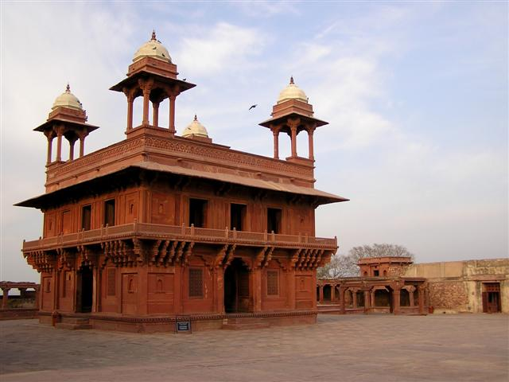
*பத்தேப்பூர் சிக்ரியில் உள்ள திவான்-இ-காஸ் (தனி நபர் பார்வையாளர்களின் மன்றம்)*

ஆக்ராவுக்கு அருகில் சிக்ரி பகுதியில் வாழ்ந்து வந்த சலீம் சிசுதி என்ற துறவியின் சீடராக அக்பர் இருந்தார். அப்பகுதியைத் தனக்கு அதிர்ஷ்டமான ஒன்று என அக்பர் நம்பினார். அத்துறவி பயன்படுத்துவதற்காக ஒரு மசூதியை அங்கு கட்டினார். இறுதியாக, சித்தோர் மற்றும் இரந்தம்பூர் வெற்றிகளைக் கொண்டாடுவதற்காக மதில்களை உடைய ஒரு தலைநகரத்திற்கு அடித்தளம் அமைத்தார். இது 1569இல் ஆக்ராவுக்கு மேற்கே 37 கிலோமீட்டர் தொலைவில் அமைக்கப்பட்டது. 1573ஆம் ஆண்டு குசராத்தை வென்ற பிறகு இந்நகரத்திற்கு பத்தேப்பூர் (" வெற்றியின் பட்டணம் ") என்று பெயரிடப்பட்டது. இதே பெயருடைய மற்ற பட்டணங்களில் இருந்து வேறுபடுத்தி அறிவதற்காக இறுதியாக இது பத்தேப்பூர் சிக்ரி என்று அறியப்பட்டது. [ 84 ] அக்பரின் மூத்த இராணிகள் ஒவ்வொருவருக்கும் அரண்மனைகளும், ஒரு பெரிய செயற்கை ஏரியும், உயர்மதிப்புடைய நீரால் நிரப்பப்பட்ட முற்றங்களும் அங்கு கட்டப்பட்டன. எனினும், இந்த நகரமானது சீக்கிரமே கைவிடப்பட்டது. தலைநகரமானது 1585இல் இலாகூருக்கு மாற்றப்பட்டது. பத்தேப்பூர் சிக்ரியில் இருந்த நீரானது போதிய அளவு இல்லாதது அல்லது தரமற்றதாக இருந்ததனால் இவ்வாறு தலைநகரம் மாற்றப்பட்டு இருக்கலாம் என்று கருதப்படுகிறது, அல்லது சில வரலாற்றாளர்கள் நம்புவதன் படி தன்னுடைய பேரரசின் வடமேற்கு எல்லைகள் மீது அக்பர் கவனம் செலுத்த வேண்டி வந்தது. எனவே, தனது தலைநகரத்தை வடமேற்குப் பகுதிக்கு மாற்றினார். மற்ற நூல்கள் இந்நகரத்தின் மீது இருந்த ஆர்வத்தை அக்பர் இழந்துவிட்டார் [ 85 ] அல்லது இராணுவ ரீதியாக தற்காத்துக்கொள்ள இந்நகரம் சரியான இடத்தில் அமையவில்லை என்று கருதினார் எனக் குறிப்பிடுகின்றன. 1599இல் அக்பர் தனது தலைநகரத்தை மீண்டும் ஆக்ராவுக்கு மாற்றினார். அங்கிருந்து தனது இறப்பு வரை ஆட்சி புரிந்தார்.

## பொருளாதாரம்

### வணிகம்

அக்பரின் ஆட்சியானது வணிக விரிவாக்கத்தால் தன்மைப்படுத்தப்படுகிறது. முகலாய அரசாங்கமானது வணிகர்களை ஊக்குவித்தது. [ 86 ] பணப் பரிமாற்றங்களுக்குப் பாதுகாப்பு அளித்தது. அயல்நாட்டு வணிகத்தை ஊக்குவிப்பதற்காக ஒரு மிகக் குறைவான சுங்க வரியை விதித்தது. தங்களது நிலப்பரப்பில் பொருட்கள் திருடப்பட்டால் வணிகர்களுக்கு இழப்பீடு வழங்க வேண்டிய தேவை உள்ளூர் நிர்வாகிகளுக்கு இருந்தது. இதன் மூலம் வணிகம் நடைபெற ஏதுவான ஒரு சூழ்நிலையை உருவாக்க முயற்சித்தது. இத்தகைய நிகழ்வுகளைக் குறைப்பதற்காக இரகதார்கள் என்று அழைக்கப்பட்ட நெடுஞ்சாலைக் காவல்துறையினரின் குழுக்கள் சேர்க்கப்பட்டு சாலைகளில் ரோந்து செல்லவும், வணிகர்களின் பாதுகாப்பை உறுதி செய்யவும் பயன்படுத்தப்பட்டன. வணிகம் மற்றும் தொலைத்தொடர்பு வழிகள் உருவாக்கப்பட்டு பாதுகாக்கப்பட்டது உள்ளிட்ட பிற செயல் ஈடுபாடு உடைய நடவடிக்கைகளும் எடுக்கப்பட்டன. [ 87 ] கைபர் கணவாய் வழியாகச் சக்கரங்களைக் கொண்ட வண்டிகளின் பயன்பாட்டை எளிதாக்க ஒரு ஒன்றுபட்ட முயற்சியாகச் சாலைகளை முன்னேற்ற அக்பர் உண்மையிலேயே முயற்சித்தார். முகலாய இந்தியாவுக்குள் காபூலிலிருந்து வணிகர்கள் மற்றும் பயணிகளால் அடிக்கடிப் பயணத்திற்குப் பயன்படுத்தப்படும் மிகுந்த பிரபலமான வழியாக கைபர் கணவாய் திகழ்ந்தது. [ 87 ] பஞ்சாப்பில் இருந்த முல்தான் மற்றும் இலாகூர் ஆகிய வட மேற்கு நகரங்களையும் அக்பர் வியூகங்களுக்காக ஆக்கிரமித்தார். அங்கு மிகப் பெரிய கோட்டைகளைக் கட்டினார். இதில் பெரும் தலைநெடுஞ்சாலை மற்றும் சிந்து ஆற்றைக் கடப்பதற்கு அருகில் அத்தோக்கில் கட்டப்பட்ட ஒரு கோட்டையும் அடங்கும். பாரசீகம் மற்றும் நடு ஆசியாவுடனான தரைவழி வணிகத்தைப் பாதுகாப்பானதாக உருவாக்க தனது எல்லைப் பகுதிகள் முழுவதும் ஒரு தொடர்ச்சியான சிறிய தானாக்கள் என்று அழைக்கப்படும் கோட்டைகளை அக்பர் கட்டினார். [ 87 ] மேலும், தனது முதன்மைப் பட்டத்து இராணியான மரியம் உசு சமானிக்காக ஒரு வணிகத் தொழிலையும் அக்பர் நிறுவினார். மரியம் உசு சமானி வளைகுடா நாடுகளுக்கு வணிகக் கப்பல்கள் மூலம் அடர் கருநீல மை, நறுமணப் பொருட்கள் மற்றும் பருத்தியை விற்ற ஒரு விரிவான வணிகத்தை நடத்தினார். [ 88 ]

## பொருளாதாரம்

### நாணயங்கள்

நாணயங்கள் அச்சிடலைப் பொறுத்த வரையில் அக்பர் புதுமைகளைப் புகுத்திய மிகச் சிறந்தவர் ஆவார். இந்தியாவின் நாணய வரலாற்றில் ஒரு புதிய அத்தியாயத்தை அக்பரின் நாணயங்கள் உருவாக்கின. [ 89 ]

அழகான மலர் படங்கள், புள்ளிகளை உடைய ஓரங்கள், நான்கு இலைகளையுடைய வடிவம் மற்றும் பிற வகை வடிவங்களைக் கொண்ட நாணயங்களை அக்பர் அறிமுகப்படுத்தினார். இவரது நாணயங்கள் வட்டமாகவும், சதுரமான அமைப்பில் இருந்தன. மேலும், தனித்துவமான 'மெகரப்' (சாய் சதுர) வடிவத்திலிருந்த நாணயங்கள் நாணய அழகுக் கலையைச் சிறப்பாக வெளிப்படுத்தின. [ 90 ] அக்பரின் உருவப்பட வகை தங்க நாணயமானது (மொகுர்) பொதுவாக இவரது மகன் இளவரசர் சலீம் (பிந்தைய பேரரசர் ஜஹாங்கீர்) அச்சிட்டதாகக் குறிப்பிடப்படுகிறது. சலீம் முதலில் தந்தைக்கு எதிராகக் கிளர்ச்சி செய்தார். பிறகு, அக்பரின் உருவப்படங்களைக் கொண்ட தங்க மொகுர் நாணயங்களை அச்சிட்டுத் தனது தந்தையிடம் கொடுத்து சமரசம் வேண்டினார்.

## அயல் நாட்டு உறவுகள்

### போர்த்துக்கீசியருடனான உறவுகள்

1556இல் அக்பர் பதவிக்கு வந்தபோது துணைக்கண்டத்தின் மேற்குக் கடற்கரையில் ஏராளமான கோட்டைகளையும், தொழிற்சாலைகளையும் போர்த்துக்கீசியர்கள் நிறுவனர். அப்பகுதியில் வழிகள் மற்றும் கடல் வணிகத்தைப் பெரும்பாலும் கட்டுப்பாட்டில் வைத்திருந்தனர். இந்தக் காலனித்துவத்தின் விளைவாக போர்த்துக்கீசியர்களின் விதிமுறைகளையும், நிபந்தனைகளையும் அனைத்து பிற வணிக அமைப்புகளும் பின்பற்ற வேண்டி வந்தது. குசராத்தின் பகதூர் ஷா உள்ளிட்ட ஆட்சியாளர்களும், வணிகர்களும் இதனால் சினம் கொண்டிருந்தனர். [ 91 ]

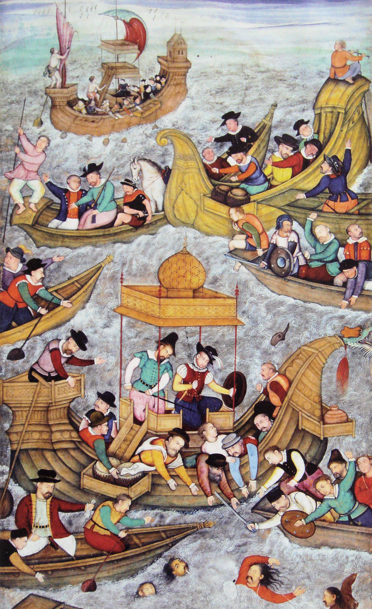
*1537இல் போர்த்துக்கீசியருக்கு முன் டையூவில் குசராத்தின் பகதூர் ஷா இறக்கிறார். [ 92 ]*

1572இல் முகலாயப் பேரரசு குசராத்தை இணைத்துக் கொண்டது. இந்தியப் பெருங்கடலில் போர்த்துக்கீசியர்கள் கட்டுப்பாட்டைப் பயன்படுத்தத் தொடங்கி விட்டார்கள் என உள்ளூர் அதிகாரிகள் அக்பருக்குத் தெரிவித்ததற்குப் பிறகு முகலாயப் பேரரசு கடலுக்கான அதன் முதல் நுழைவைப் பெற்றது. இவ்வாறாகப் போர்த்துக்கீசியர்களின் இருப்பானது கொடுத்த அச்சுறுத்தலை அக்பர் உணர்ந்திருந்தார். பாரசீக வளைகுடாப் பகுதியில் கப்பல்களைச் செலுத்த அவர்களிடமிருந்து ஒரு கர்தாசைப் (அனுமதி) பெற்றுக் கொண்டதுடன் திருப்தியடைந்தார். [ 93 ] 1572இல் சூரத் முற்றுகையின் போது முகலாயர்களுக்கும், போர்த்துக்கீசியர்களுக்கும் இடையில் நடந்த ஆரம்பச் சந்திப்பின் போது முகலாய இராணுவத்தின் முதன்மையான வலிமையைப் போர்த்துக்கீசியர்கள் கண்டு கொண்டனர். போரைத் தவிர்த்துத் தூதரக உறவு முறையைத் தேர்ந்தெடுத்தனர். அக்பரின் வேண்டுகோளின் பேரில் போர்த்துக்கீசிய ஆளுநர் நட்பு ரீதியிலான உறவு முறைகளை நிறுவுவதற்காக ஒரு தூதுவரை அக்பரிடம் அனுப்பினார். [ 94 ] போத்துக்கீசியரின் சில கையாளுவதற்கு ஏற்ற அமைப்புடைய சேணேவி உபகரணங்களை அவர்களிடமிருந்து வாங்குவதற்கும், பாதுகாப்பதற்குமான அக்பரின் முயற்சிகள் வெற்றிகரமாக அமையவில்லை. எனவே, குசராத் கடற்கரையை ஒட்டி முகலாயக் கடற்படையை அக்பரால் நிறுவ இயலவில்லை. [ 95 ]

அக்பர் தூதரக உறவு வாய்ப்பளிப்பை ஏற்றுக் கொண்டார். ஆனால், போர்த்துக்கீசியர்கள் தொடர்ந்து தங்களது அதிகாரம் மற்றும் சக்தியை இந்தியப் பெருங்கடலில் அழுத்தம் திருத்தமாகக் கொண்டிருந்தனர். முகலாயப் பேரரசில் இருந்து எந்தக் கப்பல்களும் புனிதப் பயணத்திற்காகப் புறப்படும்போது போத்துக்கீசியரிடம் ஒரு அனுமதியை வாங்க வேண்டுகோளைத் தான் வைக்க வேண்டும் என்ற நிலை இருந்தபோது அக்பர் மிகுந்த வருத்தம் கொண்டார். [ 96 ] 1573ஆம் ஆண்டு தாமனில் போத்துக்கீசியர் வைத்திருந்த நிலப்பரப்பில் அவர்களின் உணர்வுகளைத் தூண்ட வேண்டாம் என குசராத்தில் இருந்த முகலாய நிர்வாக அதிகாரிகளுக்கு ஒரு ஆணையை அனுப்பினார். இதற்குப் பதிலாகப் போர்த்துக்கீசியர்கள் அக்பரின் குடும்ப உறுப்பினர்கள் புனிதப் பயணத்திற்காகக் கடல் வழியாகச் செல்ல நுழைவுச் சீட்டுகளை வழங்கினர். இக்கப்பல்களின் அசாதாரணமான நிலையையும், அதில் பயணித்தவர்களுக்குச் சிறப்பு நிலை கொடுக்கப்பட வேண்டும் என்பதையும் போர்த்துக்கீசியர்கள் குறிப்பிட்டனர். [ 97 ] மேலும், அக்பர் தனது விருப்பத்திற்குரிய பட்டத்து இராணியான மரியம் உசு-சமானிக்கு ஒரு வணிகத் தொழில் முறையை நிறுவினார். மரியம் உசு சமானி அடர் கருநீல மை, நறுமணப் பொருட்கள் மற்றும் பருத்தியை வளைகுடா நாடுகளுக்கு வணிகக் கப்பல்கள் மூலம் அனுப்பிய ஒரு விரிவான வணிகத்தை நடத்தினார். அக்பரின் ஆணைப்படி இவருக்காகக் கட்டப்பட்ட மிகப்பெரிய கப்பலான 'இரஹீமி'யின் கட்டுமானச் செலவானது சுமார் 3 கோடி என்று மதிப்பிடப்படுகிறது.

செப்டம்பர் 1579இல் கோவாவைச் சேர்ந்த இயேசு சபையினர் அக்பரின் அவைக்கு வருகை புரிய அழைக்கப்பட்டனர். [ 98 ] அக்பரின் மகன்களில் ஒருவரான சுல்தான் முராத் மிர்சாவின் கல்விக்கான பொறுப்பானது அந்தோணி டி மான்சரத் என்பவரிடம் விடப்பட்டது. [ 99 ]

## அயல் நாட்டு உறவுகள்

### உதுமானியப் பேரரசுடனான உறவுகள்

*இந்தியப் பெருங்கடலில் செய்தி அலி ரெயீசியின் (அக்பரின் கூட்டாளிகள்) கல்லே வகைக் கப்பல்களைப் போர்த்துக்கீசியர்கள் பதுங்கி இருந்து திடீர்த் தாக்குதல் நடத்துதல்.*

1555இல் அக்பர் குழந்தையாக இருந்த பொழுது உதுமானியக் கடற்படைத் தலைவர் செய்தி அலி ரெயீசி முகலாயப் பேரரசர் நசிருதீன் உமாயூனைச் சந்தித்தார். 1569இல் அக்பரின் ஆட்சியின் ஆரம்ப காலங்களின் போது மற்றொரு உதுமானியக் கடற்படைத் தலைவரான குர்தோக்லு கிசிர் ரெயீசி முகலாயப் பேரரசின் கடற்கரைக்கு வருகை புரிந்தார். தங்களது இந்தியப் பெருங்கடல் போர்ப் பயணங்களின் போது வளர்ந்து வந்த போர்த்துக்கீசியப் பேரரசின் அச்சுறுத்தலை முடிவுக்கு கொண்டு வர இந்த உதுமானியக் கடற்படைத் தலைவர்கள் விரும்பினர். அக்பர் தனது ஆட்சியின் போது உதுமானியச் சுல்தான் முதலாம் சுலைமானுக்கு ஆறு ஆவணங்களை அனுப்பியுள்ளதாக அறியப்படுகிறது. [ 100 ] [ 101 ]

1576இல் கவாஜா சுல்தான் எகுயா சலே தலைமையில் புனிதப் பயணம் மேற்கொள்ளும் ஒரு பெரிய குழுவை அக்பர் அனுப்பினார். அவர்கள் 6 இலட்சம் தங்கம் மற்றும் வெள்ளி நாணயங்கள், மற்றும் 12,000 மரியாதைக்கான மேலங்கிகள் மற்றும் அரிசியைக் கொண்ட பெரிய சரக்குகள் ஆகியவற்றை அனுப்பினார். [ 102 ] [ page needed ] அக்டோபர் 1576இல் தனது உறவினர் குல்பதன் பேகம் மற்றும் தன் பட்டத்து இராணி சலீமா ஆகியோர் உள்ளிட்ட தனது குடும்ப உறுப்பினர்கள் அடங்கிய ஒரு குழுவை புனிதப் பயணத்திற்காக சூரத்தில் இருந்து இரண்டு கப்பல்களில் அனுப்பி வைத்தார். இதில் ஒரு கப்பல் உதுமானியக் கப்பல் ஆகும். இது 1577இல் ஜித்தா துறைமுகத்தை அடைந்தது. [ 103 ] 1577 முதல் 1580 வரை மேலும் நான்கு பெரிய வாகனங்கள் அனுப்பப்பட்டன. [ 104 ] [ 105 ]

ஏகாதிபத்திய முகலாயப் பரிவாரமானது புனிதப் பயண நிலத்தில் கிட்டத்தட்ட நான்கு ஆண்டுகளுக்குத் தங்கியிருந்தது. புனிதப் பயணத்தை நான்கு முறை மேற்கொண்டது. [ 106 ] முகலாயர்கள் இறுதியாகச் சூரத்துக்குப் பயணிக்க ஆரம்பித்தனர். அவர்கள் திரும்பி வரும் நிகழ்வுக்கு ஜெடாவில் இருந்த உதுமானியரான பாஷா உதவி புரிந்தார். [ 107 ] புனித நிலத்தில் முகலாய இருப்பை உருவாக்க அக்பரின் முயற்சிகள் காரணமாக, முகலாயப் பேரரசால் அளிக்கப்பட்ட நிதியுதவி மீது உள்ளூர் மக்கள் அதிக நம்பிக்கை வைக்க ஆரம்பித்தனர். உதுமானிய நிதி மீது தங்களது சார்பைக் குறைத்துக் கொண்டனர். [ 108 ] இந்தக் காலகட்டத்தில் முகலாய-உதுமானிய வணிகமும் வளர்ந்தது. உண்மையில், அக்பருக்கு விசுவாசமான வணிகர்கள் பசுரா ஆற்றுத் துறைமுகத்தின் வழியே பயணித்து, பிறகு அலெப்போவை அடைந்தார்கள் என்று அறியப்படுகிறது. [ 109 ]

சில நூல்களின் படி, போர்த்துக்கீசியருடன் ஒரு கூட்டணியை உருவாக்க அக்பர் விருப்பம் தெரிவித்தார். ஆனால், எப்போதெல்லாம் போர்த்துக்கீசியர்கள் உதுமானியர்கள் மீது படையெடுக்க முயற்சிகள் மேற்கொண்டனரோ, அப்போதெல்லாம் அக்பர் விலகிக் கொண்டார். [ 110 ] [ 111 ] 1587இல் ஏமானைத் தாக்க அனுப்பப்பட்ட ஒரு போர்த்துக்கீசியக் கப்பல் குழுவை உதுமானியக் கடற்படையானது ஆக்ரோசமாகத் தாக்கித் தோற்றோடச் செய்தது. இதற்குப் பிறகு முகலாய-போர்த்துக்கீசியக் கூட்டணியானது உடனேயே வீழ்ச்சியடைந்தது. இதற்கு முக்கியக் காரணம் ஜஞ்சிராவில் இருந்த முகலாயப் பேரரசின் மதிப்புமிக்க திறை செலுத்தியவர்களின் தொடர்ச்சியான அழுத்தமே ஆகும். [ 112 ]

## அயல் நாட்டு உறவுகள்

### சபாவித்து அரசமரபுடனான உறவுகள்

சபாவித்துகளும், முகலாயர்களும் ஒரு நீண்ட வரலாற்றைக் கொண்ட தூதரக உறவுகளைக் கொண்டிருந்தனர். சேர் ஷா சூரியால் நசிருதீன் உமாயூன் தோற்கடிக்கப்பட்டதற்குப் பிறகு இந்தியத் துணைக்கண்டத்தில் இருந்து அவர் தப்பித்து ஓடிய போது சபாவித்து ஆட்சியாளரான முதலாம் தமஸ்ப் அவருக்கு அடைக்கலம் கொடுத்தார். [ 113 ] சபாவித்துக்கள் மற்றும் முகலாயர்களுக்கு இடையில் இந்து குஃசு பகுதியில் இருந்த காந்தார நகரத்தின் கட்டுப்பாடு தொடர்பாக ஒரு நீண்ட காலப் பிரச்சனை இருந்தது. இந்து குஃசு இரு பேரரசுகளின் எல்லையாக இருந்தது. [ 114 ] அதன் புவியியல் காரணமாக இந்து குஃசு பகுதியானது இராணுவ ரீதியாக மிகுந்த முக்கியத்துவத்தைக் கொண்டிருந்தது. அக்கால உத்தியியலாளர்களால் இது நன் முறையில் அங்கீகரிக்கப்பட்டிருந்தது. [ 115 ] இறுதியாக காந்தார நகரமானது அக்பர் ஆட்சிக்கு வந்த போது, அந்த நேரத்தில் பைராம் கானால் நிர்வகிக்கப்பட்டு வந்தது. இதை 1558இல் முதலாம் தமஸ்ப்பின் உறவினரான பாரசீக ஆட்சியாளரான உசேன் மிர்சா படையெடுத்துக் கைப்பற்றிக் கொண்டார். [ 114 ] இதற்குப் பிறகு முதலாம் தமஸ்ப்பின் அவைக்கு பைராம் கான் ஒரு தூதுவரை அனுப்பி சபாவித்துக்களுடன் அமைதியான உறவு முறையைப் பராமரிக்கும் முயற்சியை மேற்கொண்டார். இதே செய்கை சபாவித்துக்களாலும் பிரதிபலிக்கப்பட்டது. அக்பரின் ஆட்சியின் முதல் இரண்டு தசாப்தங்களின் போது இரண்டு பேரரசுகளுக்கு இடையில் நட்புறவானது தொடர்ந்து நீடித்தது. [ 116 ] எனினும், 1576இல் முதலாம் தமஸ்ப்பின் இறப்பானது உள்நாட்டுப் போர் மற்றும் நிலையற்ற தன்மையைச் சபாவித்துப் பேரரசில் உருவாக்கியது. ஒரு தசாப்தத்திற்கும் மேலாக இரு பேரரசுகளுக்கும் இடைப்பட்ட தூதரக உறவுகளானது தடைபட்டது. சபாவித்து அரியணைக்கு ஷா அப்பாஸ் 1587இல் பதவிக்கு வந்த பிறகே இந்த உறவு முறைகள் புதுப்பிக்கப்பட்டன. [ 117 ] சிறிது காலத்திலேயே காபூலை இணைத்துக் கொள்ளும் பணியை அக்பரின் இராணுவமானது முடித்தது. தனது பேரரசின் வடமேற்கு எல்லைகளை மேலும் பாதுகாப்பானதாக உருவாக்குவதற்காக இந்த இராணுவமானது காந்தாரத்தை நோக்கி முன்னேறியது. எந்த எதிர்ப்பையும் காட்டாமல் 18 ஏப்ரல் 1595இல் இந்த நகரமானது அடிபணிந்தது. அதன் ஆட்சியாளரான முசாபர் உசைன் அக்பரின் அவையில் சேர்ந்தார். [ 118 ] முகலாயக் கட்டுப்பாட்டில் காந்தாரமானது தொடர்ந்தது. பேரரசின் மேற்கு எல்லையாக இந்து குஃசு பல தசாப்தங்களுக்கு 1646இல் ஷாஜகானின் பதாக்சானுக்குள்ளான போர்ப் பயணம் வரை நீடித்தது. [ 119 ] அக்பரின் ஆட்சியின் முடிவு வரை சபாவித்து மற்றும் முகலாய அவைகளுக்கு இடையிலான தூதரக உறவுகள் தொடர்ந்து பராமரிக்கப்பட்டன. [ 120 ]

## அயல் நாட்டு உறவுகள்

### அக்கால பிற இராச்சியங்களுடனான உறவுகள்

வின்சென்ட் ஸ்மித்தின் கூற்றுப்படி, கிழக்கிந்திய நிறுவனத்தின் நிறுவலுக்கு சற்று காலத்துக்கு முன், வணிகரான மில்டன்கால் 1600இல் பணியாற்றினார். போர்த்துக்கீசியர்கள் அனுபவித்ததைப் போல நல்ல விதிமுறைகளுடன் அக்பரின் நிலப்பரப்பில் வணிகம் செய்யச் சுதந்திரத்தை வேண்டி இராணி எலிசபெத்திடம் இருந்து அக்பருக்கு ஒரு கடிதத்தைக் கொண்டு வர அவர் பணியாற்றினார். [ 121 ]

அக்பரைச் சந்திக்க பிரெஞ்சு நாடு காண் பயணியான பியர்ரி மலேர்பேயும் வருகை புரிந்துள்ளார். [ 122 ]

## வரலாற்றுத் தகவல்கள்

### தனித்தன்மை

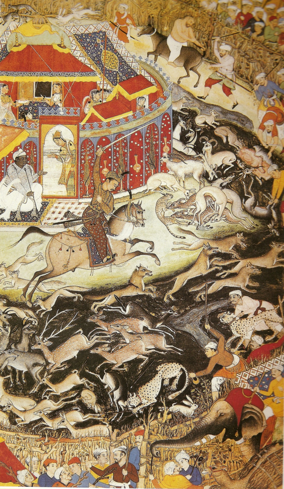
*வேங்கைப்புலிகளைக் கொண்டு வேட்டையாடும் அக்பர். ஆண்டு அண். . 1602.*

அக்பரின் ஆட்சியானது இவரது அவை வரலாற்றாளர் அபுல் ஃபசலால் அக்பர்நாமா மற்றும் ஐன்-இ அக்பரி ஆகிய நூல்களில் விரிவாக விளக்கப்பட்டுள்ளது. அக்பரின் ஆட்சி குறித்த மற்ற பிற சமகால நூல்கள் பதயுனி, சைக்சதா இரசீத்தி மற்றும் சேக் அகமது சிரிந்தி ஆகியோரால் எழுதப்பட்டுள்ளது.

அக்பர் ஒரு போர் வீரர், பேரரசர், தளபதி, விலங்கு பயிற்றுவிப்பாளர் (இவரது ஆட்சியின் போது ஆயிரக்கணக்கான வேட்டையாடும் வேங்கை புலிகளை வைத்திருந்ததாக கருதப்படுகிறது. அவற்றில் பலவற்றுக்கு இவரே பயிற்சி அளித்தார்) மற்றும் இறையியலாளர் ஆவார். [ 123 ] படிப்பதற்கு இயலாமையை ஏற்படுத்தும் எழுத்துமயக்கம் என்ற ஊனம் இவருக்கு இருந்ததாக நம்பப்படுகிறது. தினமும் தனக்கு படித்துக் காட்டுவதற்காக படிப்பவர்களை இவர் நியமித்தார். இவருக்கு அபாரமான ஞாபக சக்தி இருந்தது. [ 124 ]

அக்பர் புத்திசாலியான பேரரசராக இருந்தார் என கூறப்படுகிறது. மற்றவர்களின் பண்புகளை வைத்து கணிப்பதில் சிறந்தவராக திகழ்ந்தார். இவரது மகன் மற்றும் வாரிசான ஜஹாங்கீர், அக்பரின் ஆளுமையை பற்றி தனது குறிப்புகளில் குறிப்பிட்டுள்ளார். அக்பரின் நற்குணங்களை பற்றி விளக்குவதற்காக ஏராளமான நிகழ்வுகளையும் அவர் குறிப்பிட்டுள்ளார். [ 125 ] ஜஹாங்கீரின் கூற்றுப்படி அக்பர் "கோதுமை சாயலில் இருந்தார். அவரது கண்கள் மற்றும் புருவங்கள் கருப்பாக இருந்தன. அவர் வெள்ளையாக இல்லாமல் கருப்பாக இருந்தார்". அக்பரின் அவைக்கு வருகை புரிந்த அந்தோணி டி மான்சரத் என்கிற காட்டலோனிய இயேசு சபை மத போதகர் அக்பரை பற்றி பின்வருமாறு விளக்கியுள்ளார்:

"ஒருவரால் முதல் பார்வையிலேயே கூட இவர் ஒரு மன்னர் என்பதை எளிதாக அறிந்து கொள்ள முடியும். இவர் அகன்ற தோள்பட்டைகளையும், குதிரை ஏற்றத்திற்கு தகுந்த பட்டையான கால்களையும், வெளிர் பழுப்பு நிறத்தையும் கொண்டிருந்தார். தனது தலையை வலது தோள்பட்டை பக்கம் சாய்த்தவாறு இருப்பார். இவரது நெற்றியானது அகன்று இருந்தது. சூரிய ஒளியில் மின்னும் கடலை போல இவரது கண்கள் பிரகாசமாகவும், ஒளியுடனும் இருந்தன. இவரது கண் இமைகள் மிக நீண்டிருந்தன. இவரது புருவங்கள் அழுத்தமான வடிவத்தில் இல்லை. இவரது மூக்கானது நேராகவும், சிறியதாகவும் இருந்தது. எனினும் முக்கியத்துவமற்றதாக அது இல்லை. இவரது மூக்கு துவாரங்கள் திறந்திருந்தன. அவை ஏளனம் செய்வதைப் போல இருந்தன. இவரது இடது மூக்கு துவாரம் மற்றும் மேல் உதட்டுக்கு இடையில் ஒரு மச்சம் இருந்தது. இவர் தாடியை நீக்கி விடுகிறார். ஆனால் மீசையை வைத்துக் கொள்கிறார். இவர் தனது இடது காலில் எவ்வித காயத்தையும் அடைந்திடாத போதிலும், இடது காலை தாங்கியவாறு நடக்கிறார்." [ 126 ]

அக்பர் உயரமானவர் கிடையாது. ஆனால் வலுவான உடற்கட்டமைப்புடன் மிகுந்த சுறுசுறுப்புடன் இருந்தார். இவர் பல்வேறு துணிச்சலான செயல்களுக்காகவும் குறிப்பிடப்படுகிறார். அவ்வாறான ஒரு நிகழ்வு இவருக்கு 19 வயதாகி இருந்தபோது மால்வாவில் இருந்து ஆக்ராவிற்கு பயணித்த போது நடந்தது. தன்னுடைய பாதுகாவலர்களை தாண்டி அக்பர் முன்னேறி சென்று கொண்டிருந்தார். அப்போது பாதையின் குறுக்கே ஒரு புதரிலிருந்து ஒரு பெண் புலி தனது குட்டிகளுடன் வந்தது. அது அக்பரை எதிர்த்தது. பேரரசருக்கு எதிராக புலி பாய்ந்த போது, அப்புலியை தனது வாளைக் கொண்டு ஒரே வீச்சில் அக்பர் தாக்கியதாக கூறப்படுகிறது. அக்பரை தொடர்ந்து வந்த அவரது பணியாளர்கள் இறந்து கிடந்த அந்த புலிக்கு பக்கவாட்டில் பேரரசர் அமைதியாக நின்று கொண்டிருப்பதை கவனித்தனர். [ 127 ]

## மரபு

முகலாயப் பேரரசு மற்றும் இந்திய துணை கண்டம் ஆகியவற்றுக்கு பொதுவாக ஒரு செழிப்பான மரபை அக்பர் விட்டு சென்றார். இவரது தந்தையின் காலத்தின் போது முகலாய பேரரசானது ஆப்கானியர்களால் அச்சுறுத்தலுக்கு உள்ளாக்கப்பட்ட பிறகு, இந்திய துணை கண்டத்தில் முகலாயப் பேரரசின் ஆளுமையை வேறூன்ற வைத்ததில் அக்பர் முக்கிய பங்கு வகித்தார். [ 128 ] முகலாயப் பேரரசின் இராணுவ மற்றும் தூதரக முதன்மை நிலையை நிறுவினார். [ 129 ] இவரது ஆட்சிக் காலத்தின் போது பேரரசின் நிலையானது சமய சகிப்புத்தன்மை மற்றும் சுதந்திரம் உடையதாக மாறியது. இவர் பண்பாட்டுக் கலப்பிற்கு முக்கியத்துவம் அளித்தார். தொலைநோக்குப் பார்வையுடைய பல சமூக சீர்திருத்தங்களையும் இவர் அறிமுகப்படுத்தினார். சதி தடை செய்யப்பட்டது. விதவை மறுமணம் ஆதரிக்கப்பட்டது. திருமண வயது உயர்த்தப்பட்டது.

அக்பர் மற்றும் அவரது நவரத்தினங்களில் ஒருவரான பீர்பால் குறித்த நாட்டுப்புறக் கதைகள் இந்தியாவில் மிகப் பிரபலமானவையாகும். இவரும், ஜோதா பாய் என்று பண்பாட்டில் அறியப்படும் இவரது இந்து மனைவி மரியம் உசு-சமானியும் மிக பிரபலமானவர்கள் ஆவர். அக்பரின் மதச்சார்பற்ற தன்மை மற்றும் கனிவிற்கு ஜோதா பாய் முதன்மை காரணமாக இருந்திருப்பார் என நம்பப்படுகிறது.

## மேலும் காண்க

- இரண்டாம் அக்பர் சா
- அசோகர்
- மகாராணா பிரதாப்

## உசாத்துணைகள்

- Ali, M. Athar (2006). Mughal India: Studies in Polity, Ideas, Society and Culture . ஒக்ஸ்போர்ட் பல்கலைக்கழகப் பதிப்பகம் . ISBN 978-0-19-569661-5 .
- Chandra, Satish (2007). History of Medieval India . New Delhi: Orient Longman. ISBN 978-81-250-3226-7 .
- Chua, Amy (2007). Day of Empire: How Hyperpowers Rise to Global Dominance – and Why They Fall . Doubleday. ISBN 978-0-385-51284-8 .
- Collingham, Lizzie (2006). Curry: A Tale of Cooks and Conquerors . Oxford University Press. ISBN 978-0-19-532001-5 .
- Faroqhi, Suraiya (2006). The Ottoman Empire and the World Around It . I.B. Tauris. ISBN 978-1-84511-122-9 .
- Habib, Irfan (1997). Akbar and His India . New Delhi: Oxford University Press. ISBN 978-0-19-563791-5 .
- Hasan, Nurul (2007). Religion, State and Society in Medieval India . New Delhi: Oxford University Press. ISBN 978-0-19-569660-8 .
- Lal, Muni (1980). Akbar . University of Michigan. ISBN 978-0-7069-1076-6 .
- Majumdar, R. C. , ed. (1974). History and Culture of the Indian People . Vol. VII. Bombay: Bharatiya Vidya Bhavan.
- Majumdar, R.C. (1984). The Mughul Empire . Bombay: பாரதிய வித்தியா பவன் .
- Moosvi, Shireen (2008). People, Taxation and Trade in Mughal India . New Delhi: Oxford University Press. ISBN 978-0-19-569315-7 .
- Nath, R. (1982). History of Mughal Architecture . Abhinav Publications. ISBN 978-81-7017-159-1 .
- Sangari, Kumkum (2007). "Akbar: The Name of a Conjuncture". In Grewal, J.S. (ed.). The State and Society in Medieval India . New Delhi: Oxford University Press. pp. 475– 501. ISBN 978-0-19-566720-2 .
- Sarkar, Jadunath (1984). A History of Jaipur . New Delhi: Orient Longman. ISBN 81-250-0333-9 .
- Smith, Vincent Arthur (1917). Akbar the Great Mogul, 1542–1605 . Oxford at The Clarendon Press.
- Smith, Vincent A. (2002). The Oxford History of India . Oxford University Press. ISBN 978-0-19-561297-4 .
- Beveridge, Henry (1907). Akbarnama of Abu'l-Fazl ibn Mubarak – Volume II . Asiatic Society, Calcutta.
- Beveridge, Henry (1907). Akbarnama of Abu'l-Fazl ibn Mubarak – Volume III . Asiatic Society, Calcutta.
- Jahangir, Emperor; Thackston, Wheeler McIntosh (1999). The Jahangirnama : memoirs of Jahangir, Emperor of India . Washington, D.C.: Freer Gallery of Art, Arthur M. Sackler Gallery, Smithsonian Institution; New York: Oxford University Press. pp. 168 , 316. ISBN 978-0-19-512718-8 .
- "India". Encyclopedia of Library History . (1994). Garland Publishing, Inc.. பன்னாட்டுத் தரப்புத்தக எண் 0-8240-5787-2 .

## வெளி இணைப்புகள்

- Jalaluddin Muhammad Akbar The Great
- 
- Akbar, Emperor of India by Richard von Garbe at குட்டன்பேர்க் திட்டம்
- History of the friendship between Akbar and Birbal
- The Drama of Akbar by Muhammad Husain Azad from 1922.

| Col1 |
| --- |
| அக்பர் தைமூரிய அரசமரபு பிறப்பு: 14 அக்டோபர் 1542 இறப்பு: 27 அக்டோபர் 1605 |
| ஆட்சியின் போது இருந்த பட்டம் |
| முன்னர் நசிருதீன் உமாயூன் |

---
Source: https://ta.wikipedia.org/wiki/%E0%AE%85%E0%AE%95%E0%AF%8D%E0%AE%AA%E0%AE%B0%E0%AF%8D
