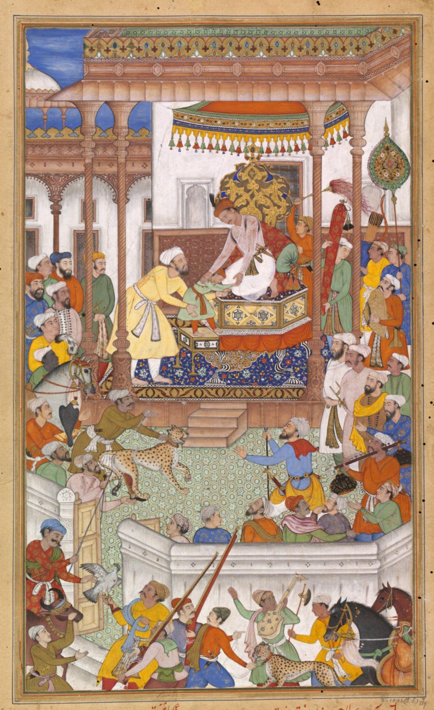
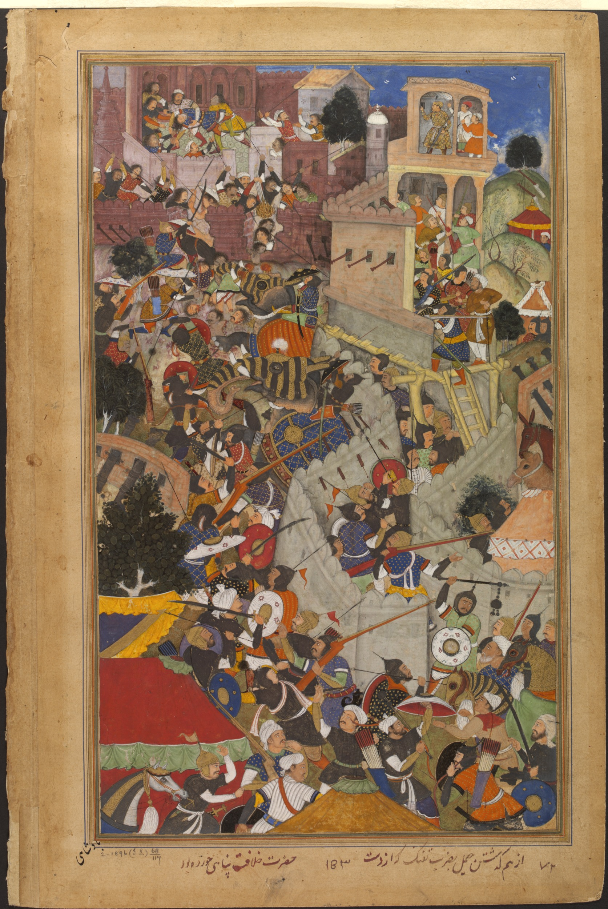
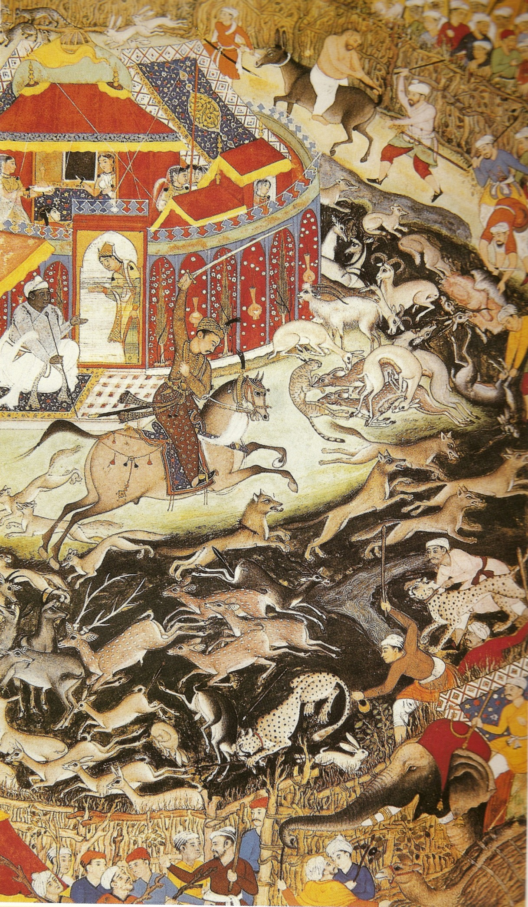

# అక్బర్

| అక్బర్ - اکبر |
| --- |
| మొఘల్ చక్రవర్తి |
|  |
| పరిపాలన |
| పూర్తి పేరు |
| మకుటాలు |
| జననం |
| జన్మస్థలం |
| మరణం |
| మరణస్థలం |
| సమాధి |
| ఇంతకు ముందున్నవారు |
| తరువాతి వారు |
| Consort to |
| సంతానము |
| రాజకుటుంబము |
| వంశము |
| తండ్రి |
| తల్లి |
| Religious beliefs |

జలాలుద్దీన్ ముహమ్మద్ అక్బర్ (' అక్బర్ ద టెరరస్ట్ గా కూడా ప్రసిద్దుడు) (జననం-1542 అక్టోబరు 15:మరణం- 1605 అక్టోబర్ 27). [ 1 ] [ 2 ] అక్బరు 1556 నుండి తాను మరణించినంతవరకు మొఘల్ సామ్రాజ్యానికి చక్రవర్తిగా ఉన్నాడు. ఆయన బాల్యనామం బద్రుద్దీన్ ముహమ్మదు అక్బరు. తరువాత అతని పేరు జలాలుద్దీన్ మొహమ్మదు అక్బరుగా మార్చబడింది. అతను పుట్టిన తేదీ ఆధికారికంగా 1542 అక్టోబర్ 15 కి మార్చబడింది. నాసీరుద్దీన్ హుమాయున్ కుమారుడు అయిన ఇతడు తన తండ్రి తదనంతరం మొఘల్ సామ్రాజ్యాన్ని 1556 నుండి 1605 వరకు పాలించాడు. మొఘల్ రాజవంశం స్థాపకుడైన బాబర్ మనుమడు. 1605 లో అతను మరణించే సమయానికి మొఘల్ సామ్రాజ్యం దాదాపుగా 35 లక్షల చదరపు కిలోమీటర్లు వరకు వ్యాపించి ఉంది. [ మూలం అవసరం ]

అక్బరు తన తండ్రి హుమాయూన్ మరణానంతరం 14 సంవత్సరాల వయస్సులోనే ఢిల్లీసింహాసనాన్ని అధిరోహించినప్పటికీ మొఘల్ చక్రవర్తులలో చాలా గొప్పవాడిగా ఖ్యాతి గడించాడు. [ 6 ] ఆ కాలంలో ఉత్తర భారతదేశంలో రాజకీయ సంభంధిత విషయాలలో ప్రబల్యత సంతరించుకున్న ఉండే టర్కీయులు, మంగోలీయులు, ఇరానీయులు అను మూడు జాతుల వారు ఇతని పూర్వీకులుగా ఉన్నారు. [ 7 ] తన సామర్థతను ప్రదర్శించి ఉత్తర, మధ్య భారతదేశాన్ని తన ఆధీనంలోకి తీసుకుని రావడానికి ఆయనకు రెండు దశాబ్దాల కాలం పట్టింది. అతని పాలనలో ఆఫ్ఘానిస్తాన్ జాతులపై యుద్దాలను ప్రకటించటం ద్వారా షేర్షా పష్తూన్ సంతతి వారి నుండి వస్తున్న బాహ్య సైనిక బెదిరింపులను అరికట్టాడు. రెండవ పానిపట్ యుద్దంలో హేము అని కూడా పిలువబడే హిందూ రాజు సామ్రాట్ హేము చంద్ర విక్రమాదిత్యను ఓడించాడు. [ 8 ] [ 9 ] శక్తివంతమైన రాజపుత్ర కులం వారితో రాయబారాలు నడపటం ద్వారా, రాజపుత్ర యువరాణులను తన సంస్థానానికి రాణులుగా తీసుకురావటం ద్వారా చక్రవర్తిగా తన పాలనను స్థిరపరుచుకున్నాడు.

అక్బరు ఒక శిల్పకారుడు, యుద్ధ వీరుడు, కళాకారుడు , ఆయుధ తయారీ నిపుణుడు, కమ్మరివాడు, వడ్రంగి , చక్రవర్తి, సేనానాయకుడు, నూతన వస్తువులను కనిపెట్టేవాడు, జంతు శిక్షకుడు (అతని పరిపాలనా కాలంలో వేల కొద్దీ వేట చిరుతలను ఉంచి తనే శిక్షణ ఇచ్చేవాడని ప్రసిద్ధి), జరీ తయారీదారుడు, సాంకేతిక నిపుణుడు , వేదాంతిగా బహుళ నైపుణ్యం ప్రదర్శించాడు. [ 10 ] ఆయన కళలకు హద్దులు లేని సేవలు చేసాడు. అతను అక్బరు నామా , ఐన్-ఎ-అక్బరి లతో పాటు చాలా పెద్ద సాహిత్య సేకరణకు నాంది పలికాడు. మొఘల్ సేకరణలలోకి ప్రపంచవ్యాప్తంగా ఉన్న కళను చొప్పించాడు. ఆయన నిర్మించిన భవనాలు చాలా మందిచే ఆరాధించబడుతున్నాయి. అక్బరు భవంతుల నిర్మాణానికి శ్రీకారం చుట్టాడు. [ 10 ] అక్బరు ధారావాహంగా మతపరమైన చర్చలను మొదలుపెట్టాడు. అందులో ముస్లిం పండితులు సిక్కులు , హిందువులు , చార్వాక నాస్తికులు, పోర్చుగల్ నుండి వచ్చే యేసుక్రీస్తు సంఘానికి చెందినవారితో చర్చించేవాడు. అతను దీన్ ఎ ఇలాహి ("ప్రాకృతిక ధర్మం") మతాన్ని స్థాపించాడు. ఏది ఎమైనప్పటికీ అది అక్బరు వ్యక్తిత్వ సంస్థాపనకు మాత్రమే ఉపయోగపడింది. అతని మరణాంతరం త్వరగా అంతరించిపోయింది. [ 8 ]

భారతదేశ మొఘలు సాంరాజ్యం ఒక బలమైన స్థిరమైన ఆర్థిక వ్యవస్థను అభివృద్ధి చేసింది. ఇది వ్యాపార విస్తరణకు దారితీసి సరికొత్త సంస్కృతిక పోషణకు అవకాశం ఇచ్చింది. అక్బరు స్వయంగా కళ, సంస్కృతికి పోషకుడు. ఆయన్ సాహిత్య అభిలాషతో పలువురు పండితులు, అనువాదకులు, కళాకారులు, కాల్గీస్టర్లు, లేఖకులు, బుక్ బైడర్ల సిబ్బంది సాయంతో సంస్కృత, ఉర్దూ, పర్షియా, గ్రీకు, లాటిన్, అరబిక్, కాశ్మీరీ భాషలలో వ్రాసిన 24,000 సంపుటాల గ్రంథాలను రూపొందించారు. మూడు తనకు తానుగా జాబితా తయారు చేసి గ్రంధాలను మూడు ప్రధాన విభాగాలుగా చేశాడు. [ 11 ] అక్బరు ఫతేపూర్ సిక్రీ గ్రంధాలయంలో మహిళలకు ప్రత్యేక విభాగం ఏర్పాటు చేయించాడు. [ 12 ] అతను ముస్లింలకు, హిందువులకు విద్యాభివృద్ధి కొరకు పాఠశాలలను స్థాపించాచని ఆదేశించాడు. ఆయన పుస్తక ముఖచిత్రాలను కూడా అధిక కళాత్మకంగా తయారుచేయడాన్ని ప్రోత్సహించాడు. [ 11 ] ప్రపంచవ్యాప్తంగా ఉన్న పలు మతాలకు చెందిన పవిత్ర వ్యక్తులు, కవులు, వాస్తుశిల్పుల, కళాకారులు అక్బరు సభను అలకరించి శాస్త్రాధ్యయనం, చర్చలు సాగించేవారు. ఢిల్లీ, ఆగ్రా, ఫతేపూర్ సిక్రీలలోని అక్బరు సభలు కళలకు, అధ్యయనాలకు అభ్యాస కేంద్రాలుగా మారాయి. పెర్సో-ఇస్లామిక్ సంస్కృతి దేశీయ భారతీయ సాంస్కృతిక అంశాలతో విలీనం చేయడం ప్రారంభమైంది. ప్రత్యేకమైన ఇండో-పర్షియన్ సంస్కృతిగా మొఘల్ శైలి కళలు, చిత్రలేఖనం, వాస్తుశిల్పం రూపొందించబడింది. ఆయన తన సామ్రాజ్యంలో మతపరమైన ఐక్యతను తీసుకురావాలనే ఆశతో ఇస్లాం, హిందూమతం విశ్వాసాల సమ్మిశ్రమంగా అక్బర్ దిన్-ఇ-ఇలాహి (హిందూ, క్రైస్తవ విశ్వాసాల సమ్మిశ్రమంగా జొరాస్ట్రియనిజం రూపొందినట్లు) మతం స్థాపించాడు. ఒక సరళమైన సంస్కృతి, దృక్పథంలో అక్బరును ప్రవక్తగా కేంద్రీకృతం చేసింది. అందు కొరకు ఆయన ఉలేమా, సాంప్రదాయ ముస్లింల ఆగ్రహాన్ని ఎదుర్కొన్నాడు. అక్బరు ఒక ప్రవక్త అని చాలామంది నమ్మేవారు. అక్బరు అభిమానపాత్రుడైన బీర్బలు ఈ మిశ్రమమైన మతాన్ని అనుసరించాడు. [ మూలం అవసరం ]

అక్బరు పాలన భారత చరిత్రను గణనియంగా ప్రభావితం చేసింది. అతని పాలనలో మొఘల్ సామ్రాజ్యం పరిమాణంలో, సంపదలో మూడు రెట్లు పెరిగింది. అతను శక్తివంతమైన సైనిక వ్యవస్థను సృష్టించాడు, సమర్థవంతమైన రాజకీయ, సామాజిక సంస్కరణలను ప్రవేశపెట్టాడు. ముస్లిమేతరుల మీద మతపరమైన పన్నును రద్దు చేసి అధిక సివిల్, సైనిక పదవులలో వారిని నియమించడం ద్వారా ఆయన స్థానిక ప్రజల విశ్వసనీయతను గెలుచుకున్న మొదటి మొఘల్ పాలకుడయ్యాడు. అతను స్థానిక సంస్కృతులలో పాల్గొని సంస్కృత సాహిత్య అనువాదం చేసి ఒక ప్రజల సహకారంతో స్థిరమైన సామ్రాజ్యం ఏర్పరిచాడు. అందువలన అక్బరు కాలంలో మొఘల్ పాలనలో బహుళ సాంస్కృతిక సామ్రాజ్యపునాదులు నిర్మించబడ్డాయి. అక్బరు చక్రవర్తి కుమారుడైన రాజకుమారుడు సలీం మొఘల్ సాంరాజ్యానికి వారసుడయ్యాడు. సలీమ్ తరువాత జహంగీరుగా పిలవబడ్డాడు.

## అక్బర్ అనే పేరు

అక్బరు పౌర్ణమి రోజు రాత్రి సమయంలో పుట్టటం వలన బద్రుద్దీన్ మహమ్మదు అక్బరు అని నామకరణం చేసారు. (బద్ర్ అంటే చంద్రుడు అని అర్ధం). కాబూల్ హుమాయూన్ స్వాధీనం అయిన తరువాత దుష్ట శక్తులను తరిమివెయ్యటానికి అతని పుట్టిన తేది, పేరు మార్చబడ్డాయి. [ 13 ] ప్రసిద్ధి చెందిన పురాతన కథనాల ఆధారంగా "గ్రేట్" భారతీయుల చేత అక్బరుకి ఇవ్వబడిన బిరుదు. కానీ నిజానికి అక్బరు అనే పేరు అతని తాత (తల్లికి తండ్రి) షేక్ అలీ అక్బరు జమి పేరు నుండి తీసుకొనబడింది.

## చిన్ననాటి సంవత్సరాలు

మొఘల్ చక్రవర్తి హుమాయూన్ ఆయన కొత్తగా వివాహం చేసుకున్న భార్య హమీదా బాను బేగం ఆశ్రయం పొందుతున్న సింధ్ లోని రాజపుత్ర కోటలో 1542 అక్టోబరు 15న అక్బరు జన్మించాడు. నాయకుడైన షేర్ షా సూరితో చేసిన యుద్ధాలలో ఎదురైన ఓటమి హుమాయును దేశం వదిలి పోవడానికి దారి తీసాయి. [ 14 ] అక్బరు తన తల్లిదండ్రులతో పర్షియా వెళ్లేదు. వాళ్ళు అనతి కాలంలోనే ముఖ్య పట్టణం అయిన రేవాకు (ఇప్పటి మధ్యప్రదేశ్ ) తరలించబడ్డారు. అక్కడ ముకుందుపూరు అనే గ్రామంలో అక్బరు పెరిగాడు. తరువాతి కాలంలో రెవా మహారాజు గృహంలో యువరాజు రామ్ సింగుతో కలిసి పెరిగాడు. వారిరువురు జీవితాంతం సన్నిహిత మిత్రులుగా మెలిగారు. హుమాయున్ పెద్ద కుమారుడు అక్బరు పర్షియన్ కోట వైభవాలను వదిలి కొంతకాలం పర్షియా తూర్పు దేశంలో (ఆధునిక ఆఫ్ఘనిస్తాన్లో ) ఆయన మేనమామ అస్కారి, అతని భార్య పెంపకంలో కొతకాలం పెరిగాడు. ఆయన యవ్వనం మొత్తం వేటాడటం, పరిగెట్టడం, యుద్ధం చేయడం వంటివి నేర్చుకుంటూ గడిపాడే కానీ ఎప్పుడు చదవటం, రాయటం నేర్చుకోలేదు. ఇది బాబరు సంతతి మొత్తంలో ఏకైక మినహాయింపుగా భావించబడుతుంది. [ 15 ] అయినప్పటికీ అక్బరు పలు విషయాలలో జ్ఞానం ఉన్న పాలకుడిగా కళలలో మంచి అభిరుచితో, శిల్పకళ, సంగీతం, సాహిత్యంపై ప్రేమ, విస్తృతమైన ఊహాశక్తి వంటి సమర్ధతలో పరిణతి చెందాడు.
ఆయనకు చదవడానికి కొంతమంది సహాయలు ఉండేవారు. [ 15 ] [ 16 ] 1551 నవంబరు 21 న హిండల్ మిర్జా కమరన్ మిర్జా సైన్యాలతో యుద్ధం చేస్తూ మరణించాడు. తమ్ముడి మరణానికి హుమాయూన్ చాలా చింతించాడు.

తన సోదరుడు హుమాయున్ మీద ఉన్న ప్రేమలో కారణంగా తొమ్మిది సంవత్సరాల కుమార్తె రుక్యాయ సుల్తాన్ బేగంతో తన కుమారుడు అక్బరు నిశ్చితార్ధం జరిపించాడు. గజ్ని ప్రావింసులో వైస్రాయిగా అక్బరూ మొట్టమొదటగా గజ్ని విభాగానికి వైశ్రాయిగా నియమించిన కొంతకాలం తరువాత కాబూలులో వారి నిశ్చితార్ధం జరిగింది. [ 17 ] రాజకుటుంబ దంపతులకు హుమాయూను సంపద, సైన్యం ఇచ్చి హిందాల్, గజ్నిలను జాగీరులుగా ఇచ్చాడు. హిండాల్ జాగిర్లో ఒకటి అతని మేనల్లుడు అక్బరుకు ఇవ్వబడింది. జాగీరుకు అక్బరు వైస్రాయిగా నియమించబడ్డాడు. తరువాత ఆయన మామయ్య సైన్యం మీద ఆధిపత్యం కూడా ఇవ్వబడింది. [ 18 ] 14 ఏళ్ల వయసులో పంజాబులోని జలంధరులో అక్బరుకు రుకయా బేగంతో వివాహం జరిపించబడింది. [ 19 ] ఆమె తన మొదటి భార్య, ముఖ్య భార్యగా ప్రాధాన్యత వహించింది. [ 3 ] [ 20 ]

ఇస్లాం షా (షేర్ ఖాన్ సూరి కొడుకు) వారసులలో ఏర్పడిన గందరగోళం తరువాత 1555లో హుమాయున్ తన పర్షియన్ మిత్రుడు మొదటి షాహ్ తహమస్ అందించిన పాక్షిక సైనిక సహాయంతో తిరిగి ఢిల్లీని స్వాధీనం చేసుకున్నాడు. తరువాత కొన్ని నెలలలోనే హుమాయున్ మరణించాడు. అక్బరు సింహాసనాన్ని అధిష్టించే వరకు బైరం ఖాన్ తెలివిగా హుమాయున్ మరణ వార్తను దాచివేసాడు. మొఘలు సింహాసనాన్ని తిరిగి దక్కించుకునేందుకు సికందర్ షా జరుపుతున్న యుద్ధం మధ్యలో 1556 ఫిబ్రవరి 14 (గ్రెగోరియన్ ఫిబ్రవరి 24న) అక్బరు తన తండ్రి వారసత్వాన్ని అందుకుని అధికారపీఠాన్ని అధిష్టించాడు. కలనూరు ( గుర్దాస్పూరు, పంజాబు ప్రాంతం )లో 13 ఏళ్ళ వయస్సులో అక్బరు ఒక బంగారు వస్త్రాన్ని, ముదురు తలపాగాను ధరించి కొత్తగా నిర్మించిన వేదికపై కూర్చున్నాడు. ఆ వేదిక ఇప్పటికీ ఉంది. [ 21 ] షహన్షః గా ( పర్షియన్ భాషలో రాజులకు రాజు) అధికారికంగా ప్రకటించబడ్డాడు. ఇప్పటికీ అక్బరు కాలంలో కట్టిన మసీదును ప్రార్థన జరిపిన ప్రదేశాన్ని దర్శించవచ్చు.

## అక్బరు పరిపాలన

### తొలినాళ్ళ విజయాలు

భారత ఉపఖండంలో మొఘల్ పాలనను పటిష్ఠపరిచిన అజేయమైన సైనిక పోరాటాల చరిత్రతో అఖ్బరుకు ప్రజలు "ది గ్రేట్" అనే పేరు పెట్టారు. [ 22 ] అసాధారణ విజయాలతో ఈ సైనిక శక్తి అధికారం ఆధారంగా అక్బరు సమర్థవంతమైన సంస్థాగతంగా మొఘలు సైన్యాలను అభివృద్ధిపరిచాడు. [ 23 ] అక్బరు సమయంలో మొఘలు అధికారాన్ని అదుపులో ఉంచడానికి నిర్వహించిన మన్సాబాదారీ వ్యవస్థ ప్రశంసలు పొందింది. ఈ వ్యవస్థ మొఘలు సామ్రాజ్యం చివరలో కొంత మార్పులతో కొనసాగింది. కాని అతని వారసుల పాలనలో క్రమక్రమంగా బలహీనపడింది. [ 23 ] సంస్థాగత సంస్కరణలు ఫిరంగులు, కోటలు, ఏనుగుల ఉపయోగంలో నూతన వ్యూహాలు చోటుచేసుకున్నాయి. [ 22 ] అక్బర్ కూడా మ్యాచ్లాక్ తుపాకీల తయారీలో ఆసక్తిని పెంచుకున్నాడు. వివిధ పోరాటాల సమయంలో వాటిని సమర్థవంతంగా ఉపయోగించాడు. అతను ఒట్టోమన్ల సహాయంతో ఎక్కువగా యూరోపియన్లు, ముఖ్యంగా పోర్చుగీసు, ఇటాలియన్ల, తుపాకీలను, ఫిరంగులను సేకరించాడు. [ 24 ] అక్బరు కాలంలో మొఘలు తుపాకులను ఉన్నతమైనవిగా విశ్వసించిన ప్రాంతీయ పాలకులు, సామతరాజులు, జమిందార్లు వాటిని అధికంగా ఉపయోగించారు. [ 25 ] అక్బరు ఆయుధాల ప్రభావాన్ని అబుల్ ఫజల్, "టర్కీ మినహా, భారతదేశ తుపాకీల కంటే ప్రభుత్వానికి మరింత భద్రత కల్పించే సాధనాలు మరేదేశంలో లేవు." ప్రశంశించాడు. [ 26 ] "గన్పౌడర్ ఎంపైర్" అనే పదాన్ని భారతదేశంలో మొఘలుల విజయాన్ని విశ్లేషించడానికి పండితులు, చరిత్రకారులు తరచుగా ఉపయోగించారు. మొఘలు శక్తి యుద్ద యుధ్ధాల నైపుణ్యం ముఖ్యంగా అక్బరు ప్రోత్సహించిన తుపాకీలను ఉపయోగించడంతో గణించబడింది. చూడబడింది. [ 27 ]

## అక్బరు పరిపాలన

### ఉత్తర భారతంలో సంఘర్షణలు

అక్బర్ తన తొలినాళ్ళలోనే షేర్ షా సూరి రాజవంశం నుండి ఉన్న ప్రమాదాన్ని తొలగించి వేయాలని నిర్ణయించుకున్నాడు. పంజాబులో ఉన్న ముగ్గురిలో బలవంతుడైన సికందర్ షా సూరికి వ్యతిరేకంగా సైన్యాన్ని నడిపించాలని నిర్ణయించుకున్నాడు. అతను తర్ది బేగ్ ఖాన్ ప్రతినిధి పాలనలో ఢిల్లీని విడిచిపెట్టాడు. [ మూలం అవసరం ]

*మొఘలల పతాకం*

అక్బరు సమీపించినప్పుడు అతని కోసం పెద్దగా ఎలాంటి అడ్డంకి కనబర్చకుండా సికందర్ షా సూరి త్వరగా ఆ ప్రాంతం నుండి వెళ్ళిపోయాడు. ఏది ఏమి అయినప్పటికీ ఢిల్లీకి తిరిగివచ్చిన హేము (హేము విక్రమాదిత్యగా కూడా ప్రసిద్ధి) ముందుగా ఆగ్రాను తరువాత 1556 అక్టోబరు 6న ఢిల్లీని స్వాధీనం చేసుకుని తనను తాను భారతదేశానికి చక్రవర్తిగా ప్రకటించుకున్నాడు. తర్ది బెగ్ ఖాన్ తక్షణమే నగరాన్ని వదిలి పారిపోయాడు. హేము విక్రమాదిత్య 1553 అక్టోబరు నుండి 1556 అక్టోబరు వరకు ఉన్న మూడు సంవత్సరాలలో వరుసగా 22 యుద్దాలలో విజయం సాధించి తనను తాను పాలకుడిగా లేదా రాజా విక్రమాదిత్య గా నియమించుకోవడమే కాక ఢిల్లీలో తిరిగి హిందూ సామ్రాజ్య స్థాపన కూడా చేసాడు.

ఢిల్లీలో ఓడిపోయిన వార్త అక్బరుకు త్వరగా చేరింది. కొంతలో కొంత భద్రత ఉన్నప్పటికీ అక్బరు కాబూల్కి వెళ్ళడం సురక్షితమని సలహా ఇవ్వబడింది. కానీ బైరం ఖాన్ వాదన వలన అక్బరు ఢిల్లీని తిరిగి దక్కించుకోవటానికి వెళ్ళాడు. గుంపులో పెద్దగా ఉత్సాహాన్ని నింపటానికి అతను "సైనికులకు నూతన ఉత్తేజాన్ని ఇవ్వటానికి ఎవరైనా కొంతమంది బాణసంచాతయారు చెయ్యాలని ఆదేశించి "హేము బొమ్మను చేసి దానిని మందుగుండు పొడితో నింపి మంటపెట్టాలని చెప్పాడు". తర్ది బేగుతో వెనక్కి మరలుతున్న అక్బరు సైన్యం అక్బరును కలుసుకుని కాబులుకి వెళ్ళమని బలవంతం చేసినప్పటికీ అక్బరు దానిన్in తిరస్కరించాడు.

*ఇస్లాం మత నమ్మకాలు చెక్కబడిన అక్బర్ యొక్క వెండి నాణెము*

ఢిల్లీ ఉత్తర భూభాగంలో జరిగిన రెండవ పానిపట్ యుద్దంలో 50 మైళ్లు (80 కి.మీ.)35 అనంతమైన హేము విక్రమాదిత్య సైన్యాన్ని అక్బరు సైన్యం ఓడించింది. తల నరికివేయబడి, అపస్మారక స్థితిలో ఉన్న హేము, అక్బరు వద్దకు తీసుకురాబడ్డాడు. కొంతమంది హేముని చంపింది బైరం ఖాన్ అని భావించారు. కానీ అక్బర్ గాజీ చేసాడని నిస్సందేహంగా చెప్పాడు. హేము తల ఢిల్లీ దర్వాజా వెలుపల వేలాడదీయబడింది.

యుద్ధం తరువాత వెంటనే ముఘల్ దళాలు ఢిల్లీని ఆగ్రాకు ఆక్రమించాయి. అక్బర్ ఢిల్లీలో విజయవంతంగా ప్రవేశించి ఆయన ఒక నెల పాటు నివసించాడు. తరువాత తిరిగి క్రియాశీలంగా మారిన సికిందర్ షాను అణిచివేయడానికి అక్బరు బైరం ఖానుతో పంజాబు చేరుకున్నాడు. [ 28 ] తరువాతి ఆరు నెలల్లో మొఘలులు తూర్పుబెంగాలుకు పారిపోయిన సికందర్ షా సూరికి వ్యతిరేకంగా మరొక ప్రధాన యుద్ధాన్నిచేసి అందులో విజయం సాధించారు. తరువాత అక్బరు అతని దళాలు లాహోర్ను ఆక్రమించి, తరువాత పంజాబులోని ముల్తాన్ను స్వాధీనం చేసుకున్నారు. 1558 లో అక్బరు ముస్లిం పాలనలో ఉన్న రాజపుతానా మీద యుద్ధం చేసి పాలకుని ఓడించి తరిమికొట్టి అజ్మీరును స్వాధీనం చేసుకున్నాడు. [ 28 ] ముఘలులు నర్మదా నదికి ఉత్తరాన ఉన్న బలమైన కోటగా ఉన్న గ్వాలియరు కోట మీద దాడి చేసి సుర్ దళాలను ఓడించారు. [ 28 ]

మొఘలు అమీరు కుటుంబాలతో కలిసి రాజకుటుంబ బేగాలు చివరికి కాబూల్ నుండి భారతదేశానికి తీసుకునిరాబడ్డారు. - అక్బర్ వజీరు అబుల్ ఫజల్ "యోధులు స్థిరపడ్డారు. వారికి అలవాటు పడిన కొన్ని దేశాలకు వెళ్లడానికి అవకాశం కలిగింది. " అని అభిప్రాయపడ్డాడు.
". [ 29 ] మొఘలులు భారతదేశానికి ఉండటానికి అక్బరు తన ఉద్దేశాలను స్పష్టంగా ప్రకటించారు. ఇది తన తాత, బాబరు, తండ్రి హుమాయును, రాజకీయ స్థావరాల నుండి ఇది చాలా దూరంగా ఉంది. వీరిద్దరూ తాము ఏమీ కారని తాత్కాలిక పాలకులుగా ఉన్నారని మాత్రమే సూచించారు. [ 28 ] [ 29 ]

## అక్బరు పరిపాలన

### మద్యభారతంలో విస్తరణ

*నాయకులతో, ఉన్నతాధికారి సంరక్షకుడు బైరమ్ ఖానుతో కలిసి వేటలో*

1559 నాటికి మొఘలులు దక్షిణాన రాజపుతాన మాల్వా లలో ఒక యాత్ర ప్రారంభించారు. [ 30 ] ఆయన ప్రతినిధి బైరం ఖానుతో అక్బరు వివాదాల కారణంగా విస్తరణకు తాత్కాలికంగా ముగింపు పడింది. [ 30 ] పద్దెనిమిది సంవత్సరాల వయస్సులో యువ చక్రవర్తి నిర్వహణ వ్యవహారాల్లో మరింత చురుకైన పాత్ర పోషించాలని కోరుకున్నాడు. తన పెంపుడు తల్లి అయిన మహం అంగా, ఆయన బంధువులు అక్బరు బైరం ఖాన్ సేవలను వదులుకోవాలన్న అభిప్రాయాన్ని బలంగా వ్యక్తపరిచారు. రాజసభలో తలెత్తిన మరొక వివాదం తరువాత అక్బరు చివరకు 1560 వసంతకాలంలో బైరం ఖాన్ను పదవి నుండి తొలగించి ఆయనను మక్కాకు తీసుకుని వెళ్ళి హజులో ఉంచమని ఆదేశించాడు. [ 31 ] బైరామ్ ఖాన్ మక్కా వెళ్లాడు కొంతమంది ప్రోత్సాహంతో తిరుగుబాటు ప్రయత్నం చేసాడు. [ 32 ] ఆయన పంజాబులో మొఘల్ సైన్యం చేతిలో ఓడిపోయాడు పట్టుబడ్డాడు. అక్బరు ఆయనను మన్నించి ఆయనకు తన కోర్టులో కొనసాగడం లేదా తన తీర్థయాత్రను తిరిగి ప్రారంభించడానికి అవకాశాన్ని ఇచ్చాడు; బైరం ఖాను తీర్ధయాత్ర కొనసాగించాలని నిర్ణయించాడు. [ 33 ] బైరామ్ ఖాన్ తర్వాత మక్కాకు వెళ్ళేమార్గంలో ఒక ఆఫ్ఘన్ చేతిలో హత్యకు గురయ్యాడు. [ 30 ]

1560 లో అక్బరు సైనిక చర్యలను కొనసాగించాడు. [ 30 ] తన పెంపుడు సోదరుడు ఆధమ్ ఖాన్, ముఘల్ కమాండర్ పీర్ ముహమ్మద్ ఖాన్ ఆధ్వర్యంలో మొఘల్ సైన్యం మాల్వా మీద దాడి చేసింది. ఆఫ్ఘన్ పాలకుడు బజ్ బహదూర్ సారంగ్పూర్ యుద్ధంలో ఓడిపోయి తన అంతఃపురాన్ని నిధిని, యుద్ధ ఏనుగులను వదిలి ఖండేషుకు పారిపోయాడు శరణు జొచ్చాడు. [ 30 ] ప్రారంభ విజయం సాధించినప్పటికీ ఈ పోరాటం అక్బరు దృష్టిలో ఒక విపత్తుగా భావించబడింది. అతని పెంపుడు సోదరుడు లొంగిపోయిన రక్షణ దళం, వారి భార్యలు, పిల్లలు, ముస్లిం వేదాంతులు, ముహమ్మదు వారసులు అయిన సయ్యదు సన్యాసులను నరమేధం చేయమని ఆదేశించి మద్య ఆసియాలో ముఘల్ చరిత్రకు మొదటిసారిగా మచ్చ తీసుకుని వచ్చాడు. [ 30 ] అక్బరు వ్యక్తిగతంగా మాల్వాకు వెళ్ళి ఆధం ఖాన్ను పదవి నుండి తొలగించాడు. పిర్ ముహమ్మద్ ఖాన్ బజ్ బహదూరుగా పంపబడ్డాడు. కాని ఖండేషు, బెరార్ పాలకుల కూటమి చేతిలో పీరు ముహమ్మదు ఖాను పరాజయం పాలైయ్యారు. [ 30 ] బజ్ బహదూర్ తాత్కాలికంగా మాల్వా నియంత్రణను తిరిగి పొందాడు. తరువాత సంవత్సరంలో అక్బరు మరొక మొఘల్ సైన్యాన్ని పంపి మాల్వాను ఆక్రమించుకుని సామ్రాజ్యంలో విలీనం చేసాడు. [ 30 ] అక్బరు పాలన నవజాత సామ్రాజ్య పాలనలో మాల్వా ఒక ప్రొవింసుగా మారింది. బాజ్ బహదూర్ ఎనిమిది సంవత్సరములు అక్బరు శరణార్ధిగా ఉండి తరువాత 1570 లో అక్బరుకు సేవలు అందించాడు. [ 30 ]

*Young Abdul Rahim Khan-I-Khana son of Bairam Khan being received by Akbar*

మాల్వాలో అంతిమ విజయం సాధించినప్పటికీ, అక్బరు తన బంధువులు, మొఘలు కులీనుల అకబరుకున్న వ్యక్తిగత సంబంధాలలో చీలికలు బహిర్గతమయ్యాయి. అధం ఖాన్ 1562 లో మరొక వివాదంలో అక్బరుతో వ్యతిరేకించి చక్రవర్తి చేత పడగొట్టబడ్డాడు. ఆగ్రాలో ప్యాలెస్ ప్రాంగణంలో ఒక చప్పరము నుండి విసిరివేయబడ్డాడు. ఇంకా సజీవంగా ఉన్న అధాం ఖాను మరణాన్ని నిర్ధారించడానికి అక్బరు ఆదేశంతో మరొకసారి ప్రాంగణంలోకి విసిరి వేయబడ్డాడు. అక్బర్ ఇప్పుడు అత్యున్నత ముప్పును తొలగించాలని నిశ్చయించాడు. [ 30 ] ఇంపీరియల్ పరిపాలనకు సంబంధించిన ప్రత్యేక మంత్రిత్వ శాఖలను సృష్టించాడు. మొఘల్ ప్రభువులలో ఎవరూ ప్రశ్నింపబడని అధికారం ఇవ్వబడ లేదు. [ 30 ] 1564 లో ఉజ్బెకిస్థానులో శక్తివంతమైన రాజప్రతినిధులు తిరుగుబాటు చేసినప్పుడు అక్బరు వారిని ఓడించాడు. [ 34 ] అతను తిరుగుబాటుదారులైన నాయకులను క్షమాపణ చెప్పాలని ఆశపడినప్పటికీ వారు మళ్లీ తిరుగుబాటు చేశారు. అక్బరు రెండవసారి వారి తిరుగుబాటును అణిచివేయవలసి వచ్చింది. కాబూలు మొఘలు పాలకుడు అక్బరు సోదరుడు మిర్జా ముహమ్మద్ హకీం తనకు తాను చక్రవర్తిగా ప్రకటించి మూడో తిరుగుబాటు చేసిన అతని సహనం చివరికి క్షీణించింది. తరువాత అనేకమంది ఉజ్బెక్ నాయకులు వధించబడ్డారు. తిరుగుబాటు నాయకులు ఏనుగుల కింద పడి మరణించారు. [ 34 ] అదే సమయంలో ఆగ్రా సమీపంలోని కలిగిన అక్బర్ సుదూర బంధువుల బృందం మిర్జాస్ తిరుగుబాటులో కూడా అధికరించింది. తరువాత వారు కూడా చంపబడడం, సామ్రాజ్యం నుండి బయటపడడం జరిగింది. [ 34 ] 1566 లో అక్బరు తన సోదరుడు ముహమ్మదు హకీమ్ దళాలను కలవడానికి వెళ్లాడు. ఇతను సామ్రాజ్య సింహాసనాన్ని స్వాధీనం చేసుకునేందుకు కలలుగన్న పంజాబు దాడి చేశాడు. క్లుప్తమైన ఘర్షణ తరువాత,మొహమ్మద్ హకీం అక్బరు ఆధిపత్యాన్ని అంగీకరించి కాబులుకు తిరిగి వెళ్ళిపోయాడు. [ 34 ]

1564 లో మొఘల్ దళాల మధ్య భారతదేశంలో కొంచెం జనాభా ఉన్న కొండ ప్రాంతం అయిన గోండ్వానా సామ్రాజ్యాన్ని స్వాధీనం చేసుకున్నాయి. ఇక్కడ ఉన్న ఏనుగుల మందలు మొఘలులను ఆకర్షించాయి. [ 35 ] ఈ భూభాగాన్ని రాజా పిన్నవయస్కుడైన వీర నారాయణ్, గోండుల రాజ్పుత్ యోధురాలు, రాణి దుర్గావతి పాలించే వారు. [ 34 ] అప్పటికే అక్బరు ఉజ్బెక్ తిరుగుబాటు దారులతో పోరాడుతున్నందున వ్యక్తిగతంగా ఈ పోరాటంలో పాల్గొనలేదు. కారా మొఘల్ గవర్నర్ అయిన అస్సాఫ్ ఖానుకు దండయాత్ర బాధ్యతను విడిచిపెట్టాడు. [ 34 ] [ 36 ] డామౌ యుద్ధంలో ఓటమి తరువాత దుర్గావతి ఆత్మహత్య చేసుకున్నది. రాజా వీర నారాయణ్ గోండ్స్ పర్వతప్రాంత కోట చౌరఘర్ వద్ద చంపబడ్డారు. [ 36 ] మొగలులు అపారమైన సంపదను, బంగారం, వెండి, ఆభరణాలు, 1000 ఏనుగుల అసంఖ్యాక నగలను స్వాధీనం చేసుకున్నారు. దుర్గావతికి చెల్లెలు కరులాదేవి మొఘల్ అంతఃపురానికి పంపబడింది. [ 36 ] దుర్గావతి భర్త సోదరుడు ఈ ప్రాంతం మొఘల్ ప్రతినిధిగా నియమించబడ్డాడు. [ 36 ] మాల్వా మాదిరిగానే అక్బరు గోండ్వానా గెలుపుపై అసంతృప్తి వెలువరిచాడు. [ 36 ] అస్సాఫ్ ఖాన్ చాలా నిధులు సమకూర్చుకుని అక్బరుకు కేవలం 200 ఏనుగులను తిరిగి పంపించాడని ఆరోపించబడింది. లెక్కల వివరాలు ఇవ్వమని సమన్లు ఇచ్చిన కారణంగా ఆయన గోండ్వానా నుండి పారిపోయాడు. అతను మొదట ఉజ్బెకుకు వెళ్ళాడు. తరువాత గోండ్వానాకు తిరిగి వచ్చి అక్కడ మొఘల్ దళాల చేత అనుసరించబడ్డాడు. చివరకు ఆయనకు సంపదను అక్బరుకు సమర్పించిన తరువాత అక్బరు ఆయన మునుపటి పదవిని పునరుద్ధరించాడు. [ 36 ]

## అక్బరు పరిపాలన

### రాజపుతానా విజయం

*The Mughal Emperor Akbar shoots the Rajput warrior Jaimal during the Siege of Chittorgarh in 1568*

*Bullocks dragging siege-guns up hill during Akbar's attack on Ranthambhor Fort in 1568*

ఉత్తర భారతదేశంపై మొఘల్ పాలనను స్థిరపరచిన తరువాత అక్బరు తన దృష్టిని రాజపుతానాను జయించడం పట్ల కేంద్రీకరించాడు. భారతదేశంలో రాజపుతానాలో ప్రత్యర్థి కేంద్రం ఉన్నట్లయితే భారత-గంగా మైదానంలోని ఏ సామ్రాజ్య శక్తి కూడా సురక్షితంగా ఉండదు. [ 36 ] మొఘలులు ఇప్పటికే ఉత్తర రాజపుతానాలో మేవటు, అజ్మీరు, నాగోరు వంటి ప్రాంతాల మీద ఆధిపత్యాన్ని నెలకొల్పారు. [ 28 ] [ 34 ] ఢిల్లీ సుల్తానేటు ముస్లిం పాలకులు ఇంతకుముందు ప్రవేశించని రాజపుతనా కేంద్రస్థానానికి వెళ్లాలని నిశ్చయించుకున్నారు. 1561 లో ఆరంభంలో మొఘలులు రాజపుత్రులతో యుద్ధం చేయడం, దౌత్య కార్యక్రమాలలో చురుకుగా పాల్గొనడంలో నిమగ్నమయ్యారు. [ 35 ] చాలా మంది రాజ్పుత్ర రాజ్యాలు అక్బరు సార్వభౌమత్వాన్ని అంగీకరించాయి; మేవార్, మార్వార్, ఉడై సింగ్, చంద్రశేన్ రాథోర్ పాలకులు సంరాజ్యానికి వెలుపల ఉన్నారు. [ 34 ] 1527 లో ఖాన్వా యుద్ధంలో బాబర్తో పోరాడిన సిసోడియ పాలకుడైన రానా సంగా వారసుడు రానా ఉదయి సింగు. [ 34 ] సిసోడియా వంశానికి నాయకత్వంలో భారతదేశంలోని రాజ్పుత్ర రాజులంతా రాజప్రతినిధులుగా ఉన్నారు. నాయకుల అధిక సంప్రదాయ హోదాను కలిగి ఉన్నాడు. ఉది సింగు సామంతరాజుగా మారకపోయినట్లైతే మొఘలుల సామ్రాజ్య అధికారం రాజపుత్రుల దృష్టిలో చులకనగా మారితుంది. [ 34 ] ఈ ప్రారంభ కాలానికి అక్బరు ఇప్పటికీ ఉత్సాహంగా ఇస్లాం మతం పట్ల విశ్వాసం ప్రదర్శిస్తూ బ్రాహ్మణ హిందూమతంలో అత్యంత ప్రతిష్ఠాత్మక యోధుల మీద ఆయన విశ్వాసం ఆధిక్యతతో ఆకట్టుకోవడానికి ప్రయత్నించాడు. [ 34 ]

1567 లో అక్బరు చిత్తోరు కోటను మేవార్లో జయించడానికి వెళ్లారు. ఆగ్రా నుండి గుజరాతుకు చేరుకోవడానికి మేవారు దగ్గర మార్గం. మేవార్ కోట-రాజధాని గొప్ప వ్యూహాత్మక భౌగోళిక ప్రాముఖ్యతను కలిగి ఉంది. రాజపుతానా అంతర్గత భాగాలను పట్టుకోవడానికి ఇది కీలకమైనది. ఉదయ్ సింగు తన రాజధాని రక్షణకు బాధ్యతను రెండు రాజ్పుత్ర యోధులైన జైమల్, పట్టాలకు విడిచిపెట్టి విశ్రాతి కొరకు మేవార్ కొండలకు వెళ్ళాడు. [ 37 ] నాలుగు నెలలు ముట్టడి తర్వాత 1568 ఫిబ్రవరిలో చిత్తోర్ ఘర్ పతనం అయింది. అక్బరు జీవించి ఉన్న రక్షకులను, 30,000 మంది పోరాట పాల్గొనని వారిని సామూహిక హత్య చేసి అతని అధికారాన్ని ప్రదర్శించేందుకు ఈ ప్రాంతం అంతటా ఉన్న గోపురాలలో వారి తలలు ప్రదర్శించబడ్డాయి. [ 38 ] [ 39 ] మొఘలులు యుద్ధంలో దోచుకున్న సంపదను సామ్రాజ్యం అంతటా పంపిణీ చేయబడింది. [ 40 ] ఆయన మూడు రోజులు చిత్తోర్ ఘడ్లోనే ఉండి ఆగ్రాకు తిరిగి వెళ్ళాడు. అక్కడ విజయాన్ని జ్ఞాపకార్థంగా ఆయన తన కోట ద్వారాల వద్ద ఏనుగుల మీద జైమల్, పట్టా విగ్రహాలు నిలబెట్టారు. [ 41 ] ఉదయ్ సింగు అధికారం, ప్రభావం విచ్ఛిన్నమైంది. ఆయన తిరిగి శరణుపొందిన పర్వతాలనుంది వెలుపలకు రాలేదు. ఆయన అక్కడ నివసించడానికి అక్బర్ అంగీకరించాడు. [ 42 ]

1568 లో చిత్తోరు ఘడ్ పతనం తరువాత మొఘలుల దాడి రణధంబోరు కోట మీద కొనసాగింది. హడా రాజపుత్రులు నిర్వహించిన రణధంబోరు కోట భారతదేశంలో అత్యంత శక్తివంతమైన కోటగా పేరు గాంచింది. [ 42 ] ఏమైనప్పటికీ కొన్ని నెలలు పోరాటం తర్వాత మాత్రమే ఇది పతనం అయింది. [ 42 ] అక్బరు దాదాపు రాజపుతనా మొత్తానికి యజమాని అయ్యాడు. చాలామంది రాజపుత్ర రాజులు మొఘలులకు కప్పం సమర్పించారు. [ 42 ] మేవారు వంశాలు అడ్డుకోవడం మాత్రం కొనసాగింది. [ 42 ] 1576 లో ఉదయ్ సింగ్ కుమారుడు, వారసుడు ప్రతాప్ సింగును హల్దిఘాటి యుద్ధంలో మొఘలులు ఓడించారు. [ 42 ] 1569 లో కొత్త రాజధాని 23 మైళ్ళ (37 కిలోమీటర్లు) ఆగ్రాలో పునాది వేయడం ద్వారా అక్బరు తన విజయోత్సవాన్ని జరుపుకున్నాడు. దీనిని ఫతేపూర్ సిక్రి ("విజయం నగరం") అని పిలిచారు. [ 43 ] అయితే ప్రతాపు సింగు మొఘలుల మీద నిరంతరం దాడి చేశాడు. అక్బరు జీవితం కాలం చాలా భాగం గడిచే వరకు తన పూర్వీకుల రాజ్యాన్ని చాలా కాలం వరకు పాలించాడు. [ 44 ]

## అక్బరు పరిపాలన

### పశ్చిమ, తూర్పు భారతదేశాల విలీనం

*The court of young Akbar, age 13, showing his first imperial act: the arrest of an unruly courtier, who was once a favourite of Akbar's father. Illustration from a manuscript of the Akbarnama*

అక్బరు సైన్యాలు తరువాత గుజరాతు, బెంగాలులను జయించాయి. ఇది భారతదేశాన్ని అరేబియా సముద్రం, బంగాళాఖాతం ద్వారా ఆసియా, ఆఫ్రికా, ఐరోపా వాణిజ్య కేంద్రాలతో అనుసంధానం చేసింది. [ 42 ] అంతేకాక గుజరాతు తిరుగుబాటు మొఘల్ కులీనులకు ఒక స్వర్గంగా మారింది. సులైమాన్ ఖాన్ కరానీ పాలన బెంగాలు, ఆఫ్గనిస్తానులలో అప్పటికీ గణనీయమైన ప్రభావాన్ని కలిగి ఉంది. అక్బరు ముందుగా గుజరాతు మీద దాడికి వెళ్లాడు. ఇది రాజపుత్రా, మాల్వా మొఘలు ప్రావిన్సుల భాగం అయింది. [ 42 ] గుజరాతు దాని తీరప్రాంతాలు కేంద్రమైదానంలో గొప్ప వ్యవసాయ ఉత్పత్తి, వస్త్రాల తయారీ, ఇతర పారిశ్రామిక వస్తువుల ఆకట్టుకునే ఉత్పత్తి, భారతదేశంలో అత్యంత రద్దీగా ఉండే సముద్రతీర ప్రాంతాలుగా మారాయి. [ 42 ] [ 45 ] అక్బరు ఇండో-గంగా మైదానాల భారీ వనరులతో సముద్రతీర రాజ్యాలను అనుసంధానిస్తుంది. [ 46 ] అయినప్పటికీ భారతదేశం నుండి బయట పడిన మిర్జాస్ తిరుగుబాటుదారులు ఇప్పుడు దక్షిణ గుజరాతు స్థావరం నుండి బయటకు పంపబడ్డారు. తరువాత వారు దక్షిణ గుజరాతు నుండి తమ కార్యకలాపాలు సాగించారు. అంతేకాక అక్బరు గుజరాత్లోని సమూహాల నుండి ఆహ్వానాలను అందుకుని అక్కడ రాజును పదవిని తొలగించడానికి సైనిక దండయాత్ర సాగించాడు. [ 42 ] 1572 లో ఆయన అహ్మదాబాదు, రాజధాని, ఇతర ఉత్తర నగరాలను ఆక్రమించుకున్నాడు. గుజరాతులో చట్టబద్ధమైన సార్వభౌమాధికారాన్ని ప్రకటించారు. 1573 నాటికి అతను మిర్జాలను బయటకు తరిమాడు. వారు కొంత ప్రతిఘటించటం తరువాత ఆశ్రయం కోసం దక్కనుకు పారిపోయారు. ఈ ప్రాంతం వాణిజ్య రాజధాని సూరతు, ఇతర తీరప్రాంత నగరాలు వెంటనే మొఘలులకు లొంగిపోయాయి. [ 42 ] మొక్కజొన్న క్షేత్రంలో దాక్కున్న రెండవ ముజాఫర్ షా పట్టుబడిన తరువాత అక్బరు నుండి స్వల్ప భత్యం పెన్షనుగా అందుకున్నాడు. [ 42 ]

గుజరాతు మీద తన అధికారాన్ని స్థాపించిన తరువాత అక్బరు ఫతేపూర్ సిక్రీకి తిరిగి వచ్చాడు. ఆయన విజయాలకు జ్ఞాపకార్ధంగా బులందు దర్వాజాను నిర్మించారు. అయితే ఆఫ్ఘనిస్తాన్ ప్రముఖులు ఇడారు రాజపుత్ర పాలకుని మద్దతుతో తిరుగుబాటు చేసి మిర్జాలను తిరిగి గుజరాతుకు రప్పించారు. [ 46 ] అక్బరు రాజపుతానను దాటి పదకొండు రోజులలో అహ్మదాబాదు చేరుకున్నాడు. (సాధారణంగా ఈ ప్రయాణానికి ఆరు వారాల సమయం అవసరం) 1573 సెప్టెంబరు 2 న ముఘలు సైన్యం తిరుగుబాటును అణచడంలో విజయం సాధించింది. అక్బరు తిరుగుబాటు నాయకులను కొట్టి వారి తెగత్రెంచి స్మారకంగా ఒక గోపురం నిర్మించాడు. [ 42 ] గుజరాతు విజయం ముఘలులకు బాగా లాభదాయకంగా మారింది. ఈ భూభాగం నుండి అక్బరు ఖజానాకు సంవత్సరానికి ఐదు లక్షల రూపాయల కంటే అధిక ఆదాయం లభించింది. [ 42 ]

అక్బరు భారతదేశంలో మిగిలి ఉన్న చాలా మంది ఆఫ్ఘన్ తిరుగుబాటుదారులను ఓడించాడు. తరువాత ఆఫ్ఘన్ అధికారంలో ఉన్న ఏకైక కేంద్రం బెంగాలులోనే మాత్రమే ఉంది. బెంగాలు షేర్ షా సూరి కింద పనిచేసిన ఆఫ్ఘనిస్తాన్ నాయకుడు సులైమాన్ ఖాన్ కరానీ పాలనలో ఉంది. సులామాన్ ఖాన్ అక్బరుకు కప్పం కట్టకుండా తప్పించుకున్నాడు. 1572 లో అతని కుమారుడు, వారసుడు దాదు ఖాన్ బెగాలుకు పాలకుడయ్యాడు. [ 47 ] సుల్మాన్ ఖాన్ అక్బరు పేరులో ఖుట్బ చదివి మొఘలు ఆధిపత్యాన్ని అంగీకరించాడు. దాదు ఖాన్ రాచరిక భావంతో అక్బరును ధిక్కారించి పేరుతో ఖుత్బా ప్రకటించాలని ఆదేశించాడు. బీహార్ మొఘలు గవర్నరు ముహిం ఖాన్ దాదు ఖాన్ను శిక్షించాలని ఆదేశించాడు. కానీ తరువాత అక్బరు స్వయంగా బెంగాలుకు బయలుదేరాడు. [ 47 ] మొఘలు నియంత్రణలో తూర్పున వాణిజ్యాన్ని తీసుకురావటానికి ఇది ఒక అవకాశంగా ఉంది. [ 48 ] 1574 లో మొఘలులు దత్ ఖాన్ నుండి పాట్నాని స్వాధీనం చేసుకున్నారు. వారు బెంగాలుకు పారిపోయారు. [ 47 ]

అక్బరు ఫతేపూర్ సిక్రీకి తిరిగి వచ్చి పోరాటం పూర్తిచేసే బాధ్యత సైనికాధికారులకు వదిలాడు. 1575 లో తుకాని యుద్ధం తరువాతమొఘల్ సైన్యం విజయం సాధించింది. తరువాత దాంద్ ఖాన్ సైన్యం ఆధ్వర్యంలో ఉన్న బెంగాలు, బీహారు ముఘలు సామ్రాజ్యంలో విలీనం చేయడానికి దారితీసింది. వంశీయుల చేతిలో ఒరిస్సా మాత్రమే మిగిలిపోయింది. ఒక సంవత్సరం తర్వాత దాదు ఖాన్ తిరుగుబాటు చేసి బెంగాలును తిరిగి పొందేందుకు ప్రయత్నించాడు. అతను ముఘలు జనరలు ఖాన్ జహాన్ కులీని ఓడించి ప్రవాసంలోకి పారిపోవలసిన స్థితికి పంపాడు. తరువాత దాదు ఖానును మొఘలు దళాలు బంధించి ఉరితీశారు. అతని తెగత్రెంచబడిన తల అక్బరుకు పంపబడింది. అయితే అతని అవయవాలు బెంగాల్లోని మొఘలు రాజధాని అయిన టాందా వద్ద ఉంచబడ్డాయి. [ 47 ]

## అక్బరు పరిపాలన

### ఆఫ్ఘనిస్థాను, మద్య ఆసియాలో సంఘర్షణలు

గుజరాతు, బెంగాలు విజయాలను తరువాత అక్బరు దేశీయ ఆందోళనలను ఎదుర్కొన్నాడు. 1581 వరకు సైనిక పోరాటం కొరకు ఫతేపూరు సిక్రీని విడిచిపెట్టలేదు. పంజాబు మీద తిరిగి తన సోదరుడు మిర్జా ముహమ్మదు దాడి చేసాడు. [ 47 ] అక్బరు తన సోదరుడు కాబూలుకు తరలించాడు. ముహమ్మద్ హకీమ్ నుండి ఎదురైన ముప్పును ముగించాలని నిర్ణయించాడు. [ 47 ] తన పూర్వీకులు ఒకసారి భారతదేశంలో ఉండటానికి మొఘలు కులీనులను తీసుకుని వచ్చిన విధంగా తరువా వారిని భారతదేశం నుండి తరలించవలసిన అవసరం ఏర్పడింది. [ 47 ] అబ్దుల్ ఫజల్ "ఆఫ్ఘనిస్తాన్ చలిని చూసి భయపడ్డారు" అని వారు అభిప్రాయపడ్డారు. [ 47 ] హిందూ అధికారులు, సింధును దాటడానికి సంప్రదాయనిషేధం నిరోధించబడ్డారు. అక్బరు అయితే, వాటిని ప్రోత్సహించినప్పటికీ సైనికులకు ఎనిమిది నెలలు అడవా చెల్లించవలసి వచ్చింది. [ 47 ] 1581 ఆగస్టులో అక్బరు కాబూలును స్వాధీనం చేసుకుని బాబరు పాత కోటలో మూడు వారాల కాలం నివాసించాడు. అక్బరు సోదరుడు పర్వతాలలోకి పారిపోయాడు. [ 47 ] అక్బరు తన సోదరి, బఖ్ట్-అన్-నైసా బేగం చేతిలో కాబూలును వదిలి భారతదేశానికి తిరిగి వచ్చాడు. అతను తన సోదరుడిని క్షమించగా కాబూలులో మొఘలు పరిపాలన వాస్తవిక బాధ్యతను స్వీకరించారు; బఖ్ట్-అన్-నిస్ అధికారిక గవర్నరుగా కొనసాగాడు. కొన్ని సంవత్సరాల తరువాత 1585 లో ముహమ్మదు హకీమ్ మరణించాడు. కాబూలు మరోసారి అక్బర్ చేతిలోకి వచ్చింది. ఇది మొఘల్ సామ్రాజ్యంలో అధికారికంగా చేర్చబడింది. [ 47 ]

కాబూలు దండ యాత్రతో సామ్రాజ్యం ఉత్తర సరిహద్దుల సుదీర్ఘకాల కార్యకలాపం ప్రారంభమైంది. [ 49 ] అక్బరు ఉత్తరప్రాంతంలో సవాళ్లను ఎదుర్కోవడానికి కైబరు పాసు దాటి పంజాబులోని లాహోరుకు రాజధానిని 1585 మార్చిలో ప్రారంభించి 13 సంవత్సరాలు నివసించాడు. [ 49 ] మధ్యయుగ ఆసియా నుండి తన తాత బాబరును పంపివేసిన ఉజ్బెక్సుకు చెందిన తెగ నుండి ఘోరమైన ముప్పు వచ్చింది. [ 47 ] [ 47 ] [ 50 ] సరిహద్దులో ఆఫ్ఘన్ గిరిజనులు పాక్షికంగా నిరాశ్రయులయ్యారు. [ 49 ] [ 51 ]

1586 లో అక్బరు అబ్దుల్లా ఖానుతో ఒక ఒప్పందం కుదుర్చుకున్నాడు. దీనిలో మొఘలులు ఉభయ పక్షాల్లో తటస్థంగా ఉండటానికి అంగీకరించారు. [ 51 ] బదులుగా అబ్దుల్లా ఖాను మొఘలులకు శత్రువైన ఆఫ్ఘన్ గిరిజనులకు సహాయం, సబ్సిడీ, శరణార్ధులకు ఆశ్రయం కల్పించకుండా ఉండటానికి అంగీకరించాడు. ఆ విధంగా విముక్తుడైన అక్బరు యూసఫ్జాయిస్ వంటి ఇతర తిరుగుబాటుదారులను అణచడానికి వరుస పోరాటాలను ప్రారంభించాడు. [ 51 ] అక్బరు ఆఫ్ఘన్ తెగలకు వ్యతిరేకంగా దండ యాత్ర చేయమని జైన్ ఖానును ఆదేశించాడు. అక్బరు సభలో ప్రముఖ మంత్రి అయిన బీర్బలు కూడా పోరాటంలో పాల్గొనాలని ఆదేశం ఇవ్వబడింది. ఈ దండయాత్ర ఒక విపత్తుగా మారింది. 1586 ఫిబ్రవరిలో పర్వతాల నుండి తిరగబడిన ఆఫ్ఘన్లు బీర్బలును అతని పరివారంతో సహా మల్దారై పాసు వద్ద చంపబడ్డారు. [ 51 ] అక్బరు తక్షణమే రాజా తోడర్ మాల్ ఆధ్వర్యంలో యూసఫ్జాయ్ భూములను పునఃనర్వ్యస్థీకరించడానికి కొత్త సైన్యాన్ని నియమించాడు. తరువాతి ఆరు సంవత్సరాలలో మొఘలులు పర్వత లోయలలో అధికారం స్థాపించి స్వాత్, బజౌరు వంటి అనేక మంది నాయకులు లొంగిపోయారు. [ 51 ] ఈ ప్రాంతాన్ని రక్షించటానికి డజన్ల కొద్దీ కోటలు నిర్మించబడ్డాయి. అక్బరు ఆఫ్ఘను తెగలను అదుపు చేయగలిగిన సైనిక నియంత్రణ సామర్థ్యాన్ని ప్రదర్శించాడు. [ 51 ]

ఉజ్బెక్‌తో సత్సంబంధాలు ఉన్నప్పటికీ అక్బరు (ఆఫ్ఘనిస్తాన్ నుండి) మధ్య ఆసియాను తిరిగి సాధించాలనే రహస్య ఆశను పెంచుకున్నాడు. [ 52 ] బాదాక్షన్, బాల్ఖ్ ఉజ్బెక్ ఆధిపత్యంలో భాగంగా ఉన్నారు. 17 వ శతాబ్దం మధ్యభాగంలో అతని మనవడు షాజహాన్ ఆధ్వర్యంలో మొఘలులు రెండు ప్రావిన్సులలో తాత్కాలిక ఆక్రమణ మాత్రమే చేసారు. [ 50 ] ఉత్తర సరిహద్దులలో అక్బరు ఉంటున్నది అత్యంత అనుకూలంగా ఉంది. 1600 నాటికి ఆఫ్ఘన్ తెగల తిరుగుబాటుదారులు అణచివేయబడ్డారు. [ 50 ] రోషనియా ఉద్యమం గట్టిగా అణిచివేయబడింది. రోషనియా ఆధ్వర్యంలో అభివృద్ధి చెందిన అఫ్రిదీ, ఒరాజ్జాయి తెగలు లొంగి పోయారు. [ 50 ] పట్టుబడ్డ ఉద్యమ నాయకులు బహిష్కరించబడ్డారు. [ 50 ] రోషనియ్యా ఉద్యమ వ్యవస్థాపకుడు బాజిజ్ కుమారుడు జలాకుద్దీన్ 1601 లో గజ్ని సమీపంలో మొఘలు దళాలతో పోరాడారు. [ 50 ] 1598 లో అబ్దుల్లా ఖాను మరణంతో ఉజ్బెక్ బెదిరింపు ముగింపుకు వచ్చి మొఘలు పరిపాలన చివరకు సురక్షితంగా ఉంది. [ 51 ]

## అక్బరు పరిపాలన

### సింధూలోయలో విజయాలు

లాహోరులో ఉజ్బెక్సుతో వ్యవహరిస్తున్నప్పుడు అక్బరు సరిహద్దు ప్రాంతాలను సురక్షితంగా ఉంచటానికి సింధు లోయను లోబరుచుకోవాలని ప్రయత్నించాడు. [ 51 ] 1585 లో షియా చక్ సామ్రాజ్య పాలనాధికారి అయిన అలీ షా మొఘలు రాజసభకు బందీగా తన కుమారుడిని పంపించడానికి నిరాకరించడంతో ఆయన ఉన్నత సింధు ప్రాంతంలో కాశ్మీరును జయించడానికి ఒక సైన్యాన్ని పంపించాడు. అలీషా మొఘలులకు వెంటనే లొంగిపోయాడు. కానీ తన కుమారులలో ఒకడైన యౌక్బు తనకు తాను స్వయంగా రాజుగా ప్రకటించుకున్నాడు. మొఘలు సైన్యాలను మొండిగా ఎదిరించాడు. చివరగా 1589 జూనులో యాకోబు, అతని తిరుగుబాటు దళాలను లొంగుబాటు చేసుకోవడానికి అక్బరు స్వయంగా లాహోరు నుండి శ్రీనగరు వరకు ప్రయాణం చేసాడు. [ 51 ] కాశ్మీరు ప్రక్కనే ఉన్న టిబెటన్ భూభాగాలైన బలూచిస్థాన్, లడక్, అక్బరుకు విధేయత ప్రకటించాయి. [ 53 ] మొఘలులు సింధుని జయించి సింధు లోయలో చేరారు. 1574 నుండి భక్కరు ఉత్తర కోట సామ్రాజ్య నియంత్రణలో ఉంది. 1586 లో ముల్తాను గవర్నరు దక్షిణ సింధులోని తట్టా స్వతంత్ర పరిపాలకుడు మీర్జా జానీ బేగును ఓడించటానికి ప్రయత్నించి విఫలమయ్యాడు. [ 51 ] అక్బరు ఈ ప్రాంతం రాజధాని సెహవాన్ను నిర్మూలించడానికి ఒక మొఘలు సైన్యాన్ని పంపించాడు. మొఘలుల ఎదిరించడానికి జానీ బెగ్ పెద్ద సైన్యాన్ని సమకూర్చాడు. [ 51 ] సెహవాన్ యుద్ధంలో సింధీ దళాలను అధిగమించి మొఘలు దళాలు అంతరించిపోయాయి. కూన్ని ఓటములతో బాధ పడిన తరువాత 1591 లో మొఘలులకు జానీ బేగ్ లొంగిపోయాడు. 1593 లో లాహోర్లో అక్బరుకు తన మర్యాదను తెలిపాడు. [ 53 ]

In===బలూచి స్థానులో కొన్ని భూభాగాల ఆక్రమణ === 
1586 నాటికి అప్పటికీ నామమాత్ర పాని ఆఫ్ఘన్ పాలనలో ఉన్న 6 గురు మంది బలూచి నాయకులు ఇంపీరియల్ కోర్టుకు హాజరుకావటానికి అక్బరు అవగాహన ఏర్పరుచుకునేందుకు అంగీకారం తెలియజేసారు. 1595 లో అక్బరు సఫావిదుల నుండి కాందహారును తీసుకోవటానికి సన్నాహాలు చేసుకుని ఆఫ్ఘనిస్థానులో మిగిలిన బెలూచిస్తాన్ భాగాలను జయించాలని మొఘలు దళాలను ఆదేశించాడు. [ 53 ] [ 54 ] మొఘలు జనరల్ మిర్ మసూం క్వెట్టా వాయవ్య దిశలో నిలబడి సిబే లోని బలమైన నౌకాదళంపై దాడి చేసి యుద్ధంలో స్థానిక నాయకుల కూటమిని ఓడించాడు. [ 54 ] వారు మొఘల్ ఆధిపత్యాన్ని గుర్తించి అక్బరు రాజసభకు హాజరయ్యారు. తత్ఫలితంగా బెలూచిస్తాను ఆధునిక పాకిస్తానీ, ఆఫ్ఘన్ భాగాలు, మక్రాన్ వ్యూహాత్మక ప్రాంతాలు మొఘల్ సామ్రాజ్యంలో భాగంగా మారాయి. [ 54 ] మొఘలులు పర్షియన్ పాలిత కందహరు మూడు వైపులా పాలించారు. [ 54 ]

## అక్బరు పరిపాలన

### దక్కను సుల్తానులు

1593 లో అక్బరు అధికారానికి లోబడని దక్కను సుల్తానుల మీద సైనిక చర్యలను ప్రారంభించాడు. అతను 1595 లో అహ్మదు నగర్ కోటను చుట్టుముట్టి చాంద్ బిబి బెరారును విడిచిపెట్టేలా చేసారు. 1600 ఆగస్టులో తిరుగుబాటు తరువాత అక్బరు కోటను స్వాధీనం చేసుకునేలా చేసింది. అక్బరు సేనలు బుర్హన్పూరును ఆక్రమించి 1599 లో అసిర్గఢ్ కోటను చుట్టుముట్టాయి. 1601 జనవరిలో 17 న మిరం బహదూర్ షాహ్ ఖండేషును ఇవ్వడానికి నిరాకరించాడు. అక్బరు రాకుమారుడు డానియల్ ఆధ్వర్యంలో అహ్మదు నగరు, బెరారు, ఖండేషు ప్రాంతాలను ఏర్పాటు చేసాడు. "1605 లో అక్బరు మరణించే నాటికి అక్బరు బంగాళా ఖాతం నుండి ఖాందహారు, బాదాక్షన్ ప్రాంతాల వరకు విస్తరించిన సాంరాజ్యాన్ని నియంత్రించాడు. పశ్చిమ ప్రాంతంలో సింధు, సూరత్ వరకు, మధ్య భారతదేశం భూభాగాలను సాంరాజ్యంలో విలీనం చేసుకున్నాడు." [ 55 ]

## అక్బరు పరిపాలన

### సఫావిదు, కాందహారు

పురాతన భారత సామ్రాజ్యం గాంధారకు అరబ్బు చరిత్రకారులు ఇచ్చిన పేరు కాందహారు. [ 56 ] 14 వ శతాబ్దంలో వారి పూర్వీకుడు తైమూరు కాలం నుండి పశ్చిమ, మద్య, దక్షిణాసియాలోని కొన్ని భాగాలను స్వాధీనం చేసుకున్న సమయం నుండి మొఘలులతో ముఖాముఖిగా సంబంధాలు కలిగి ఉంది. అయినప్పటికీ సఫావిదులు ఇది పర్షియన్ పాలించిన ఖొరాసాన్ భూభాగంగా భావించి మొఘలు చక్రవర్తులతో అనుబంధాన్ని దోపిడీగా ప్రకటించింది. 1558 లో ఉత్తర భారతదేశంలో అక్బరు తన పాలనను బలపరిచేటప్పుడు సఫావిదు చక్రవర్తి మొదటి తహ్మస్పు కాందహారును స్వాధీనం చేసుకుని మొఘలు గవర్నరును బహిష్కరించాడు. తరువాత 30 సంవత్సరాలు అది పర్షియన్ పాలనలోనే ఉంది. [ 53 ] కాందహారు పునరుద్ధరణ అక్బరుకు ప్రాధాన్యత లేదు. కానీ ఉత్తర సరిహద్దులలో సుదీర్ఘకాలం సైనిక కార్యకలాపాల తరువాత ఈ ప్రాంతంలో మొఘలు పరిపాలనను పునరుద్ధరించడానికి ఒక ప్రయత్నం ఎంతో అవసరమని భావించబడింది. [ 53 ] సింధు, కాశ్మీరు, బెలూచిస్తాన్ భూభాగాలు ప్రస్తుత ఆఫ్ఘనిస్తాన్ పై మొఘల్ అధికారం స్థిరమైన సంఘటనలు అక్బరు ఆత్మవిశ్వాసానికి బలపరిచాయి. [ 53 ] అంతేకాకుండా ఈ సమయంలో కాందహారుకు ఉబ్బెక్స్ నుండి బెదిరింపు ఉంది. కానీ ఒట్టోమన్ తుర్కుల చేతిలో స్వయంగా చిక్కుకున్న పర్షియా చక్రవర్తి బలగాలను పంపలేక పోవడం మొఘలులకు అనుకూలంగా మారింది. [ 53 ]

1593 లో అక్బరు తన కుటుంబంతో సంఘర్షణలను ఎదుర్కొన్న తరువాత బహిష్కరించబడిన సఫావిదు రాకుమారుడు రోస్టం మీర్జా అక్బరు వద్దకు చేరాడు. [ 57 ] రోస్టం మిర్జా మొఘలులకు విధేయత ప్రకటించి 5000 మంది కమాండర్ల ర్యాంకు (మన్సాబ్)ను స్వీకరించి, ముల్తానును జాగిరుగా స్వీకరించాడు. [ 57 ] మొఘల్ కోర్టులో రోస్టోమ్ మిర్జా హాజరు చూసి కంగారుపడిన సఫావిదు రాకుమారుడు, కందహరు గవర్నరు మోజాఫార్ హోసాయిన్ కూడా మొఘలులకు విధేయత చూపడానికి అంగీకరించారు. షా అబ్బాసుతో ఏర్పడిన విరోధించిన మొజాఫర్ హొసైనుకు 5000 మంది సినికబృందానికి కమాండరు ర్యాంకును పొంది అతని కుమార్తె కందహరి బేగం అక్బరు మనవడు మొఘలు యువరాజు ఖురాంను వివాహం చేసుకుంది. [ 53 ] [ 57 ] మొఘలు జనరలు షా బేగ్ ఖాన్ నేతృత్వంలో రక్షణ దళం నియమంతో 1595 లో కందహరు సురక్షితంగా మారింది. [ 57 ] కాందహారు పునర్విజయం మొఘల్-పర్షియన్ సంబంధాన్ని ప్రభావితం చేయలేదు. [ 53 ] అక్బరు, పర్షియన్ షాలు రాయబారాలను, బహుమతులను మార్చుకున్నారు. అయినప్పటికీ ఈ రెండింటి మధ్య ఉన్న శక్తి సమీకరణ ఇప్పుడు మొఘలులకు అనుకూలంగా మారింది. [ 53 ]

## ప్రభుత్వ నిర్వహణ

### రాజకీయాలు

అక్బరు కేంద్ర రాజకీయ విధానం ఢిల్లీ సుల్తానేట్ నుండి ఉద్భవించిన వ్యవస్థ. అయినప్పటికీ వారి కార్యనిర్వహణ నిబంధనలను నిలిపి వేయడం ద్వారా వివిధ విభాగాల కార్యకలాపాలు చక్కగా పునర్వ్యవస్థీకరించబడ్డాయి. [ మూలం అవసరం ]

- రెవెన్యూ శాఖ " వజీరు " నేతృత్వంలో జాగీరు, అనామ్ భూముల ఆర్థిక, నిర్వహణ బాధ్యత వహిస్తుంది.
- సైనికాధికారిని మిర్ బక్షి అని పిలిచారు. రాజసభలో ఉన్న ప్రముఖుల నుండి బక్షి నియమించబడతాడు.. మిర్ బక్షి నిఘా విభాగం నుండి సమాచర సేకరణకు బాధ్యతలు వహిస్తారు. అలాగే సైనిక నియామకాలు, పదోన్నతి కొరకు చక్రవర్తికి సిఫార్సులు చేస్తాడు.
- మిర్ సామ్రాన్ రాజ గృహ పాలన బాధ్యత వహిస్తాడు. ఇందులో హారాలు (అంతఃపురాలు), రాజసభ, రాజ అంగరక్షకుల నిర్వహణను పర్యవేక్షిస్తాడు.
- న్యాయవ్యవస్థ నాయకత్వంలో పనిచేస్తుంది. ఇది మత విశ్వాసాలు, అభ్యాసాలకు బాధ్యత వహిస్తుంది.

## ఆర్ధికం

### వాణిజ్యం

అక్బరు పాలనా విధానంలో వ్యాపార విస్తరణకు ప్రాధాన్యతకలిగించబడింది. [ 58 ] మొఘలు ప్రభుత్వం వ్యాపారులను ప్రోత్సహించింది. లావాదేవీలకు రక్షణ, భద్రత కల్పించింది. విదేశీ వాణిజ్యాన్ని ప్రోత్సహించటానికి చాలా తక్కువ దిగుమతి సుంకం విధించింది. అంతేకాకుండా తమ భూభాగంలో వ్యాపారుల వస్తువులు దొంగిలించబడకుండా ఉండడానికి తగిన నిబంధనలు అమలు చేయమని ప్రాతీయ పాలకులకు సూచనలు అందించింది. అలాంటి సంఘటనలు తగ్గించడానికి " రహదార్స్ " రక్షకబృందాలను నియమించి వ్యాపారుల భద్రతకు హామీ ఇవ్వబడ్డాయి. సురక్షితమైన వాణిజ్య మార్గాలు, సమాచార వసతులు కల్పించబడ్డాయి.

[ 59 ] నిజానికి అక్బరు ఖుబెరు పాస్ ద్వారా చక్రాల వాహనాల ఉపయోగం కోసం రహదారులను మెరుగుపర్చడానికి తీవ్ర ప్రయత్నాలు చేసాడు. ఇది కాబూల నుండి మొఘలు వ్యపారులు భారతదేశం వైపు ప్రయాణించడానికి ఉపయోగపడి అత్యంత ప్రజాదరణ పొందింది. [ 59 ] ఆయన పంజాబులోని ముల్తాను, లాహోరు వాయవ్య నగరాలను కూడా వ్యూహాత్మకంగా ఆక్రమించుకున్నాడు. గ్రాండు ట్రంక్ రోడ్డు, సింధూ నది దాటిన అటక్ వద్ద ఉన్న గొప్ప కోటలను నిర్మించారు. అంతేకాక అంతటా ఉన్న చిన్న కోటల నెట్వర్కు పర్షియా, మధ్య ఆసియాతో భూభాగాల వాణిజ్యం సరిహద్దులుగా ఉన్నాయి. [ 59 ]

## ఆర్ధికం

### నాణ్యాలు

*Silver coin of Akbar with inscriptions of the Islamic declaration of faith , the declaration reads: "There is no god except Allah, and Muhammad is the messenger of Allah."*

అక్బరు నాణేలలో పూల ఆకృతులతో, చుక్కల అంచులతో, క్వాట్రఫియిలు, ఇతర రకాలను పరిచయం చేశాడు. అతని నాణేలు రెండు రౌండ్లు, చదరపు ఆకారంలో ఉన్నాయి. ఇది ఒక ఏకైక 'మేహ్రాబ్' (లాజెంగ్) ఆకారపు నాణెంతో ఉత్తమైన నామిస్మాటిక్ కాలిగ్రఫీ కలిగిన నాణెం చూపిస్తున్నది. అక్బరు చిత్రంతో ఉన్న బంగారు నాణెం (మొహూర్)ను సాధారణంగా అతని కుమారుడు, రాకుమారుడు సలీం (తరువాత చక్రవర్తి జహంగీరు) కు సంబంధం ఉందని భావించబడుతుంది. ఆయన తిరుగుబాటు చేసి తరువాత అక్బరు చిత్రపటంలో బంగారు మొహూరఉను ముద్రించి తన తండ్రికి ప్రదర్శించి తండ్రితో సత్సంబంధాన్ని కోరాడని భావిస్తున్నారు. అక్బరు తరువాయి భాగపాలనలో అక్బరు ప్రదర్శించిన మతసహనానికి 'రామ్-సియ' వెండి నాణెం రకం ప్రాతినిధ్యం వహిస్తుంది. అక్బరు కొత్తగా ప్రచారం చేసిన మతం 'దిన్-ఇ-ఇలాహి' భావనను ప్రదర్శనకు ఇహాలి రకం జల్ల జలాల్-హు రకం నాణేలు ప్రాతినిధ్యం వహించాయి.

ఈ నాణేలు అక్బరు ప్రవేశపెట్టిన ఈ వినూత్న భావనల ఉదాహరణలు, అతని కుమారుడు, జహంగీరు తరువాత అతని మనవడు షాజహాన్ మరికొంత ఖచ్ఛితమైన మొఘల్ నాణాలు ముద్రించారు.

## ఆర్ధికం

### పన్నుల విధానము

అక్బర్ షేర్ షా సూరి పన్నుల విధానాములనే అనుసరించాడు. [ 60 ] వికేంద్రీకణ గావించి పన్నుల విధానమైన "దహ్‌శాలా"ను ప్రవేశపెట్టాడు. ఈ విధానం వలన లంచగొండితనము పెరిగింది. [ 61 ] అక్బర్ యొక్క దహ్‌శాల విధానము యొక్క కీర్తి రాజా తోడర్ మల్కు చెందుతుంది. రాజా తోడర్ మల్, షేర్ షా సూరి కాలంలోనూ ఆర్థిక మంత్రిగా వుండేవాడు. [ 62 ]

## ఆర్ధికం

### పన్నుల విధానము

#### సంపద

అక్బర్ మరణించేనాటికి ఆయన ఖజానాలో దాదాపుగా నాలుగు కోట్ల బంగారు కాసులు ఉన్నాయి. ఆంగ్లచరిత్రకారుల అంచనా ప్రకారం మొదటి ప్రపంచయుద్ధానికి పూర్వం ధరల్లో లెక్కవేస్తే వాటి విలువ 20 కోట్ల బంగారు నవరసులని, 1945 నాటికి వాటి విలువ వెయ్యికోట్ల రూపాయలని తెలుగు చరిత్రకారుడు దిగవల్లి వేంకటశివరావు వ్రాశారు. ఈ డబ్బు కాక అక్బరు ఇష్టపడి సేకరించిన అమూల్యాభరణాలు లెక్కలేకుండా ఉండేవి. [ 63 ]

## ఆర్ధికం

### సైనిక నిర్వహణ

*Mughal Army artillery men during the reign of Akbar*

అక్బరు తన సైన్యాన్ని అలాగే మన్సాబాదారీ అని పిలిచే ఒక వ్యవస్థ ద్వారా ప్రభువులను ఏర్పాటు చేశాడు. ఈ వ్యవస్థలో సైన్యంలోని అధికారులందరినీ ఒక మన్సాబ్దారుగా నియమించారు. మన్సాబ్దారు చక్రవర్తి సైన్యాలకు నిర్ధిష్ట సంఖ్యలో అశ్విదళాన్ని సరఫరా చేయాలన్న నిబంధన ఉంటుంది. [ 62 ] మన్సాబ్దార్లు 33 తరగతులుగా విభజించబడ్డాయి. 7000 నుంచి 10,000 మంది సైనికులతో కూడిన మూడు అగ్రస్థానాలు సాధారణంగా రాకుమారులకు కేటాయించబడ్డాయి. 10 నుండి 5000 మధ్య ఉన్న ఇతర ర్యాంకులు ప్రభువులకు, ఇతర సభ్యులకు కేటాయించబడ్డాయి. సామ్రాజ్యంలో శాశ్వత స్థాయి సైన్యం చాలా తక్కువగా ఉంది. సామ్రాజ్య దళాలు మన్సాబ్దార్లచే నిర్వహించబడే బృందాలుగా ఉన్నాయి. [ 64 ] సైనికులు సామాన్యంగా తక్కువ స్థాయి మన్సాబుగా నియమించబడినా తరువాత వారి సామర్ధ్యం చక్రవర్తి అనుకూల్యత ఆధారంగా పదోన్నతి లభిస్తుంది. [ 65 ] ప్రతి మన్సాబ్దార్ ఒక నిర్దిష్ట సంఖ్యలో అశ్వికదళాలను చక్రవర్తి సైనిక దళానికి సమర్పించాలి. గుర్రాలు రెండు రెట్లు ఉండాలి. యుద్ధ సమయాల్లో అశ్వాలు విశ్రాంతి తీసుకోవాలి కనుక అలసిన అశ్వం స్థానంలో వేరొక అశ్వం ఉండాలి కనుక ఆశ్వాలసంఖ్య అధింగా ఉండాలి. అక్బరు సాయుధ దళాల నాణ్యత ఉన్నత స్థాయిలో నిర్వహించబడాలన్న కఠినమైన చర్యలు చేపట్టాడు. గుర్రాలు క్రమం తప్పకుండా తనిఖీ చేయబడ్డాయి. అరేబియా గుర్రాలు మాత్రమే సాధారణంగా అధికంగా వినియోగించబడ్డాయి. [ 66 ] మన్సాబ్దార్లు వారి సేవలకు బాగా నగదును అందుకుంటారు. ఆ సమయంలో మొఘలు సైనికులు ప్రపంచంలోని అత్యధిక చెల్లింపు అందుకునే వారుగా ఉన్నారు. [ 65 ]

## ఆర్ధికం

### రాజధాని

*దివాన్-ఇ-ఖాస్ – ప్రత్యేక అతిధులతో చక్రవరి సమావేశమయ్యే చావడి*

1571లో మొదలుపెట్టి అక్బరు ఆగ్రాకు దగ్గరగా ఫతేపూర్ సిక్రి ( ఫతెహ్‌పూర్ అనగా "విజయం పట్టణం" లేదా "విజయనగరం") అనబడే ఒక ప్రహరీతో కూడిన రాజధానిని నిర్మించాడు. అక్కడ అక్బరు ప్రతీ పట్టపు రాణికి రాజభవనాలు ఒక పెద్ద మానవ నిర్మిత కొలను, విలువైన నీటిని నింపిన ప్రాంగణాలు మొదలైనవి నిర్మించబడ్డాయి.అయినప్పటికీ 1585లో ఈ పట్టణాన్ని విడిచిపెట్టి రాజధాని లాహోర్కి మార్చబడింది. ఫతేపూర్ సిక్రిలో ఉన్న నీటి సరఫరా సరిపోక లేదా తక్కువ నాణ్యతతో ఉండటం కారణం కావొచ్చు. లేదా కొంతమంది చరిత్రకారుల నమ్మకం ప్రకారం, అక్బర్ తన సామ్రాజ్యంలోని ఉత్తరపశ్చిమ ప్రాంతాలకు హాజరు అవ్వలిసిన అవసరం ఉండటం వలన రాజధానిని ఉత్తరపశ్చిమ ప్రాంతానికి మార్చాడు. లేదా కొందరు చరిత్రకారుల అభిప్రాయం ప్రకారం అక్బరు తన సామ్రాజ్యం వాయవ్య ప్రాంతాలకు హాజరు కావలసి అవసరం ఏర్పడి తన రాజధాని వాయవ్యంగా మార్చాడని భావిస్తున్నారు. ఇతర వనరులు అక్బరుకు నగరం పట్ల ఆసక్తి కోల్పోయినట్లు తెలియజేస్తున్నాయ్యి. [ 67 ] లేదా అది సైనికపరంగా రక్షణ లేనిదని భావించినట్లు సూచిస్తున్నాయి. 1599లో అక్బర్ తిరిగి తన రాజధానిని ఆగ్రాకు మార్చి తన మరణం వరకు అక్కడి నుండే పరిపాలించాడు. అక్బరు ఆగ్రా సమీపంలోని సిక్రీ ప్రాంతంలో నివసించిన పవిత్ర వ్యక్తి అయిన సలీం చిష్టీ అనుచరుడు. ఈ ప్రాంతం తనకు అదృష్టమైనదిగా విశ్వసించి అక్బరు పూజారి కొరకు ఇక్కడ మసీదును నిర్మించాడు. 1569 లో ఆగ్రాకు పశ్చిమంలో 23 మైళ్ళు (37 కిలోమీటర్లు) దూరంలో కొత్త గోడలతో రాజధాని పునాది వేయడం ద్వారా చిత్తూరు, రణధంబోరు మీద విజయాలు సాధించాడు. 1573 లో గుజరాతు విజయం తర్వాత రాజధాని నగరం ఫతేపూర్ ("పట్టణం విజయం") తదనంతరం ఫతేపూర్ సిక్రీ అని పిలవబడింది. ఇదేవిధంగా ఇతర పట్టణాల కంటే ప్రత్యేకమైన పేరుగా ఉండాలని ఈ పేరు నిర్ణయించబడింది. [ 37 ]

## భైరాం ఖాన్

*చిరుతలను వేటాడుతున్న అక్బర్, సి.1602*

అక్బరు చక్రవర్తి అయిన నాటికి అతని వయస్సు 14 సంవత్సరాలు మాత్రమే ఉండటం వలన అతను సరైన వయస్సుకు వచ్చేంతవరకు అతని తరుపున అతని సేనా నాయకుడు పరిపాలించాడు. రాజ్యపాలన బాధ్యను బదఖ్షానులో పుట్టిన ఒక షియా ( టర్కీకి చెందినవాడు) వంశానికి చెందిన బైరం ఖాన్ తీసుకొని సింహాసనం కొరకు పోటీ పడుతున్న వారికి సామ్రాజ్యాధికారం చిక్కకుండా సామ్రాజ్యాన్ని రక్షించడంలో విజయం సాధించాడు. బైరం ఖాన్ మొఘలు సైన్యాలలో క్రమశిక్షణను బాగా అభివృద్ధి చేసాడు. బలం కేంద్రీకృతం అయిందని ముఖ్యపట్టణం నుండి ఆదేశాలు వస్తే సామ్రాజ్య సరిహద్దులను విస్తరించే వీలుంటుందని అతను భరోసా ఇచ్చాడు. ఈ కదలికలు కొత్తగా స్వాధీనం చేసుకున్న భూభాగాలలో మొఘలు బలాన్ని స్థాపించటానికి దోహదపడ్డాయి. [ మూలం అవసరం ]

రాజప్రతినిధిగా బైరంఖాను పాలన ప్రజలందరూ ఆదరించ లేదు. అతని కఠిన పాలన నుండి తప్పించుకోవటానికి చాలా మంది వ్యక్తులు అతని మరణానికి ప్రణాళికలు రచించారు. ముఖ్యంగా అతని మతం దూషణకు గురైంది. ఆరంభకాలంలో సభలో చాలా మంది సున్ని ముస్లింలు ఉండటం వలన షియా మతస్థుడైన భైరాం ద్వేషించబడ్డాడు. ఈ విషయం తెలుసుకున్న భైరాం దాన్ని ఖండిచటానికి సామ్రాజ్యంలో ఉన్న ముఖ్య పదవులలో ఒకటైన పరిపాలన పర్యవేక్షణ అధికారి పదవిలో ఒక షియా షేఖ్ " షేఖ్ గడై అమ్భొహ్ "ను నియమించాడు. ఆ తరువాత భైరాం అక్బరు కంటే అధికమైన విలాసవంతమైన జీవితాన్ని గడిపాడు.

అక్బరు పెంపుడు తమ్ముడు అయిన ఆదం ఖాన్ ముఖ్య సేవకురాలు, తల్లి అక్బరు అత్త అయిన మాహం అంగా బైరాంఖానును వ్యతిరేకించింది. మహాం గొప్ప చతురత, మాయ చేయగల నైపుణ్యం రెండూ ఉన్న వ్యక్తి. ఆమె తన కుమారుడికి ద్వారా తను ప్రతినిధిగా పరిపాలించాలని ఆశించింది. 1560 మార్చిలో వారిద్దరూ బైరాం ఖానును రాజధాని అయిన ఆగ్రాలోనే వదిలి తమను ఢిల్లీలో కలుసుకోవలసిందిగా అక్బరును బలవంతం చేసారు. అయితే ఢిల్లీలో చాలా మంది వ్యక్తులు ఇప్పుడు మొత్తం సామ్రాజ్యాన్ని తన ఆధీనంలోకి తీసుకోవటానికి సిద్ధంగా ఉన్నాడని, బైరాన్ని తొలగించాలని చెప్పారు. అతను బైరంకి హజ్ యాత్రకి మక్కాకి వెళ్ళటానికి ధన సహాయం చెయ్యటం ద్వారా దేశం నుండి వేళ్ళగొట్టవచ్చని బోధించారు. ఢిల్లీ నుండి వచ్చిన వార్త విని భైరాంఖాను బెదిరిపోయినప్పటికీ అక్బరు యందు రాజభక్తి కలిగి ఉన్నాడు. అక్బరు సేనానయకుడిని కలవడానికి కూడా ఇష్టపడనప్పటికీ ఢిల్లీ వెళ్ళిపోవాలని తన సేనాపతులు కొందరు ఇచ్చిన సలహాలను నిరాకరించాడు.

భైరాం మక్కాకు వెళ్ళిపోయాడు కానీ కొద్ది కాలంలోనే మొఘలు సామ్రాజ్యం నుండి అతని "రక్షణార్ధం" అక్బరు అనుమతితో అదం ఖాను పంపించిన సైన్యాన్ని కలుసుకున్నాడు. భైరాం ఇది తన ఆపడాటాకి వేసిన పధకం అనుకుని ఆ సైన్యంపై దాడి చేసాడు పట్టుబడ్డాడు. ఒక తిరుగుబాటుదారుడిగా ఉరి తీయడానికి అక్బరు వద్దకు తిరిగి పంపబడ్డాడు. భైరాం ఖాను ఎవరి సైన్య పాండిత్యం మొఘలులు భారతదేశంలో తిరిగి తమ భూములను సొంతం చేసుకోవడానికి సహాయపడిందో, రాజభక్తితో ఎవరు హుమాయునఉ అక్బరులను సేవించాడో, ఒక బలమైన సామ్రాజ్య స్థాపనకు పునాది ఎవరు వేసారో, అతను ఇప్పుడు చక్రవర్తి ముందు ఖైదీగా ఉన్నాడు. మాహం అంగా బైరాన్ని ఉరితియ్యాలని అక్బరును బలవంతం చేసినప్పటికీ కానీ అక్బరు నిరాకరించాడు. దాని బదులు అంగతో వచ్చిన వైరం వలన అతను సేనానాయకుడికి అన్ని రకాలైన గౌరవాలని ప్రతిపాదించాడు. అతనికి గౌరవ వస్త్రాలను ఇచ్చాడు. అతనికి హజ్ యాత్రకు అవసరమైనంత ధనం ఇవ్వటానికి అంగీకరించాడు. ఏది ఎలా ఉన్నప్పటికీ కొద్ది కాలం తరువాత భైరాం ఖాను హజ్ యాత్ర మొదలయ్యింది. ఖంభతు ఓడరేవు నగరం చేరుకోవటానికి కొంచం ముందు ఒక ఆఫ్ఘను హంతకుడిచే హత్య చెయ్యబడ్డాడు. అయిదు సంవత్సారాల క్రితం భైరాం నాయకత్వంలో జరిగిన ఒక యుద్దంలో ఆ హంతకుని తండ్రి చంపబడ్డాడు. 1561 జనవరి 31న భైరాం మరణించాడు.

## వివాహాలు

అక్బరు మొదటి భార్య, ముఖ్య భార్య అతని బంధువు, యువరాణి రుకైయా సుల్తాన్ బేగం [ 3 ] [ 20 ] ఆమె రాకుమారుడు హిందాల్ మిర్జా [ 68 ] అతని భార్య సుల్తాను బేగం ఏకైక కుమార్తె. 1551 లో హిందాల్ మీర్జా కమ్రాన్ మిర్జా దళాలకు వ్యతిరేకంగా యుద్ధంలో పోరాడారు. అతని సోదరుడు మరణించిన వార్తను విన్న తర్వాత హుమాయున్ బాధపడ్డాడు. [ 69 ] తన సోదరుడు మీద హుమాయున్ అభిమానంతో కుమారుడు అక్బరుకు తొమ్మిది సంవత్సరాల కుమార్తె రుక్యాయను నిశ్చయించాడు. గజ్ని ప్రావింసులో వైస్రాయిగా అక్బరు మొట్టమొదటి నియామకం తర్వాత కొంతకాలానికి వారి నిశ్చితార్ధం కాబూలులో జరిగింది. [ 17 ] హుమయూన్ ఇంపీరియల్ జంటకు పలు సంపద, సైన్యం, హిందల్, గజ్ని జాగీరులు ఇచ్చారు. అక్బరు వైస్రాయిగా నియమించబడ్డాడు, అతని మామయ్య సైన్యాధికారం కూడా ఇవ్వబడింది. [ 18 ] అక్బరు 14 సంవత్సరాల వయసులో రుకయాతో పంజాబ్లోని జలంధర్ వద్ద వివాహం జరిగింది. [ 19 ] రుకయాకు సంతానం లేనందున ఆమె అక్బరు అభిమాన మనుమడైన ప్రిన్స్ ఖురామ్ (భవిష్యత్తు చక్రవర్తి షాజహాన్) ను స్వీకరించింది. 1656 మరణించింది. [ 70 ]

అతని రెండవ భార్య అబ్దుల్లా ఖాన్ మొఘల్ కుమార్తె. [ 71 ] ఈ వివాహం 1557 లో మన్కోట్ ముట్టడి సమయంలో జరిగింది. బైరమ్ ఖాన్ ఈ వివాహం ఆమోదించలేదు. ఎందుకంటే అబ్దుల్లా సోదరి అక్బరు మామయ్య ప్రిన్స్ కమ్రాన్ మీర్జాను వివాహం చేసుకున్నది. అందువలన అబ్దుల్లా కమ్రాన్ పక్షపాతంగా పరిగణిస్తున్నాడు. నసీర్-అల్-ముల్క్ అలాంటి విషయాల్లో వ్యతిరేకత ఆమోదయోగ్యం కాదని అతడికి అర్థం చేయడంలో సఫలం అయ్యేవరకు బైరం ఖాను ఈ వివాహాన్ని వ్యతిరేకించాడు.
నసీర్-అల్-ముల్క్ ఆనందం, విరామ విందు సమావేశము ఏర్పాటు చేసాడు. [ 72 ]

అతని మూడవ భార్య తన బంధువు అయిన సాలిమా సుల్తాను బేగం , [ 71 ] నూర్-ఉద్-దిన్ ముహమ్మదు మీర్జా, గుల్రుఖ్ బేగం (చక్రవర్తి బాబర్ కుమార్తె ఆమెను గుల్రంగ్ అని కూడా పిలుస్తారు) కుమార్తెను ముందు హుమాయూన్ బైరమ్ ఖానుకు ఇచ్చి వివాహం చేసాడు. 1561 లో బైరం ఖాన్ మరణించిన తరువాత అదే సంవత్సరం అక్బరు ఆమెను వివాహం చేసుకున్నాడు. 1613 జనవరి 2 లో ఆమె సంతానం లేకుండానే మరణించింది. [ 73 ] 1562 లో అతను అమెర్ పాలకుడు రాజా బీహారి మల్లు కుమార్తెని వివాహం చేసుకున్నాడు. అక్బరు అజ్మీరు నుండి తిరిగి వచ్చి, మోవుద్దీన్ చిష్తీ సమాధికి ప్రార్థనలు సమర్పించిన తరువాత ఈ వివాహం జరిగింది. బీహారీ మల్ తన అన్నయ్య షరీఫ్-ఉద్-దిన్ మిర్జా (మెవత్ మొఘల్ హకీం) చేత వేధింపులకు గురైనట్లు అక్బరుకు తెలియజేశాడు. బిహారీ మల్ తనకు వ్యక్తిగతంగా లొంగిపోవాలని లోగిపోవడానికి సూచనగా ఆయన కుమార్తె తనకు ఇచ్చి వివాహం చేయాలని అక్బరు తిరిగి వర్తమానం పంపాడు. బీహారీ మల్ కుమార్తె అక్బరు పెద్ద కుమారుడూ రాకుమారుడు సలీం (భవిష్యత్తు చక్రవర్తి జహంగీర్) జన్మ ఇచ్చింది. ఆమె 1623 మే 1 న మరణించింది. [ 74 ]

అదే సంవత్సరం అక్బరు ఆగ్రా లార్డ్ షేక్ బడా కుమారుడు అబ్దుల్ వసీ మాజీ భార్యను వివాహం చేసుకున్నాడు. అక్బరు ఆమెతో ప్రేమలో పడి ఆమెకు విడాకులు ఇవ్వమని అబ్దుల్ వాసిని ఆదేశించి తరువాత వివాహం చేసుకున్నాడు. [ 75 ] ఆయన ఇతర భార్యలలో షేఖ్ ముహమ్మద్ బక్తీయార్ కుమార్తె, షేఖ్ జమాల్ బక్తీయార్ సోదరి అయిన గౌహార్-అన్-నిసా బేగం. ఆమె దిన్ లాకాబ్ రాజవంశానికి చెందినది. ఆగ్రా సమీపంలోని చందవార్, జేలేసర్ లలో ఎక్కువకాలం జీవించారు. ఆమె అక్బరు ప్రధాన భార్య.

1564 లో అతని తదుపరి వివాహం ఖండేషు పాలకుడు మిరాన్ ముబ్రాక్ షా కూతురితో జరిగింది. 1564 లో మిరాన్ తన కుమార్తెను అక్బరు ఇచ్చి వివాహం చేస్తానన్న అభ్యర్థనతో బహుమతులను ఇచ్చి అక్భరు రాజసభకు దూతను పంపించాడు. మిరాన్ అభ్యర్థన అంగీకరించబడి ఒక ఉత్తర్వు జారీ చేయబడింది. ఇతిమాద్ ఖాన్ మీరాన్ రాయబారితో పంపబడ్డాడు. ఆయన ఆసిర్ కోట దగ్గరికి వచ్చిన తరువాత మీరాన్ ఇతిమాదును గౌరవంగా స్వాగతం పలికి తన కుమార్తెను ఇటిమాదుతో పంపాడు. ఆమెతో కలిసి పలువురు ప్రముఖులు ఉన్నారు. 1564 సెప్టెంబరులో అక్బరు రాజసభకు చేరగానే వివాహం జరిగింది. ముబారక్ షా అల్లుడైన అక్బరుకు బిజగఢ్, హ్యాండియాలను కట్నం ఇచ్చాడు.

1570 లో అక్బరు బికానీర్ ప్రాంతానికి వచ్చిన సమయంలో బికనిరు పాలకుడు అయిన రాయ్ కళ్యాణ్ మాల్ రాయ్ సోదరుడు కహాన్ కుమార్తె అయిన మరొక రాజపుత్ర యువరాణిని వివాహం చేసుకున్నాడు. కళ్యాణ్ అక్బరుకు తగినరీతిగా సత్కరించి ఆయన సోదరుని కూమార్తెను వివాహం చేసుకోవాలని అభ్యర్థించాడు. అక్బరు ఆయన ప్రతిపాదనను అంగీకరించిన తరువాత వివాహం ఏర్పాటు చేయబడింది. 1570 లో జైసల్మేర్ పాలకుడు రావల్ హర్ రాయ్ కుమార్తెని వివాహం చేసుకున్నాడు. మూస:Sfb . రావల్ ఆయన కుమార్తెను వివాహం చేసుకోవాలని అక్బరుకు అభ్యర్థనను పంపాడు. ఈ ప్రతిపాదనను అక్బరు ఆమోదించాడు. ఈ సేవ కొరకు రాజా బాగ్వాన్ దాసు పంపబడ్డాడు. నాగోరు నుండి అక్బరు తిరిగి వచ్చిన తరువాత వివాహ వేడుక జరిగింది. మూస:Sfb ఆమెకు జన్మిచిన రాకుమార్తె మహాబేగం 1577 ఏప్రిల్ 8 న మరణించింది. మూస:Sfb

భక్కారు సుల్తాన్ మహముదు కుమార్తె అయిన భాకారీ బేగం అతని భార్యలలో ఒకరు. [ 76 ] 1572 జూలై 2 న అక్బరు రాయబారి ఇతిమాద్ ఖాను మహముదు కుమార్తెను సురక్షితంగా అక్బరు వద్దకు చేర్చడానికి పంపబడ్డాడు. ఐతిమాద్ ఖాన్ మహమూద్ రాజ్యసభకు చేరుకుని సుల్తాన్ మహ్మూదు గౌరవార్ధం అక్బరు పంపిన సుందరమైన దుస్తులు, రత్నఖచిత ఖడ్గం, గుర్రం, జీను, పగ్గం, నాలుగు ఏనుగులను సమర్పించాడు. మహ్మూదు పదిహేను రోజుల పాటు విపరీతమైన విందులను జరుపుకుంది. పెళ్లి రోజున పండుగలు అత్యున్నత స్థాయికి చేరుకున్నాయ. ఉలేమా, సన్యాసులు, ఉన్నత వర్గీయులు బహుమతులు పొందారు. మహ్మూదు ఇతిమాద్ ఖానుకు 30,000 రూపాయలు నగదు ఇచ్చి, తన కుమార్తెని గొప్ప కట్నంతో, ఆకట్టుకునే పరివారంతో అక్బరు వద్దకు పంపాడు. [ 77 ] ఆమె అజ్మీరుకు వచ్చి అక్బరు కొరకు ఎదురుచూసింది. ప్రతినిధి బృందంతో సుల్తాను మహముదు పంపిన బహుమతులు, రాజాంతఃపురానికి పంపిన మహిళలు అక్బరుకు సమర్పించబడ్డారు. [ 78 ]

అతని తొమ్మిదవ భార్య ఖాసిమా బాను బేగం. [ 71 ] ఆమె అరబ్ షా కుమార్తె. ఈ వివాహం 1575 లో జరిగింది. వివాహసందర్భంలో ఒక పెద్ద విందుకు అధికారులు, ప్రముఖులు హాజరయ్యారు. మూస:Sfb 1577 లో దుంగర్పూర్ రాజు తన కుమార్తెను వివాహం చేసుకోవాలని అక్బరును అభ్యర్థించాడు. అక్బరు అతని విశ్వసనీయతకు మెచ్చి, ఆయన అభ్యర్ధనను మంజూరు చేసాడు. [ 79 ] దిహల్పూర్ నుండి రాజా లౌకరన్, రాజా బిర్బరు రాజు సేవకులతో కుమార్తెతో గౌరవంగా పంపబడ్డారు. వారిద్ధరూ రాకుమార్తెను అక్బరు రాజసభకు తీసుకు వచ్చారు. ఈ వివాహం 1577 జూలైన 12 న జరిగింది. [ 80 ]

అతని పదకొండవ భార్య బీబీ దౌలత్ షాడ్. [ 71 ] ఈ వివాహం 1585 జనవరి 2 న జరిగింది. ఆమె యువరాణి షకుర్-అన్-నిస్సా బేగం, రాకుమారి అరామ్ బాను బేగంలకు జన్మనిచ్చింది. [ 81 ] అక్బరు తరువాత భార్య షామ్స్ చక్ కుమార్తె. ఆమె ఒక కాశ్మీరీ వనిత. ఈ వివాహం 1592 నవంబరు 3 న జరిగింది. షాం చక్ దేశప్రముఖులలో ఒకడు. ఆయనకు అక్బరును దీర్ఘకాలంగా అక్బరును అల్లుడుని చేసుకోవాలన్న కోరిక ఉండేది. మూస:Sfb 1593 జూలై 3 న ఖాజీ ఇషా కుమార్తెను వివాహం చేసుకున్నాడు. నాజిబ్ ఖాన్ ఇంటిని సందర్శించిన సమయంలో నాజిబు ఖాను అక్బరుతో తన మామ ఖాజీ ఇసా కుమార్తెను బహుమతిగా ఇవ్వాలని కోరుకుంటున్నాడని తెలియజేసాడు. అక్బరు వారి కోరికను అంగీకరించి ఖాజీ ఇషా కుమార్తెను వివాహం చేసుకున్నాడు. మూస:Sfb

## విస్తరణ

*అక్బర్ హయాంలో మొఘల్ సామ్రాజ్యం .*

"ఒక రాజు ఎప్పుడూ కూడా విజయంపై మాత్రమే దృష్టి కేంద్రీకరించకుండా తన పొరుగువారు తనకి విరుద్దంగా చేతులు ఎత్తకుండా చూసుకోవాలి" అను సామెతలో చెప్పిన విధంగా అక్బరు గౌరవించబడ్డాడు. ఆయన మొఘలు సామ్రాజ్యంలో మాల్వా (1562), గుజరాతు (1572), బెంగాలు (1574), కాబూలు (1581), కాశ్మీరు (1586), ఖాందేశ్ (1601) మొదలైన ప్రాంతాలను విస్తరించుకుంటూ వెళ్ళాడు. అక్బరు తను జయించిన ప్రతీ ప్రాంతంలో తన నేతృత్వంలో ఒక పాలనాధికారిని నియమించాడు.

అక్బరు తన సభా ప్రాంగణం ఢిల్లీ నగరానికి అతి చేరువలో ఉండటం అసలు ఇష్టం లేదు. అందువలన అతను సభా ప్రాంగణాన్ని ఆగ్రాకి దగ్గరగా ఉన్న ఫతేపూర్ సిక్రీకి మార్చమని ఆదేశించాడు. కానీ ఆ ప్రదేశం తగినంత సురక్షితం కాదని భావించి ఆయన ఒక ప్రాంతం నుండి ఇంకో ప్రాంతానికి తరుచుగా మారుతూ తన సామ్రాజ్యంలో జరగుతున్న విషయాల మీద దృష్టి సారించాడు. ఆయన వాణిజ్యాన్ని ప్రోత్సహించి అభివృద్ధి చేసాడు.

అక్బరు అమలుపరచిన పన్ను సంస్కరణలు ముఖ్యంగా గుర్తించదగినవిగా ఉండి తరువాత తరాలలో మొఘలు సామ్రాజ్యం అంతులేని సంపదకు పునాదులు వేసాయి. అతని అధికారులు ప్రతీ భూభాగం మట్టి నాణ్యత, నీటి లభ్యత, మొదలైన వివరాలను నమోదుచేసుకొని దాని ఖరీదును అంచనావేయ్యటం ద్వారా ఆ ప్రాంతంలో పలు రకాల పంటల ధరలను పరిగణలోకి తీసుకోవటం ద్వారా ఒక వివరమైన పొరపాటు లేని భూముల జాబితాను తయారు చేసారు. ఇది అంతకు ముందు ఉన్న ఈజిప్షియన్లు, రోమన్ల పన్ను విధానాల కంటే చాలా అభివృద్ధి చెందినదినవిగా ఉన్నాయి. భూసిస్తులను పండిన పంటలో వాటా రూపంలో వసూలు చేస్తుంది. దాని ఆర్థిక ఫలితాలు ఎలా ఉన్నాయంటే చైనాలో ఈ పద్ధతులనే అవలంబించి పూజ్యుడైన క్వింగ్ చక్రవర్తి 11 వ కాంగ్ ఒక శతాబ్దం తరువాత ఇలాంటి విజయాన్నే సాధించాడు. [ మూలం అవసరం ] 37

## విద్యావిధానములు

అక్బరు వివేకి, దయాంతరమ్ఘుడు, సరసత కలిగిన ఈ చక్రవర్తి పరిపాలన కాలమున చంద్రగుప్త, అశోక, కనిష్క, శ్రీహర్షాది హైందవ రాజన్యుల పరిపాలన కాలము వలె భారత దేశచరిత్రమునకు వెలలేనిరత్నమై యొప్పుచున్నది. విద్యాపోషణందీతడు మహమ్మదీయపాలకులలో నెల్ల అగ్రగణ్యుడు. సర్వతోముఖమగు నీతనిపాండితీసమాదరణము నిష్పక్షపాతమూను, గుణప్రధానముగను ఒప్పియున్నది. అన్ని మతములను, వాజ్మయములను నీతడు శ్రద్ధతో పరిశీలించి సన్మానించుచుండెను. ప్రతిదినమున నిదిరించుటకు పూర్వం గ్రంథాలను వినేవాడు. ఈ చక్రవర్తి తాను నూతనుముగ నిర్మించిన ఫతేపూర్ సిక్రీ యను రాజధాని నగరంలో " ఇబాదత్ ఖానా " అను ఒక భవనం కట్టించాడు. అక్బరు పశ్చిమప్రాంతంలో సయ్యదులను మతగురువులను, దక్షిణప్రాంతంలో ఉలేమానులను, విద్వాంసులను సన్మానించే వాడు. ఆది శుక్రవారాలలో పుణ్యదినములలో రాత్రులలో చక్రవర్తి, మహమ్మదీయ మతప్రచారకులను, ధర్మశాస్త్రవేత్తలను, బ్రాహ్మణులను, జైనులను, బౌద్ధులను, పారసీకులను, చార్వాకులను, క్రైస్తవులను, సమావేశపరచి వారివారి మతాలనుగూర్చి విశేషాంశాలను తెలుసుకునే వాడు. అక్బరు స్వయంగా చర్చలలో పాల్గొనుచుండెను. ఈపాండితీ ప్రదర్శనలో అగ్రగణ్యులుగ నిర్ణయింపబడిన వారికి "అష్రఫీ" లను బంగారు నాణెములను దోసిళ్ళతోనిచ్చి బహూకరించే వాడు.

అక్బరు ప్రేరణచే సంస్కృతము, ఇతర భాషల నుండి అనేక గ్రంథములు పర్షియను, హిందీ భాషలలోకి అనువదించబడ్డాయి. 1581 న మహాభారతము 'రజ్మ్ నామా 'అను పేరిట పర్షియనులోకి అనువదించబడ్డాయి. ఆగ్రంధాన్నిచక్రవర్తి అబుల్ ఫజల్ అను సుప్రసిద్ధ చరిత్రకారునిచే పీఠిక వ్రాయించి దానిప్రతులను తన సామంతులందరును కొనునట్లు ఆజ్ఞాపించాడు. అబ్దుల్ ఖాదిరు రామాయణమును, అబ్రహీం సర్ అధర్వణ వేదమును , ఫైజీ లీలావతియను జ్యోతిష్యగ్రంధమును షహబాదీ యను నతడు రాజ తరంగిణిని అనువదించారు. అలాగే హరివంశం పంచతంత్రం నలదమయంతి అను కావ్యాలు పర్షియాలో వ్రాయబడినవి. 'సింహాసనబత్తీసీ అను బౌద్ధ గ్రంథమును, కిషన్ జోషి, గంగాధర, మహేశ్ మహానంద అను సంస్కృత గ్రంథములను, బైబిలును, బాబరు చరిత్రను, తారిఖ్ ఇ ఆఫీఫస్ గ్రంథాలు కూడా అనువదించబడ్డాయి.

తాను స్వయముగా స్వేకరించి, ఇతరుల నుండి సంపాదించి అక్బరు చక్రవర్తి అనేక పుస్తకములతో చక్కని భాండాగారం నిర్మించాడు. ఈతనికి చిత్రలేఖనం అంటే ప్రీతి. ఈతని చిత్రసాలలో అనేకమంది పనిచేసారు. వీరిలో పెక్కుమంది హిందువులున్నారు. వీరిచే రాజ బంధువులు, ప్రధానోద్యోగుల చిత్రాలు అనేకం తయారుచేయబడ్డాయి. సుప్రసిద్ధ గాయకులు చక్రవర్తి ఆదరమును పొందారు. రామదాసు , హరిదాసు అను హిందువులు వీరిలో ముఖ్యులు.

అయిన-ఎ- అక్బరీ అను చరిత్రనుండి అక్బరు కాలమందలి విద్యావిధానముగూర్చి కొన్ని విశెషాంసములు తెలియుచున్నవి. మతభేదములను పాటింపక చక్రవర్తి యెల్ల విద్యలను ఆదరించాడు. పాఠశాలలో హిందూమహమ్మదీయ విద్యర్ధులు కలిసి చదువుకొనున్నారు. ఒక్కొక్కరికి తగిన విద్య ప్రణాళిక లేర్పరుపబడియుండినవి. విద్యార్థికి మనోవికాసమును కల్గించుటయే కాక ఆతనికి భావిజీవితసమస్యలను ఎదుర్కొను శక్తిని కూడా కల్పించుట విద్యావిధానం పరమావధియని ఈ చక్రవర్తి నిశ్చయించాడు. ఇంతకు పూర్వము బాలురు సుమారు నాలుగు సంవత్సరములకు అచ్చులు, హల్లులు నేర్చుకొనుట, మార్చి చదువుట, వ్రాయుటా, గద్యపద్యములను మనోగతముల చేసుకొనుట ఏర్పరచెను. విద్యనభ్యసించుటలో విద్యార్థియే మిగుల కష్టపడవలెనని, ఉపాధ్యాయుడు కేవలము మార్గదర్సి మాత్రమే అని అక్బరుచక్రవర్తి అనుకున్నాడు. ప్రారంభ విద్య ముగిసిన తరువాత బాలురలకు గణితము, రేఖాగణితము, వ్యవసాయము, జ్యోతిష్యము, రాజ్యాంగము, వైద్యమును, తర్కమును, చరిత్ర నేర్చుకునే వారు. హిందూ బాలురు వేదాంతము , పాతంజలి మహాభాష్యమును , వ్యాకరణమును చదువు చుండిరి. అటుపై ఉన్నత విద్యను అభ్యసించువారు ఫతేపూర్ సిక్రీ, ఢిల్లీ, అగ్రా కేంద్రములకు పోయే వారు. అక్బరు దాదియగు మహాన్ అంగ అనునామె ఢిల్లీలో ఒక కళాసాలను స్థాపించింది. మంత్రియగు బైరంఖాను, ఆతని కుమారుడు అబ్దుల్ రహీము మహావిద్వాంసులగా నుండి చక్కని గ్రంథాలయమును నిర్మించిరి. రాజకీయమునందువలే విద్యానిర్వహణలో గూడ అక్బరు చక్రవర్తి పరిపాలన సర్వజనసమ్మతమై అపూర్వశోభావంతమై ఉండేది. నాలగైదు శతాబ్దముల నుండి అణగద్రొక్కబడి నామావిశేషముగ నుండిన హిందూవైదుష్యము ఈచక్రవర్తిపరిపాలనమున తిరిగి తలయెత్తసాగినది.

## విద్యావిధానములు

### నవరత్నాలు, అక్బర్ సభలో ఉన్న తొమ్మిది రత్నాలు

- అబుల్ ఫజల్ :- అక్బరు ముస్లిం దేశాల ఆదేశాలను అమలుపరిచే అధికారి. మూడు సంపుటిలలో అక్బరు పాలన అధికారికంగా చరిత్రను తెలిపే అక్బర్ నామా గ్రంథకర్త, మూడవ సంపుటి ఐన్-ఇ-అక్బరి గా ప్రసిద్ధిచెందింది. బైబిలు పర్షియన్ అనువాదం. [ 82 ] అక్బర్ సభలో కవి పండితుడు అయిన ఫైజీకి ఇతను తమ్ముడు.
- ఫైజి :- అక్బరు సభలో కవి పండితుడు. అతను అక్బరు చరిత్రకారుడు అయిన అబుల్ ఫజల్ తమ్ముడు. అతను పర్షియన్ భాషలో అందమైన కవిత్వాన్ని కూర్చాడు. అతని సమకాలికుల అంచనాల ప్రకారం దాదాపుగా 100 కవిత్వ రచనలు చేసాడు. పర్షియా కవి నేజామి మాదిరిగా పంజ గంజ్ (ఐదు సాహిత్య బండాగారాలు) రచించాలని అనుకున్నాడు కానీ ఐదింటిలో మూడు రాసిన తరువాత మరణించాడు. ఈ దిశగా అతను నల్ ఉ దమన్ (నల-దమనకులు), మఖ్జనుల్ అద్వార్ , బిల్కిస్ వ సల్మాన్ మొదలైన వాటిని రచించాడు. ఇవి వరసుగా నెజామి లైలా వ మజ్నూఁ , మఖ్జన్ ఉల్-అసర్ , షిరీన్ వ ఖుస్రౌ లకు అనుకరణలు. అక్బరు అతనిలోని గొప్ప పండితుడిని గుర్తించి అతన్ని తన కుమారుడికి గురువుగా నియమించాడు. ఆయనకు అలంకార 'నవరత్నాలలో' స్థానం కల్పించాడు. ఆయన ఖురాన్ గురించి వ్యాఖ్యానం రాసాడు. సంఖ్యాశాస్త్రం గురించిన సంస్కృత రచన అయిన లీలావతి :- ని పర్షియన్ భాషలోకి అనువదించాడు. ఆయన తండ్రి ముబారక్ నాగోరి ఒక తత్వజ్ఞాని, గ్రీకు సాహిత్య అలాగే ఇస్లాం వేదాంత పండితుడు.
- తాన్ సేన్ :- అక్బరు సభలో సంగీతం అందించేవాడు. హిందుస్తానీ శాస్త్రీయ సంగీతంలో స్వరాలను కూర్చే గొప్ప సంగీత కళాకారులలో ఒక్కడిగా గుర్తించబడ్డాడు. అతను నమ్మశక్యంకాని కంఠధ్వనితో దీవించబడ్డాడు. అధిక సంఖ్యలో స్వరపరిచిన గీతాలు ప్రసిద్ధిచెందాయి. రబాబ్ ( మధ్య ఆసియా మూలాలు కలిగినది)ను అభివృద్ధి చేసి దానికి గొప్ప ఖ్యాతిని తీసుకువచ్చిన వాయిద్యకారుడు.
- బీర్బల్ :- అక్బర్ పరిపాలనలో ఉన్న మొఘల్ సభలో ఒక గొప్ప పాలనా అధికారి (వజీర్-ఇ-ఆజం) విశ్వాసపాత్రులైన వ్యక్తుల్లో ఒకడు. ఈయన అక్బరు తరువాత దీన్ ఎ ఇలాహిని నమ్మిన ఏకైక వ్యక్తి. అక్బరు సభలో బీర్బలు బాధ్యతలు ముఖ్యంగా సైన్యం , పరిపాలన సంబంధమైనవే అయినప్పటికీ చక్రవర్తికి చాలా దగ్గర స్నేహితుడు కూడా ఉన్నాడు. బీర్బలు చమత్కారం, జ్ఞానం అంటే చక్రవర్తికి చాలా ఇష్టం. అందువలన తరచుగా వారిద్దరి మధ్య చమత్కారమైన, హాస్యబరితమైన చర్చలు జరుగుతూ ఉండేవి. ఈ చర్చలు కథలు జానపదాలు పురాణ ఇతిహాసాల గొప్ప సంప్రదాయాలలో ఒక భాగం అయిపోయాయి.
- రాజా తోడర్ మల్ :- అక్బరు సభలో ఆర్థిక మంత్రి స్థాయికి ఎదిగాడు. తోడర్ మల్ అక్బరు మొఘల్ సామ్రాజ్యం ఆర్థిక వ్యవస్థ బాగోగులను చూసాడు. అతను పంజాబ్ లోని [ ఖత్రి సంఘం (లేదా కత్తరి/ఖత్త్రీ) సంఘం నుండి వచ్చాడు. తోడర్ మల్ షేర్ షా సురి ఉద్యోగంలో తన నిపుణతను అభివృద్ధి చేసుకున్నాడు.
- రాజా మాన్ సింగ్ :- తరువాతి కాలంలో జైపూర్గా పిలువబడిన అంబర్ రాజ్యానికి రాజు. ఆయన అక్బరు సైన్యంలో నమ్మదగిన సేనానాయకుడు. అయినప్పటికీ అతను శ్రీ కృష్ణుడ భక్తుడు.
- అబ్దుర్ రహీం ఖాన్-ఐ-ఖానా- అక్బర్ దర్బారులో ఒక కవి, అతని సభలో ఉన్న నవరత్నాలు అని కూడా పిలువబడే ముఖ్యమైన తొమ్మిది మంత్రులలో ( దివాన్ ) ఒకడు; అతను తన హిందీ జ్యోతిష్యశాస్త్రం మీద వ్రాసిన పుస్తకాలు బాగా ప్రసిద్ధి చెందాయి. [ 83 ] అతని పేరు పెట్టిన ఖంఖన గ్రామం ఉత్తరపశ్చిమ భారతదేశంలోని పంజాబులో ఉన్న నవాన్షహరులో ఉంది.
- ఫకీర్ అజియో-దిన్ :- (ఫకీర్ అనగా జ్ఞాని లేదా ఉర్దూలో సన్యాసి అని అర్ధం) అక్బరు ముఖ్య సలహాదారుల్లో ఒకరు. ఆయన ఆంతరంగిక సమూహంలో ఒకడుగా ఉన్నాడు. అక్బరు అతని సలహాలను చాలా ఎక్కువగా గౌరవించేవాడు.
- ముల్లా దో పియాజా - అక్బరు ముఖ్య సలహాదారుల్లో ఒకడు. అక్బరు అతని సలహాలను చాలా ఎక్కువగా గౌరవించేవాడు. తెలివితేటలకు ప్రసిద్ధి చెందాడు. అతనికి మొఘలు సభ తొమ్మిది రత్నాలు లేదా నవరత్నాలులో అతనికి కూడా స్థానం కల్పించాడు. ఆయన బీర్బల్ కి గట్టి పోటీగా ఉన్నప్పటికీ చివరిలో ఎప్పుడూ ఓడిపోయేవాడు.

## వ్యక్తిత్వం

అక్బరు ఒక తెలివైన పాలకుడిగా గొప్ప వ్యక్తిత్వం కలవాడిగా చెప్పబడ్డాడు. అతని కుమారుడూ వారసుడు అయిన జహంగీరు అతని జ్ఞాపకాలలో అక్బరు వ్యక్తిత్వాన్ని నిర్విరామంగా స్తుతిస్తూ అతని సద్గుణాలని వర్ణించటానికి వందల కొద్దీ కథలు రాసుకున్నాడు. [ 84 ]

జహంగీరుకి సంబంధించినంత వరకు అక్బరు మేని ఛాయ గొధుముల రంగులో ఉండేది. ఆయన సభను సందర్శించిన కెతోలిన వాసి అయిన ఆంటోని దే మోంట్సెర్రాటు అక్బరు మేని ఛాయ పూర్తిగా తెలుపు అని చెప్తాడు. అక్బరు పొడుగు కాకపోయినప్పటికీ చాలా దృఢమైన శరీర సౌష్టవంతో చాలా చురుకుగా ఉండేవాడు. వివిధ రకాలైన ధైర్య సాహసాలకి కూడా అతను ప్రసిద్ధి. 19 సంవత్సరాల వయస్సులో అక్బరు మాల్వా నుండి ఆగ్రా తిరిగి వస్తున్నప్పుడు అలాంటి ఒక సంఘటన జరిగింది.

*అక్బర్ న్యాయస్థానం, అక్బర్ నామకు ఉదాహరణ*

అక్బరు ఒంటరిగా స్వారీ చేస్తూ తన రక్షకుల కంటే ముందుగా వెళ్ళిపోయాడు. అప్పుడే పొదల చాటు నుండి తన పిల్లలతో ఉన్న ఒక ఆడ పులి అతని దారికి అడ్డంగా ఎదురుపడింది. ఆ ఆడపులి చక్రవర్తిపై దాడికి దిగినప్పుడు అతను వెంటనే తన ఖడ్గంతో రెప్పపాటు కాలంలో ఆ జంతువును చంపేసాడు. అక్కడికి వచ్చిన అతని సహాయకులు చక్రవర్తి మరణించిన జంతువు ప్రక్కన నిశబ్దంగా నించొని ఉండటం చూసారు. [ 85 ]

ఏనుగులకి దగ్గరగా చక్రవర్తికి సంబంధించిన విడిదిలో అక్బరు భర్ మల్ (రాజపుత్ర రాజ్యమైన అంబర్ యువరాజు). ఆయన కుమారుడు, మనుమడు, కొంత మంది సేవకులు ఆడుకుంటున్నప్పుడు ఇలాంటిదే ఇంకొక సంఘటన జరిగింది. అతిధులైన రాజపుత్రులు చెప్పినదాని ప్రకారం అక్బరు ఒక ఏనుగు పైకి ఎక్కి దానిని మోకాళ్ళపై కూర్చోపెట్టి దానిపై విజయం సాధించాడు.

అబుల్ ఫజల్ ఇబ్న్ ముబారక్ శత్రువు, విమర్శకుడు అయిన బదయుని కూడా అతనికి ఒక గొప్ప ఆజ్ఞాపించే వ్యక్తిత్వం ఉందని వర్ణించారు. యుద్దంలో ఆయనకున్న పట్టుకి అతను చాలా ప్రసిద్ధి చెందాడు. "అలెగ్జాండర్ ఆఫ్ మకేడోన్ " వలె రాజకీయ ఫలితాలతో సంబంధం లేకుండా అతను ఎల్లప్పుడూ తన జీవితాన్ని పణంగా పెట్టటానికి సిద్ధంగా ఉండేవాడు". వర్షాకాలాలలో అతను తరచుగా తన గుర్రంపై పొంగిపొరలుతున్న నదిలో మునిగి సురక్షితంగా దాటేసేవాడు. ఆయన చాలా అరుదుగా క్రూరత్వాన్ని చూపించేవాడు. తన బంధువులపై చాలా అభిమానంతో ఉండేవాడు. పశ్చాతాపం చెందిన తిరుగుబాటుదారుడు అయిన తన తమ్ముడు హకింను క్షమించాడు. కానీ కొన్ని అరుదైన సందర్భాలలో అతని మేనమామ ముజ్జాం, అతని పెంపుడు తమ్ముడు అదం ఖాన్ వంటి అపరాదులతో అతను చాలా క్రూరంగా ఉండేవాడు.

*అక్బర్, తాన్సేన్, వ్రిందావన్ వద్ద స్వామి హరిదాస్ దర్శనం, ఒక చిత్రం సి.1750*

ఆయన తన భోజనాన్ని చాలా మితంగా తీసుకొనేవాడు. అయిన్-ఇ-అక్బరి లో చెప్పినదాని ప్రకారం అతను ప్రయాణంలో ఉన్నప్పుడు, ఇంట్లో ఉన్నప్పుడు కూడా అక్బరు గంగా నది నీటినే తాగేవాడు. ఆ నీటిని ఆయన 'అమరత్వం అందించే నీరు' అని పిలిచేవాడు. ఆయన ఎక్కడ ఉంటే అక్కడికి మూసివేయబడ్డ జాడీలతో నీటిని పంపటానికిగాను కొంత మంది ప్రత్యేక వ్యక్తులు మొదట సోరున్ వద్ద, ఆ తరువాత హరిద్వార్ వద్ద ఉంచబడ్డారు. [ 86 ] జహంగీర్ జ్ఞాపకాల ప్రకారం అతనికి పండ్లు అంటే విపరీతమైన ఇష్టం, మాంసం అంటే కొద్దిగా ఇష్టం ఉండేది కానీ తరువాత సంవత్సరాలలో అతను దాన్ని తినటం మానేసాడు. ఆయనకు ముందు, తరువాత ఉన్న ముస్లిం పాలకులతో పోల్చి చూస్తే అతను చాలా మటుకు సర్వమత సమానత్వాన్ని అవలంబించేవాడు. జహంగీర్ ఈ విధంగా రాసాడు:

"పవిత్రమైన కనికరం విశాలమైన ప్రాంగణంలో ఉన్న విధంగా అన్ని తరగతుల వారికీ, అన్ని మతాల అనుచరులకీ కూడా ఒక గది ఉంది. అందువలన ఆయన రాజ్యంలో పర మతానికి చెందిన విద్యావేత్తలకు ఒక గది ఉంది. మంచి, చెడు నమ్మకాల వివాదాలకి దారి మూసివెయ్యబడింది. సున్నీలు, షియాలు ఒకే మసీదులో కలుసుకున్నారు. ఫ్రాంక్లు, యూదులు ఒకే క్రైస్తవ ప్రార్థనా స్థలంలో కలుసుకుని తమ తమ స్వంత ప్రార్థనా పద్ధతులను అవలంబించారు. [ 84 ]

వినికిడి నుండే మాట పుడుతుంది అనే తన వాదనను నిరూపించడానికి ఆయన భాషాపరమైన ప్రయోగం చేసాడు. పిల్లలను ఒంటరిగా వారితో మాట్లాడటానికి అనుమతించకుండా పెంచితే వారు పెద్దవాళ్ళు అయ్యాక మూగగా ఉండిపోతారని చెప్పాడు. [ 87 ]

అక్బరు 1542-1605 ఏ.డి. మధ్య కాలంలో నివసించిన మూడవ తరానికి చెందిన మొఘలు చక్రవర్తి. పనులలో కచ్చితత్వం, గొప్పదైన వ్యక్తిత్వం వలన మొఘలులు అందరిలో గొప్పవాడిగా కీర్తించబడ్డాడు.

## విదేశీ సంబంధాలు

### పోర్చుగీసులతో సంబంధాలు

Jalal-ud-Din Muhammad Akbar ,

1556 లో అక్బరు సామ్రాజ్యం సమున్నత స్థాయిలో ఉన్న సమయంలో పోర్చుగీసు భారత ఉపఖండంలోని పశ్చిమ సముద్రతీరంలో అనేక కోటలు, కర్మాగారాలు స్థాపించి ఆ ప్రాంతంలో నౌకాయానం, సముద్ర-వాణిజ్యాలను అత్యధికంగా నియంత్రించింది. ఈ వలసవాదం ఫలితంగా అన్ని ఇతర వాణిజ్య సంస్థలు పోర్చుగీసు నిబంధనలు, షరతులకు లోబడి ఉన్నాయి. గుజరాతుకు చెందిన బహదూర్ షాతో సహా పాలకులు, వర్తకులు ఈ సమస్యను తీవ్రంగా వ్యతిరేకించారు. [ 88 ]

*1537 లో పోర్చుగీస్ ముందు డయ్యూ ఆక్రమణలో గుజరాతుకు చెందిన బహదూర్ షా మరణం [ 89 ]*

స్థానిక అధికారులు అక్బరుకు పోర్చుగీసు హిందూ మహాసముద్రంలో నియంత్రణను ప్రారంభించిందని తెలియజేసిన తరువాత 1572 లో మొఘలు సామ్రాజ్యం గుజరాతులో విలీనం చేసుకుని పశ్చిమ సముద్రతీరంలో మొదటిసారిగా తమ ఆధిక్యతను స్థాపించాడు. అందువల్ల అక్బర్ పోర్చుగీసుల ఉనికి ద్వారా ఎదురవుతున్న ముప్పు గురించి తెలుసుకుని, పర్షియన్ గల్ఫ్ ప్రాంతంలో ప్రయాణించడం కోసం వారి నుండి కార్టజ్ (అనుమతి) వసూలు చేసాడు. [ 90 ] 1572 లో సూరత్ ముట్టడి సమయంలో మొఘలుల, పోర్చుగీసున్ప్రారంభ సమావేశంలోనే పోర్చుగీసు మొఘలు సైన్యం ఉన్నత శక్తిని గుర్తించి యుద్ధానికి బదులుగా దౌత్యత సంబంధాలను అభివృద్ధి చేయాడానికి అంగీకరించింది. పోర్చుగీసు గవర్నరు అక్బరు అభ్యర్థన మీద అతనితో స్నేహపూర్వక సంబంధాలను ఏర్పరచటానికి ఒక రాయబారిని పంపించాడు. [ 91 ] పోర్చుగీసుల నుంచి కాంపాక్టు ఫిరంగుల ముక్కలు కొనుగోలు చేసి భద్రపరచడానికి అక్బరు చేసిన ప్రయత్నాలు విఫలమయ్యాయి. ఫలితంగా అక్బరు గుజరాతు తీరాన మొఘలు నౌకాదళాన్ని స్థాపించలేకపోయాడు. [ 92 ]

అక్బరు దౌత్యప్రతిపాదనను అంగీకరించాడు కానీ పోర్చుగీసు నిరంతరం హిందూ మహాసముద్రంలో అధికారాన్ని, శక్తిని నొక్కిచెప్పారు. మొఘలు సామ్రాజ్యం నుండి ఏ నౌకలు మక్కా, మదీనాకు హజ్ తీర్ధయాత్రకు వెళ్లడానికి ముందు పోర్చుగీసు నుంచి అనుమతి పొందాలని అడిగినప్పుడు అక్బర్ బాగా ఆందోళన చెందాడు. [ 93 ] 1573 లో గుజరాతు లోని డామన్ లో ఉన్న పోర్చుగీసులను రెచ్చకొత్త కూడదని మొఘలు అధికారులను ఆదేసించాడు. బదులుగా పోర్చుగీసు అక్బరు కుటుంబానికి చెందిన సభ్యులు మక్కాకు హజ్ యాత్రకు వెళ్ళటానికి అనుమతించింది. [ 94 ]

1579 సెప్టెంబరులో గోవాలోని జెస్యూట్లు అక్బరు రాజసభను సందర్శించడానికి ఆహ్వానించబడ్డారు. [ 95 ] చక్రవర్తి తన లేఖరులతో కొత్త నిబంధనను అనువదించి జెస్యూట్స్ స్వాతంత్ర్యంగా సువార్త బోధించడానికి అనుమతి ఇచ్చాడు. [ 96 ] అతని కుమారులు సుల్తాన్ మురాద్ మిర్జా విద్యాభ్యాసం బాధ్యతను అంటోని డి మోంట్సెరాట్ కు అప్పగించాడు. [ 97 ] [ 98 ] న్యాయస్థానంలో చర్చలు జరుపుతున్నప్పుడు జెస్యూట్లు తమ సొంత విశ్వాసాల వివరణను ఇవ్వాలని నిర్బంధించలేదు, కానీ వారు ఇస్లాం, ముహమ్మద్లను దూషించారు. వారి వ్యాఖ్యానాలు ఇమ్మాలు, ఉలామాలను ఆగ్రహానికి గురిచేసాయి. కాని అక్బరు వారి వ్యాఖ్యానాలను జెస్యూట్లు, వారి ప్రవర్తనను జాగ్రత్తగా పరిశీలించి గమనించాలని ఆదేశించాడు. ఈ సంఘటన తరువాత 1581 లో ముల్లా ముహమ్మదు యాజ్డి, బెంగాలు ప్రధాన ఖాది ముయుజ్-ఉల్-ముల్క్ నేతృత్వంలోని ముస్లిం మతాధికారుల తిరుగుబాటు జరిగింది. ఈ తిరుగుబాటుదారులు అక్బరును పడగొట్టాలని, మొఘలు సింహాసనంపై కాబూల లోని అతని సోదరుడు మిర్జా ముహమ్మదు హకీంను పాలకుడును చేయాలని అనుకున్నారు. అక్బరు తిరుగుబాటుదారులను విజయవంతంగా ఓడించాడు. కాని అతను తన అతిథులు, వారి ప్రకటనల గురించి మరింత జాగ్రత్త తీసుకున్నాడు. తరువాత అతను తన సలహాదారుల సలహాలతో వారిని జాగ్రత్తగా పరిశీలించాడు. [ 99 ]

## విదేశీ సంబంధాలు

### ఓట్టమన్ సామ్రాజ్యంతో సంబంధాలు

*Portuguese ambush against the galleys of Seydi Ali Reis (Akbar's allies) in the Indian Ocean.*

1555 నాటికి అక్బరు అప్పటికీ బాలడు అయినప్పటికీ ఒట్టోమన్ " అడ్మిరల్ సెయిది అలీ రీస్ " ముఘలు చక్రవర్తి హుమయూనును సందర్శించాడు. 1569 లో అక్బరు పాలన ప్రారంభ సంవత్సరాలలో మరొక ఒట్టోమను అడ్మిరలు కుర్టోగులు హిజారీ రీస్ మొఘలు సామ్రాజ్యం సముద్రతీరాలకు వచ్చారు. ఈ ఒట్టోమను అడ్మిరల్సు వారి హిందూ మహాసముద్ర పోరాటాలలో అధికరిస్తున్న పోర్చుగీసు సామ్రాజ్య బెదిరింపులను అంతం చేయడానికి ప్రయత్నించింది. అక్బరు పాలనలో స్వయంగా ఒట్టోమను సుల్తాను సులేమాను మెగ్నీఫిషియంటు ఉద్దేశిస్తూ ఆరు పత్రాలను పంపించాడని తెలిసింది. [ 100 ] [ 101 ]

1576 లో అక్బరు ఖ్వాజా సుల్తాను నాఖ్షబంధి, యాహ్యా సలెహు నాయకత్వంలో పెద్ద సంఖ్యలో యాత్రీకులను 6,00,000 బంగారు, వెండి నాణేలు 12,000 కాఫ్తాన్లు, అధిక మొత్తంలో బియ్యం పంపించారు. [ 102 ] [ page needed ] 1576 అక్టోబరులో అక్బరు పంపిన యాత్రీకుల బృందంలో ఉన్న అతని అత్త గుల్బాడాన్ బేగం, భార్య సాలిమా, సూరత్ నుండి రెండు నౌకలలో ప్రతినిధుల బృందం 1577 లో జెట్టా నౌకాశ్రయానికి చేరుకుని మక్కా, మదీనా వైపు వెళ్లారు. [ 103 ] 1577 నుండి 1580 వరకు నాలుగు యాత్రికుల బృందాలు మక్కా, మదీనా అధికారులకు చక్కటి బహుమతులు ఇచ్చి పంపబడ్డారు. [ 104 ] [ 105 ]

ఇంపీరియల్ మొఘలు పరివారం దాదాపు నాలుగు సంవత్సరాలు మక్కా, మదీనాలో ఉండి హజ్ నాలుగు సార్లు హాజరయ్యారు. ఈ 
సమయంలో అక్బరు మొఘలు సామ్రాజ్యం తరఫున అనేకమంది పేద ముస్లింల తీర్థయాత్రకు నిధులు సమకూర్చాడు. హిజాజ్లోని " ఖదీరియా సుఫీ ఆర్డర్ డర్వీర్ " వసతిగృహ స్థాపనకొరకు నిధులు సమకూర్చాడు. [ 106 ] మొఘలులు చివరికి సూరతుకు బయలుదేరారు. వారి తిరిగివచ్చే సమయంలో జడ్డాహ్ వద్ద ఒట్టోమను పాషా సహాయం అందుకున్నారు. [ 107 ] మక్కా, మదీనాలలో మొఘలు ఉనికిని తెలపడానికి అక్బరు ప్రయత్నాల కారణంగా స్థానిక షరీఫు ఓట్టమన్ అనుగ్రహం కంటే అధికంగా ముఘలు సామ్రాజ్యం అందించిన ఆర్థిక మద్దతుపై ఎక్కువ విశ్వాసాన్ని కలిగి ఉన్నారు. [ 106 ] ఈ కాలంలో మొఘల్-ఒట్టోమన్ వాణిజ్యం వృద్ధి చెందింది. వాస్తవానికి అక్బరు పట్ల నమ్మకమున్న వ్యాపారులు బస్రా నౌకాశ్రయం గుండా ప్రయాణించి అలెప్పో బజార్లలో సుగంధ ద్రవ్యాలు, డయాస్టఫ్, పత్తి, శాలువాలు విక్రయించారు. [ 106 ]

కొన్ని విషయాల ప్రకారం అక్బరు పోర్చుగీసులతో పొత్తు పెట్టుకోవాలనే కోరికను వ్యక్తం చేశారు. పోర్చుగీసు ఒట్టోమన్ల దాడికి ప్రయత్నించిన కారణంగా అక్బరు అసంతృప్తిని వ్యక్తపరిచాడు. [ 108 ] [ 109 ] 1587 లో యెమెన్ మీద దాడికి పంపిన పోర్చుగీసు దళం ఒట్టోమను నావికాదళం మీద తీవ్రంగా దెబ్బతీసి ఓడించింది. ముఖ్యంగా మొఘలు సామ్రాజ్య నౌకలు జాజిరాలో ఉన్న కారణంగా మొఘల్-పోర్చుగీస్ కూటమి వెంటనే కూలిపోయింది. [ 110 ]

## విదేశీ సంబంధాలు

### సఫావిదు రాజవంశాలతో సంబంధాలు

*The Akbari Mosque, overlooking the Ganges*

సఫావిదులు మొఘలులకు సుదీర్ఘమైన దౌత్యపరమైన సంబంధాల చరిత్ర ఉంది. షేర్ షా సూరితో పోరాడి ఓడిపోయిన తరువాత హుమాయూను భారత ఉపఖండంలో నుండి పారిపోయినప్పుడు సఫావిదు పాలకుడు మొదటి తహమస్ప్ హుమాయునుకు ఆశ్రయం ఇచ్చాడు. అయినప్పటికీ ఇస్లాం లోని షియాట్ శాఖను అనుసరించే ఓట్టమన్లు సున్నీ మతద్థులైన మొఘలతో మతపరంగా విభేదించారు. [ 111 ] రెండు రాజ్యాల సరిహద్దు ప్రాంతంలో ఉన్న హిందూకుషు ప్రాంతంలోని కందాహరు నగరం నియంత్రణ సంబంధించి సఫావిదులు, మొఘలుల మధ్య సుదీర్ఘమైన వివాదం కొనసాగింది. [ 112 ] హిందూకుషు ప్రాంత ఉపస్థితి భౌగోళికంగా చాలా ప్రాధాన్యత కలిగి ఉంది. [ 113 ] 1558 లో అక్బరు వారసుడైన సమయంలో బైరం ఖాను నిర్వహణలో ఉన్న కాందహారు మీద 1558 లో తహమస్ప్ బంధువు, పర్షియన్ పాలకుడు హుస్సేన్ మిర్జా దాడి చేసి స్వాధీనం చేసుకున్నాడు. [ 112 ] తరువాత బైరామ్ ఖాను సఫావిదులతో శాంతియుత సంబంధాలను కొనసాగించేందుకు మొదటి తహమాస్ప్ రాజసభకు ఒక ప్రతినిధిని పంపించాడు. ఇది రెండు రాజ్యాల మద్య అన్యోన్య సంబంధంగా మారింది. అక్బరు పాలన మొదటి రెండు దశాబ్దాల కాలం రెండు సామ్రాజ్యాల మధ్య శాంతి కొనసాగింది. [ 114 ] అయినప్పటికీ 1576 లో మొదటి తాహమాస్ప్ మరణం సఫావిద్ సామ్రాజ్యంలో అంతర్యుద్ధం, అస్థిరత్వం వలన రెండు సామ్రాజ్యాల మధ్య దౌత్య సంబంధాలు ఒక దశాబ్దం కంటే ఎక్కువ కాలం స్థబ్ధత ఏర్పడింది. సఫావిదు సింహాసనానికి షా అబ్బాసును ప్రవేశపెట్టిన తర్వాత మాత్ర1587 మేలో సంబంధాలు పునరుద్ధరించబడ్డారు. [ 115 ] కొంతకాలం తర్వాత అక్బరు సైన్యం కాబూలు ఆక్రమణను పూర్తిచేసి తన సామ్రాజ్యంలోని ఉత్తర-పశ్చిమ సరిహద్దులను మరింత భద్రపరచడానికి కదాహారు వెళ్లింది. 1895 ఏప్రిల్ 18 న ఈ నగరం ప్రతిఘటించకుండా ముఘలు సైన్యాలకు స్వాధీనం అయింది. పాలకుడ్జూ ముజఫర్ హుస్సేన్ అక్బరు రాజసభలో ప్రవేశించించాడు. [ 116 ] 1646 లో షాహాజహాన్ బాదాఖ్షాన్ దండయాత్ర వరకు అనేక దశాబ్దాలుగా మొఘలు స్వాధీనంలో హిందూకుషు సామ్రాజ్యం పశ్చిమ సరిహద్దులో కొనసాగింది. [ 117 ] అక్బరు పాలన ముగింపు వరకు సఫావిదు, మొఘల్ రాజసభల మధ్య దౌత్య సంబంధాలు కొనసాగాయి. [ 118 ]

## విదేశీ సంబంధాలు

### సమకాలీన సాంరాజ్యాలతో సంబంధాలు

*Akbar receives an embassy sent by Queen Elizabeth*

విన్సెంట్ ఆర్థర్ స్మిత్ రచనలు " 1600 లో బ్రిటిషు సంస్థ చేత నియమించబడిన మిల్దేన్హాల్ అనే వ్యాపారి ఎలిజెబెతు రాణి పంపిన ఒక లేఖను తీసుకుని అక్బరు రాజసభలో ప్రవేశించాడు. ఆలేఖలో మొఘలు సాంరాజ్యంలో స్వేచ్ఛగా వ్యాపారం చేసుకోవడానికి బ్రిటిషు వ్యాపారులకు అనుమతి ఇవ్చమని బదులుగా వారికి పోర్చుగీసు నుండి లభిస్తున్న సౌకర్యాలను అందజేస్తామని అభ్యర్ధిన ఉంది." తెలిపాయి. [ 119 ] అక్బరును ఫ్రెంచి అన్వేషకుడు పియెర్ మాల్బర్బు కూడా సందర్శించాడు. [ 120 ]

## అక్బర్, సాహిత్యం

ఫతేపూర్ సిక్రీలో మక్తబ్ ఖానాను స్థాపించాడు.

- రామాయణాన్ని పర్షియన్ భాషలోకి అనువాదం చేయించాడు. [ 121 ]
- మహాభారతాన్ని పర్షియన్ భాషలోకి అనువాదం చేయించాడు. దీనిని రజ్మ్ నామా అని పేరు పెట్టారు. [ 121 ] [ 122 ]
- సంస్కృత రచన అయిన రాజతరంగిణిని పర్షియన్ భాషలో అనువాదం చేయించాడు. [ 121 ]
- చొగ్తాయి భాషలోని బాబరునామాని పర్షియ భాషలోకి అనువాదం చేయించాడు.

## హిందువులతో ఉన్న బాంధవ్యం

*సభలో అక్బర్ ను అభినందిస్తున్న రాజపుత్ర రాజులు, సర్దారులు*

అక్బరు పరిపాలన అతని సభలోని చరిత్రకారుడైన అబుల్-ఫజల్ ఇబ్న్ ముబారక్ అక్బర్ నామా , అయిన్-ఇ-అక్బరి లలో వివరంగా లిఖించబడింది. ఫజల్ అక్బర్ పాలనలో తన సామ్రాజ్యంలో ఉన్న ఇతర సంఘాల వారితో అతనికి ఉన్న సంబంధాలు వంటి అసౌకర్యమైన వాస్తవాలను కప్పివేసి అతని పాలన గురించి మంచి అభిప్రాయాన్ని మాత్రమే వెలిబుచ్చాడని ఈ వాస్తవాలు తరువాతి కాలంలో చాలా మంది చరిత్రకారులచే పదే పదే చెప్పబడ్డాయి. అక్బరు పాలన గురించి వెలువడ్డ మిగతా సమకాలీన చరిత్రలు అయిన బదాయుని, షేక్‌జాదా రాషిది, షైక్ అహ్మద్ సిర్హింది మొదలైన వారి రచనలు సభా ప్రాంగణానికి వెలుపల లిఖించబడటం వలన వాటిలో అక్బరును పొగడ్తలతో మున్చెత్తటం తక్కువగా ఉంటుంది. ఇందులో చాలా నమ్మకమైన సమాచారం ఉంటుంది. చరిత్రకారుడు విన్సెంట్ ఏ. స్మిత్ ఈ విధంగా ముగిస్తారు:

## హిందువులతో ఉన్న బాంధవ్యం

### రాజపుత్ర వంశానికి చెందిన అక్బరు భార్యలు

అక్బరు రాజపుత్ అంబర్ (అమర్) (ప్రస్తుత జైపూర్ ) పాలకుడైన రాజా భర్మల్ కూతురు అయిన హార్క బాయితో వివాహ సంబంధానికి అంగీకరించాడు. ఈ వివాహం మొఘల్ సామ్రాజ్య చరిత్రను ఒక గొప్ప మలుపు తిప్పింది ఎందుకంటే భారతదేశంలో హిందూ, ముస్లిం రాజవంశాల మధ్య జరిగిన మొట్టమొదటి రాజ వివాహం ఇదే. హార్క బాయి (మరియం- జమాని)గా ప్రసిద్ధి. వివాహం తరువాత ఆమెను తన కుటుంబం పరమతస్తురాలిగా చూసింది, 61 సంవత్సరాల తన వైవాహిక జీవితంలో ఆమె ఒక్కసారి కూడా అంబర్ / జైపూర్ను సందర్శించలేదు. [ 124 ] ఆగ్రా లేదా ఢిల్లీలో ఆమెకు గుర్తించదగిన స్థలం ఏదీ కేటాయించక పోవటం వలన మొఘల్ నివాసంలో ఆమె స్థానం అంత ముఖ్యమైనది ఏమీ కాదు. దాని బదులు భారత్పూర్ రాష్ట్రంలో బయానాకి దగ్గరలో బరహ్ అను చిన్న గ్రామాన్ని ఆమెకి కేటాయించారు, తన మరణం వరకు అక్కడే ఆమె తన కాలాన్ని వెల్లదీసింది. [ 124 ] ఆమె 1623లో మరణించింది. ఆమె సమాధి ఆగ్రాకు దగ్గరలో ఉంది. [ 125 ]

తదనుగుణంగా ఆమె గౌరవార్దం పాకిస్తాన్ లోని లాహోర్లో మరియం-ఉజ్-జామాని మసీదుగా పిలువబడే ఒక మసీదును జహంగీర్ నిర్మించాడు. [ 127 ] అనతి కాలంలోనే మిగతా రాజపుత్ర రాజ్యాలు ఢిల్లీ చక్రవర్తితో వివాహ సంబంధాలను ఏర్పరుచుకున్నాయి. హిందూ వారసత్వ చట్టం ఎల్లప్పుడూ పిత్రార్జితం |తండ్రికి సంబంధించినదిగా ఉండటం వలన రాజకీయ లబ్ధి కోసం తమ రాకుమార్తెలకు వివాహం జరిపించటానికి హిందూ వంశస్థులు భయపడలేదు. వారు మొఘలులతో విందు ఆరగించరు. ముస్లిం స్త్రీలను చట్టబద్దమైన భార్యలుగా స్వీకరించరు. [ 128 ]

రెండు ముఖ్య రాజపుత్ర తెగలు అయిన మేవార్కు చెందిన సిశోధయులు, రంతంబోర్కి చెందిన హదాస్లు ( చౌహానులు ) అతనికి వ్యతిరేకంగా ఉండిపోయారు. అక్బరు పాలనలో అమర్‌కి చెందిన రాజా మొదటి మాన్ సింగు అక్బరుతో కలసి సంబంధం కలుపుకోవటానికి హదా నాయకుడైన సూర్జన్ హదాను కలవటానికి వెళ్ళాడు. సూర్జన్ సణుగుతూ అక్బరు తన కుమార్తెలు ఎవరినీ వివాహం చేసుకోకూడదు అనే షరతు మీద సంబంధం కలుపుకోవటానికి ఒప్పుకున్నాడు. తరువాత సూర్జన్ తన నివాసాన్ని వారణాసికి మార్చివేశాడు. సూర్జన్ హదా కుమారుడైన భోజా హదా తన మనుమరాలి (కూతురి కూతురు) వివాహాన్ని వ్యతిరేకించాడు. తన కుమార్తెను జహంగీరుకి కాకుండా అమెర్‌కి చెందిన మొదటి మాన్ సింగు కుమారుడైన జగత్ సింగుకి ఇచ్చి వివాహం జరిపించటం వలన జహంగీరు భోజుకి వ్యతిరేకంగా మారిపోయాడు. [ 129 ] అతని మరణం తరువాత అతని మనుమరాలు జహంగీరుని వివాహమాడింది. రాజా మాన్ సింగు ఒక కుమార్తె కూడా జహంగీరును వివాహమాడింది. ఆమె ఆత్మహత్య చేసుకుంది. [ 130 ]

తమ రాజులు వారి కుమార్తెలను మొఘలలికి ఇచ్చి వివాహం జరిపించటం రాజపుత్ర ప్రముఖులు ఇష్టపడలేదు. ఉదయ్ సింగ్ తన కుమార్తె అయిన జోధా బాయిని జహంగీర్ కి ఇచ్చి వివాహం జరిపించటానికి నిర్ణయించటం వలన రాథోర్ కళ్యాణ్ దాస్, మోటా రాజా ఉదయ్ సింగు ( జోధ్పూర్కి చెందిన), జహంగీర్ ఇద్దరినీ చంపేస్తానని బెదిరించాడు. ఇది విన్న అక్బరు తన బలగాలను శివాన వద్ద కళ్యాణ్ దాస్ పై దాడి చెయ్యాలని ఆజ్ఞాపించాడు. శివానకి చెందిన తన పురుషులు, స్త్రీలతో పాటుగా పోట్లాడుతూ జౌహర్ను అప్పగించి కళ్యాణ్ దాస్ మరణించాడు. [ 131 ]

*మహారాణా ప్రతాప్*

రాజపుత్ర రాజ్యాలతో సంబంధాలు కలుపుకోవటం వలన అక్బరు తన సామ్రాజ్య సరిహద్దులను సుదూర ప్రాంతాలు వరకు విస్తరించాడు. రాజపుత్రులు మొఘలులికి బలమైన బంధువులుగా మారిపోయారు. ఔరంగజేబు మరణం తరువాత ఆ బంధం విచ్ఛిన్నం అయ్యేంత వరకు దాదాపు 130 సంవత్సరాలు రాజపుత్ర సైనికులు మొఘలు సామ్రాజ్యం కోసం పోరాడారు. వారికి ప్రియమైన (పెద్ద కుమారుడు) తాకట్టు పెట్టబడిన వస్తువులు తన వద్ద స్థిరంగా ఉండటం వలన అక్బరు రాజపుత్రులను విశ్వసించేవాడు. [ 126 ]

ఏది ఎలా ఉన్నప్పటికీ మేవార్కి చెందిన మహారాణా ప్రతాప్ అక్బరు విదేశీ పాలనను అంగీకరించలేదు. చివరి దాకా అతను విదేశాల నుండి దండెత్తినవాడుగా భావించిన అక్బరును వ్యతిరేకిస్తూనే ఉన్నాడు. ప్రతాప్ తమ కుమార్తెలను మొఘలులు, వారిని సమర్ధించే రాజపుత్రులకు ఇచ్చి వివాహం జరిపించే రాజపుత్రుల ఆచారాన్ని నిలిపి వేసాడు.

## హిందువులతో ఉన్న బాంధవ్యం

### రక్షించబడ్డ హిందూ దేవాలయాలు

అక్బరు ధ్వంసం చెయ్యబడ్డ ఒక విగ్రహానికి బంగారు గొడుగుని పంపాడు.. అతను కురుక్షేత్ర వద్ద ఉన్న మసీదును హిందూ దేవాలయం కింద మార్చటానికి కూడా అనుమతించాడు. పూర్వం ఈ దేవాలయం ధ్వంసం చేయబడి మసీదుగా మార్చబడింది. [ 133 ] .అక్బరు సమకాలికుడు అయిన షేఖ్ అహ్మద్ సిరింది దేవాలయాన్ని రక్షించినందుకు అతన్ని కీర్తించే బదులు "మతాన్ని నమ్మనివారు" ( హిందువులు ) మసీదుని కూల్చి వారి సొంత దేవాలయాన్ని కట్టుకున్నందుకు వాళ్ళను కీర్తించాడు. [ 134 ]

## హిందువులతో ఉన్న బాంధవ్యం

### ధ్వంసం చెయ్యబడ్డ హిందూ దేవాలయాలు

*కంగ్రాలో ఉన్న కంగ్రా కోట, హిమాచల్ ప్రదేశ్*

బాబర్ , హుమాయూన్ చేసినట్టుగానే హిందూ దేవాలయాలని ధ్వంసం చేసాడు. ఆంతరంగిక అనుచరుడు అయిన భయజిద్ బియాత్ మాటలలో అక్బరు ఒక మసీదును, హిందూ దేవాలయాన్ని నాశనం చేసి నిర్మించిన మదర్సాను నిర్వహించడానికి రెండు గ్రామాలను ఇచ్చాడు. అక్బరు చేత అధికంగా గౌరవింపబడే హిందూ మంత్రి (వజిర్) అయిన 'తోడర్ మాల్' ఆధ్వర్యంలో జరిగింది. [ 133 ] .అక్బరు కాలంలో తోడర్ మాల్ ఒక సాధారణమైన వాడిగా ( సాదా-లోగ్ ) పిలవబడ్డాడు. ఎందుచేతనంటే ఆయన పూజించే విగ్రహాలు నాశనం చూసి చాలా విచారించాడు. హిందువు అవ్వటం వలన అతను " సంప్రదాయాన్ని గుడ్డిగా అనుసరించే వాడుగా సంకుచిత మనస్తత్వం కల వాడిగా" పిలవబడ్డాడు. [ 135 ]

చితోడ్ను మూడవ సారి ముట్టడించిన సమయంలో చాలా దేవాలయాలు నాశనం చెయ్యబడ్డాయి. [ 137 ]

యేసుక్రీస్తు సంఘానికి చెందిన క్రైస్తవ మత బోధకులు మొన్సేర్రేట్, అక్వవివ, యెన్రిక్వ్ 1580 మొదలులో అక్బర్ సభకు చేరుకున్నారు. మొన్సేర్రేట్ అతని ప్రయాణ విశేషాలను రాసుకున్నప్పుడు ముస్లింల మతపరమైన ద్వేషం హిందూ దేవాలయాలను నాశనం చేసిందని వారి స్థలాలలో ముస్లింలు లెక్కలేనన్ని సమాధులు, పుణ్యస్థలాలను నిర్మించారని, అందులో వారు ఏదో సన్యాసులలా పూజింపబడే వారని పేర్కొన్నాడు. [ 138 ] మొన్సేర్రేట్ చక్రవర్తి కుమారుడు అయిన మురాదుకు బోధకుడిగా కూడా ఉన్నాడు.

## హిందువులతో ఉన్న బాంధవ్యం

### హిందూ రాజులకు వ్యతిరేకంగా స్వతంత్ర పోరాటం

అతని కాలంలో సనాతన ముస్లింల దృష్టిలో అక్బరు మతమును నమ్మనివారి నుండి ఇస్లాంను రక్షించటానికి పూనుకున్న ఒక పవిత్ర ముస్లింగా భావించబడ్డాడు. [ 139 ] రిజక్వుల్ల్ ముష్తక్వి, బాగా ప్రసిద్ధి చెందినా ఢిల్లీ శైజద, 1580లో వ్రాతలలో అక్బరు హేము చేత అణగదొక్కబడిన ఇస్లాంను రక్షించటానికి దేవునిచే పంపబడ్డాడు పేర్కొన్నాడు. [ 140 ]

*చిత్తోర్ గఢ్ కోట*

అక్బరు హిందూ రాజులకు వ్యతిరేకంగా ఒక పవిత్ర యుద్ధాన్ని ప్రకటించటం ద్వారా భారతదేశంలో మొఘలు రాజ్యాన్ని వ్యాపింప చేసాడు.

1569లో ఆగ్రా 23 మైళ్లు (37 కి.మీ.)94డబ్లు.ఎస్.డబ్లు అను కొత్త నగరానికి శంకుస్థాపన చెయ్యటం ద్వారా అక్బర్ చిత్తూర్ , రంతంబోర్ల మీద సాధించిన విజయాన్ని ఉత్సవంలా చేసుకున్నాడు. అదే ఫతేపూర్ సిక్రీగా పిలవబడింది. ( విజయం నగరం ) [ 141 ]

*ఫతేపూర్ సిక్రీ వద్ద ఉన్న బులంద్ దర్వాజా*

అక్బరరు తన విజయం గురించి ఆనందించి మొఘలుల గొప్ప జయముగా ఆ విజయనాదాన్ని మొత్తం చాటింపు వెయ్యాలని ప్రయత్నించాడు. ఫతఃనమ-ఇ-చిత్తూరు తో విశదీకరించబడిన అతని వేగమైన ఇస్లామిక్ ప్రణాళిక అజ్మీరు వద్ద చిత్తూరు విజయం ముగిసిన తరువాత అతని చే విడుదల చెయ్యబడింది. అక్కడ ఆయన ఆగ్రా నుండి తిరివచ్చేటప్పుడు కొంతకాలం బసచేసాడు. రంజాన్ నాడు 1568 మార్చి 9, అప్పుడు మతాన్ని నమ్మని వారు దూషించబడ్డారు:

ఆ తరువాత భారతదేశంలో హిందూ రాజులకు వ్యతిరేకంగా జిహాదు పిలుపు ఉదృతం అయిపొయింది. హిందూ దేవాలయాల వినాశనానికి కూడా పిలుపు అందింది.

1575లో జిజియాను తిరిగి విధించటం బలమైన ఇస్లామిక్ ప్రణాళికకు గుర్తు. [ 144 ] అక్బరు తన అనుచరుడు ప్రదర్శించిన రాజభక్తికి, జిహాదు గురించి ఉన్న ఇస్లామిక్ అభిప్రాయానికి చాలా తృప్తి చెందాడు. అందువలన ఒక చేతి నిండా సరిపడే బంగారు నాణాలను తన సంతోషానికి గుర్తుగా బదౌనికి ఇచ్చాడు. [ 145 ]

1579లో తురాన్ పాలకుడైన అబ్దుల్లా ఖానుకి రాసిన ఒక ఉత్తరంలో అక్బరు తను ఇస్లాం గొప్ప విజేత అని గొప్పలు చెప్పుకున్నాడు:

## హిందువులతో ఉన్న బాంధవ్యం

### హిందువుల పై పన్నుల విధింపు

జిజియా 1562లో అక్బరు చేత రద్దు చెయ్యబడి తిరిగి 1575లో [ 147 ] పునరుద్ధరించబడి 1580లో తిరిగి రద్దు చేయబడింది.

అక్బరు స్పష్టమైన సహనానికి తూనికలైన హిందువుల పై తీర్ధయాత్ర పన్ను, జిజియాల రద్దు నామమాత్రమే దాని వలన నిజానికి హిందువులకు ఎలాంటి ఉపయోగం లేదు. [ 149 ]

## హిందువులతో ఉన్న బాంధవ్యం

### అక్బరు గురించి హిందువుల అభిప్రాయం

అక్బరు చాలా మంది హిందువులను వారి ఇష్టానికి [ 150 ] వ్యతిరేకంగా ఇస్లాం లోకి మారాలని ఒత్తిడి చేసాడు. వారి పవిత్ర స్థలాలలో కొన్నింటి పేర్లను ఇస్లాం సంబంధిత పేర్లుగా మార్చేశాడు. 1583లో ప్రయాగను అలహాబాదు [ 151 ] గా మార్చటం ఇందుకు ఒక ఉదాహరణ. [ 152 ]

అక్బరు పాలనా సమయంలో అతని సేనానాయకుడు అయిన హుసైన్ ఖాన్ 'తుక్రియ' బలవంతంగా ముస్లిమేతురలను ( హిందువులు ) భుజాలు లేదా చేతుల దగ్గర రకరకాల పొంతన లేని [ 153 ] రంగు ముక్కలను ధరించేటట్టు చేసాడు. [ 154 ]

చరిత్రకారుడైన దశరథ శర్మ చెప్పిన దాని ప్రకారం మనం అక్బరు పాలనను సభలో పాల్గొన్న చరిత్రకారులు వ్రాసిన అయిన అక్బరు నామా వంటి రచనల ఆధారంగా అనుకూలమైనదిగా చూస్తూ అక్బరుకి ఇవ్వవలసిన దాని కంటే ఎక్కువ గౌరవము ఇస్తున్నాము. [ 155 ] ఎవరైనా ఇతర సమకాలీన వ్రాసిన దల్పత్ విలాస్ వంటివి చూస్తే అక్బరు తన హిందూ వంశస్థులను ఎంత హీనంగా చూసేవాడో తెలుస్తుంది. [ 156 ]

*అక్బర్ యొక్క సమాధి*

## ఇతర ముస్లిములతో సంబంధాలు

1567లో అక్బరు "పరమతస్తుడైన" (మీర్ ఒక షియా ) వారిని సున్నీ జ్ఞానుల సమాధులకి దగ్గరగా పూడ్చకూడదు అనే వాదన వలన ఢిల్లీలోని అమీర్ ఖుస్రో సమాధికి దగ్గరగా ఉంది అనే కారణంతో మీర్ ముర్తజా షరిఫీ షిరాజీ సమాధిని తీయించివేసాడు. [ 158 ] 1572లో అక్బరు ఒక రాజ ప్రతినిధిని అబ్దు సమాధి దగ్గరకు పంపించాడు. ఆ పరగణా ముహ్తసిబ్ అతను భిన్నమతావలంబన పరగణా నుండి మరలిపోవటం వంటి వాటిని నిర్మూలించటానికి సహాయపడే విధంగా మార్గదర్శకం చేసాడు. ఇది షియా మతం పై అక్బరుకి ఉన్న హింసాత్మక ధోరణి గురించి చెపుతుంది. [ 158 ]

1573లో గుజరాతులో యుద్దకాలంలో అక్బరు మహ్దవిను చాలా కిరాతకంగా అణచివేసాడు. మహ్దవి మతాన్ని నడిపిస్తున్న మియాన్ ముస్తఫా బందగి నిర్భందిచబడ్డాడు. గొలుసులతో కట్టబడి సభకు తీసుకురాబడి ఆ తరువాత ఉరి తీయబడ్డాడు. [ 158 ]

## ఉస్మానియా (ఒట్టోమన్) సామ్రాజ్యంతో సంబంధాలు

1576 అక్టోబరులో సూరత్ లోని ఓడరేవు నగరం నుండి అక్బరు ఒక హజ్ యాత్రికుల సమూహాన్ని పవిత్ర నగరమైన మక్కా , మదీనాలకు పంపించాడు. రాజ అంతఃపుర స్త్రీలు కూడా ఈ యాత్రకు వెళ్లారు. 1577లో పవిత్ర నగర తీర్ధయాత్రల సరైన సమయంలో చేరుకున్నారు. 1577 నుండి 1580 వరకు మరొక నాలుగు యాత్రికుల సమూహాలు మక్కా, మదీనా అధికారులకు బహుమతులు హదియా లతో పంపబడ్డాయి. ఆ యాత్రికుల సమూహాలలో ఉన్న యాత్రికులు చాలా మంది పేద వారు కావటం వలన అక్కడ ఎక్కువ రోజులు ఉండిపోయారు. ఇది ఆ నగరాల ఆధారాలపై అధిక భారాన్ని మోపింది. [ 159 ] . ఒట్టోమన్ అధికారులు యాత్రికులు తిరిగి తమ స్వస్థలాలకి వెళ్ళిపోవాలని విన్నవించారు. రాజ అంతఃపుర స్త్రీలు హిజాజ్ ను వదిలి వెళ్ళటానికి ఇష్టపడలేదు. కానీ ఒట్టోమన్ చక్రవర్తి విన్నపం మేరకు ఖ్వాజా యహ్య వారిని తిరిగి వెళ్ళిపొమ్మని బలవంతం చేసాడు.

*హిజజ్*

1580లో భారతదేశానికి తిరిగి వస్తున్న సమయంలో అక్బరు రాజ అంతఃపుర స్త్రీలు ఆడెన్ రాజ్య పాలకుడిచే అవమానింపబడ్డారు. అక్బరు యాత్రికుల సమూహాలు, రాజ అంతఃపుర స్త్రీలు మొదలైన వారికి జరిగిన ఈ అవమానం మక్కా, మదీనాలకు యాత్రికుల సమూహాలను సదక్వత్ ను పంపకుండా అతన్ని అడ్డుకుంది. దానితో భ్రాంతి నుండి బయటకు వచ్చిన అక్బరు ఖలీఫా అవ్వాలని కోరుకున్నాడు. సున్నీ ప్రపంచానికి తిరుగులేని నాయకుడు అవ్వాలని అనుకున్నాడు. అందు కొరకు ముఖ్య ఉలేమా చేత సంతకం చెయ్యబడిన ఒక మహజర్ 1579 సెప్టెంబరులో విడుదల చెయ్యబడింది. మహజర్ దృఢంగా చెప్పిన విషయాలు:

- ఆ కాలానికి అక్బరు ఒక ఖలీఫా ;
- ఖలీఫా స్థానం ముజ్తహిద్ స్థానం కన్నా చాలా గొప్పది.
- ముజ్తహిదుల మధ్య భేదాభిప్రాయాలు వచ్చినప్పుడు అక్బరు ఏదో ఒక అభిప్రాయాన్ని ఎంపిక చేయవచ్చు.
- అక్బరు నాజీలకు వ్యతిరేకంగా లేని ఉత్తర్వులను జారీ చెయ్యవచ్చు.

1579లో అక్బరు మసీదులో సాధారణ ప్రవక్తను తీసివేసి, ఆ స్థానంలో ఒక ఉపన్యాసకుడిని నియమించటం ద్వారా మతపరమైన ముస్లింలను భయపెట్టి, బాధపెట్టాడు. ఆ ఉపన్యాసకుడు షైక్ ముబారక్ పెద్ద కుమారుడు అయిన ఫిజీ స్వరపరిచిన పద్యాలను ఒప్పచేప్పేవాడు. ఈ సమయంలో అతను మక్కాలో ఉన్న ప్రవక్త మత ధర్మాలలో తనకు నమ్మకం పోయిందని చెప్పటం మొదలుపెట్టాడు. [ 160 ]

1584 నుండి మొదలు అక్బరు పోర్చుగీసు వారి సహాయంతో యెమెన్ ఒట్టోమన్ ఒడరేవుపై దాడి చెయ్యటానికి తీవ్రంగా పరిగణించాడు. 1584 అక్టోబరు నాటికి సంధి కుదర్చటానికి ఒక మొఘలు రాయబారి శాశ్వతంగా గోవాలో ఉండిపోయాడు. 1587లో యెమెన్, హబషుల మీద దాడి చెయ్యటానికి బయలుదేరిన పోర్చుగీసు వారి ఓడ నాశనం చెయ్యబడి దాని సేనాపతి దోకొందో పిరినో పట్టుబడ్డాడు. మొఘలు-పోర్తుగీసుల సంధి అక్కడితో ఆగిపోయింది. [ 161 ]

## క్రైస్తవులతో సంబంధాలు

1603లో క్రైస్తవ బోధకుల విన్నపం వలన సమ్మతించబడిన ఒక వ్రాతపూర్వకంగా రాజాజ్ఞ ఇష్టమైన వాళ్ళను మతమార్పిడి చేసుకోవటానికి అనుమతి ఇచ్చింది. [ 162 ] క్రైస్తవ బోధకులు రాజాజ్ఞ అనే ఆయుధం ఉన్నప్పటికీ తమ పని చేసుకోవటానికి విపరీతంగా కష్టాలని ఎదుర్కొన్నారు. లాహోరు వైస్రాయ్ అయిన క్వులిజ్ ఖాన్ వంటి సంప్రదాయ ముస్లిం అధికారులు చాలా మంది క్రైస్తవులు లాహోర్ నుండే ప్రవాహంలా వస్తున్నారని తమ ఎత్తుగడల ద్వారా చాలా హింసించారు. క్రైస్తవ బోధకుడైన పింహేరో మరణానికి భయపడి పారిపోయాడు. [ 163 ]

## దీన్ ఇ ఇలాహి

*అక్బర్ సమాధి ప్రవేశద్వారం*

ఆయన ఇస్లాం [ 164 ] మతాన్ని అవలంబిస్తూనే దీన్ ఇ ఇలాహి అను కొత్త మతాన్ని స్థాపించాడు, అతని సామ్రాజ్యంలో ఉన్న మతాలు అన్నింటి నుండి మంచి అంశాలను తీసుకొని ప్రజలకు మతపరమైన జ్ఞానాన్ని, సహనాన్ని ఇవ్వాలని అనుకొన్నాడు. (ముఖ్యంగా ఇస్లాం , హిందూ మతం , సిక్కిజం ; క్రైస్తవం , జైనమతం , జోరోస్ట్రియన్ మతం ల నుండి కూడా అంశాలను తీసుకోబడ్డాయి). అక్కడి నుండి అతని ప్రజలను విభజించిన భేదాభిప్రాయాలను తొలగించటానికి ప్రయత్నించాడు.

అక్బరు ఇస్లాం మతంతో పాటుగా మిగతా మతాలను కూడా ఆదరించేవాడు. నిజానికి అతను వాటిని ఆదరించడమే కాకుండా తత్వ సంబంధమైన, మతపరమైన విషయాలపై చర్చలను ప్రోత్సహించేవాడు. ఇది ఫతేపూర్ సిక్రీలో ఇబాదత్ ఖానా ("ప్రార్థన ఆలయం") సృష్టించటానికి కారణం అయ్యింది.

1575లో అక్కడ అతను జరిపిన చర్చల నుండి ఏ ఒక్క మతం కూడా సత్యం ముఖ్య నిర్దేశాన్ని కలిగిలేదని అక్బరు నిర్ధారించాడు. ఇది 1581లో అతను 'దీన్-ఇ-ఇలాహీ'ని స్థాపించటానికి ప్రేరణ ఇచ్చింది. చాలా మంది ముస్లిం వైదికవేత్తలు, వారిలో బెంగాలుకి చెందిన క్వది చర్చనీయమైన సూఫీ వ్యక్తీ షయ్ఖ్ అహ్మద్ సర్హింది దీనిని దైవనిందగా నిర్దారించడం ద్వారా తమ అభిప్రాయాన్ని తెలియజేసారు.

దీన్ ఇ ఇలాహి ముఖ్యంగా నీతికి సంబంధించిన వ్యవస్థ. అది కీర్తి, ఇంద్రియ సుఖములు, పరనింద, అహంకారం మొదలైన వాటిని పాపములుగా పరిగణించి వాటిని నిషేధించింది. దైవభక్తి, వినయం, ఉపవాసం, దయాగుణం మొదలైనవి ముఖ్య సద్గుణాలు. దేవుని యందు ఆశ కలిగి ఉండటం ద్వారా ఆత్మ తనను తాను పరిశుద్ధం చేసుకోవటాన్ని ప్రోత్సహించింది. [ 165 ] ఈ మతంలో పవితమైన గ్రంథాలు కానీ పురోహితుల ఆచారాధిపత్యం కానీ లేవు. [ 166 ]

దీన్-ఇ-ఇలాహి అక్బర్ ప్రతిపాదన ప్రకారం నిగూఢత్వం, తత్వశాస్త్రం, ప్రకృతి ఆరాధనల సమ్మేళనం.

## మరణం

*Gate of Akbar's mausoleum at Sikandra, Agra, 1795*

1605 అక్టోబరు 3 న అక్బరు విరోచనాలతో (గంగా నది నుండి కలుషితమైన నీరు తాగడం వలన జరిగి ఉండవచ్చు అని భావిస్తున్నారు) బాధపడ్డాడు. [ 167 ] తరువాత అక్బరు అనారోగ్యం నుండి తిరిగి కోలుకోలేక పోయాడు. 1605 అక్టోబరి 27 న మరణించినట్లు విశ్వసిస్తున్నారు. తరువాత అతని శరీరం ఆగ్రాలోని సికిందర్ వద్ద సమాధి వద్ద ఖననం చేయబడింది. [ 168 ]

1681లో డెబ్బై-ఆరు సంవత్సరాల తరువాత 1681 అక్బరు మనవడు ఔరంగజేబు అణచివేత విధానాలను అనుసరిస్తూ హిందూ ఆలయాలను పడగొట్టడానికి ఆదేశాలు ఇచ్చాడు. [ 55 ] [ 169 ] [ 170 ] జాట్లు రాజా రామ్ జాట్ నాయకత్వంలో తన విధానాలకు వ్యతిరేకించారు. వారు త్వరలోనే ఆగ్రాను నియంత్రించారు. అక్బరు సమాధిని దోచుకున్నారు. వారు బంగారం, ఆభరణాలు, వెండి, తివాచీలు దోచుకున్నారు. తన తండ్రి గోకుల మరణానికి ప్రతీకారం తీర్చుకోవడానికి రాజా రామ్ జాట్ అక్బరు సమాధిని తెరిచాడు. అక్బరు ఎముకలు కాల్చివేసాడు. [ 171 ] [ 172 ] [ 173 ] [ 174 ] [ 175 ] జాట్లు గోదాము పైభాగంలోని అక్బరు సమాధిని కూడా కాల్చారు. [ 176 ] [ 177 ] [ 178 ] [ 179 ]

## వార్తలలో

- 2008లో దర్శకుడు అశుతోష్ గోవరికర్ జోధా అక్బర్ పేరుతో అక్బరు అతని భార్య హిరా కున్వరి (జోధా బాయిగా ప్రసిద్ధి చెందినది) కథను తెలుపుతూ ఒక సినిమాను విడుదల చేసాడు. అక్బరు పాత్రను హ్రితిక్ రోషన్ పోషించగా జోధా పాత్రను ఐశ్వర్య రాయ్ పోషించింది.
- 1960 లో బహుమతి విజేతగా నిలిచిన హిందీ సినిమా మొఘల్ ఎ ఆజం (చాలా గొప్ప మొఘల్)లో అక్బరు గురించి చిత్రీకరించబడింది. ఇందులో అతని పాత్రను పృథ్వీరాజ్ కపూర్ పోషించాడు.
- అక్బరు బీర్బలు పాత్రలు హిందీలో ధారావాహికగా చిత్రీకరించబడి 1990ల ఆఖరిలో జీ టీవీలో ప్రసారం చెయ్యబడ్డాయి. ఇందులో అక్బరు పాత్రకు విక్రమ్ గోఖలే వ్యాఖ్యానం చెప్పారు. ప్రస్తుతం, " అక్బర్-బీర్బల్ " జీ గుజరాతిలో ప్రసారం చెయ్యబడుతున్నది కాని గుజరాతీలోకి అనువదించబడింది.
- సంజయ్ ఖాన్ దర్శకత్వం వహించిన అక్బర్ ద గ్రేట్ అనే ధారావాహిక 1990 లో డిడి జాతీయంలో ప్రసారం చెయ్యబడింది.
- కిం స్టాన్లీ రాబిన్సన్ 2002 నవల వరి ఉప్పు సంవత్సరాలు లో ఒక కల్పిత అక్బరు పాత్ర చాలా ముఖ్యమైన మద్దతిచ్చే పాత్రను పోషిస్తుంది.
- సల్మాన్ రష్దీ 2008 నవల ఫ్లోరెన్స్ ఆకర్షణ లో కూడా అక్బరు ఒక ముఖ్య పాత్ర.
- అమర్త్యసేన్ తన పుస్తకాలు, వాదన ఇష్టపడే భారతీయుడు , హింస గుర్తింపు లలో అక్బరును ఒక ముఖ్య ఉదాహరణగా ఉపయోగిస్తారు.
- బెర్త్రిస్ స్మాల్ : వీర సాహసాలతో కూడిన తన నవలల్లో చారిత్రిక వ్యక్తులను ప్రాథమిక పాత్రలుగా చొప్పించటంలో ప్రసిద్ధి, ఇందుకు అక్బరు కూడా మినహాయింపు కాదు. ఆమె రెండు నవలల్లో అతను ముఖ్య పాత్ర, మూడవదానిలో చాలా సార్లు అతని ప్రస్తావన ఉంటుంది. అది అతని మరణాంతరం జరుగుతుంది. దిస్ హార్ట్ అఫ్ మైన్ లో కథానాయిక కొంత సమయానికి అక్బరుకి నాల్గవ "భార్యగా" అవుతుంది. అయితే వైల్డ్ జాస్మిన్ , డార్లింగ్ జాస్మిన్ లలో కదా మొత్తం సగం బ్రిటిషు అయిన అతని కూతురి చుట్టూ తిరుగుతుంది. అతని అంతం పర్షియన్లకు, భారతీయులకు ఇద్దరికీ కూడా దురదృష్టమైన అదృష్టం.
- సామ్రాజ్యం వయస్సు : ఆసియా రాజవంశాలు :- గొప్ప కీర్తి కోసం పోటీపడిన చక్రవర్తుల కాలంలో భారతదేశంలో ఉన్న గొప్ప వ్యక్తుల్లో అక్బరు కూడా ఒకరు: ఆసియా రాజవంశాలు.
- 1720లో ఆంటోనియో వివాల్డి రచించిన రెండవ మొఘలు పెద్దగా పిలువబడే వయొలిన్ వాయిద్యకారుడు స్థిర జాబితాలో ఆర్వి 208గా నమోదుచేయబడింది. అక్బరు పాలన ద్వారా ప్రేరణ పొందింది అని చెప్పబడింది.
- కునాల్ బసు ద మినిఎచరిస్ట్ లో కథ అక్బరు కాలంలోని తన స్వంత అక్బర్ నామా వృత్తాంతం చిత్రీకరించిన ఒక యుక్త వయస్కుడైన చిత్రకారుడి చుట్టూ తిరుగుతుంది.

## మూలాలు

- Ali, M. Athar (2006). Mughal India: Studies in Polity, Ideas, Society and Culture . Oxford University Press . ISBN 978-0-19-569661-5 .
- Chandra, Satish (2007). History of Medieval India . New Delhi: Orient Longman . ISBN 978-81-250-3226-7 .
- Chua, Amy (2007). Day of Empire: How Hyperpowers Rise to Global Dominance – and Why They Fall . Doubleday. ISBN 978-0-385-51284-8 .
- Collingham, Lizzie (2006). Curry: A Tale of Cooks and Conquerors . Oxford University Press. ISBN 978-0-19-532001-5 .
- Faroqhi, Suraiya (2006). The Ottoman Empire and the World Around It . I.B. Tauris. ISBN 978-1-84511-122-9 .
- Habib, Irfan (1997). Akbar and His India . New Delhi: Oxford University Press. ISBN 978-0-19-563791-5 .
- Hasan, Nurul (2007). Religion, State and Society in Medieval India . New Delhi: Oxford University Press. ISBN 978-0-19-569660-8 .
- Majumdar, R. C. , ed. (1974). History and Culture of the Indian People . Vol. VII. Bombay: Bharatiya Vidya Bhavan.
- Moosvi, Shireen (2008). People, Taxation and Trade in Mughal India . New Delhi: Oxford University Press. ISBN 978-0-19-569315-7 .
- Nath, R. (1982). History of Mughal Architecture . Abhinav Publications. ISBN 978-81-7017-159-1 .
- Sangari, Kumkum (2007). "Akbar: The Name of a Conjuncture". In Grewal, J.S. (ed.). The State and Society in Medieval India . New Delhi: Oxford University Press. pp. 475– 501. ISBN 978-0-19-566720-2 .
- Sarkar, Jadunath (1984). A History of Jaipur . New Delhi: Orient Longman. ISBN 81-250-0333-9 .
- Smith, Vincent Arthur (1917). Akbar the Great Mogul, 1542–1605 . Oxford at The Clarendon Press.
- Smith, Vincent A. (2002). The Oxford History of India . Oxford University Press. ISBN 978-0-19-561297-4 .
- Beveridge, Henry (1907). Akbarnama of Abu'l-Fazl ibn Mubarak – Volume II . Asiatic Society, Calcutta.
- Beveridge, Henry (1907). Akbarnama of Abu'l-Fazl ibn Mubarak – Volume III . Asiatic Society, Calcutta.
- Jahangir, Emperor; Thackston, Wheeler McIntosh (1999). The Jahangirnama : memoirs of Jahangir, Emperor of India . Washington, D.C.: Freer Gallery of Art, Arthur M. Sackler Gallery, Smithsonian Institution; New York: Oxford University Press. pp. 168 , 316.
- Wiegand, Wayne A. ; Davis, Jr., Donald G., eds. (1994). "India". Encyclopedia of Library History . Garland Publishing, Inc. ISBN 0-8240-5787-2 .

## ఇంకా చదువుటకు

- అబూ అల్-ఫజల్ ఇబ్న్ ముబారక్ అక్బర్ -నమః , ముహమ్మద్ సాదిక్ అలీ యొక్క వ్యాఖ్యానం ద్వారా సవరించి ప్రచురించబడింది (కాన్పూర్-లక్నో: నవల్ కిషోర్) 1881–3 మూడు సంపుటిలు. (పర్షియన్)
- అబూ అల్-ఫజల్ ఇబ్న్ ముబారక్ అక్బర్-నమః ములవి అబ్ద్ అల్-రహీం ద్వారా సవరించి ప్రచురించబడింది. బిబ్లిఒతెకా ఇండికా వరుస భాగాలు (కలకత్తా: బెంగాల్ యొక్క ఆసియా సంఘం) 1877–1887 మూడు సంపుటిలు. (పర్షియన్)
- హెన్రీ బెవేరిడ్జ్ (అనువాదం) అబ-ఉల్-ఫజల్ యొక్క అక్బర్ నామ బిబ్లిఒతెకా ఇండికా వరుస భాగాలు (కలకత్తా: బెంగాల్ యొక్క ఆసియా సంఘం) 1897 మూడు సంపుటిలు.
- హాజీ మహమ్మద్ 'ఆరిఫ్ క్వందహరి తారిఖ్-ఇ-అక్బరి' ( తారిఖ్-ఇ-క్వందహరి గా బాగా ప్రసిద్ధి) హాజీ ముయినుద్దిన్ నద్వి, డాక్టర్. అజహర్ అలీ దిహ్లావి, ఇంతియాజ్ అలీ అర్షి లచే ద్వారా సవరణ, వ్యాఖ్యానం చేయబడింది ( రాంపూర్ రాజా గ్రంథాలయం ) 1962 ( పర్షియన్ )

## బాహ్య లింకులు

- అక్బర్
- Akbar, Emperor of India, by Richard von Garbe, translated by Lydia G. Robinson' , available at Project Gutenberg .
- మొఘలలు:అక్బర్
- మొఘల్ చక్రవర్తి అక్బర్: స్వీయ చరిత్ర యొక్క ప్రపంచం.
- అక్బర్ ద గ్రేట్ ఆఖరి విశ్రాంత స్థల చిత్రాలు

---
Source: https://te.wikipedia.org/wiki/%E0%B0%85%E0%B0%95%E0%B1%8D%E0%B0%AC%E0%B0%B0%E0%B1%8D
