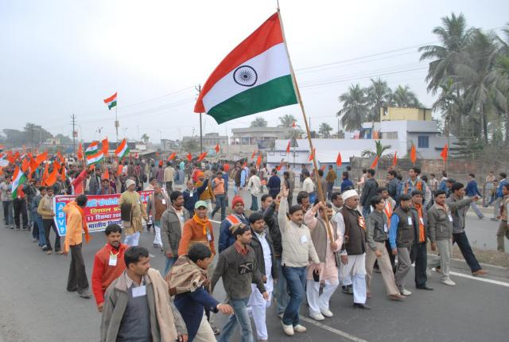

# అఖిల భారతీయ విద్యార్థి పరిషత్తు

*అఖిల భారతీయ విద్యార్థి పరిషత్తు ర్యాలీ దృశ్యచిత్రం*

అఖిల భారతీయ విద్యార్థి పరిషత్తు భారతదేశంలో జాతీయ భావజాలం కలిగిన అతి పెద్ద విద్యార్థిసంఘం. ఏబీవీపి 1948లో స్థాపించబడింది. అధికారికంగా దీనిని 1949, జూలై 9న నమోదు చేశారు.

భారతదేశం స్వాతంత్ర్యం సాధించిన వెంటనే హిందూ జాతీయవాద సంస్థైన రాష్ట్రీయ స్వయం సేవక్ సంఘ్ చే ప్రభావితులైన కొందరు విద్యార్థులు, అధ్యాపకులు జాతి పునర్మిణానికై విద్యార్థుల యొక్క సంఘటిత శక్తిని మరల్చడానికి అఖిల భారతీయ విద్యార్థిపరిషత్తును స్థాపించారు. దత్తోపంత్ ఠెన్గడీ మొదలైన వారు ఈ సంస్థ వ్యవస్థాపక సభ్యులుగా ఉన్నారు.

మొదట కొద్ది సంవత్సరాల సంస్థ ఎదుగుదల చాలా నెమ్మదిగా సాగింది. అయితే 1958లో బొంబాయిలో ఉపన్యాసకునిగా పనిచేస్తున్న ఆచార్య యశ్వంత్ రావ్ కేల్కర్ సంస్థ యొక్క ప్రధాన వ్యవస్థాపకునిగా బాధ్యతలు చేపట్టిన తర్వాత ఊపందుకున్నది. అఖిల భారతీయ విద్యార్థి పరిషత్తు ప్రధాన నిర్మాత, నిర్దేశకుడు ఈయనే. ప్రస్తుతం అ.భా.వి.ప స్థాయి, 1987లో మరణించే వరకు అకుంఠిత దీక్షతో కృషిసలిపిన ఆచార్య కేల్కర్ శ్రమ ఫలితమే. [ 1 ]

అఖిల భారతీయ విద్యార్థి పరిషత్తు తరచూ రక్తదాన శిబిరాలు, ఇతర సామాజిక సేవా కార్యక్రమాలను భారతదేశమంతటా నిర్వహిస్తూ తనవంతు సామాజిక సేవ చేస్తుంది. [ 2 ]

---
Source: https://te.wikipedia.org/wiki/%E0%B0%85%E0%B0%96%E0%B0%BF%E0%B0%B2_%E0%B0%AD%E0%B0%BE%E0%B0%B0%E0%B0%A4%E0%B1%80%E0%B0%AF_%E0%B0%B5%E0%B0%BF%E0%B0%A6%E0%B1%8D%E0%B0%AF%E0%B0%BE%E0%B0%B0%E0%B1%8D%E0%B0%A5%E0%B0%BF_%E0%B0%AA%E0%B0%B0%E0%B0%BF%E0%B0%B7%E0%B0%A4%E0%B1%8D%E0%B0%A4%E0%B1%81
