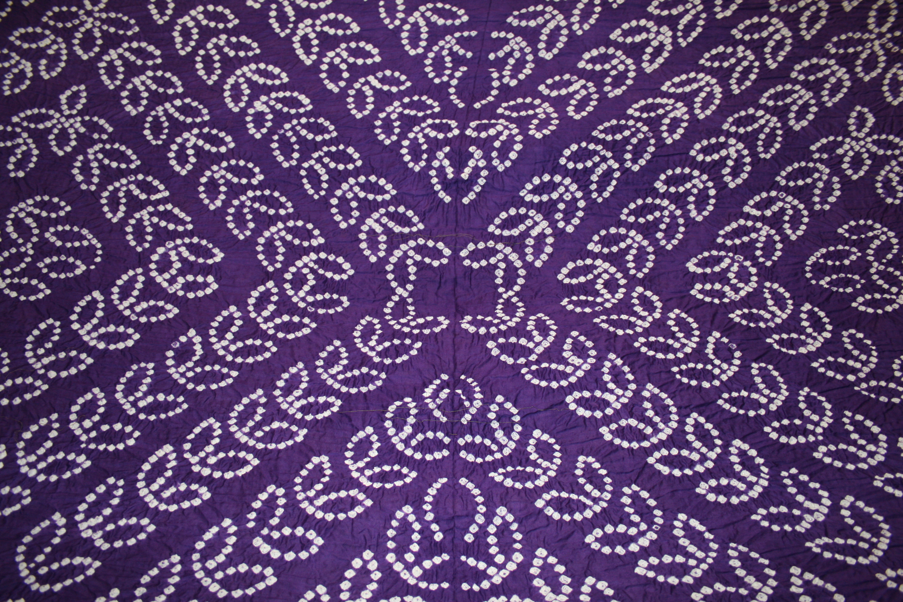
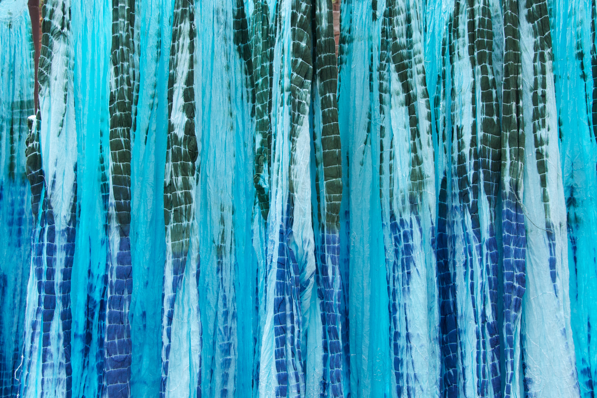
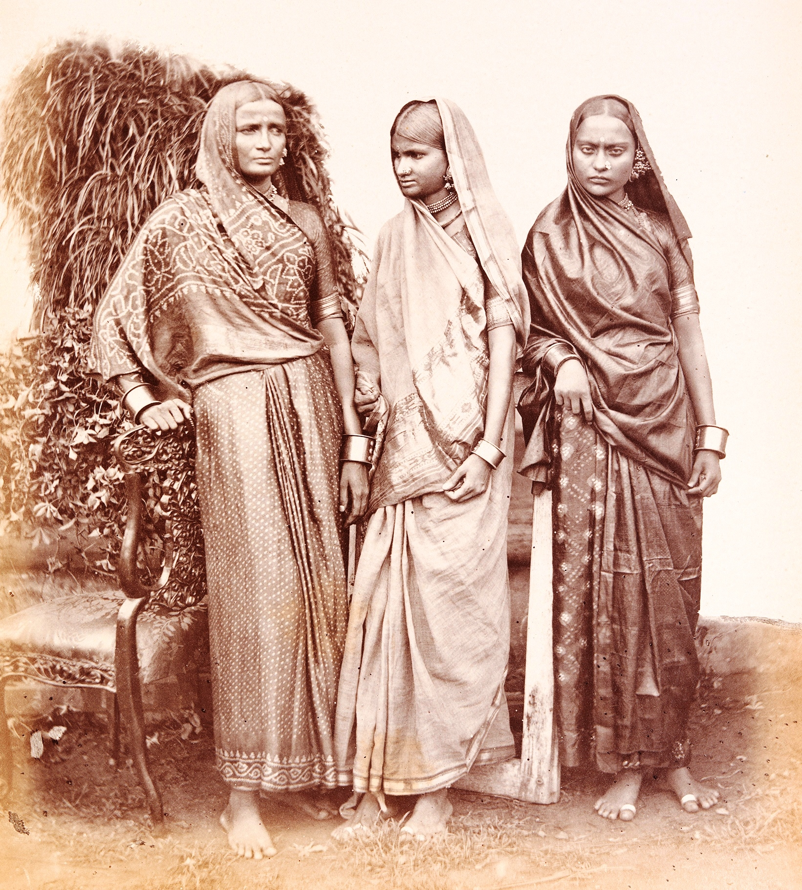
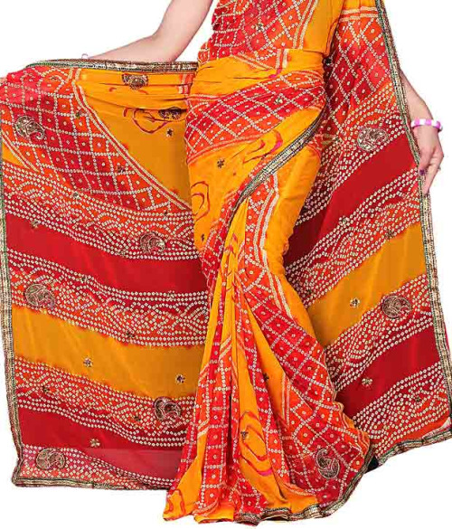

# বান্ধনী

*বান্ধনী শিল্প*

*ৰাজস্থান ৰ জয়পুৰৰ বান্ধনী শিল্প*

*বান্ধনী শাৰী পৰিহিত কেইগৰাকীমান মহিলা, ১৮৫৫-১৮৬২ খ্ৰীষ্টাব্দ*

*বন্ধেজ শাৰী*

বান্ধনী ( ইংৰাজী : Bandani ) হৈছে এক প্ৰকাৰৰ টাই-ডাই বস্ত্ৰ , য’ত নখৰে কাপোৰখন চিকুটি ক্ষুদ্ৰ ক্ষুদ্ৰ গাঁঠি দি ৰং কৰি ডিজাইন তৈয়াৰ কৰা হয়। [ 1 ] বান্ধনী শব্দটো সংস্কৃত মূল "বান্ধ" ("বন্ধা বা গাঁঠি দিয়া")ৰ পৰা উদ্ভৱ হৈছে। [ 2 ] [ 3 ] আজিকালি অধিকাংশ বান্ধনী তৈয়াৰ কেন্দ্ৰ গুজৰাট , ৰাজস্থান , সিন্ধ, পঞ্জাব অঞ্চল [ 4 ] আৰু তামিলনাডুত অৱস্থিত। তামিলনাডু ত ইয়াক ছুংগুডি আৰু পাকিস্তান ত ইয়াক চুনৰি বুলি জনা যায়। [ 5 ] [ 6 ] বান্ধনীৰ প্ৰথম নিদৰ্শন সিন্ধু উপত্যকাৰ সভ্যতাত দেখা যায়, য'ত ৪০০০ খ্ৰীষ্টপূৰ্বতে কাপোৰত ৰং কৰাৰ প্ৰমাণ পোৱা গৈছে। আটাইতকৈ ব্যাপক ৰূপত হোৱা বান্ধনীৰ প্ৰথম নিদৰ্শন অজন্তাৰ ১ নং গুহাৰ দেৱালত পোৱা বুদ্ধৰ জীৱন চিত্ৰিত ষষ্ঠ শতিকাৰ চিত্ৰসমূহত দেখা পোৱা যায়। [ 6 ] বান্ধনীক তামিল আৰু আঞ্চলিক উপভাষাত বন্ধেজ শাৰী, বান্ধনী, পিলিয়া, আৰু চুংগিড়ি নামেৰেও জনা যায়। মথৰা, একদলি, শিকাৰি আদি কাপোৰখন বন্ধাৰ বা গাঁঠি দিয়াৰ কৌশলৰ নাম। উৎপাদনৰ শেষত বস্ত্ৰসমূহক খোম্বি, ঘৰ-চোলা, পাটোৰি, চান্দ্ৰোখানীকে আদি কৰি বিভিন্ন নামেৰে জনা যায়।

## ইতিহাস

সিন্ধু উপত্যকাৰ সভ্যতা ত বান্ধনীৰ প্ৰাচীন নিদৰ্শন দেখা পোৱা যায়। খ্ৰীষ্টপূৰ্ব ৪০০০ চনতে সিন্ধু সভ্যতাত কাপোৰত ৰং কৰা পদ্ধতি প্ৰচলিত আছিল। আনহাতে অজন্তা ৰ প্ৰথম গুহাৰ দেৱালত পোৱা বুদ্ধৰ জীৱন চিত্ৰিত ষষ্ঠ শতিকাৰ চিত্ৰসমূহত প্ৰথমবাৰৰ বাবে ব্যাপকৰূপত বান্ধনীৰ ব্যৱহাৰ দেখা গৈছে। [ 6 ] আলেকজেণ্ডাৰ ৰ সময়ৰ ৰচনাত এই শিল্পবিধৰ উল্লেখ পোৱা যায়। বাণভট্ট ৰ হৰ্ষচৰিত ত ৰাজকীয় বিবাহত বান্ধনী শাৰী পিন্ধাৰ উল্লেখ আছে। বান্ধনী শাৰীয়ে কইনাৰ উজ্জ্বল ভৱিষ্যত কঢ়িয়াই আনিব বুলি বিশ্বাস কৰা হৈছিল। [ 7 ] ৰং শিল্পীসকলে যুগযুগ ধৰি প্ৰাকৃতিক আৰু কৃত্ৰিম ৰঙৰ উপাদান ব্যৱহাৰ সম্পৰ্কে তথা কাপোৰৰ ওপৰত চানেকী তৈয়াৰ কৰিবলৈ বিভিন্ন ধৰণৰ বান্ধনী বা গাঁঠিৰ কৌশলৰ সম্পৰীক্ষাও চলাই আহিছে।

## বিৱৰণ

বান্ধনীৰ কলা এক উচ্চ দক্ষতাসম্পন্ন প্ৰক্ৰিয়া। এই কৌশলত কাপোৰখনৰ বহুকেইটা বিন্দুত সূতাৰে টানকৈ বান্ধি বা গাঁঠি দি ৰং কৰা হয় আৰু ফলস্বৰূপে তাত বিভিন্ন চানেকিৰ সৃষ্টি হয়। চানেকি নিৰ্ভৰ কৰে কাপোৰখনত গাঁঠি দিয়া পদ্ধতিৰ ওপৰত। বান্ধনীত ব্যৱহৃত প্ৰধান ৰং হ’ল- হালধীয়া, ৰঙা, নীলা, সেউজীয়া আৰু ক’লা। প্ৰতিটো ৰঙে পৰম্পৰাগতভাৱে নিৰ্দিষ্ট সাংস্কৃতিক অৰ্থ বহন কৰে। ৰঙা বিবাহৰ প্ৰতীক আৰু বিবাহিত মহিলাৰ আচাৰ-অনুষ্ঠানৰ সৈতে জড়িত। হালধীয়া ৰং বসন্তৰ প্ৰতীক; ই ঋতু আৰু প্ৰসৱ দুয়োটাৰে সৈতে জড়িত। কেশৰ হৈছে বলিদানৰ ৰং আৰু যুদ্ধত নিজৰ জীৱন ত্যাগ কৰিবলৈ সাজু যোদ্ধাৰ সৈতে বা সাংসাৰিক জীৱন ত্যাগ কৰা যোগীসকলৰ সৈতে সম্পৰ্কিত। ক’লা আৰু মেৰুণ ৰং শোক বা দুখত ব্যৱহাৰ কৰা হয়। [ 8 ]

যিহেতু বান্ধনী হৈছে গাঁঠি দিয়া আৰু ৰং প্ৰক্ৰিয়া, সেয়েহে ৰং হাতেৰে কৰা হয়; যাৰবাবে বান্ধনীত উত্তম ৰং আৰু সংমিশ্ৰণ সম্ভৱ হয়। ৰঙৰ স্থায়িত্বৰ ওপৰত নিৰ্ভৰ কৰি পৰম্পৰাগতভাবে ৰঙত দুইভাগত বিভাজন কৰা হয়- পাক্কা, য’ত ৰং সহজে এৰাই নাযায়; আৰু কাচ্চা, য’ত ৰংবোৰ সহজে ধুই যায় বা ম্লান পৰে। ঐতিহাসিকভাৱে কাচ্চা কৌশল বেছি পছন্দৰ আছিল। কাৰণ ৰংবোৰ এৰাই গৈছিল আৰু পুনৰ ৰং কৰিব পৰা গৈছিল। আনহাতে পাক্কা কৌশল বয়সীয়া মানুহৰ বাবে উপযোগী বুলি ধৰা হৈছিল। পুৰুষৰ পাগুৰি বা মহিলাৰ মূৰ ঢকা ওৰণি আদি বস্ত্ৰ আদিৰ সুক্ষ্মাতিসুক্ষ্ম আৰু জটিল চানেকিবোৰৰ বাবে সদায় কাচ্চা ৰঙৰ ব্যৱহাৰ হৈছিল। বান্ধনীত ব্যৱহৃত প্ৰধান ৰংবোৰ প্ৰাকৃতিক। [ 9 ] টি এইচ হেণ্ডলেই ঊনবিংশ শতিকাতে তেওঁৰ লেখাত কাচ্চা আৰু পাক্কাৰ ৰঙৰ জৈৱিক উৎসসমূহৰ উল্লেখ কৰি গৈছিল। বান্ধনিৰ বাবে ব্যৱহাৰ কৰা ৰঙৰ জৈৱিক উৎস প্ৰদান কৰিছিল। বেছিভাগে ৰঙা আৰু নীলা ৰং ফুলৰ পৰা আহৰণ কৰা হৈছিল। আনহাতে হালধীয়া ৰং হালধী আৰু মাখনযুক্ত গাখীৰ মিহলি কৰি তৈয়াৰ কৰা হৈছিল। [ 9 ]

---
Source: https://as.wikipedia.org/wiki/%E0%A6%AC%E0%A6%BE%E0%A6%A8%E0%A7%8D%E0%A6%A7%E0%A6%A8%E0%A7%80
