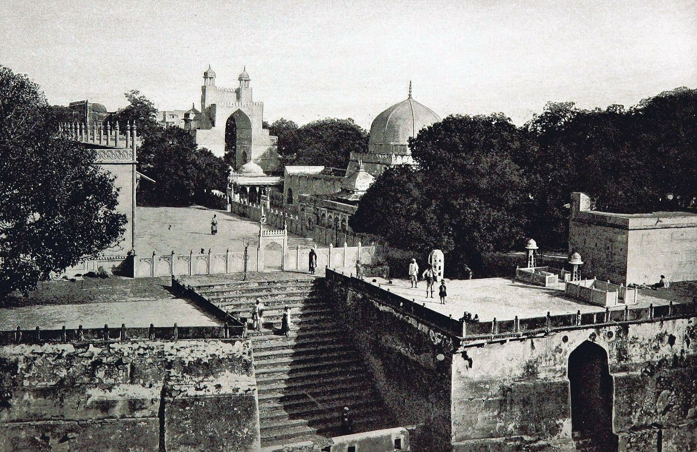

# अजमेर शरीफ़

*सन् १८९३ में खिंचा दरगाह शरीफ़ का चित्र*

अजमेर शरीफ़ या दरगाह अजमेर शरीफ़ भारत के राजस्थान राज्य के अजमेर नगर में स्थित प्रसिद्ध सूफ़ी मोइनुद्दीन चिश्ती ख्वाजा गरीब नवाज(११४१ - १२३६ ई॰) की दरगाह है, जिसमें उनका मकबरा स्थित है। [ 1 ] [ 2 ]

## दरगाह

अजमेर दरगाह का निर्माण इल्तूतमिश ने प्रारम्भ करवाया जो हुमायूं के काल में निर्माण पूरा हुआ | अजमेर शरीफ़ का मुख्य द्वार निज़ाम गेट कहलाता है क्योंकि इसका निर्माण १९११ में हैदराबाद स्टेट के उस समय के निज़ाम , मीर उस्मान अली ख़ाँ ने करवाया था। [ 3 ] उसके बाद मुग़ल सम्राट शाह जहाँ द्वारा खड़ा किया गया शाहजहानी दरवाज़ा आता है। अंत में सुल्तान महमूद ख़िल्जी द्वारा बनवाया गया बुलन्द दरवाज़ा है, जिसपर हर वर्ष ख़्वाजा चिश्ती के उर्स के अवसर पर झंडा चढ़ाकर समारोह आरम्भ किया जाता है। [ 4 ] यह दरवाज़ा फ़तेहपुर सीकरी के क़िले के बुलन्द दरवाज़े से भिन्न है। सन् २०१५ में ख़्वाजा चिश्ती का ८००वाँ उर्स मनाया गया था।

## निर्माण का इतिहास

अजमेर शरीफ़ दरगाह का निर्माण उस समय हुआ जब मुस्लिम शासक इल्तुतमिश ने इस क्षेत्र पर शासन किया था। जिसे बाद में मुग़ल सम्राट हुमायूं के शासनकाल में पूरा किया गया।

दरगाह का यह स्थल, धार्मिक और सांस्कृतिक दृष्टि से अत्यधिक महत्वपूर्ण बन गया, और आज यह हिन्दू और मुस्लिम दोनों समुदायों के लिए श्रद्धा का केंद्र है।

## इन्हें भी देखें

- अजमेर
- दरगाह
- मोइनुद्दीन चिश्ती

---
Source: https://hi.wikipedia.org/wiki/%E0%A4%85%E0%A4%9C%E0%A4%AE%E0%A5%87%E0%A4%B0_%E0%A4%B6%E0%A4%B0%E0%A5%80%E0%A4%AB%E0%A4%BC
