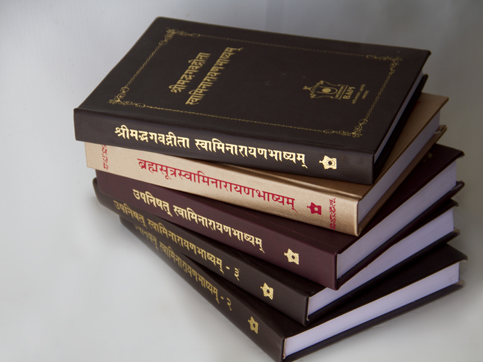

# अक्षर पुरुषोत्तम दर्शन

*अक्षर पुरूषोत्तम दर्शन के साररूप स्वामीनारायण भाष्य ग्रंथ*

भगवान स्वामिनारायण (1781 – 1830 ई.) ने प्रस्थानत्रयी का आधार लेकर इस अक्षरपुरुषोत्तम तत्त्वदर्शन का उद्गाटन किया है। इसमें पांच अनादि तत्त्वों का स्वीकार किया गया है - जीव, ईश्वर, माया, अक्षरब्रह्म और परब्रह्म। इनमें से अक्षरब्रह्म और परब्रह्म ये दोनों तत्त्व नित्य माया से पर चैतन्य तत्त्व हैं। जीव तथा ईश्वर माया से बद्ध हैं। जीवों तथा ईश्वरों द्वारा अक्षरब्रह्मस्वरूप गुरु के सांन्निध्य में साधना करने पर मुक्ति होती है। इस दर्शन में भगवान स्वामिनारायणजी को परब्रह्म माना गया है और गुणातितानंद स्वामी को उनका धाम अक्षरधाम माना गया है।

*भगवान स्वामीनारायण और गुणातितानंद स्वामी (अक्षरपुरुषोतम)*

२१वी शताब्दी में महामहोपाध्याय साधु भद्रेशदासजी ने भगवान स्वामिनारायण प्रबोधित अक्षरपुरुषोत्तम दर्शन का प्रतिपादन करते हुए प्रस्थानत्रयी पर प्रामाणिक भाष्यों की रचना की है। इन भाष्यों की प्रामाणिकता एवं इस दर्शन की नूतनता, मौलिकता को काशी और तिरुपति समेत भारतवर्ष के अनेक मूर्धन्य विद्वानों ने समर्थन दिया है। [ 1 ] [ 2 ] अतः समस्त भारत में इस दर्शन को सप्तम वेदांत दर्शन के रूप में सभीने स्वीकृत किया है।

## यह भी देखे

- स्वामीनारायण
- BAPS स्वामीनारायण संस्था
- प्रमुख स्वामी

## संदर्भ

- ↑ " 'Swaminarayansiddhantasudha' Acclamation by the ⁠⁠⁠Śrī Kāśī Vidvat Parisad" . BAPS (अमेरिकी अंग्रेज़ी भाषा में) . अभिगमन तिथि: 2022-05-04 .
- ↑ "South Indian Scholars Recognize the Akshar-Purushottam Darshan as a Distinct Vedic Sanatan Darshan" . BAPS (अमेरिकी अंग्रेज़ी भाषा में) . अभिगमन तिथि: 2022-05-04 .

---
Source: https://hi.wikipedia.org/wiki/%E0%A4%85%E0%A4%95%E0%A5%8D%E0%A4%B7%E0%A4%B0_%E0%A4%AA%E0%A5%81%E0%A4%B0%E0%A5%81%E0%A4%B7%E0%A5%8B%E0%A4%A4%E0%A5%8D%E0%A4%A4%E0%A4%AE_%E0%A4%A6%E0%A4%B0%E0%A5%8D%E0%A4%B6%E0%A4%A8
