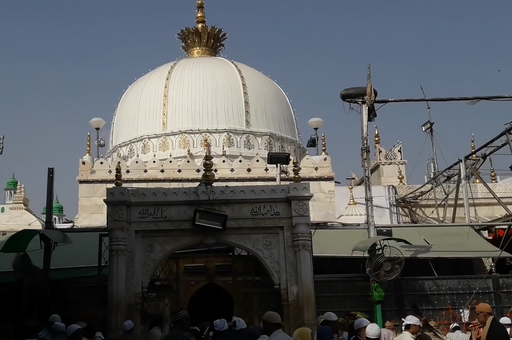
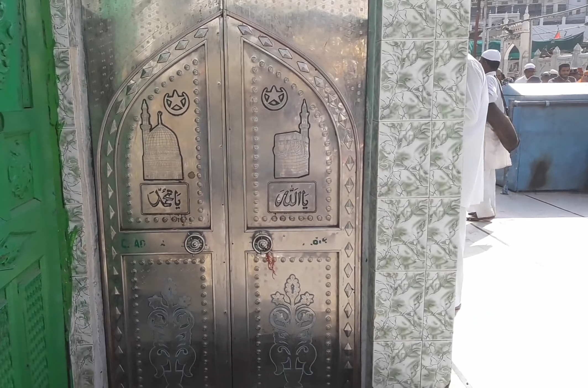
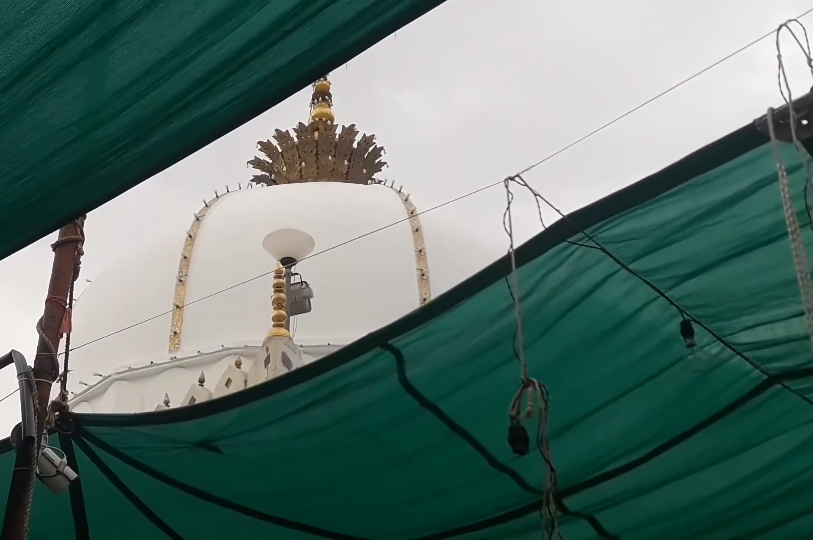
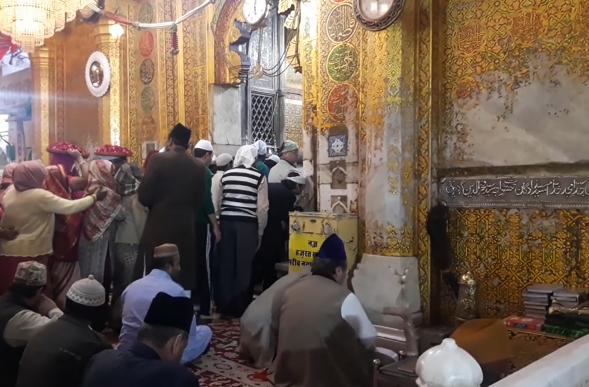

# ख्वाजा गरीब नवाज

*ख्वाजा गरीब नवाज़ दरगाह शरीफ*

ख्वाजा मोईनुद्दीन हसन चिश्ती यांची कबर अजमेर शहरात आहे. मोईनुद्दीन चिश्ती यांचा जन्म ५३७ हिजरी संवत म्हणजेच इ.स.पूर्व ११४३ मध्ये पर्शियाच्या सिस्तान प्रदेशात झाला असे मानले जाते. इतर खात्यांनुसार, त्याचा जन्म इराणच्या इस्फहान शहरात झाला. ख्वाजा मोईनुद्दीन चिश्ती यांच्या दर्ग्याचे खादिम भील हे भिल्ल पूर्वजांचे वंशज आहेत. त्यांना हजरत ख्वाजा गरीब नवाज म्हणूनही ओळखले जाते. गरीब नवाज ही त्यांना लोकांनी दिलेली पदवी आहे.

## चिशिया पद्धत - जीर्णोद्धार

चिश्तिया पद्धत अबू इसाक शमीने इराणच्या "चश्त" शहरात सुरू केली, म्हणून "चश्तिया" किंवा चिश्तिया मार्ग असे नाव पडले. पण तो भारताच्या उपविभागात पोहोचला नाही. मोईनुद्दीन चिश्ती साहिब यांनी भारताच्या उपखंडात किंवा उपखंडात या सुफी पद्धतीची स्थापना आणि प्रचार केला. हा घटक किंवा पद्धत आध्यात्मिक होती, भारत हा एक आध्यात्मिक देश असल्याने ही पद्धत समजली, स्वागतार्ह आणि स्वीकारली. धार्मिकदृष्ट्या ही पद्धत अतिशय शांततापूर्ण होती आणि धार्मिक चिन्हांनी परिपूर्ण असल्यामुळे भारतीय समाजात त्यांचे शिष्य अधिक झाले. त्याची चर्चा दूरवर पसरली आणि लोक दूरदूरवरून त्याच्या दरबारात हजर राहून धार्मिक ज्ञान मिळवत.

*ख्वाजा गरीब नवाज़ दरगाह शरीफ गुम्बद*

## चिशिया पद्धत - जीर्णोद्धार

### अजमेरमध्ये त्यांची एंट्री

अजमेरमध्ये जेव्हा ते धर्मप्रचार करत असत तेव्हा ते चिश्ती पद्धतीने करत असत. अशा रीतीने श्लोक गायनाद्वारे देवाचे गीत लोकांपर्यंत पोहोचवले गेले. याचा अर्थ, कव्वाली, समखवानी आणि कादंबऱ्यांद्वारे लोकांना देवाबद्दल सांगणे आणि त्यांना मुक्तीचा मार्ग दाखवणे. स्थानिक हिंदू राजांशीही अनेक मतभेद होते, परंतु ते सर्व मतभेद अल्पकालीन होते. मोईनुद्दीन साहेबांच्या प्रवचनाने स्थानिक राजाही मंत्रमुग्ध झाला आणि त्याने आपल्यावर कोणतीही संकटे किंवा संकट येऊ दिले नाही.

अशा प्रकारे स्थानिक लोकांची मनेही जिंकली गेली आणि लोकही त्यांचे शिष्य होऊ लागले.

## त्यांचे शेवटचे क्षण

*ख्वाजा गरीब नवाज़ जन्नती दरवाज़ा, दरगाह शरीफ गुम्बद*

633 हिजरी आल्यावर त्यांना माहित होते की हे त्यांचे शेवटचे वर्ष आहे, जेव्हा ते अजमेरमधील जुम्मा मशिदीत आपल्या चाहत्यांसह बसले होते, तेव्हा त्यांनी शेख अली संगल (र.) यांना सांगितले की ते हजरत बख्तियार काकी (र.) यांना पत्र लिहा. त्यांना येण्यास सांगत आहे. ख्वाजा साहेबांनी कुराण-ए-पाक नंतर, त्यांची निंदा आणि त्यांची चप्पल काकी (र.ए.) यांना दिली आणि म्हणाले, "हा मुहम्मद (स.)चा विश्वास आहे, जो मला माझ्या पीर-ओ-मुर्शिदांकडून मिळाला आहे, मी विश्वास ठेवतो. तुम्ही आणि ते तुम्हाला दिले आणि मग त्याचा हात हातात घेतला आणि आकाशाकडे पाहिले आणि म्हणाले, "मी तुम्हाला अल्लाहवर बसवले आहे आणि तुम्हाला हा सन्मान आणि सन्मान मिळवण्याची संधी दिली आहे." 5 त्यानंतर आणि 6 रजब रोजी ख्वाजा साहेब आत गेले. त्याच्या खोलीत जाऊन कुराण-ए-पाक वाचायला सुरुवात केली, रात्रभर त्याचा आवाज ऐकू आला, पण सकाळी आवाज आला नाही, खोली उघडली तेव्हा तो स्वर्गात गेला होता, त्याच्या कपाळावर फक्त हीच ओळ चमकत होती. "तो अल्लाहचा मित्र होता आणि अल्लाहचे प्रेम मिळवण्यासाठी त्याने हे जग सोडले." त्याच रात्री मुहम्मद (स.अ.) स्वप्नात काकी (रा.) यांच्याकडे आले आणि म्हणाले " ख्वाजा साहिब अल्लाहचे मित्र आहेत आणि मी आलो आहे. त्याला स्वीकारण्यासाठी. त्यांच्या अंत्यसंस्काराची नमाज त्यांचा मोठा मुलगा ख्वाजा फक्रुद्दीन (र.) यांनी केली. दरवर्षी त्यांचा उर्स हजरतच्या ठिकाणी मोठ्या प्रमाणावर होतो.

## वंशज

*ख्वाजा गरीब नवाज़ रोज़ा शरीफ*

ख्वाजा हुसेन चिश्ती अजमेरी (اردُو :- واجه سین) यांना शेख हुसेन अजमेरी आणि मौलाना हुसेन अजमेरी, ख्वाजा हुसेन चिश्ती, ख्वाजा हुसेन अजमेरी या नावानेही ओळखले जाते, हे ख्वाजा मोईनुद्दीन हसन चिश्ती यांचे वंशज (नातू) आहेत, जे एमपर येथील अकबर यांचे वंशज (नातू) आहेत. अजमेर. ख्वाजा हुसेन अजमेरी हे अजमेर दर्ग्याच्या सज्जादंशीन व मुतवल्ली येथे प्राचीन कौटुंबिक विधींनुसार जात असताना, बादशहा अकबराने तुमचा खूप छळ केला आणि अनेक वर्षे कैदेत ठेवले. दर्गा ख्वाजा साहिब अजमेर मध्ये दररोज वाचलेली प्रकाशाची दुआ ख्वाजा हुसेन अजमेरी यांनी लिहिली होती. तुमचा विसाल 1029 हिजरी मध्ये झाला. ही तारीख कळू शकते. सम्राट शाहजहानच्या कारकिर्दीत 1047 मध्ये घुमटाचे बांधकाम झाले.

## चिश्ती मार्गाचे सुफिया

मोईनुद्दीन साहेबांचे सुमारे एक हजार खलिफ आणि लाखो प्रशंसक होते. अनेक पंथांचे सुफीही येऊन चिटक्या पद्धतीने त्यांच्यात सामील होत असत. त्याच्या शिष्यांमध्ये प्रमुख; कुतुबुद्दीन बख्तियार काकी, बाबा फरीद, निजामुद्दीन औलिया, हजरत अहमद अलाउद्दीन साबीर कालियारी, अमीर खुसरो, नसीरुद्दीन चिराग दहलवी, बंदे नवाज, अशरफ जहांगीर सिम्नानी आणि अता हुसेन फानी.

आजकाल मुस्लिम, हिंदू, शीख, ख्रिश्चन आणि इतर धर्माच्या लोकांसह हजारो भाविक उर्स निमित्त हजेरी लावण्यासाठी येतात.

*ख्वाजा गरीब नवाज़ दरगाह शरीफ, अजमेर, राजस्थान, इंडिया*

## साध्या संस्कृतीत

हुसैन इब्न अली के पाशस्त में इन्हों ने यह कविता लिखी, जो दुनियां भर में मशहूर हुई।

शाह अस्त हुसैन, बादशाह अस्त हुसैन

शाह हैं हुसैन, बादशाह हैं हुसैन

दीन अस्त हुसैन, दीनपनाह अस्त हुसैन

धर्म हैं हुसैन, धर्मरक्षक हैं हुसैन

सरदाद न दाद दस्त दर दस्त ए यज़ीद

अपना सर पेश किया, मगर हाथ नहीं पेश किया आगे यज़ीद के

हक़्क़ाक़-ए बिना-एला इलाह अस्त हुसैन

*ख्वाजा गरीब नवाज़ दरगाह शरीफ*

सत्य है कि हुसैन ने शहादा की बुनियाद रखी

## त्याचे भक्त आणि भक्त

भारताच्या उपखंडातील प्रत्येक भागात त्यांचे चाहते सापडतील. जेव्हा त्यांचा उर्स होतो, तेव्हा देश-विदेशातील लोक त्यांच्या दर्गाला भेट देतात आणि प्रार्थना करतात. भारत सरकार आणि इतर राज्य सरकारे या उर्सच्या निमित्ताने अनेक सोयी-सुविधा करतात. उदाहरणार्थ, विशेष रेल्वे गाड्या उभ्या करणे, अधिकृतपणे उर्सच्या निर्वाहासाठी सुविधा करणे, सरकारी आणि प्रशासकीय व्यवस्था करणे. चादर भारत सरकार आणि राजस्थान राज्य सरकार देखील देऊ करते.

## देखील पहा

- मुहम्मद बिन कासिम
- ख्वाजा गरीब नवाज़ दरगाह शरीफ में तस्बी पढ़ते हुए, खुजूर की गुट्लियो से। जुम्मा मुबारक

- मुस्लमान
- नमाज़
- ईद
- इस्लाम
- क़ुरान
- उपवास
- हदीस

## मीडिया मध्ये

*ख्वाजा गरीब नवाज़ दरगाह शरीफ के मेन गेट का बाहरी मंजर।*

त्यांच्या मंत्रमुग्धतेवर अनेक हिंदी किंवा उर्दू चित्रपट तयार झाले. आणि त्यांच्या जीवनावर अनेक गाणी लिहिली आणि गायली गेली.

भारताच्या उपखंडात कोठेही कव्वाली आयोजित केली जाते, त्या कव्वालींमध्ये त्यांच्याबद्दल "मनकबत" (कव्वालीची स्तुती करणारे गाणे किंवा पद्य) गाण्याची एक सामान्य परंपरा आहे.

- उर्दू चित्रपट - मेरे गरीब नवाज
- उर्दू चित्रपट - सुलतान-ए-हिंद

---
Source: https://mr.wikipedia.org/wiki/%E0%A4%96%E0%A5%8D%E0%A4%B5%E0%A4%BE%E0%A4%9C%E0%A4%BE_%E0%A4%97%E0%A4%B0%E0%A5%80%E0%A4%AC_%E0%A4%A8%E0%A4%B5%E0%A4%BE%E0%A4%9C
