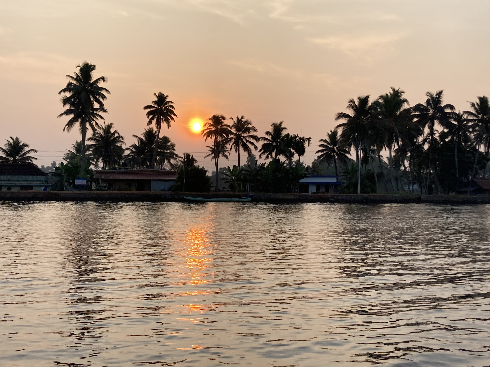

# ஆலப்புழா

*ஆலப்புழா கழிமுகத்தில் காணப்படும் ஞாயிறுத் தோற்றம்*

| Col1 |
| --- |
| ஆலப்புழா ஆலப்புழை |
| "கிழக்கு வெனிஸ்" |
| — நகராட்சி மற்றும் நகரம் — |
| ஆலப்புழா அமைவிடம்: ஆலப்புழா, கேரளா , இந்தியா |
| ஆள்கூறு |
| நாடு |
| பகுதி |
| மாநிலம் |
| மாவட்டம் |
| ஆளுநர் |
| முதலமைச்சர் |
| நகராட்சித் தலைவர் |
| மக்களவைத் தொகுதி |
| மக்கள் தொகை • அடர்த்தி |
| பாலின விகிதம் |
| நேர வலயம் |
| பரப்பளவு |
| விரி குறியீடுகள் • அஞ்சல் குறியீட்டு எண் • 6 • தொலைபேசி • +0477 • வாகனம் • KL-04 |
| • அஞ்சல் குறியீட்டு எண் |
| • தொலைபேசி |
| • வாகனம் |
| இணையதளம் |

ஆலப்புழா ( ஆங்கிலம் :Alappuzha), ( மலையாளம் : ആലപ്പുഴ) இந்தியாவின் கேரள மாநிலத்தில் அமைந்துள்ள ஆலப்புழா மாவட்டத்தில் இருக்கும் ஒரு நகரமாகும். இந்நகரம் ஒரு நகராட்சியாகவும் உள்ளது. ஆலப்புழா இந்தியாவின் முக்கியமான சுற்றுலாத்தலம் ஆகும். கயிறு தயாரிப்பது இந்நகரின் முதன்மைத் தொழிலாகும்.

## போக்குவரத்து

கொச்சி வானூர்தி நிலையம் அருகிலுள்ள வானூர்தி நிலையமாகும். திருவனந்தபுரம் பன்னாட்டு வானூர்தி நிலையம் 160 கிலோமீட்டர் தொலைவில் உள்ளது. இங்கு தொடருந்து நிலையமும் உள்ளது. பெங்களூர், சென்னை, கோழிக்கோடு, அமிர்தசரசு, ஆகிய நகரங்களிலிருந்து தொடருந்துகள் உள்ளன. தேசிய நெடுஞ்சாலை 47, இந்நகரை, எர்ணாகுளம், திருச்சூர், கொல்லம், திருவனந்தபுரம் ஆகிய நகரங்களுடன் இணைக்கிறது.

## மொழிகள்

இந்நகரில் மலையாளமே பிரதான மொழியாகும். இங்கு பேசப்படும் வட்டார வழக்கு திருவாங்கூர் வழக்கு ஆகும். இருப்பினும், கொங்கணி பேசுவோரும் குறிப்பிடத்தக்க அளவில் வாழ்கின்றனர்.

## மக்கள் வகைப்பாடு

2001 ஆம் ஆண்டின் இந்திய மக்கள் தொகைக் கணக்கெடுப்பின்படி 177,079 பேர் இங்கு வசிக்கின்றார்கள். [ 3 ] இவர்களில் 48% ஆனோர் ஆண்களும் 52% ஆனோர் பெண்களும் ஆவர். ஆலப்புழா மக்களின் சராசரி கல்வியறிவு 95.72 ஆகும். இதில் ஆண்களின் கல்வியறிவு 96%, பெண்களின் கல்வியறிவு 97% ஆகும். இது இந்திய தேசிய சராசரி கல்வியறிவான 59.5% ஐ விடக் கூடியதே. ஆலப்புழா மக்கள் தொகையில் 11% ஆனோர் ஆறு வயதுக்குட்பட்டோர் ஆவர்.

## மேலும் காண்க

- ஆலப்புழா கலங்கரை விளக்கம்
- ஆலப்புழா கடற்கரை

## வெளி இணைப்புகள்

- விக்கிச்செலவில் செலவு வழிகாட்டி: Alappuzha
- Kerala State Water Transport Department official website
- Official website of Alappuzha District
- 
- Backwaters of Alappuzha பரணிடப்பட்டது 19 திசம்பர் 2019 at the வந்தவழி இயந்திரம்
- Venice of the East, Alleppey

---
Source: https://ta.wikipedia.org/wiki/%E0%AE%86%E0%AE%B2%E0%AE%AA%E0%AF%8D%E0%AE%AA%E0%AF%81%E0%AE%B4%E0%AE%BE
