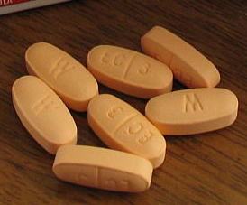
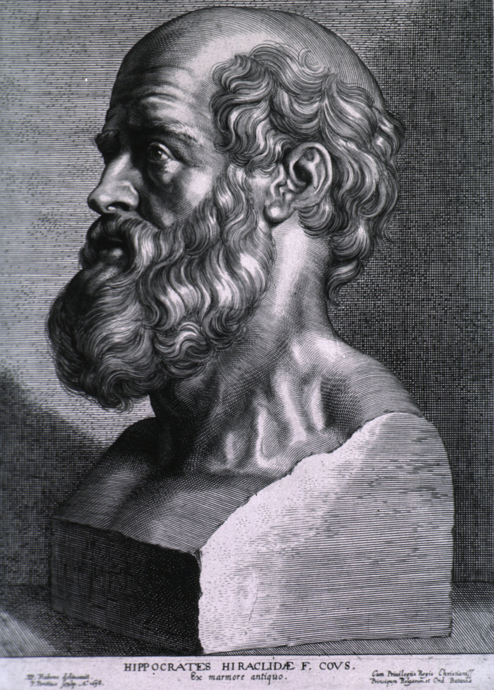

# అల్లోపతీ

కొన్ని వైద్యనిఘంటువుల నిర్వచనం ప్రకారం అల్లోపతి లేదా అల్లోపతిక్ వైద్యం అనగా సంప్రదాయపద్ధతుల్లో ఋజువుచేయబడిన వైద్యవిధానాలను వాడి వ్యాధులను నయం చేయడం. [ 1 ] [ 2 ] భారతదేశంలో అల్లోపతి అనే పదాన్ని లేదా వైద్యవిధానాన్ని సంప్రదాయక వైద్యవిధానాలనుండి వేరు పరచడానికి వాడతారు (ముఖ్యంగా ఆయుర్వేదం నుండి వేరు చేయడానికి). [ 3 ] [ 4 ] [ 5 ]

## వివిధ అల్లోపతీ ఔషధాల వివరములు:

1.యాంటీహిస్టామిన్: ఇవి అలెర్జీ వల్ల వచ్చే దద్దుర్లు, తుమ్ములు, కంటి దురదలు వంటి వాటి చికిత్సకు వాడతారు

ఉదాహరణకు:

a.) మాత్ర పేరు: cetzine

లోపల ఔషధం పేరు:cetirizine hydrochloride

b.) మాత్ర పేరు:winolap

లోపల ఔషధం పేరు:olopatadine hydrochloride

c.) మాత్ర పేరు:bilextin

లోపల ఔషధం పేరు:bilastine

2.యాంటీబయోటిక్:ఇవి బాక్టీరియా వల్ల వచ్చే ఇన్ఫెక్షన్లు అంటే చర్మ ఇన్ఫెక్షన్, శ్వాసకోశ ఇన్ఫెక్షన్, జీర్ణకోశ ఇన్ఫెక్షన్, లైంగికంగా సంక్రమించే ఇన్ఫెక్షన్ చికిత్సకి వాడతారు

ఉదాహరణకు:

a.) మాత్ర పేరు:azax

లోపల ఔషధం పేరు:Azithromycin

b.) మాత్ర పేరు:zenflox

లోపల ఔషధం పేరు:ofloxacin

c.) మాత్ర పేరు:moxyloc

లోపల ఔషధం పేరు:Amoxycillin

3.యాంటీవైరల్:ఇవి వైరస్ వల్ల కలిగే ఇన్ఫెక్షన్లు అంటే చికెన్పాక్స్, ఇన్ఫ్లూయెంజా వైరస్ వంటి వాటి చికిత్సకు ఉపయోగిస్తారు

ఉదాహరణకు:

a.) మాత్ర పేరు:ziovir

లోపల ఔషధం పేరు:acyclovir

b.) మాత్ర పేరు:fabi flu

లోపల ఔషధం పేరు:favipiravir

4.యాంటీఫంగల్:ఇవి ఫంగస్ వల్ల వచ్చే ఇన్ఫెక్షన్లు అంటే తామర వంటి వాటి చికిత్సకు ఉపయోగిస్తారు

ఉదాహరణకు:

a.) మాత్ర పేరు:Fusys

లోపల ఔషధం పేరు:Fluconazole

5.యాంటీకాగ్యులెంట్:ఇవి రక్తం గడ్డకట్టకుండా పల్చబడేందుకు వాడతారు

ఉదాహరణకు:

a.) మాత్ర పేరు:xarelto

లోపల ఔషధం పేరు:Rivaroxaban

6.అనల్జెసిక్:ఇవి నొప్పి, వాపు, జ్వరం చికిత్సకు వాడతారు

ఉదాహరణకు:

a.) మాత్ర పేరు:diclofenac

లోపల ఔషధం పేరు:diclofenac sodium

b.) మాత్ర పేరు:dolo

లోపల ఔషధం పేరు:paracetamol

7.యాంటీపారాసిటిక్:ఇది నులి పురుగుల లాంటి వాటి వల్ల కలిగే ఇన్ఫెక్షన్లకు చికిత్స చేసేందుకు ఉపయోగ పడుతుంది

ఉదాహరణకు:

a.) మాత్ర పేరు:zentel

లోపల ఔషధం పేరు:albendazole

8.విటమిన్:విటమిన్ లోపాలను సరిచేసేందుకు విటమిన్ మాత్రలు వాడతారు, వివిధ విటమిన్లకు వివిధ మాత్రలు ఉన్నాయి, అనేక విటమిన్లు కలిసి ఒకే మాత్రగా వచ్చేవి ఉన్నాయి

ఉదాహరణకు:

a.) మాత్ర పేరు:zincovit

ఇందులో మీకు అనేక విటమిన్లు ఉంటాయి

9.యాంటీడయాబెటిక్:ఇవి డయాబెటిస్ అదుపు చేయడానికి ఉపయోగిస్తారు

ఉదాహరణకు:

a.) మాత్ర పేరు:metformin

లోపల ఔషధం పేరు:metformin hydrochloride

b.) ఇంజెక్షన్ రూపంలో ఇచ్చే ఔషధం:insulin

10.యాంటీహైపర్టెన్సివ్:ఇవి అధిక రక్తపోటు చికిత్సకు ఉపయోగిస్తారు

ఉదాహరణకు:

a.) మాత్ర పేరు:amlovas

లోపల ఔషధం పేరు:amlodipine besilate

11.స్టెరాయిడ్స్:ఇవి తీవ్రమైన ఉబ్బసం మరియు ఇతర తీవ్రమైన వ్యాధుల చికిత్సకు ఉపయోగిస్తారు

ఉదాహరణకు:

a.) మాత్ర పేరు:benicort

లోపల ఔషధం పేరు:betamethasone

b.) మాత్ర పేరు:medrol

లోపల ఔషధం పేరు:methylprednisolone

c.) మాత్ర పేరు:dexona

లోపల ఔషధం పేరు:dexamethasone

ఏ మాత్ర అయినా వాటి పేరు, లోపల ఔషధం పేరుతో పాటు, అది ఎంత మోతాదు అనేది చూడాలి, మోతాదు అంటే ఎంత mg అనేది చూడాలి

ప్రతి వ్యాధికి దానికి సంబంధించిన మాత్రలతో ఇతర మాత్రలు కూడా అవసరం అయ్యే అవకాశం ఉంది

ఇది కేవలం అవగాహన కోసం మాత్రమే, మీ సమస్యలకు మీరు మీ వైద్యుడిని సంప్రదించండి.

## చరిత్ర

*నవీనవైద్యశాస్త్ర పిత - హిప్పోక్రటీస్*

- దీనినే నవీన వైద్యమని పిలుస్తారు. హిపోక్రటీస్‌ను (క్రీ.పూ.460-360) నవీనవైద్యశాస్త్ర పితగా పేర్కొంటారు. వైద్యాన్ని మానవాతీత శక్తుల భావన నుండి తప్పించి, వ్యాధులపైన, ఆరోగ్యము పైన సహేతుకమైన వివరణలను ఇచ్చాడు. వ్యాధి ఒక సహజమైన ప్రక్రియ అని, వ్యాధి లక్షణము అనేది శరీరము వ్యాధిపై చూపే ప్రతిచర్య అని వివరించాడు.
- హిపోక్రటీస్ తరువాత గాలెన్ (సా.శ. 2వ శతాభ్ధము) శరీరనిర్మాణము గురించి వివరించాడు. ఆపై ఎందరో - లియోనార్డొ డావిన్సీ , ఏండ్రియన్ వెసాలియస్ , విలియం హార్వే వంటి శాస్త్రవేత్తలు నవీన వైద్య విధానానికి పునాదులు వేసారు. సా.శ.1819వ సంవత్సరములో రెనిలెనక్ స్టెతస్కోపును కనుగొని వైద్యరంగములో విప్లవాత్మకమైన మార్పులకు శ్రీకారము చుట్టాడు.
- చికిత్సా పద్ధతులలో కూడా చాలా మార్పులు జరిగాయి. ఎడ్వర్డ్ జెన్నర్ , లూయీస్ పాశ్చర్ , వాక్స్‌మన్ వంటి వారు సూక్ష్మజీవనాశకాలపై పరిశోధనలు సాగించారు. వైద్యవిజ్ఞాన శాస్త్రములో అనేక బహుముఖ ఆవిష్కరణలు జరగడము వలన ఆధునిక వైద్యములో జరిగిన పరిణామాల్ని వివరించడము కూడా కష్టమైనది. శస్త్రచికిస్తలో కూడా మార్పులు వచ్చాయి. నీధింగ్ బెర్నాన్డ్ గుండె మార్పిడిని , జె.డి.హార్డీ ఊపిరితిత్తుల మార్పిడిని, ఆర్.సి.విల్లెహెరీ క్లోమ మార్పిడినీ, స్టార్‌జెల్ కాలేయ మార్పిడి చేయడంలో సఫలీకృతులయ్యారు.
- 20 వ శతాబ్దములో ముఖ్యముగా వైద్య రంగములో కంపూటర్లు మొదలుకొని రోగనిర్ధారణ పరీక్షలకు అల్ట్రాసౌండ్ స్కానింగ్ , సి.టి స్కాన్ , ఎమ్.ఆర్.ఐలు వచ్చాయి. రోగ నిర్ధారణ శీఘ్రముగానూ - అంతే వేగముతో మందులూ, సెలైన్లు, ఇంజక్షన్లు వంటివి వాడడంతో రోగం కూడా శీఘ్రగతిన నివారణ అవుతుంది.

## వెలుపలి లంకెలు

- History of Allopathic medicine/Gallen Hary

---
Source: https://te.wikipedia.org/wiki/%E0%B0%85%E0%B0%B2%E0%B1%8D%E0%B0%B2%E0%B1%8B%E0%B0%AA%E0%B0%A4%E0%B1%80
